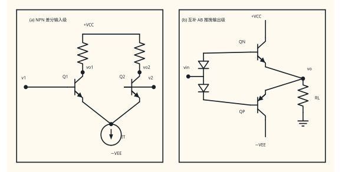

# 模拟电子技术典型电路速查

> 读图顺序：**端口/地 → DC 状态或 Q 点 → AC/功能模型 → 候选解 → 状态与额定复核**。表中 $A_v$ 默认是“表内输入节点到表内输出节点”的拓扑增益；从信号源到负载必须另乘加载：
>
>
> \[
> \frac{v_L}{v_s}=
> \frac{R_{in}}{R_s+R_{in}}\,A_{v0}\,
> \frac{R_L}{R_{out}+R_L}.
> \]
>
> 若已把 $R_L$ 并入 $R_C\parallel R_L$ 或 $R_D\parallel R_L$，不可再乘一次负载分压。[端口与总增益依据](../guide/04-基本放大电路.md#23-四种电压传递不能混称)

## 0. 三条总规则

- **候选解不等于答案：** 二极管/BJT/MOS/运放都先用候选模型求解，再验 ON/OFF、结偏置、$V_{DS}\gtreqless V_{OV}$、输出轨、共模、电流、频率和热；一项失败就换状态/模型。
- **DC/AC 分两张图：** DC 中耦合/旁路电容开路并保留电源；中频小信号中恒定电源为交流地，足够大的耦合/旁路电容才近似短路。[DC/AC 分离](../guide/04-基本放大电路.md#33-dc-与-ac-是同一电路的两次分析)
- **条件/适用边界：** 下列趋势均针对表中明确的 NPN、增强型 NMOS、理想或低频运放模型；改成 PNP/PMOS、换输出定义或进入高频/大信号时，重画电流方向再列 KCL/KVL。

## 1. 二极管：整流、限幅、钳位

<figure class="ae-figure-frame" markdown="1">
{ .ae-figure }
<figcaption markdown="1">三列都以地为公共参考；中列的 $+V_R/-V_R$ 网络符号表示另一端接地的理想参考源。两只二极管方向相反，因而输出在 $\pm(V_R+V_D)$ 附近限幅。电路本体只标器件与端口，导通条件在正文中说明。</figcaption>
</figure>

| 电路 | 输入端 / 输出端 | 相位 / 极性 / 功能 | 典型传递 | $R_{in}$ / $R_{out}$ | DC/状态工作流 | 最常见失效或误用 | 详细说明 |
|---|---|---|---|---|---|---|---|
| 串联半波整流 | $v_i$ 对地；$v_o$ 取 $R_L$ 上端对地 | 非线性整流，无单一线性相位；图示方向保留正半周，反接则保留负半周 | 恒压降候选：$v_o=0$（$v_i<V_\gamma$），$v_o=v_i-V_\gamma$（$v_i\ge V_\gamma$） | 状态相关：OFF 时 $R_{in}\to\infty$，ON 时源看入约 $R_L+r_d$；$R_{out}$ 需置零输入后按 ON/OFF 小信号模型测试 | 每一时刻假设 ON/OFF→列 KVL→检查 $i_D\ge0$ 或 $v_D<V_\gamma$ | 把完整正半周都算导通；忽略源阻、反向恢复、峰值反压 | [半波整流](../guide/02-二极管与半导体基础.md#61-例题-b半波整流与门槛效应) |
| 偏置限幅器 | $v_i$ 经 $R$ 输入；$v_o$ 为限幅节点；按所链接图 2-13 的**无负载**拓扑 | 分段同相：OFF 段输出跟随输入，越阈后由相应参考支路钳位 | 上限约 $V_{ref,+}+V_\gamma$；下限由二极管方向与参考源决定 | 非线性、状态相关：两管 OFF 时输入电流为零，$R_{in}\to\infty$；某管 ON 时小信号 $R_{in}\approx R+r_d+R_{ref}$，其中 $r_d$ 是导通管小信号电阻、$R_{ref}$ 是参考源内阻（理想时为 0）。$R_{out}$ 随状态由这三者共同决定，应置零输入后加测试源求 | 枚举每只管 ON/OFF→求分段式→同时检查所有二极管不等式 | 把限幅与钳位混同；把无负载图擅自加入负载；忘记非理想参考源的 $R_{ref}$ 会改变导通段 | [偏置对称限幅](../guide/02-二极管与半导体基础.md#62-例题-cpm27-mathrm-v-偏置对称限幅器) |
| 电容钳位器 | $v_i$ 经 $C$；$v_o$ 为 $C$ 后节点，$R_L$ 提供回流 | 波形不反相而整体平移；某一峰值按二极管方向钳到参考附近，理想峰峰值近似不变 | 导通峰值设定 $v_C$；关断时 $v_o=v_i-v_C$；$R_LC\gg T$ 时下垂小 | 无单一 DC $R_{in}/R_{out}$：两者随频率与导通态变；OFF 时输入经 $C$ 耦合、输出约由 $R_L$ 定，ON 时参考源与 $r_d$ 降低 $R_{out}$ | 先给 $v_C(0)$→判首次导通→求周期稳态→检查 $R_LC/T$ | 用稳态结果替代启动过程；$RC$ 太小、源阻太大、方向画反 | [钳位与下垂](../guide/02-二极管与半导体基础.md#63-例题-d带负载的正向钳位器与实际下垂) |

条件/适用：以上为恒压降、准静态或声明过的周期稳态模型；高频时加入结电容和反向恢复，击穿区必须外部限流。[状态假设算法](../guide/02-二极管与半导体基础.md#5-p0状态假设算法先解线性电路再审判假设)

## 2. BJT 三组态：CE / CC / CB

<figure class="ae-figure-frame" markdown="1">
{ .ae-figure }
</figure>

| 拓扑 | 输入端 / 输出端 | 相位 | 级内典型增益 | $R_{in}$ / $R_{out}$ 趋势 | DC→AC 工作流 | 最常见失效或误用 | 详细说明 |
|---|---|---:|---|---|---|---|---|
| CE，共射，E 旁路 | B 对交流地 / C 对交流地 | 反相 | $A_{v,b\to L}\approx-g_m(R_C\parallel R_L)$ | 基极约 $r_\pi$ 再并偏置，偏低/中；输出约 $R_C$（有限 $r_o$ 时修正） | DC 求 $I_{CQ},V_{CEQ}$ 并验 BE 正偏/BC 反偏；AC 求 $g_m,r_\pi$，再乘源分压 | 把 $-g_mR_C$ 当 $v_L/v_s$；忘记加载、Q 点、旁路条件或 $r_o$ | [CE 增益推导](../guide/04-基本放大电路.md#43-发射极交流接地混合-pi-模型与增益) |
| CE，$R_E$ 未旁路 | B / C | 反相 | $-\beta R_C'/[r_\pi+(\beta+1)R_E]$；条件充分才近似 $-R_C'/R_E$ | $R_{in,b}$ 增至 $r_\pi+(\beta+1)R_E$；单向 $r_o\to\infty$ 模型下 $R_{out}\approx R_C$ | 同上，但 AC 保留 $R_E$、重算 E 节点 | 未满足 $\beta\gg1$、$g_mR_E\gg1$ 就跳到阻值比；机械写 $R_C\parallel r_o$ 为精确输出阻抗 | [发射极退化](../guide/04-基本放大电路.md#44-不旁路-r_e精确-beta-形式与退化近似) |
| CC，射极跟随器 | B / E | 同相，$<1$ | $(\beta+1)R_E'/[r_\pi+(\beta+1)R_E']$ | 输入高，负载约乘 $\beta+1$ 反射；输出低但取决于 $R_s\parallel R_1\parallel R_2$ | DC 验有源与两侧摆幅；AC 令 C 为交流地，负载并入 $R_E'$ | 说“增益恒等于 1”或“输出阻抗恒等于 $1/g_m$”；忘记源阻和输出电流 | [CC 端口推导](../guide/04-基本放大电路.md#52-cc-完整电路与混合-pi-图) |
| CB，共基 | E / C | 同相 | $A_v\approx+g_m(R_C\parallel R_L)$；本征电流传输幅值 $\alpha\approx1$ | 输入很低，晶体管端约 $1/g_m$；输出约 $R_C$ | DC 给 B 偏置；AC 用旁路令 B 交流地，从 E 注入测试信号 | 把“B 为交流地”说成 B 没有 DC 电压；用低 $R_{in}$ 接高阻电压源 | [CB 推导](../guide/04-基本放大电路.md#53-cb-完整电路与推导) |

条件/适用：NPN 正向有源、小信号、中频、耦合/旁路满足近似并默认 $r_o\to\infty$。输出摆幅仍须沿实际交流负载线检查截止/饱和。[BJT 三组态同尺度表](../guide/04-基本放大电路.md#54-三种-bjt-接法放到同一尺度)

## 3. MOS 三组态：CS / SF / CG

<figure class="ae-figure-frame" markdown="1">
{ .ae-figure }
</figure>

| 拓扑 | 输入端 / 输出端 | 相位 | 级内典型增益 | $R_{in}$ / $R_{out}$ 趋势 | DC→AC 工作流 | 最常见失效或误用 | 详细说明 |
|---|---|---:|---|---|---|---|---|
| CS，共源，S 旁路 | G / D | 反相 | $A_{v,g\to L}\approx-g_m(R_D\parallel R_L)$ | 栅本征低频很高，整级约偏置电阻并联；输出约 $R_D$ | DC 解 $I_D,V_{GS},V_{DS}$ 并验饱和；AC 求 $g_m$、令 S 交流地 | 只见 $V_{GS}>V_{TH}$ 就称饱和；把栅高阻说成任意频率无限 | [CS 推导](../guide/04-基本放大电路.md#62-三个中频小信号图与增益推导) |
| CS，$R_S$ 未旁路 | G / D | 反相 | $-g_mR_D'/(1+g_mR_S)$ | $R_{in}$ 仍主要由栅偏置网络定；所声明 $r_o\to\infty$ 模型中 $R_{out}\approx R_D$，退化降低增益、提高线性 | DC 保留 $R_S$ 稳 Q；AC 也保留并重算 $v_{gs}=v_g-v_s$ | 只说 $R_S$ 越大越好，忽略 Q 点、余量和体效应 | [源极退化](../guide/04-基本放大电路.md#62-三个中频小信号图与增益推导) |
| SF，源极跟随 | G / S | 同相，$<1$ | $g_mR_S'/(1+g_mR_S')$ | 输入高；输出约 $R_S\parallel1/g_m$（所声明一阶模型） | DC 验饱和及上/下摆幅；AC 令 D 为交流地、负载并入 $R_S'$ | 忘记体效应通常进一步降低增益；忽略容性负载和输出电流 | [源极跟随器](../guide/04-基本放大电路.md#62-三个中频小信号图与增益推导) |
| CG，共栅 | S / D | 同相 | $A_v\approx+g_m(R_D\parallel R_L)$ | 输入低，约 $1/g_m$；输出约 $R_D$ | DC 给 G 偏置；AC 令 G 交流地，从 S 注入 | 把低输入阻抗误接高阻电压源；忽略 $r_o$/体效应与漏源方向 | [共栅推导](../guide/04-基本放大电路.md#62-三个中频小信号图与增益推导) |

条件/适用：增强型 NMOS 在长沟道强反型饱和区、小信号、中频，并声明 $r_o\to\infty,g_{mb}=0$。现代短沟道或衬底不随 S 动时须重列模型。[MOS 与 BJT 对照](../guide/04-基本放大电路.md#63-与-bjt-的对应以及不能对应之处)

## 4. 运放八类典型电路

<figure class="ae-figure-frame" markdown="1">
{ .ae-figure }
</figure>

| 电路 | 输入端 / 输出端 | 极性 / 功能 | 典型候选关系 | $R_{in}$ / $R_{out}$ 趋势 | 状态工作流 | 最常见失效或误用 | 详细说明 |
|---|---|---|---|---|---|---|---|
| 反相放大 | $v_i\to R_{in}\to v_-$；$v_o$ 对地 | 反相 | $v_o/v_i=-R_f/R_{in}$ | 信号源看入约外接 $R_{in}$；闭环输出低 | 判负反馈→虚地 KCL→验六项边界 | 把虚地接成物理地；越轨后仍用电阻比 | [反相放大器](../guide/05-运算放大器.md#4-p0反相放大器kcl-主模板) |
| 同相放大 | $v_i\to v_+$；$v_o$ 对地 | 同相 | $v_o/v_i=1+R_f/R_g$ | 输入很高；输出低 | 先由分压求 $v_-=\beta v_o$→候选→边界检查 | 写成 $R_f/R_g$ 而漏掉 1；忽略输入共模 | [同相放大器](../guide/05-运算放大器.md#5-p0同相放大器与电压跟随器) |
| 电压跟随器 | $v_i\to v_+$；$v_o$ 直接反馈到 $v_-$ | 同相缓冲 | $v_o\approx v_i$ | 输入高、输出低，隔离高源阻/低负载 | 验单位增益稳定性、共模、摆幅、电流、容性负载 | 误以为电压增益 1 就没有功率/端口作用，或能驱无限负载 | [电压跟随器](../guide/05-运算放大器.md#53-跟随器单位增益不等于没有作用) |
| 反相求和器 | 每个 $v_k$ 经 $R_k$ 到 $v_-$；$v_o$ | 加权求和并反相 | $v_o=-R_f\sum v_k/R_k$ | 每路源看相应 $R_k$；输出低 | 对虚地列总 KCL→用**所有输入之和**验轨/电流 | 把理想电压源直接并联；饱和后仍叠加各路实际输出 | [求和器](../guide/05-运算放大器.md#6-p0反相求和器在一个节点做加权) |
| 四电阻差分器 | $v_1\to$反相侧，$v_2\to$同相分压；$v_o$ | 输出差值；匹配时共模理想相消 | $R_2/R_1=R_4/R_3=k\Rightarrow v_o=k(v_2-v_1)$ | 两输入阻抗有限且不同；输出低 | 先写一般式→验比值/源阻匹配、共模范围、轨 | 只看四阻就写差值；把运放自身 CMRR 与电阻匹配混为一项 | [四电阻差分器](../guide/05-运算放大器.md#7-p0差分放大器匹配电阻比才抑制共模) |
| 反相积分器 | $v_i\to R\to v_-$，反馈 $C$；$v_o$ | 正输入给负斜率，带记忆 | $v_o(t)=v_o(t_0)-(1/RC)\int_{t_0}^{t}v_i(\tau)\,d\tau$ | 低频理想闭环输入约 $R$；输出低但会随时间撞轨 | 先写电容极性/初值→KCL→求候选斜坡→验轨/SR | 删除初值；忽略失调和 DC 被持续积分；无泄放导致饱和 | [积分器](../guide/05-运算放大器.md#8-p0积分器电容初值直流漂移与实用泄放) |
| 同相比较器 | $v_i\to v_+$，$V_{ref}\to v_-$；$v_o$ | 大小判断：高/低两态 | $v_i>V_{ref}\Rightarrow V_{OH}$，$v_i<V_{ref}\Rightarrow V_{OL}$ | $R_{in}$ 高；推挽输出 $R_{out}$ 低，开集/开漏输出的等效 $R_{out}$ 由外接上拉与导通管共同决定 | 不用虚短；直接判 $v_d$ 符号并查输入范围、输出接口、延迟 | 忘记开集/开漏上拉；交越处宣称唯一 0 输出 | [比较器](../guide/05-运算放大器.md#10-p0比较器先判大小不用虚短) |
| 反相施密特 | $v_i\to v_-$；$v_o\to v_+$ 经 $R_1$，$v_+\to V_{ref}$ 经 $R_2$ | 反相双阈值、有记忆 | $\beta=R_2/(R_1+R_2)$；$V_{TH}=\beta V_{OH}+(1-\beta)V_{ref}$；$V_{TL}=\beta V_{OL}+(1-\beta)V_{ref}$ | 正反馈，不用线性闭环端口公式；$R_{in}$ 高，$R_{out}$ 对推挽型低、对开集/开漏型由上拉决定 | 由当前输出决定当前阈值；上穿 $V_{TH}$ 翻低，下穿 $V_{TL}$ 翻高 | 把 $R_1,R_2$ 系数写反；忘记历史和不对称输出电平 | [施密特触发器](../guide/05-运算放大器.md#11-p0反相施密特触发器正反馈制造滞回) |

条件/适用：理想电阻比只给**候选**。线性电路必须满足负反馈、高环路增益、未饱和；比较器/施密特是开环或正反馈状态，禁止虚短。[虚短状态判定](../guide/05-运算放大器.md#32-状态判定先求候选解再验自洽)

## 5. 反馈四组态

识别只做两步：输出端跨接取样就是取电压，串入取样就是取电流；输入端形成误差电压属于串联比较，在同一节点比较电流属于并联比较。对应端口趋势是“输入串增并减，输出压减流增”。

| 中文名（输出—输入） | 输入端 / 输出端 | 相位 / 极性 / 典型功能 | 典型闭环传递 | $R_{in,f}$ / $R_{out,f}$ | 状态/分析工作流 | 最常见误判 | 详细说明 |
|---|---|---|---|---|---|---|---|
| 电压串联 | 输入比较电压；输出跨接取样 $v_o$ | 负反馈电压放大；典型同相运放/跟随器为同相，严格符号仍由端口参考决定 | $A_{vf}=v_o/v_s=A_v/(1+T)\approx1/\beta$，无量纲；$\beta=v_f/v_o$ 无量纲 | $R_{in}(1+T)$ / $R_{out}/(1+T)$ | 先看跨输出取压，再看输入形成电压差；确认 $T$ 相位合适 | 只凭返回到“−”端命名；忽略取样网络加载 | [电压串联](../guide/06-反馈与频率响应.md#42-电压串联电压放大器) |
| 电压并联 | 输入求和节点比较电流；输出跨接取样 $v_o$ | 负反馈跨阻；典型反相运放按“流入求和点为正”时 $v_o$ 反相，换箭头则符号随之变 | $R_{mf}=v_o/i_s=R_m/(1+T)\approx1/\beta$，单位 Ω；$\beta=i_f/v_o$，单位 S | $R_{in}/(1+T)$ / $R_{out}/(1+T)$ | 输出电压经网络变反馈电流，在输入节点列 KCL | 看到 $R_f$ 像“串着”就误称串联混合；把虚地当物理地 | [电压并联](../guide/06-反馈与频率响应.md#43-电压并联跨阻型放大器) |
| 电流串联 | 输入比较电压；输出支路串入取样 $i_o$ | 负反馈跨导；$i_o/v_s$ 的正负由所画电流箭头决定，组态名称本身不固定相位 | $G_{mf}=i_o/v_s=G_m/(1+T)\approx1/\beta$，单位 S；$\beta=v_f/i_o$，单位 Ω | $R_{in}(1+T)$ / $R_{out}(1+T)$ | 明确取样的是 $i_C/i_E$ 或 $i_D/i_S$ 哪一个，再看串联误差电压 | 把任意 $R_E/R_S$ 都叫完整输出电流取样；漏掉电流定义差异 | [电流串联](../guide/06-反馈与频率响应.md#44-电流串联跨导型放大器) |
| 电流并联 | 输入节点比较电流；输出支路串入取样 $i_o$ | 负反馈电流放大；$i_o/i_s$ 的正负由两个端口箭头决定，不能由“并联”二字推出 | $A_{if}=i_o/i_s=A_i/(1+T)\approx1/\beta$，无量纲；$\beta=i_f/i_o$ 无量纲 | $R_{in}/(1+T)$ / $R_{out}(1+T)$ | 圈出输入 KCL 节点与输出串联传感器，分别决定两端趋势 | 只看电阻横竖；混淆中英文命名顺序 | [电流并联](../guide/06-反馈与频率响应.md#45-电流并联电流放大器) |

条件/适用：四行均采用同一个通式 $A_f=A/(1+T)$；$A$ 与 $A_f$ 可依端口量分别带无量纲、Ω 或 S，而 $T=A\beta$ 始终无量纲。$A_f\approx1/\beta$ 还要求深度反馈 $|T|\gg1$、相位合适且闭环稳定。表中端口乘除 $1+T$ 另要求 $T$ 在该频带近似正实、取样/混合理想且前向通道近似单向；接近失稳或加载明显时用测试源重算。[闭环代数](../guide/06-反馈与频率响应.md#22-由方程求闭环增益与深度负反馈极限)；[端口公式边界](../guide/06-反馈与频率响应.md#46-用-1t-解释端口电阻趋势)

## 6. 差分对与电流镜

<figure class="ae-figure-frame" markdown="1">
{ .ae-figure }
<figcaption markdown="1">左列 $Q_1$ 的集电极与基极短接，右列 $M_1$ 的漏极与栅极短接；这两条直角连线表示参考管的二极管连接，不是额外器件。说明文字置于图注中，图内导线只表示电气连接。</figcaption>
</figure>

| 电路 | 输入端 / 输出端 | 相位 / 极性 / 功能 | 典型关系 | $R_{in}$ / $R_{out}$ | DC/AC 或状态工作流 | 最常见失效或误用 | 详细说明 |
|---|---|---|---|---|---|---|---|
| 对称差分对 | $v_1,v_2$；单端 $v_{o1}$ 或差分 $v_{od}=v_{o1}-v_{o2}$ | $v_{id}>0$：$i_{c1}\uparrow,v_{o1}\downarrow$，$v_{o2}\uparrow$；左单端反相，定义 $v_{o1}-v_{o2}$ 的差分输出也反相 | 平衡 $I_C\approx I_T/2$；$A_{d,se}=-g_mR_C/2$，$A_{d,diff}=-g_mR_C$ | 输入电阻有限，输出节点电阻较高；具体值随单端/差分端口定义、$R_C$、器件 $r_o$、尾源和负载改变，无普适数值，须在所选偏置与终端下加测试源求 | DC 验两管放大区与尾源顺从；AC 固定 $v_{cm}$、输入 $\pm v_{id}/2$ | 只知道差值不查共模范围；混淆单端和差分输出符号/倍数 | [对称差分对](../guide/07-差分功放与电源.md#3-p0对称-bjt-差分对) |
| CMRR 读出 | 同一对输入；必须指定同一输出定义 | 共模理想应被抑制；单端/差分输出的符号与倍率必须分别定义 | $\mathrm{CMRR}=\lvert A_d/A_c\rvert$；有限尾阻会造成**单端** $A_{c,se}\ne0$；完全对称差分读出可消共同量 | 不是新拓扑：$R_{in}/R_{out}$ 沿用同一差分对及所选单端/差分端口；不得把不同终端的端口值混用 | 分别做固定共模的差模测试和 $v_1=v_2$ 的共模测试，供电/负载/频率相同 | 用单端 $A_d$ 除差分 $A_c$；把差分输出的理想相消推广到失配电路 | [单端/差分 CMRR 边界](../guide/07-差分功放与电源.md#34-完整数值例与共模边界) |
| BJT 基本镜 | 参考经 $R_{ref}$；输出取 Q2 集电极 | 低侧吸收电流；$I_{ref}$ 增大使 $I_{out}$ 同向增大，输出端电流按“流入镜”定义为正 | 理想匹配 $I_{out}\approx I_{ref}$；含两份基流 $I_{out}\approx I_{ref}/(1+2/\beta)$ | 参考端 $R_{in}$ 有限且通常较低；输出 $R_{out}$ 高但因 Early 效应有限。二者随偏置、器件参数与外接参考/负载而变，无普适数值，须加测试源求 | DC 求 $I_{ref}$→验两管正向有源、输出顺从/耐压/功耗→再评误差 | 把 Q2 集电极误接基极节点；忘记 Early、温差、基流 | [BJT 电流镜](../guide/07-差分功放与电源.md#41-bjt-基本电流镜参考关系与基极电流误差) |
| NMOS 基本镜 | M1 漏栅短接参考；输出取 M2 漏 | 低侧吸收电流；$I_{ref}$ 增大使 $I_{out}$ 同向增大 | $I_{out}/I_{ref}\approx k_{n2}/k_{n1}\approx(W/L)_2/(W/L)_1$（后一近似限同工艺） | 参考端 $R_{in}$ 有限且通常较低；输出 $R_{out}$ 高但因沟道长度调制有限。二者随偏置、器件参数与外接参考/负载而变，无普适数值，须加测试源求 | 建立共同 $V_{GS}$→验 M2 $V_{DS}\ge V_{OV}$ 与上下额定→查 $\lambda$/失配 | “同 $V_{GS}$ 就绝对同电流”；顺从不足仍套饱和比例 | [MOS 电流镜](../guide/07-差分功放与电源.md#42-mos-基本电流镜比例与饱和条件) |

条件/适用：差分公式限平衡点附近、低频、匹配、小差模和正确工作区；镜像关系限匹配同温、顺从充足。高输出阻抗是小信号斜率，不表示输出无需 DC 余量。[顺从与 $r_o$](../guide/07-差分功放与电源.md#43-顺从电压输出电阻与误差来源)

## 7. A / B / AB 与互补推挽

<figure class="ae-figure-frame" markdown="1">
{ .ae-figure }
</figure>

| 类别 / 电路 | 输入端 / 输出端 | 相位 / 极性 / 功能 | 增益 / 导通角 / 效率 | $R_{in}$ / $R_{out}$ | DC/状态工作流 | 最常见失效或误用 | 详细说明 |
|---|---|---|---|---|---|---|---|
| A 类单管功率级 | 控制端输入；集/漏极或变压器/跟随输出，必须指定 | 相位取决于 CE/CS、跟随或变压器接法；器件全周期导通 | 单管导通角 $360^\circ$；增益和效率依具体耦合/拓扑，不能给单一值 | $R_{in}/R_{out}$ 均取决于具体 CE/CS、跟随或变压器拓扑；未指定电路时 N/A | 先选 Q 点和完整负载线→验全周期不截止/饱和→算静态功耗/热 | 脱离耦合方式背“固定最大效率”；忽略零信号也发热 | [A/B/AB 对照](../guide/07-差分功放与电源.md#51-导通角静态电流效率与失真) |
| B 类互补推挽 | 两管基极受互补驱动；公共发射极为 $v_o$ | 同相跟随；上管向负载供正电流、下管吸收负电流，各负责一个半周 | 电压增益约 1；每管理想导通 $180^\circ$；理想最大效率 $\pi/4$ | $R_{in}$ 由 $\beta$、负载及驱动状态决定；$R_{out}$ 低但取决于源阻、$g_m$ 与导通管 | 按半周判哪只管导通→算峰值电流/双轨功率→验死区、摆幅、驱动、SOA | 以为负载只有半波；忽略 $V_{BE}$ 死区、关断管耐压和中等摆幅最大耗散 | [B 类推挽](../guide/07-差分功放与电源.md#52-互补-b-类推挽与交越失真) |
| AB 类推挽 | 与 B 类同，增加浮动偏置/小发射极电阻 | 同相；过零附近上下管重叠导通，电流极性与 B 类相同 | 电压增益约 1；每管严格 $180^\circ<\theta<360^\circ$，端点分别归 B/A 类；效率低于同条件理想 B 类 | $R_{in}$ 由偏置、$\beta$ 与负载决定；$R_{out}$ 低且交越区通常比纯 B 类连续，但仍随偏置/源阻变 | 设静态偏置→测静态电流→扫温度与器件离散→再查交越、功耗、热稳定 | 偏置太小仍失真，太大趋向 A 类并可能热失控；偏置器件不热耦合 | [AB 预偏与热稳定](../guide/07-差分功放与电源.md#53-ab-类预偏置与热稳定) |

条件/适用：$\eta_{max}=\pi/4$ 只属于理想双轨 B 类、纯电阻正弦和最大无失真 $V_p=V_{CC}$；实体还要查峰值 I、关断 V、SOA、$T_J$、散热和故障。[B 类效率与热](../guide/07-差分功放与电源.md#54-理想-b-类最大效率-pi4-的推导)

## 8. 桥式整流 + 电容滤波

<figure class="ae-figure-frame" markdown="1">
{ .ae-figure }
</figure>

| 输入端 / 输出端 | 相位 / 极性 / 功能 | 典型关系 | $R_{in}$ / $R_{out}$ | 状态工作流 | 最常见失效或误用 | 详细说明 |
|---|---|---|---|---|---|---|
| 只接**合规隔离后的低压次级** $a,b$；输出 $p$ 对 $n$ 为正 | 全波取绝对值式整流，不是线性相位关系；两半周都令 $p$ 相对 $n$ 为正，C 峰值充电、峰间放电 | $f_{ripple}=2f_{line}$；$V_{raw,max}\approx V_{sec,p}-2V_D$；小纹波 $\Delta V_{pp}\approx I_L/(f_{ripple}C)$ | 周期时变非线性，故无单一 $R_{in}/R_{out}$；输入只在充电脉冲内呈低阻取能，输出在导通时由源/二极管低阻钳住、关断时由 $C$ 与负载决定下垂 | 逐半周圈导通二极管对→求峰值→按关断段 $C\,dv/dt=-I_L$ 估纹波→验谷值/下级 dropout | 把 RMS 当峰值；只减一只压降；只按平均负载电流选二极管；忽略 ESR、纹波电流和空载峰值 | [桥式整流与滤波](../guide/07-差分功放与电源.md#63-完整桥式整流与电容滤波)；[纹波推导](../guide/07-差分功放与电源.md#64-纹波近似的推导数值选容与失效条件) |

!!! warning "安全警告"

    **不得搭建市电带电实验，也不得把面包板接市电。** 本指南只分析合规隔离后的安全低压次级；保险、保护接地、绝缘、爬电距离、外壳与认证不由本速查表替代。[安全边界](../guide/07-差分功放与电源.md#61-电源链分工与安全边界)

## 9. 齐纳并联与串联线性稳压

<figure class="ae-figure-frame" markdown="1">
{ .ae-figure }
</figure>

齐纳并联稳压依靠支路分流，串联线性稳压则由调整管、基准和误差放大环路主动校正；两者的状态与热约束见下表。

| 电路 | 输入端 / 输出端 | 相位 / 极性 / 功能 | 典型关系 | $R_{in}$ / $R_{out}$ | DC/状态工作流 | 最常见失效或误用 | 详细说明 |
|---|---|---|---|---|---|---|---|
| 齐纳并联稳压 | 安全低压 $V_{in}$；$v_o$ 为齐纳 K 对 A/地 | DC 同极性：输入升高会让输出略升，但增量被齐纳分流压小；$v_o\approx+V_Z$ | $I_Z=(V_{in}-V_Z)/R_s-I_L$ | $R_{in}$ 与 $R_{out}$ 都随齐纳是否处于规定击穿区、偏置电流、$R_s$、源阻和负载而变；稳压区输出电阻较低但非零，无普适数值，须在最坏偏置/负载下加测试源求 | 最小 $V_{in}$+最大 $I_L$ 验 $I_{Z,min}$；最大 $V_{in}$+最小 $I_L$ 验 $I_{Z,max},P_Z,P_R$ | 只写 $v_o=V_Z$ 不验最坏组合；无串联限流；轻载功耗被忽略 | [齐纳稳压](../guide/07-差分功放与电源.md#71-齐纳并联稳压的电流分配) |
| 串联调整/线性稳压 | 未稳压 $V_{raw}$ 经 Qpass；输出 $v_o$ 对地 | DC 同极性稳压；负反馈使输入/负载扰动到输出的增量同向但显著衰减 | $V_{in,min}\ge V_o+V_{dropout}$；$P_{pass}\approx(V_{in}-V_o)I_L$ | $R_{in}$ 不是固定放大器端口量，随负载、静态电流和控制方式变；环路带宽内 $R_{out}$ 低，掉压/限流/失稳后不再成立 | 用**纹波谷值**验 dropout→最大/平均输入验热→验限流、规定电容和环路稳定→分别测线/负载调整 | 只看输入平均值；把滤波当稳压；忽略静态电流、热和电容 ESR/稳定性 | [串联稳压](../guide/07-差分功放与电源.md#72-串联调整管与线性稳压器核心) |

条件/适用：齐纳须在规定击穿电流窗口，串联稳压须未掉压、未限流/过热且反馈稳定。滤波负责储能，稳压负责主动校正，两者不能互相替代。

## 10. 面试最后 15 秒自检

1. 我说的是**哪两个端口之间**的增益？是否把信号源分压和负载分压重复/漏算？
2. 我给的是**候选解**还是已经通过工作区、轨、共模、电流、频率、功率和热的自洽解？
3. 差分题的 $A_d,A_c$ 是否使用同一频率、终端和**同一个单端/差分输出定义**？
4. 输出出现负号，是相位/参考方向，还是模型假设失败？
5. 若参数趋零、无穷，或输入减半，结论是否回到合理极限？

配合[一页公式表](一页公式表.md)使用：先用本表识别拓扑和状态，再用公式表恢复关系，最后点章节链接复核推导。
