# 模拟电子技术分层练习题（88 题）

本册只放题目；答案在[详细解答](详细解答.md)。先在纸上写“模型—参考方向—方程—状态检查—边界”，再点答案。计算题必须带单位，口述/趋势题必须给因果链，作图题必须标坐标、参考方向与换区点。章节原有题保留原编号、数值和意图，新增题只在本总表扩展。

## 使用方法与覆盖索引

| 区域 | 编号 | 基础 / 迁移 / 深入 | 题数 |
|---|---|---:|---:|
| 电路基础 | C-01～C-12 | 7 / 4 / 1 | 12 |
| 二极管 | D-01～D-10 | 6 / 3 / 1 | 10 |
| 晶体管 | T-01～T-14 | 8 / 4 / 2 | 14 |
| 放大器 | A-01～A-16 | 8 / 7 / 1 | 16 |
| 运算放大器 | O-01～O-14 | 8 / 5 / 1 | 14 |
| 反馈与频响 | F-01～F-12 | 7 / 4 / 1 | 12 |
| 系统级 | S-01～S-10 | 7 / 1 / 2 | 10 |
| **合计** |  | **51 / 28 / 9** | **88** |

难度比例为 58.0% / 31.8% / 10.2%。类型允许重叠：含计算 48 题、状态 14 题、口述 30 题、趋势 17 题、诊断 4 题、作图 12 题、推导或证明 12 题；其中含口述、趋势或诊断的题共 48 题，超过总数的三分之一。标有“结论失效”的题至少先找一个反例，再给成立边界。

## 一、电路基础（C）

### C-01　参考方向与功率

**P0｜基础｜计算+口述｜前置：关联参考方向。** 二端元件有 $v=V_a-V_b=12\ \mathrm V$，参考电流从 $b$ 流向 $a$，$i=0.5\ \mathrm A$。判断是否为关联参考方向及元件吸收/发出功率；把箭头反向后重写。[核对答案](详细解答.md#c-01)

<figure class="ae-figure-frame" markdown="1">
{ .ae-figure }
<figcaption markdown="1">先在图上确认电流是否流入电压正端，再决定吸收功率的表达式；不要只看数值正负。</figcaption>
</figure>

### C-02　电容与理想源边界

**P0｜基础｜计算+口述｜前置：$i=C\,dv/dt$、储能。** $20\ \mu\mathrm F$ 电容电压由 $-1\ \mathrm V$ 在 $2\ \mathrm{ms}$ 内线性升至 $3\ \mathrm V$，电流流入正端。求电流和储能变化；用方程矛盾与非理想极限解释为何 $5\ \mathrm V$ 理想电压源不能短路、$2\ \mathrm{mA}$ 理想电流源不能开路。[核对答案](详细解答.md#c-02)

| 电容参考方向与节点回路 | 两类独立源 |
|---|---|
|  |  |

先用左图定义电容电压与电流，再用右图分别写理想源规定的端口量；短路或开路会加入一条互相矛盾的方程。

### C-03　KCL/KVL 与负号

**P0｜基础｜计算+口述｜前置：KCL、KVL。** 节点中 $i_1$ 流入，$i_2,i_3$ 流出；$i_1=4\ \mathrm{mA},i_2=7\ \mathrm{mA}$，求 $i_3$ 并解释负号。另对 $9\ \mathrm V$ 源串联 $1\ \mathrm{k\Omega},2\ \mathrm{k\Omega}$ 列 KVL；若回路链接未建模变化磁通，应怎样修正？[核对答案](详细解答.md#c-03)

<figure class="ae-figure-frame" markdown="1">
{ .ae-figure }
<figcaption markdown="1">本题使用中间的节点方向和右侧的回路绕行方向；题面数值替换图中符号。</figcaption>
</figure>

### C-04　节点电压与四个极限

**P0｜迁移｜推导｜前置：节点法。** 对[图 1-7](../guide/01-最小电路基础.md#53-完整两节点例题选地标节点列-kcl求解)保留 $V_s,I_s,R_1,R_2$，推导 $V_a$；解释 $R_1\to0,\infty$ 与 $R_2\to0,\infty$ 的物理意义，并以至少两个极限验式。[核对答案](详细解答.md#c-04)

<figure class="ae-figure-frame" markdown="1">
{ .ae-figure }
<figcaption markdown="1">使用左侧原网络。节点 $a$ 的支路方向、参考地和返回路径都属于题目条件。</figcaption>
</figure>

### C-05　叠加与受控源

**P0｜迁移｜计算+口述｜前置：线性叠加。** 节点经 $2\ \mathrm{k\Omega}$ 接 $10\ \mathrm V$，经 $3\ \mathrm{k\Omega}$ 接地，另有 $1\ \mathrm{mA}$ 从地注入。分别求两独立源贡献和总电压；说明为何电阻功率不能由两次功率相加，以及置零独立源时如何处理受控源。[核对答案](详细解答.md#c-05)

<figure class="ae-figure-frame" markdown="1">
{ .ae-figure }
<figcaption markdown="1">只沿用左侧的连接关系；电源和电阻数值以 C-05 题面为准。每次只保留一个独立源。</figcaption>
</figure>

### C-06　戴维南、诺顿与最大功率

**P0｜迁移｜计算+证明｜前置：一端口等效。** 对[图 1-7](../guide/01-最小电路基础.md#62-同一个一端口求戴维南和诺顿等效)求 $V_{th},R_{th},I_N$；注意开路和短路时原 $1.00\ \mathrm{mA}$ 独立电流源仍工作，只有求 $R_{th}$ 时才与其他独立源一起置零。接 $R_L=R_{th}$ 后求负载电压、功率、抽象戴维南效率与原网络全部独立源到负载的效率；解释为何前者为 50%，后者却约为 33.6%，以及为何不能由前者推出原网络效率随 $R_L$ 单调上升。[核对答案](详细解答.md#c-06)

<figure class="ae-figure-frame" markdown="1">
{ .ae-figure }
<figcaption markdown="1">先在左图标出端口 $a,b$，再分别得到中、右两种等效；内部功耗必须回到左图计算。</figcaption>
</figure>

### C-07　RC 三点法与参数变化

**P0｜基础｜计算+趋势｜前置：一阶响应。** $R=5\ \mathrm{k\Omega},C=20\ \mu\mathrm F,V_0=8\ \mathrm V,V_f=2\ \mathrm V$。写 $v_C(t),i_C(t)$，求 $\tau$ 和 $0^+,\tau,\infty$ 三点；分别判断 $R,C,|V_f-V_0|$ 加倍对 $\tau$ 与初始电流的影响。[核对答案](详细解答.md#c-07)

<figure class="ae-figure-frame" markdown="1">
{ .ae-figure }
<figcaption markdown="1">题目是下降响应：沿用左侧参考方向，把右侧曲线的初值放在 $8\ \mathrm V$、终值放在 $2\ \mathrm V$。</figcaption>
</figure>

### C-08　模型审判：五个常用结论为何失效

**P2｜深入｜口述｜前置：集总模型。** 逐项给适用条件或反例：“KCL 在任何频率都可直接对导电电流使用”“电容电压永远连续”“戴维南等效保留内部功耗”“最大功率传输就是最高效率”“回路有电感时 KVL 失效”。按“模型—结论—边界”作答。[核对答案](详细解答.md#c-08)

| 守恒与储能模型 | 一端口等效模型 |
|---|---|
|  |  |

五个判断分别对应图中的节点、回路、电容和端口层次；不能把某一层的等效性质外推到另一层。

### C-09　参考方向重画

**P0｜基础｜作图｜前置：关联参考方向。** 画电阻、电容和独立电压源各一只，统一令电流流入标注正端；写元件式和功率正负含义。再把电容电流反向而不改电压，重写元件式。[核对答案](详细解答.md#c-09)

<figure class="ae-figure-frame" markdown="1">
{ .ae-figure }
<figcaption markdown="1">先照图建立关联参考方向；第二问只反转电容的电流箭头，电压极性保持不变。</figcaption>
</figure>

### C-10　带流出电流源的节点

**P0｜基础｜计算｜前置：节点法。** 节点 $a$ 经 $2\ \mathrm{k\Omega}$ 接 $10\ \mathrm V$，经 $4\ \mathrm{k\Omega}$ 接地，另有 $2\ \mathrm{mA}$ 从 $a$ 流向地。统一取流出为正，求 $V_a$ 与两电阻支路实际方向。[核对答案](详细解答.md#c-10)

<figure class="ae-figure-frame" markdown="1">
{ .ae-figure }
<figcaption markdown="1">C-10 完整电路。$10.0\ \mathrm V$ 节点、两只电阻、公共地和由 $a$ 流向地的 $2.00\ \mathrm{mA}$ 电流源均已按题面画出，无需改图。</figcaption>
</figure>

### C-11　等效不等于内部相同

**P1｜基础｜口述｜前置：端口概念。** 用 60 秒说明两个戴维南等效的一端口“相同”的精确定义，并列出至少三种不保证相同的内部量；指出开路/短路测试的安全边界。[核对答案](详细解答.md#c-11)

<figure class="ae-figure-frame" markdown="1">
{ .ae-figure }
<figcaption markdown="1">只比较外部端口的 $v$–$i$ 关系；左侧原网络的内部支路、电源功率和温升不由右侧等效图保留。</figcaption>
</figure>

### C-12　最大功率条件证明

**P1｜迁移｜证明｜前置：微分、戴维南。** 从 $P_L=V_{th}^2R_L/(R_{th}+R_L)^2$ 出发，在 $R_{th}>0,R_L>0,V_{th}\ne0$ 下分别用导数变号与 AM-GM 证明唯一最大值在 $R_L=R_{th}$，并用 $R_L\to0,\infty$ 检查；另单独处理退化情形 $V_{th}=0$。[核对答案](详细解答.md#c-12)

<figure class="ae-figure-frame" markdown="1">
{ .ae-figure }
<figcaption markdown="1">证明只使用右侧戴维南端口接 $R_L$ 的模型；关于原网络总效率的结论必须回到左侧网络。</figcaption>
</figure>

## 二、二极管（D）

### D-01　从载流子到端口方向

**P1｜基础｜作图+口述｜前置：PN 结。** 画零偏 PN 结的 p/n 区、$A^-/D^+$、耗尽区、内建场、电子/空穴扩散及漂移方向，另标 A→K 的传统电流；解释热平衡净电流为何为零及 $V_{bi}$ 为何不是外接电池。[核对答案](详细解答.md#d-01)

<figure class="ae-figure-frame" markdown="1">
{ .ae-figure }
<figcaption markdown="1">先遮住文字复画，再逐项核对固定离子、内建场、扩散与漂移方向；不要把电子方向当成传统电流方向。</figcaption>
</figure>

### D-02　分段线性串联限流

**P0｜基础｜计算+状态｜前置：状态假设。** $V_S$ 从 $-1$ 扫至 $5\ \mathrm V$，经 $820\ \Omega$ 接二极管；A 接电阻，$i_D$ 取 A→K。OFF：$i_D=0,v_D<0.60\ \mathrm V$；ON：$v_D=0.60\ \mathrm V+20\ \Omega\,i_D,i_D\ge0$，等号归 ON。求 $i_D(V_S),v_D(V_S)$ 并验交界连续。[核对答案](详细解答.md#d-02)

<figure class="ae-figure-frame" markdown="1">
{ .ae-figure }
<figcaption markdown="1">左图给连接和参考方向，右图提示器件式必须与外电路负载线同时成立；参数以 D-02 为准。</figcaption>
</figure>

### D-03　负半波整流波形

**P0｜基础｜作图+计算｜前置：恒压降模型。** 输入 $4\sin(2\pi1000t)\ \mathrm V$，二极管方向仅通过负半周，$R_L=2.0\ \mathrm{k\Omega},V_\gamma=0.65\ \mathrm V$，输出取负载上端对地。画一周期，标峰值、零线、导通角并写 $v_o(v_i)$。[核对答案](详细解答.md#d-03)

<figure class="ae-figure-frame" markdown="1">
{ .ae-figure }
<figcaption markdown="1">D-03 完整电路。二极管阴极 K 接输入、阳极 A 接输出，因此只在输入足够负时导通；输出极性定义为负载上端对地。</figcaption>
</figure>

### D-04　非对称偏置限幅

**P1｜迁移｜作图+计算｜前置：限幅状态。** 输入经 $R=1.0\ \mathrm{k\Omega}$ 接空载节点 $v_o$；上管 $D_+$ 的 A 接 $v_o$、K 接理想 $+1.5\ \mathrm V$ 参考，下管 $D_-$ 的 A 接理想 $-2.0\ \mathrm V$ 参考、K 接 $v_o$，两参考源均回公共地，两管均取 $V_\gamma=0.65\ \mathrm V$。输入三角波在 $\pm4\ \mathrm V$ 间、周期 $1.0\ \mathrm{ms}$，$t=0$ 从 $-4\ \mathrm V$ 上升。画传输特性和两周期波形，标绝对换区时刻并求峰值处管电流。[核对答案](详细解答.md#d-04)

<figure class="ae-figure-frame" markdown="1">
{ .ae-figure }
<figcaption markdown="1">D-04 完整电路。$D_+$ 的 A 接 $v_o$、K 接 $+1.50\ \mathrm V$；$D_-$ 的 A 接 $-2.00\ \mathrm V$、K 接 $v_o$，两参考源均回公共地。</figcaption>
</figure>

### D-05　钳位器启动与稳态下垂

**P1｜迁移｜作图+计算｜前置：电容初值、状态切换。** $v_i=3\sin(2\pi500t)\ \mathrm V,C=0.47\ \mu\mathrm F,V_\gamma=0.65\ \mathrm V$，定义 $v_C=v_i-v_o$、$v_C(0^-)=0$。A：$R_L\to\infty$，画首周期并标 $v_i=-0.65\ \mathrm V$ 初导通、负峰与关断。B：恢复 $R_L=220\ \mathrm{k\Omega}$ 且已稳态；定义 $T=1/f$、$\tau=R_LC$，在 $\tau\gg T$ 的高时间常数近似下，用 $\Delta|v_C|\approx(3.0-0.65)[1-\exp(-T/\tau)]\ \mathrm V$ 求 $\tau/T$ 与一周期下垂并画关键点。[核对答案](详细解答.md#d-05)

<figure class="ae-figure-frame" markdown="1">
{ .ae-figure }
<figcaption markdown="1">使用右侧钳位面板。A 问关注首次充电的状态序列，B 问关注有限 $R_LC$ 引起的峰间下垂。</figcaption>
</figure>

### D-06　两管状态枚举

**P0｜基础｜状态+计算｜前置：恒压降模型。** $V_S$ 经 $1.0\ \mathrm{k\Omega}$ 接空载 $v_o$；$D_1$ 为 $v_o$（A）到 $+1.0\ \mathrm V$（K），$D_2$ 为地（A）到 $v_o$（K），均取 $0.70\ \mathrm V$。对 $V_S=-2.0,0.50,3.0\ \mathrm V$，每个输入都必须逐一列出并检验 $(D_1,D_2)=$ ON/ON、ON/OFF、OFF/ON、OFF/OFF 四种组合，写出矛盾的不等式，再求唯一有效状态、$v_o$ 及所有导通电流。[核对答案](详细解答.md#d-06)

<figure class="ae-figure-frame" markdown="1">
{ .ae-figure }
<figcaption markdown="1">D-06 完整电路。$D_1$ 的 A 接 $v_o$、K 接 $+1.00\ \mathrm V$；$D_2$ 的 A 接地、K 接 $v_o$，可直接据图枚举四种状态。</figcaption>
</figure>

### D-07　直流电阻与小信号电阻

**P0｜基础｜计算｜前置：偏置点线性化。** $T=300\ \mathrm K,I_D=2.00\ \mathrm{mA},V_D=0.680\ \mathrm V,n=1.50$。$10.0\ \mathrm{mV}$ 小信号经 $R_s=100\ \Omega$ 驱动，求 $R_D,r_d$、二极管增量电压及 $|\tilde v_d|/(nV_T)$。[核对答案](详细解答.md#d-07)

<figure class="ae-figure-frame" markdown="1">
{ .ae-figure }
<figcaption markdown="1">直流电阻是原点到 Q 点的割线斜率倒数，小信号电阻是 Q 点切线斜率倒数；两者不能互换。</figcaption>
</figure>

### D-08　齐纳最坏情况限流

**P1｜迁移｜计算+额定｜前置：KCL、齐纳模型。** $V_Z=5.1\ \mathrm V$ 与 $R_L=1.00\ \mathrm{k\Omega}$ 并联，$V_S=10$～$14\ \mathrm V$，要求 $2\le I_Z\le20\ \mathrm{mA}$。求串联 $R$ 范围，判断 $470\ \Omega$，并算最坏电源下齐纳和电阻功耗；明确 $I_Z$ 与 A→K 的 $i_D$ 关系。[核对答案](详细解答.md#d-08)

<figure class="ae-figure-frame" markdown="1">
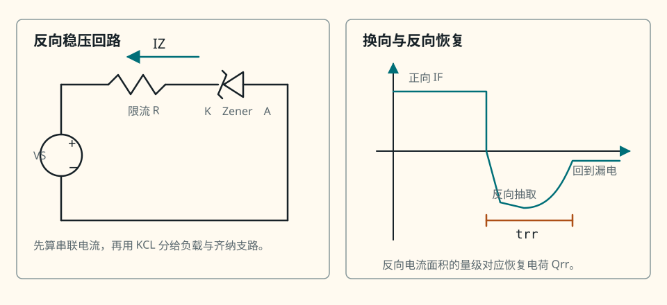{ .ae-figure }
<figcaption markdown="1">使用左侧稳压回路，并在齐纳两端并联题给 $R_L$；串联电流等于负载电流与齐纳电流之和。</figcaption>
</figure>

### D-09　小信号电阻的温度趋势

**P1｜基础｜趋势+口述｜前置：$r_d=nV_T/I_D$。** 分别在“$I_D$ 由理想偏置保持不变”与“$V_D$ 固定、Shockley 模型参数随温度变化”两种条件下讨论升温对 $r_d$ 的趋势；说明为何不能只说“温度升高，$r_d$ 必增”。[核对答案](详细解答.md#d-09)

<figure class="ae-figure-frame" markdown="1">
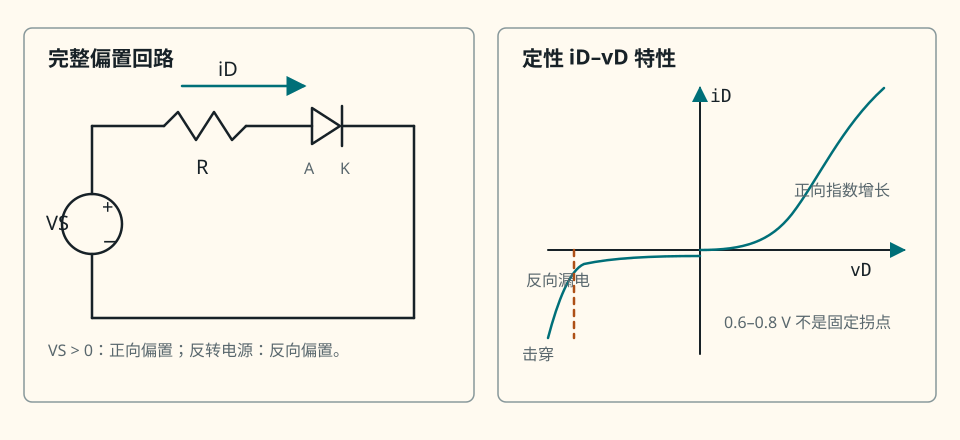{ .ae-figure }
<figcaption markdown="1">先声明保持电流还是保持电压，再判断温度改变后 Q 点与局部斜率怎样移动。</figcaption>
</figure>

### D-10　“硅管恒为 0.7 V”为何失效

**P2｜深入｜口述（结论失效）｜前置：五种二极管模型。** 给出至少四个反例或边界，并说明在整流估算、微小交流、反向击穿和高频开关中应换用什么模型。[核对答案](详细解答.md#d-10)

<figure class="ae-figure-frame" markdown="1">
{ .ae-figure }
<figcaption markdown="1">同一器件可按任务采用理想、恒压降、分段线性、指数或 Q 点小信号模型；“0.7 V”只是其中一种工作区近似。</figcaption>
</figure>

## 三、BJT 与 MOSFET（T）

### T-01　端子、方向与载流子

**P0｜基础｜作图+口述｜前置：半导体电流。** 画 NPN 与增强型 NMOS；标端子、$I_B/I_C/I_E,I_D,V_{BE},V_{CE},V_{GS},V_{DS}$ 的本书参考方向，画电子路径/反型沟道并解释电子流与传统电流相反。[核对答案](详细解答.md#t-01)

<figure class="ae-figure-frame" markdown="1">
{ .ae-figure }
<figcaption markdown="1">先独立画，再用图核对两类器件的控制端、输出端和低频端口表述；载流子路径仍需自己补出。</figcaption>
</figure>

### T-02　由端电压判断 BJT 区域

**P0｜基础｜状态｜前置：两结判区。** 三组 $(V_E,V_B,V_C)$：A $(0.40,1.10,4.20)$，B $(0,0.10,5.00)$，C $(0,0.80,0.20)\ \mathrm V$。求 $V_{BE},V_{BC},V_{CE}$ 并以两结偏置判区；正偏约 $0.70\ \mathrm V$，饱和模型 $V_{BE,sat}=0.80\ \mathrm V,V_{CE,sat}=0.20\ \mathrm V$。[核对答案](详细解答.md#t-02)

<figure class="ae-figure-frame" markdown="1">
{ .ae-figure }
<figcaption markdown="1">每组电压都先算 $V_{BE}$ 与 $V_{BC}$，再在图中定位；不能只凭 $V_{BE}\approx0.7\ \mathrm V$ 判断正向有源。</figcaption>
</figure>

### T-03　固定偏置 Q 点

**P0｜基础｜计算+状态｜前置：BJT 分段模型。** NPN 发射极接地，$V_{CC}=9.00\ \mathrm V,R_B=330\ \mathrm{k\Omega},R_C=1.80\ \mathrm{k\Omega}$，取 $V_{BE}=0.70\ \mathrm V,\beta=80$；饱和候选 $V_{BE,sat}=0.80\ \mathrm V,V_{CE,sat}=0.20\ \mathrm V$。求各端电流、电压、Q 点，画负载线并验区。[核对答案](详细解答.md#t-03)

<figure class="ae-figure-frame" markdown="1">
{ .ae-figure }
<figcaption markdown="1">连接关系沿用本图，所有数值改用 T-03 题面；求完必须用 $V_{BC}$ 检查正向有源候选。</figcaption>
</figure>

### T-04　gₘ、rπ、rₑ 与线性尺度

**P0｜基础｜计算｜前置：BJT 小信号。** $I_{CQ}=1.50\ \mathrm{mA},\beta=120,|\tilde v_{be}|=4.00\ \mathrm{mV},V_T=25.9\ \mathrm{mV}$。求 $g_m,r_\pi,r_e$（精确 $\alpha/g_m$ 与 $1/g_m$ 近似），并估二阶/一阶尺度。[核对答案](详细解答.md#t-04)

<figure class="ae-figure-frame" markdown="1">
{ .ae-figure }
<figcaption markdown="1">偏置电流决定切线斜率 $g_m$，信号幅度相对 $V_T$ 的大小决定一阶模型误差。</figcaption>
</figure>

### T-05　发射极反馈趋势

**P1｜迁移｜趋势｜前置：分压偏置。** 采用[图 3-8](../guide/03-BJT与MOSFET.md#42-例题-b分压偏置加发射极电阻)的 NPN 电路：$V_{CC}=12.0\ \mathrm V$；$R_1=82.0\ \mathrm{k\Omega}$ 从 $V_{CC}$ 接 B，$R_2=18.0\ \mathrm{k\Omega}$ 从 B 接地，$R_C=2.20\ \mathrm{k\Omega}$ 从 $V_{CC}$ 接 C，$R_E=1.00\ \mathrm{k\Omega}$ 从 E 接地；以 $T=300\ \mathrm K$、候选正向有源 $\beta=100,V_{BE}=0.70\ \mathrm V$ 为基准，忽略 Early 效应和自热。每次只改一项：$\beta:50\to150$；$R_E$ 增 20%；升温只令 $V_{BE}$ 降低；$R_{TH}$ 降而 $V_{TH}$ 不变。判断 $I_C,V_E,V_{CE}$ 首要趋势、反馈链及是否接近区域边界。[核对答案](详细解答.md#t-05)

<figure class="ae-figure-frame" markdown="1">
{ .ae-figure }
<figcaption markdown="1">每小问只改变题目指定的一项；沿 $I_C\rightarrow V_E,V_C\rightarrow V_{CE}$ 的路径判断并检查区域。</figcaption>
</figure>

### T-06　MOS 过驱动、区域与电流

**P0｜基础｜计算+状态｜前置：长沟道平方律。** NMOS 体接源，$V_{TH}=0.80\ \mathrm V,k_n=0.80\ \mathrm{mA/V^2},V_{GS}=2.60\ \mathrm V$。对 $V_{DS}=0.70,3.00\ \mathrm V$ 求 $V_{OV}$、区域和 $I_D$；验证 $V_{DS}=V_{OV}$ 两式连续。[核对答案](详细解答.md#t-06)

<figure class="ae-figure-frame" markdown="1">
{ .ae-figure }
<figcaption markdown="1">先由 $V_{GS}$ 求 $V_{OV}$，再比较 $V_{DS}$；“栅压超过阈值”本身不能推出 NMOS 在饱和区。</figcaption>
</figure>

### T-07　栅分压—源电阻偏置

**P1｜迁移｜计算+状态｜前置：MOS 偏置。** $V_{DD}=9.00\ \mathrm V,R_1=2.00\ \mathrm{M\Omega},R_2=1.00\ \mathrm{M\Omega},R_D=1.50\ \mathrm{k\Omega},R_S=0.750\ \mathrm{k\Omega}$，$V_{TH}=1.00\ \mathrm V,k_n=1.20\ \mathrm{mA/V^2}$。求全部代数根，筛物理解并给各节点与 Q 点。[核对答案](详细解答.md#t-07)

<figure class="ae-figure-frame" markdown="1">
{ .ae-figure }
<figcaption markdown="1">沿用图中拓扑、替换为 T-07 数值。所有代数根都要回代 $V_{OV}$ 与 $V_{DS}$ 的区域条件。</figcaption>
</figure>

### T-08　MOS 偏置、gₘ 与 rₒ 趋势

**P1｜迁移｜趋势｜前置：源极反馈、沟长调制。** 在饱和且未跨区时分别增大 $V_{TH}$、$R_S$、$R_D$；判断 $I_D,V_S,V_{OV},g_m$。另保持 $I_D,V_{DS}$ 而把 $\lambda$ 加倍，判断 $r_o=(1+\lambda V_{DS})/(\lambda I_D)$。[核对答案](详细解答.md#t-08)

<figure class="ae-figure-frame" markdown="1">
{ .ae-figure }
<figcaption markdown="1">A～C 每次只改变一个元件或参数；$R_D$ 首先改变漏端余量，未跨区且 $\lambda=0$ 时不会直接进入栅—源偏置方程。</figcaption>
</figure>

### T-09　模型有效性压力测试

**P2｜深入｜趋势（结论失效）｜前置：小信号与器件非理想。** 判断以下变化使一阶模型误差增减及首先应补什么效应：$|v_{be}|:1\to20\ \mathrm{mV}$；$|v_{gs}|/V_{OV}:0.01\to0.5$；频率升至结/栅电容显著；现代短沟道替代长沟道；$V_{CE}$ 靠近饱和。[核对答案](详细解答.md#t-09)

<figure class="ae-figure-frame" markdown="1">
{ .ae-figure }
<figcaption markdown="1">图中模型只代表 Q 点附近、给定频带内的一阶近似；题目逐项迫使它加入非线性、电容、短沟道或跨区效应。</figcaption>
</figure>

### T-10　BJT/MOS 跨导与输入端比较

**P1｜基础｜趋势+口述｜前置：$g_m/I$。** 两者偏置电流均 $1.00\ \mathrm{mA}$。比较 $g_{m,BJT}=I_C/V_T$ 与 $g_{m,MOS}=2I_D/V_{OV}$ 在 $V_{OV}:0.40\to0.20\ \mathrm V$ 时的差距；说明高频下“输入开路”怎样失效及各自怎样用局部直流反馈稳定偏置。[核对答案](详细解答.md#t-10)

<figure class="ae-figure-frame" markdown="1">
{ .ae-figure }
<figcaption markdown="1">比较必须同时说明控制电压、输入电流近似、跨导效率和频率边界，不能只贴“电流控/电压控”标签。</figcaption>
</figure>

### T-11　工作区判断算法口述

**P0｜基础｜口述+状态｜前置：候选—审判法。** 用 60 秒分别给出 NPN 和 NMOS 的“假设区域—列式—求解—不等式审判—换模型”流程；解释为何不能先用 $I_C=\beta I_B$ 或饱和平方律算到底。[核对答案](详细解答.md#t-11)

| NPN 两结判区 | NMOS 电压不等式判区 |
|---|---|
|  |  |

先从候选区选择对应方程，求解后再回到这两张图区图逐条审判，而不是由最初假设直接宣布答案。

### T-12　从偏置电流得到 BJT 小信号参数

**P0｜基础｜计算｜前置：$g_m,r_\pi$。** $T=300\ \mathrm K,I_C=2.00\ \mathrm{mA},\beta=150$。求 $g_m,r_\pi,1/g_m$，并给使指数非线性二阶/一阶小于 5% 的 $|v_{be,peak}|$ 上限。[核对答案](详细解答.md#t-12)

<figure class="ae-figure-frame" markdown="1">
{ .ae-figure }
<figcaption markdown="1">先由 $I_C$ 定 $g_m$，再由 $\beta$ 定 $r_\pi$；允许幅度必须回到指数展开误差检查。</figcaption>
</figure>

### T-13　MOS 跨导的两种形式

**P1｜迁移｜证明+趋势｜前置：平方律。** 从 $I_D=k_nV_{OV}^2/2$ 推出 $g_m=k_nV_{OV}=2I_D/V_{OV}=\sqrt{2k_nI_D}$；讨论固定 $I_D$ 降低 $V_{OV}$ 的增益、摆幅、线性和模型边界权衡。[核对答案](详细解答.md#t-13)

<figure class="ae-figure-frame" markdown="1">
{ .ae-figure }
<figcaption markdown="1">切线斜率是 $g_m$；降低 $V_{OV}$ 提高 $g_m/I_D$ 的同时，也改变允许摆幅和强反型长沟道模型余量。</figcaption>
</figure>

### T-14　“MOS 是纯电压控制、栅极永不取电流”为何失效

**P2｜深入｜口述（结论失效）｜前置：栅电容与漏电。** 从 DC 绝缘栅近似、高频位移电流、栅漏电/保护二极管、击穿和驱动功耗五方面纠正该说法，并给出可安全使用 $I_G\approx0$ 的边界。[核对答案](详细解答.md#t-14)

<figure class="ae-figure-frame" markdown="1">
{ .ae-figure }
<figcaption markdown="1">低—中频 DC 栅电流近零是端口近似；高频栅电容充放电、保护结构、漏电与击穿都会使“永不取电流”失效。</figcaption>
</figure>

## 四、基本放大器（A）

### A-01　DC/AC 分离与交流地

**P0｜基础｜作图+口述｜前置：耦合/旁路电容。** 对[图 4-20](../guide/04-基本放大电路.md#72-完整源级负载图与三段传递)的给定 CE（$V_{CC}=12\ \mathrm V,R_1=82\ \mathrm{k\Omega},R_2=18\ \mathrm{k\Omega},R_C=2.20\ \mathrm{k\Omega},R_E=1.00\ \mathrm{k\Omega}$）画 DC 与中频图，标 $C_{in},C_{out},C_E,V_{CC}$ 和返回，解释为何 $V_{CC}$ 只在小信号图中成为交流地。[核对答案](详细解答.md#a-01)

<figure class="ae-figure-frame" markdown="1">
{ .ae-figure }
<figcaption markdown="1">从同一张完整图分别得到 DC 与中频等效图；不要把电容的两种状态混在一组方程中。</figcaption>
</figure>

### A-02　CE 的 Q 点与总增益

**P0｜基础｜计算+状态｜前置：第 3 章、CE 小信号。** 取[图 4-9](../guide/04-基本放大电路.md#41-直觉与完整偏置电路)全部数值，$v_s=8.0\ \mathrm{mV_{peak}}$。求 $I_{BQ},I_{CQ},V_{CEQ},g_m,r_\pi,R_{in},v_L/v_b,v_L/v_s$，检查工作区、线性尺度与摆幅。[核对答案](详细解答.md#a-02)

<figure class="ae-figure-frame" markdown="1">
{ .ae-figure }
<figcaption markdown="1">先按电容开路求 DC，再按中频短路画小信号图；源、级、负载三段传递分开计算。</figcaption>
</figure>

### A-03　增大集电电阻 RC 后为何不能只说增益增大

**P1｜迁移｜趋势（结论失效）｜前置：Q 点与加载。** 在 A-02 只把 $R_C:2.20\to4.70\ \mathrm{k\Omega}$。按 Q 点、$R_C\parallel R_L$、增益绝对值、截止/饱和余量逐项判断并重验工作区。[核对答案](详细解答.md#a-03)

<figure class="ae-figure-frame" markdown="1">
{ .ae-figure }
<figcaption markdown="1">只改变 $R_C$；先在完整电路重算 Q 点，再进入中频模型判断加载与增益。</figcaption>
</figure>

### A-04　未旁路 CE 的精确 β 形式

**P0｜基础｜推导+计算｜前置：混合-$\pi$。** $\beta=100,g_m=40.0\ \mathrm{mS},r_\pi=2.50\ \mathrm{k\Omega},R_C=3.30\ \mathrm{k\Omega},R_L=10.0\ \mathrm{k\Omega},R_E=470\ \Omega,r_o\to\infty$。先画完整中频混合-$\pi$ 小信号图，标出 $v_b,v_\pi,v_e,v_o$、$r_\pi$、受控源 $g_mv_\pi$、$R_E$、$R_C\parallel R_L$ 及公共交流地；再从 $i_b$ 推导并算 $v_o/v_b$、$R_{in,b}$，比较高 $\beta$ 近似。[核对答案](详细解答.md#a-04)

<figure class="ae-figure-frame" markdown="1">
{ .ae-figure }
<figcaption markdown="1">沿基极—发射极回路先写输入关系，再由集电极受控电流和负载求输出。</figcaption>
</figure>

### A-05　CC 的增益、输入与输出

**P0｜基础｜计算+口述｜前置：射极跟随器。** $\beta=100,r_\pi=2.590\ \mathrm{k\Omega},R_E=2.20\ \mathrm{k\Omega},R_L=1.00\ \mathrm{k\Omega},R_1\parallel R_2=47.0\ \mathrm{k\Omega},R_s=1.00\ \mathrm{k\Omega}$。求 $v_L/v_b,R_{in,b},R_{in},v_L/v_s$；移除 $R_L$ 后求 $R_{out}$，解释增益小于 1 仍有何价值。[核对答案](详细解答.md#a-05)

<figure class="ae-figure-frame" markdown="1">
{ .ae-figure }
<figcaption markdown="1">输出取发射极；求输出电阻时先移除 $R_L$，并把独立输入信号置零。</figcaption>
</figure>

### A-06　CB 的低输入与电流传输

**P1｜基础｜计算+口述｜前置：共基。** $\beta=120,g_m=50.0\ \mathrm{mS},r_\pi=\beta/g_m,R_C=2.70\ \mathrm{k\Omega},R_L=8.20\ \mathrm{k\Omega},R_E=1.00\ \mathrm{k\Omega}$，基极交流接地。求 $R_{in,e}$、总输入、$v_o/v_e$ 与本征电流传输幅值，并解释同相。[核对答案](详细解答.md#a-06)

<figure class="ae-figure-frame" markdown="1">
{ .ae-figure }
<figcaption markdown="1">输入从发射极进入，基极为交流公共端，输出取集电极；相位要沿控制电压和集电流方向推出。</figcaption>
</figure>

### A-07　MOS 三组态同尺度

**P1｜基础｜计算｜前置：MOS 小信号。** 三只 NMOS 均 $g_m=4.00\ \mathrm{mS},r_o\to\infty,g_{mb}=0$。CS/CG：$R_D=6.80\ \mathrm{k\Omega},R_L=10.0\ \mathrm{k\Omega}$；SF：$R_S=3.30\ \mathrm{k\Omega},R_L=2.20\ \mathrm{k\Omega}$。求三种节点增益和 CG 输入电阻，标反相/同相与公共端。[核对答案](详细解答.md#a-07)

<figure class="ae-figure-frame" markdown="1">
{ .ae-figure }
<figcaption markdown="1">逐图确认输入、输出和交流公共端后再写增益；不要只把 BJT 公式换字母。</figcaption>
</figure>

### A-08　源极退化、体效应与负载趋势

**P1｜迁移｜趋势｜前置：MOS 三组态。** 分别增大 CS 未旁路 $R_S$、减小 SF 的 $R_L$、增强固定衬底 SF 的体效应、增大 CG 的 $g_m$；对增益、输入/输出电阻和线性给有条件趋势。[核对答案](详细解答.md#a-08)

<figure class="ae-figure-frame" markdown="1">
{ .ae-figure }
<figcaption markdown="1">四问对应不同面板和不同局部反馈路径；每次只改变题面指定的一项。</figcaption>
</figure>

### A-09　输入/输出电阻测试源

**P0｜基础｜作图+计算｜前置：端口测试。** 输入测试 $20.0\ \mathrm{mV}$ 得流入 $5.00\ \mu\mathrm A$；移除负载、置零独立输入而保留受控源，输出测试 $100\ \mathrm{mV}$ 得注入 $40.0\ \mu\mathrm A$。画测试图、求两电阻；若未移除 $10.0\ \mathrm{k\Omega}$ 负载会测到什么？[核对答案](详细解答.md#a-09)

<figure class="ae-figure-frame" markdown="1">
{ .ae-figure }
<figcaption markdown="1">输入、输出是两次不同测试；输出测试必须移除负载并保留受控源和反馈路径。</figcaption>
</figure>

### A-10　源—级—负载链

**P0｜基础｜计算+趋势｜前置：输入/输出加载。** $A_{v0}=-40,R_{in}=5.00\ \mathrm{k\Omega},R_{out}=1.00\ \mathrm{k\Omega},R_s=1.00\ \mathrm{k\Omega},R_L=4.00\ \mathrm{k\Omega},v_s=12.0\ \mathrm{mV_{peak}}$。列 $k_s,A_{vL},G_v,v_L$；判断 $R_s$ 加倍、$R_L$ 减半的影响，不得重复计入负载。[核对答案](详细解答.md#a-10)

<figure class="ae-figure-frame" markdown="1">
{ .ae-figure }
<figcaption markdown="1">沿图从左到右只乘一次输入分压、空载级增益和输出加载；每个比值都要写清端点。</figcaption>
</figure>

### A-11　耦合/旁路电容故障

**P1｜迁移｜诊断｜前置：DC/AC 分离。** 诊断：①$C_{in}$ 前有 AC 后无；②接源后 $V_{BQ}$ 被拉向 0；③集电极有 AC、$R_L$ 无；④Q 点正常但增益下降且 $v_e$ 增大。分别给首要电容状态和一个 DC、AC 验证，并说明旁路电容短路风险。[核对答案](详细解答.md#a-11)

<figure class="ae-figure-frame" markdown="1">
{ .ae-figure }
<figcaption markdown="1">按信号从左到右定位 $C_{in},C_E,C_{out}$；先测 DC Q 点，再沿 AC 路径找最早断点。</figcaption>
</figure>

### A-12　削顶与重载诊断

**P1｜迁移｜诊断｜前置：工作区、负载线。** 输出定义为集/漏极对地，诊断 NPN CE 顶部贴 $V_{CC}$、底部 $V_{CE}\approx0.20\ \mathrm V$，NMOS CS 顶部贴 $V_{DD}$、底部 $V_{DS}<V_{GS}-V_{TH}$，以及接小 $R_L$ 后提前削顶；解释为何不可照搬到 CC/SF。[核对答案](详细解答.md#a-12)

<figure class="ae-figure-frame" markdown="1">
{ .ae-figure }
<figcaption markdown="1">先按输出节点对地电压描述“顶部/底部”，再沿器件电流和工作区解释。</figcaption>
</figure>

### A-13　三种 BJT 组态口述比较

**P0｜基础｜口述｜前置：CE/CC/CB。** 用输入端、输出端、公共端、相位、$R_{in},R_{out}$ 和典型用途七列比较 CE、CC、CB；每个趋势写出所用模型边界。[核对答案](详细解答.md#a-13)

<figure class="ae-figure-frame" markdown="1">
{ .ae-figure }
<figcaption markdown="1">“共”指交流公共端。依次辨认输入、输出、公共端和相位，再填写阻抗与用途。</figcaption>
</figure>

### A-14　由目标 Q 点反推节点

**P0｜基础｜计算+设计｜前置：DC 负载线。** $V_{CC}=12\ \mathrm V,R_C=2.0\ \mathrm{k\Omega},R_E=1.0\ \mathrm{k\Omega}$，希望 $I_C\approx2.0\ \mathrm{mA},\beta\gg1,V_{BE}=0.70\ \mathrm V$。求 $V_E,V_B,V_C,V_{CE}$，验正向有源并讨论是否接近对称摆幅。[核对答案](详细解答.md#a-14)

<figure class="ae-figure-frame" markdown="1">
{ .ae-figure }
<figcaption markdown="1">沿用集电极和发射极电阻回路；题目要求从目标电流反推节点电压。</figcaption>
</figure>

### A-15　“CE 增益就是 −gₘRC”何时失效

**P1｜迁移｜口述（结论失效）｜前置：完整增益链。** 至少从负载、$r_o$、发射极退化、源加载、频率、工作区和大信号七方面修正式子；明确“级内增益”和“源到负载总增益”。[核对答案](详细解答.md#a-15)

<figure class="ae-figure-frame" markdown="1">
{ .ae-figure }
<figcaption markdown="1">$-g_mR_C$ 只对应特定局部图；逐项把题目列出的遗漏重新接回模型。</figcaption>
</figure>

### A-16　对称摆幅 Q 点证明

**P2｜深入｜证明｜前置：负载线、削顶。** 对发射极 DC 电压近似固定的 CE，集电极输出上界 $V_{CC}$、下界 $V_E+V_{CE,sat}$。证明最大无削顶峰值在 $V_{CQ}$ 取两界中点，并说明交流负载与 $V_E$ 摆动会怎样改变结论。[核对答案](详细解答.md#a-16)

<figure class="ae-figure-frame" markdown="1">
{ .ae-figure }
<figcaption markdown="1">把上下可用电压余量写成两个距离；最大化较小者即可得到中点条件。</figcaption>
</figure>

## 五、运算放大器（O）

### O-01　开环饱和状态

**P0｜基础｜计算+状态｜前置：$v_o=A(v_+-v_-)$ 与限幅。** 供电 $\pm12\ \mathrm V$，$V_{OH}=10.8\ \mathrm V,V_{OL}=-10.3\ \mathrm V,A=2.0\times10^5$。对 $(v_+,v_-)=(0.50000,0.49996),(0.1000,0.1001),(-1.00000,-1.00002)\ \mathrm V$ 写线性候选和实际状态；不得用虚短。[核对答案](详细解答.md#o-01)

<figure class="ae-figure-frame" markdown="1">
{ .ae-figure }
<figcaption markdown="1">先由中央斜率求线性候选，再用 $V_{OH},V_{OL}$ 限幅；开环题不能先假定虚短。</figcaption>
</figure>

### O-02　虚短有效性四连判

**P0｜基础｜口述+状态｜前置：反馈极性。** 判断能否用虚短：负反馈反相器候选 $-3\ \mathrm V$ 且范围 $\pm9\ \mathrm V$；同电路候选 $-12\ \mathrm V$；开环比较器；输出回同相端的施密特。写反馈、线性与非理想检查依据。[核对答案](详细解答.md#o-02)

<figure class="ae-figure-frame" markdown="1">
{ .ae-figure }
<figcaption markdown="1">虚断来自高输入阻抗，虚短还要求负反馈且候选输出处于线性状态；四种情况逐项检查。</figcaption>
</figure>

### O-03　反相器全边界

**P0｜基础｜计算+状态｜前置：反相 KCL。** $R_{in}=8.20\ \mathrm{k\Omega},R_f=39.0\ \mathrm{k\Omega},R_L=4.70\ \mathrm{k\Omega}$，$v_i=1.20\sin(2\pi\cdot8\mathrm{kHz}t)\ \mathrm V$。运放供电 $\pm10.0\ \mathrm V$，输出范围 $\pm8.5\ \mathrm V$，共模 $[-8,8]\ \mathrm V$，$I_{o,max}=8\ \mathrm{mA}$，GBW $800\ \mathrm{kHz}$，SR $0.60\ \mathrm{V/\mu s}$。先画完整电路：$v_i$ 经 $R_{in}$ 接 $v_-$，$R_f$ 从 $v_o$ 返回 $v_-$，$v_+$ 接公共地，$R_L$ 从 $v_o$ 接地，并标电源轨、节点电压和输出/反馈电流参考方向；再列 KCL、求候选增益与峰值，逐项检查轨、共模、负载加反馈电流、GBW 和 SR。[核对答案](详细解答.md#o-03)

<figure class="ae-figure-frame" markdown="1">
{ .ae-figure }
<figcaption markdown="1">数值以题面为准；图中的电源、负载返回和反馈支路都必须保留在状态检查中。</figcaption>
</figure>

### O-04　有限开环增益 A 的反相误差

**P0｜基础｜推导+计算｜前置：有限开环模型。** $R_{in}=10.0\ \mathrm{k\Omega},R_f=90.0\ \mathrm{k\Omega},A=5.0\times10^4,v_i=0.500\ \mathrm V$，输出范围 $\pm13\ \mathrm V$。由 $v_-=-v_o/A$ 与 KCL 推精确增益，算误差并判状态。[核对答案](详细解答.md#o-04)

<figure class="ae-figure-frame" markdown="1">
{ .ae-figure }
<figcaption markdown="1">沿用反相拓扑，但不要令 $v_-=0$；用 $v_-=-v_o/A$ 与求和节点 KCL 联立。</figcaption>
</figure>

### O-05　同相器与跟随器加载

**P0｜基础｜计算+状态｜前置：同相 KCL。** 同相器 $R_f=47\ \mathrm{k\Omega},R_g=10\ \mathrm{k\Omega},v_i=1.50\ \mathrm V,R_L=1.00\ \mathrm{k\Omega}$，输出范围 $\pm10\ \mathrm V$、共模 $\pm9\ \mathrm V$、最大电流 $6\ \mathrm{mA}$，判状态。再比较 $1\ \mathrm V,R_s=200\ \mathrm{k\Omega}$ 传感器直接与经理想跟随器驱动 $2\ \mathrm{k\Omega}$。[核对答案](详细解答.md#o-05)

<figure class="ae-figure-frame" markdown="1">
{ .ae-figure }
<figcaption markdown="1">先完成同相闭环状态检查，再用图中的源阻抗—负载关系比较直接连接与缓冲连接。</figcaption>
</figure>

### O-06　加权求和与饱和

**P0｜基础｜计算+状态｜前置：求和节点 KCL。** $R_f=30\ \mathrm{k\Omega}$，$(v_1,R_1)=(0.40\ \mathrm V,10\ \mathrm{k\Omega})$、$(v_2,R_2)=(-1.20\ \mathrm V,20\ \mathrm{k\Omega})$、$(v_3,R_3)=(2.00\ \mathrm V,60\ \mathrm{k\Omega})$，输出范围 $\pm4.2\ \mathrm V$。求候选；再只令 $v_1=2.0\ \mathrm V$ 重判。[核对答案](详细解答.md#o-06)

<figure class="ae-figure-frame" markdown="1">
{ .ae-figure }
<figcaption markdown="1">三路各经独立电阻流入同一求和节点；饱和后必须撤销虚短和线性叠加。</figcaption>
</figure>

### O-07　差分器匹配与共模边界

**P1｜迁移｜计算+趋势｜前置：差分放大器。** 四电阻连接为：$v_1$ 经 $R_1=10\ \mathrm{k\Omega}$ 接 $v_-$，$R_2=100\ \mathrm{k\Omega}$ 从 $v_o$ 反馈到 $v_-$；$v_2$ 经 $R_3=12\ \mathrm{k\Omega}$ 接 $v_+$，待选 $R_4$ 从 $v_+$ 接公共地。$v_1,v_2,v_o$ 均定义为相应节点对公共地电压；在 $v_-$ 取 $v_1\to v_-$ 与 $v_-\to v_o$ 为 KCL 参考方向。取 $v_1=2.40\ \mathrm V,v_2=2.55\ \mathrm V$，输出范围 $\pm10\ \mathrm V$、输入共模 $[-1,5]\ \mathrm V$。选 $R_4$ 使比值匹配并求输出；两输入同加 $4\ \mathrm V$ 后比较公式与实体状态。[核对答案](详细解答.md#o-07)

<figure class="ae-figure-frame" markdown="1">
{ .ae-figure }
<figcaption markdown="1">电阻编号和两侧连接以图为准；匹配条件比较的是两个电阻比，不是四只电阻都相等。</figcaption>
</figure>

### O-08　积分器初值与撞轨

**P1｜迁移｜计算+波形｜前置：积分器。** $R=200\ \mathrm{k\Omega},C=0.50\ \mu\mathrm F$，输出范围 $[-5,5]\ \mathrm V$，定义 $v_C=v_--v_o$ 且 $v_C(0)=1.50\ \mathrm V$。$0\le t<0.20\ \mathrm s$ 时 $v_i=0.25\ \mathrm V$，随后 $-0.10\ \mathrm V$。写分段候选和首次撞轨；说明并联 $R_f$ 后 DC 趋势。[核对答案](详细解答.md#o-08)

<figure class="ae-figure-frame" markdown="1">
{ .ae-figure }
<figcaption markdown="1">先按图定义电容电压和输出初值，再对两个时间区间分别积分并保持切换时刻连续。</figcaption>
</figure>

### O-09　微分器波形与动态限制

**P1｜迁移｜计算+趋势｜前置：微分器。** $R_f=15.0\ \mathrm{k\Omega},C=6.8\ \mathrm{nF},v_i=0.30\sin(2\pi\cdot5\mathrm{kHz}t)\ \mathrm V$；输出范围 $\pm4\ \mathrm V$、SR $0.20\ \mathrm{V/\mu s}$、GBW $1\ \mathrm{MHz}$。求理想输出、所需最大斜率并检查限制；说明实用 $R_{in},C_f$ 作用。[核对答案](详细解答.md#o-09)

<figure class="ae-figure-frame" markdown="1">
{ .ae-figure }
<figcaption markdown="1">先由输入电容电流求理想输出，再检查输出幅值、斜率和带宽；实用电路用额外元件限制高频增益。</figcaption>
</figure>

### O-10　比较器状态表

**P0｜基础｜状态+口述｜前置：开环比较。** 同相输入 $v_i$，反相参考 $0.750\ \mathrm V$；$V_{OH}=4.8\ \mathrm V,V_{OL}=0.15\ \mathrm V$。为 $v_i=0.60,0.75,0.90\ \mathrm V$ 写状态并说明为何不能用虚短。[核对答案](详细解答.md#o-10)

<figure class="ae-figure-frame" markdown="1">
{ .ae-figure }
<figcaption markdown="1">比较 $v_+$ 与 $v_-$ 的符号决定输出状态；恰在阈值处不能由理想静态模型唯一决定。</figcaption>
</figure>

### O-11　非对称施密特阈值

**P1｜迁移｜推导+波形｜前置：正反馈。** 反相施密特中 $R_1=24\ \mathrm{k\Omega}$ 从输出到 $v_+$，$R_2=16\ \mathrm{k\Omega}$ 从 $v_+$ 到 $V_{ref}=0.25\ \mathrm V$，$V_{OH}=4.1\ \mathrm V,V_{OL}=-4.5\ \mathrm V$。求上下阈值和滞回，描述 $-3\to+3\to-3\ \mathrm V$ 翻转。[核对答案](详细解答.md#o-11)

<figure class="ae-figure-frame" markdown="1">
{ .ae-figure }
<figcaption markdown="1">阈值由当前输出状态决定：分别代入 $V_{OH}$ 与 $V_{OL}$，不能只算一个固定门槛。</figcaption>
</figure>

### O-12　综合反相器诊断

**P1｜迁移｜口述+计算｜前置：实际运放边界。** 反相器 $R_{in}=10\ \mathrm{k\Omega},R_f=100\ \mathrm{k\Omega},R_L=1\ \mathrm{k\Omega}$，$v_i=0.80\sin(2\pi\cdot20\mathrm{kHz}t)\ \mathrm V$；输出范围 $\pm10\ \mathrm V$、输入共模范围 $[-9,+9]\ \mathrm V$、$I_{max}=5\ \mathrm{mA}$、GBW $1.1\ \mathrm{MHz}$、SR $0.30\ \mathrm{V/\mu s}$。按轨、共模、电流、GBW、SR 诊断并判断虚短。[核对答案](详细解答.md#o-12)

<figure class="ae-figure-frame" markdown="1">
{ .ae-figure }
<figcaption markdown="1">先用反相 KCL 得候选输出，再沿电源轨、共模、输出电流、GBW、SR 的顺序逐项撤销不成立的近似。</figcaption>
</figure>

### O-13　理想运放两条规则的来源

**P0｜基础｜口述｜前置：开环模型、负反馈。** 用 90 秒从 $v_o=A(v_+-v_-)$ 与输入阻抗趋于无穷解释“虚短、虚断”，并分别给出它们不代表的物理含义及使用前检查清单。[核对答案](详细解答.md#o-13)

<figure class="ae-figure-frame" markdown="1">
{ .ae-figure }
<figcaption markdown="1">围绕“输入电流小”和“差分电压小”分别解释来源；二者不是同一条假设。</figcaption>
</figure>

### O-14　“有反馈就能虚短”为何失效

**P2｜深入｜口述（结论失效）｜前置：反馈极性、稳定性。** 以正反馈、输出饱和、共模越界、电流限幅、GBW/SR 不足和环路失稳为反例，说明何时反馈存在但 $v_+\approx v_-$ 仍不成立。[核对答案](详细解答.md#o-14)

<figure class="ae-figure-frame" markdown="1">
{ .ae-figure }
<figcaption markdown="1">先用扰动方向确认是否为负反馈；即使方向正确，还要继续检查线性范围和动态稳定性。</figcaption>
</figure>

## 六、反馈与频率响应（F）

### F-01　反馈代数与灵敏度

**P0｜基础｜计算｜前置：$A_f=A/(1+A\beta)$。** $A=400,\beta=0.0150$。求 $T,A_f,S_A$；令 $A$ 降 25%，用初始点灵敏度与精确式求闭环相对变化并比较。[核对答案](详细解答.md#f-01)

<figure class="ae-figure-frame" markdown="1">
{ .ae-figure }
<figcaption markdown="1">先按图写误差和返回量，再代数消去内部变量；减号已经包含反馈极性。</figcaption>
</figure>

### F-02　扰动注入与反馈边界

**P1｜迁移｜推导+口述｜前置：注入点。** $x_o=A(x_s-\beta x_o)+n_o$，$A=120,\beta=0.0500$；另有输入同点噪声 $n_s$ 和取样点后负载扰动 $n_L$。推导 $x_o/x_s,x_o/n_s,x_o/n_o$，判断 $n_L$；再令高频 $T=0.200$，同时明确高频 $\beta$ 仍为 $0.0500$，故 $A=T/\beta$ 可数值确定，再重判。[核对答案](详细解答.md#f-02)

<figure class="ae-figure-frame" markdown="1">
{ .ae-figure }
<figcaption markdown="1">先确认扰动位于比较点、前向通道内还是取样点之后；只有被环路观察到的误差才可能按 $1+T$ 压低。</figcaption>
</figure>

### F-03　四种反馈组态与端口电阻

**P0｜基础｜分类+计算｜前置：输出取样、输入混合。** 对四个实际连接逐一分类并按“输出—输入”顺序命名：（a）输出分压网络跨接负载，其返回量与信号源在输入端串接成误差电压；（b）输出电压经反馈电阻返回输入电流求和节点；（c）电流传感器串入负载支路，其返回电压与信号源在输入端串接；（d）同样以串入负载的传感器测输出电流，但返回电流注入输入求和节点。统一取 $T=15,R_{in}=20\ \mathrm{k\Omega},R_{out}=800\ \Omega$，求四类闭环端口电阻的趋势与数值。[核对答案](详细解答.md#f-03)

| 电压串联 | 电压并联 |
|---|---|
|  |  |
| **电流串联** | **电流并联** |
|  |  |

先看输出端是跨接取压还是串入取流，再看输入端形成电压差还是电流和；名称采用“输出—输入”顺序。

### F-04　RC 低通精确幅相与阶跃

**P0｜基础｜计算+作图｜前置：复阻抗。** $R=6.80\ \mathrm{k\Omega},C=4.70\ \mathrm{nF}$，输入 $1.00\ \mathrm{V_{rms}}$。推 $H_{LP}$，求 $\tau,f_c$ 及 $0.1f_c,f_c,10f_c$ 的幅值、dB、相位并画渐近线；写 1 V 阶跃且标 $t=\tau$。[核对答案](详细解答.md#f-04)

<figure class="ae-figure-frame" markdown="1">
{ .ae-figure }
<figcaption markdown="1">输出取电容两端；先由复阻抗推传递函数，再用低频开路、高频短路检查。</figcaption>
</figure>

### F-05　RC 高通、分贝与初值

**P0｜基础｜计算+波形｜前置：高通。** $R=22.0\ \mathrm{k\Omega},C=100\ \mathrm{nF}$。求 $H_{HP},f_c$ 及 $100\ \mathrm{Hz},f_c,10\ \mathrm{kHz}$ 的 dB、相位；零初值下输入跃至 $2\ \mathrm V$，写输出暂态并解释 DC 输出为零。[核对答案](详细解答.md#f-05)

<figure class="ae-figure-frame" markdown="1">
{ .ae-figure }
<figcaption markdown="1">输出取电阻两端；阶跃瞬间由电容电压连续性定起点，长期 DC 由串联电容开路定终点。</figcaption>
</figure>

### F-06　多极点放大器 Bode 图

**P1｜迁移｜计算+作图｜前置：极点斜率叠加。** 对 $H(s)=-40[s/(s+2\pi50)][s/(s+2\pi200)]/[1+s/(2\pi20\mathrm{k})]/[1+s/(2\pi200\mathrm{k})]$ 画渐近幅频，标斜率；由总模求相对中频的两侧 $-3.01\ \mathrm{dB}$ 频率并与角频率粗估比较。[核对答案](详细解答.md#f-06)

<figure class="ae-figure-frame" markdown="1">
{ .ae-figure }
<figcaption markdown="1">每跨过一个零点或极点就更新一次斜率；总 $-3\ \mathrm{dB}$ 点不能在相邻转折时只凭某一个角频率决定。</figcaption>
</figure>

### F-07　单主极点反馈与增益带宽

**P0｜基础｜推导+计算｜前置：单极点。** $A(s)=A_0/(1+s/\omega_p)$，$A_0=8.00\times10^4,f_p=12.0\ \mathrm{Hz},\beta=0.0200$。求 $T_0,A_{f0},f_{Hf},A_{f0}f_{Hf}$，比较深反馈近似并说明为何不能由此回答 SR。[核对答案](详细解答.md#f-07)

<figure class="ae-figure-frame" markdown="1">
{ .ae-figure }
<figcaption markdown="1">图中乘积不变只属于单主极点小信号模型；压摆率是另一项大信号限制。</figcaption>
</figure>

### F-08　Miller 两端等效

**P1｜迁移｜推导+计算｜前置：跨接阻抗。** $C=1.20\ \mathrm{pF}$ 跨输入输出，频带内 $A_v=-80$；输入另有 $8.00\ \mathrm{pF}$、所见 $150\ \mathrm{k\Omega}$。推并求 $C_{in},C_{out}$、输入总电容和极点；说明 $A_v(s)$ 降幅转相后常数等效为何失效。[核对答案](详细解答.md#f-08)

<figure class="ae-figure-frame" markdown="1">
{ .ae-figure }
<figcaption markdown="1">输入、输出等效必须成对使用，并保留 $A_v$ 的符号和适用频带。</figcaption>
</figure>

### F-09　稳定裕度与纯延时

**P2｜深入｜计算+趋势｜前置：PM/GM。** 原环路在 $f_{gc}=40\ \mathrm{kHz}$ 相位 $-128^\circ$；$f_{pc}=180\ \mathrm{kHz}$ 时 $|T|=0.250$。求 PM、GM 和阶跃趋势；加入 $4.00\ \mu\mathrm s$ 纯延时且交越不变，求新 PM；说明为何不能替代 Nyquist。[核对答案](详细解答.md#f-09)

<figure class="ae-figure-frame" markdown="1">
{ .ae-figure }
<figcaption markdown="1">PM 在增益交越读相位，GM 在相位交越读幅值；加入延时只改相位，不得换错频率。</figcaption>
</figure>

### F-10　反馈、频响与失稳综合

**P1｜迁移｜口述+诊断｜前置：闭环与实际边界。** 电压串联反馈 $A_0=2.0\times10^4,\beta=0.0100,R_{in}=5\ \mathrm{k\Omega},R_{out}=1.2\ \mathrm{k\Omega},f_p=100\ \mathrm{Hz}$，另有第二极点 $80\ \mathrm{kHz}$；输出 $\pm10\ \mathrm V,8\ \mathrm{mA}$、SR $0.50\ \mathrm{V/\mu s}$，$R_L=2\ \mathrm{k\Omega}$，输入 $0.300\sin(2\pi30\mathrm{kHz}t)\ \mathrm V$。求候选并指出应撤销项与稳定性所需测量。[核对答案](详细解答.md#f-10)

<figure class="ae-figure-frame" markdown="1">
{ .ae-figure }
<figcaption markdown="1">低频闭环候选只是第一步；第二极点出现后还需按正确断环条件测同一环路的幅值与相位。</figcaption>
</figure>

### F-11　“负反馈总能改善一切”为何失效

**P0｜基础｜口述（结论失效）｜前置：反馈作用边界。** 以环外扰动、输出饱和、器件噪声注入位置、带宽代价、相位滞后和不稳定为例，给出负反馈能/不能改善的因果条件。[核对答案](详细解答.md#f-11)

<figure class="ae-figure-frame" markdown="1">
{ .ae-figure }
<figcaption markdown="1">只有被取样、比较、放大并能由执行端纠正的误差才在环路控制范围内。</figcaption>
</figure>

### F-12　零点与极点的手绘

**P0｜基础｜作图+口述｜前置：Bode 规则。** $H(s)=10(1+s/2\pi100)/[(1+s/2\pi1000)(1+s/2\pi10000)]$。画幅频渐近线，标各段斜率和角点修正方向；口述两个 LHP 极点、一个 LHP 零点各自的相位贡献边界。[核对答案](详细解答.md#f-12)

<figure class="ae-figure-frame" markdown="1">
{ .ae-figure }
<figcaption markdown="1">先从低频增益开始，按频率顺序逐个更新斜率，再补角点和相位过渡。</figcaption>
</figure>

## 七、系统级（S）

### S-01　差模、共模与 CMRR

**P0｜基础｜计算+口述｜前置：差/共模定义。** $v_1=1.205\ \mathrm V,v_2=1.195\ \mathrm V$，求 $v_{id},v_{cm}$ 并重构。某单端输出 $A_d=-80,A_c=0.00800$，求线性/dB CMRR；解释两输入同加 $2\ \mathrm V$ 后为何仍查共模范围。[核对答案](详细解答.md#s-01)

<figure class="ae-figure-frame" markdown="1">
{ .ae-figure }
<figcaption markdown="1">先按图中定义求“差值”与“平均值”，再用可逆关系重构两个引脚对地电压。</figcaption>
</figure>

### S-02　尾源、失配与两种共模增益

**P2｜深入｜趋势｜前置：对称差分对。** 增大尾源小信号输出电阻，再分别引入 $R_C$ 失配和温差。定义左单端 $A_{c,se}$ 与差分 $A_{c,diff}$，判断两者、各自 CMRR 和输出对称性；区分“有限尾阻产生共同移动”与“对称差分读出抵消”。[核对答案](详细解答.md#s-02)

<figure class="ae-figure-frame" markdown="1">
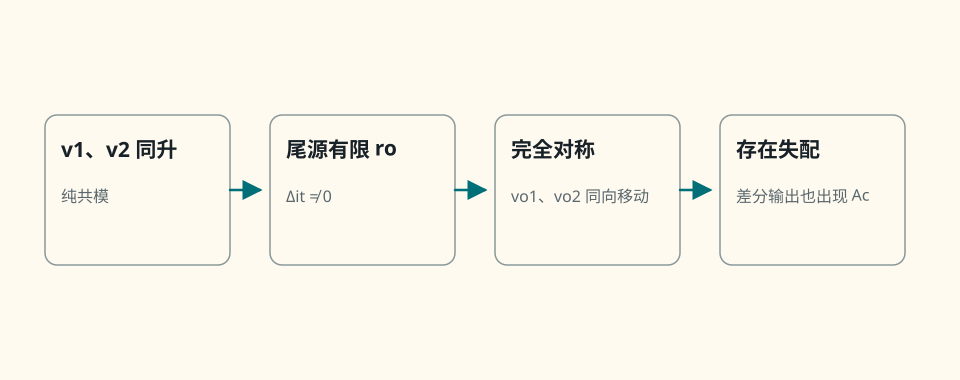{ .ae-figure }
<figcaption markdown="1">先分析完全对称时两个输出的共同移动，再加入失配；不要把单端共模增益和差分读出的共模增益混为一个量。</figcaption>
</figure>

### S-03　BJT 差分对符号与数值

**P0｜基础｜计算｜前置：半电路。** $I_T=1.20\ \mathrm{mA},R_C=3.90\ \mathrm{k\Omega},V_T=25.9\ \mathrm{mV}$，尾源阻抗无限，定义 $v_{id}=v_1-v_2,v_{od}=v_{o1}-v_{o2}$。求平衡电流、$g_m$、单端/差分增益及 $v_{id}=1\ \mathrm{mV}$ 时四个增量。[核对答案](详细解答.md#s-03)

<figure class="ae-figure-frame" markdown="1">
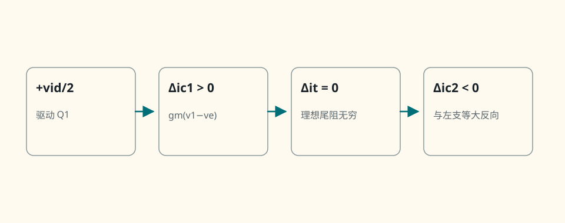{ .ae-figure }
<figcaption markdown="1">题目的正负号以图中 $v_{id}$、支路电流和两个输出的参考方向为准；建议先写增量再代数。</figcaption>
</figure>

### S-04　电流镜顺从与输出电阻

**P1｜迁移｜趋势｜前置：MOS 镜。** 对基本 NMOS 镜依次降低输出电压至低于 $V_{OV}$、在饱和内提高输出电压、增长沟道减小 $\lambda$、使输出管更热；判断输出电流、$r_o$、余量与误差趋势，温度项允许条件化。[核对答案](详细解答.md#s-04)

<figure class="ae-figure-frame" markdown="1">
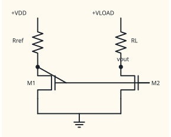{ .ae-figure }
<figcaption markdown="1">固定参考支路后，每次只改题面指定的一项；首先重新检查输出管工作区，然后再谈 $r_o$ 和镜像误差。</figcaption>
</figure>

### S-05　BJT/MOS 镜与有源负载

**P1｜基础｜作图+口述｜前置：电流镜。** 画两种镜的参考/输出回路，解释 BJT 基极电流误差、MOS 饱和区条件、顺从和有限 $r_o$；说明有源负载为何提高差分级增益，同时牺牲摆幅并引入高阻极点。[核对答案](详细解答.md#s-05)

<figure class="ae-figure-frame" markdown="1">
{ .ae-figure }
<figcaption markdown="1">左列 $Q_1$ 的集电极—基极短接，右列 $M_1$ 的漏极—栅极短接，均为参考管的二极管连接。作答时需自己在图外标出参考电流、输出电流、最低输出电压和有限输出电阻，不要把解释文字压在导线上。</figcaption>
</figure>

### S-06　B/AB 交越—热权衡

**P1｜基础｜趋势｜前置：互补推挽。** 保持电源、负载和输出正弦不变，逐步增加预偏置；判断过零失真、静态功耗、导通角和热失控风险。说明小发射极电阻作用，不能以“越大越好”结论。[核对答案](详细解答.md#s-06)

<figure class="ae-figure-frame" markdown="1">
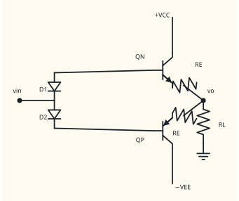{ .ae-figure }
<figcaption markdown="1">预偏置决定零点附近两管的导通重叠，小发射极电阻提供局部负反馈和电流均衡；两者都同时影响失真与热边界。</figcaption>
</figure>

### S-07　B 类效率证明与热检查

**P1｜基础｜证明+计算｜前置：正弦平均功率。** 理想互补 B 类用 $\pm10\ \mathrm V$ 驱动 $5.00\ \Omega$，$v_o=8.00\sin\omega t\ \mathrm V$。从半波电源电流积分推效率，求 $I_p,P_L,P_{DC},\eta$、总管耗散；解释为何不是 $\pi/4$ 并列 SOA/热数据需求。[核对答案](详细解答.md#s-07)

<figure class="ae-figure-frame" markdown="1">
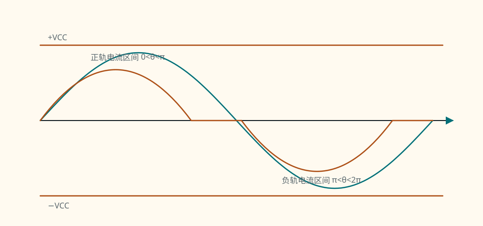{ .ae-figure }
<figcaption markdown="1">对电源功率积分时用每条电源支路的半波电流；对负载功率则用完整正弦的 RMS。</figcaption>
</figure>

### S-08　全波滤波纹波趋势

**P1｜基础｜趋势｜前置：$\Delta V\approx I/(f_rC)$。** 对桥式全波与近似恒流负载，分别把线频 50→60 Hz、电容加倍、负载电流加倍、把电容继续做很大；判断 $f_r,\Delta V_{pp}$、充电脉冲峰值/导通角及简单式何时不足。[核对答案](详细解答.md#s-08)

<figure class="ae-figure-frame" markdown="1">
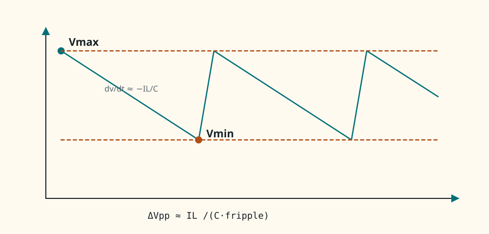{ .ae-figure }
<figcaption markdown="1">先用电容放电斜率判断纹波趋势；当电容很大时，还要回到导通角、充电脉冲和源阻抗，不能只看近似式。</figcaption>
</figure>

### S-09　整流、纹波与 dropout

**P1｜基础｜计算+诊断｜前置：桥式电源链。** 隔离 $10.0\ \mathrm{V_{rms}}$、50 Hz 次级，经桥式（每管 $0.700\ \mathrm V$）、$C=1500\ \mu\mathrm F$、负载 $0.180\ \mathrm A$ 后接 $9.00\ \mathrm V$ 稳压器，dropout $2.00\ \mathrm V$。估峰、纹波、谷值、调整余量与热趋势；比较增容、降输出、低 dropout。[核对答案](详细解答.md#s-09)

<figure class="ae-figure-frame" markdown="1">
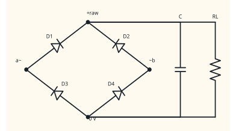{ .ae-figure }
<figcaption markdown="1">沿“次级峰值→两只导通管压降→电容峰值→放电纹波→谷值余量”顺序计算；稳压器最差时刻看谷值。</figcaption>
</figure>

### S-10　运放内部模块综合口试

**P2｜深入｜口述｜前置：差分级、增益级、功率级。** 画“差分输入→有源负载/高增益→电平移动/补偿→AB 输出”，补偏置镜与电源；把 $V_{OS}$、CMRR、共模范围、$A_0$、GBW、SR、输出摆幅/电流、交越失真、PSRR、热映射到模块，并区分方框推断与数据手册事实。[核对答案](详细解答.md#s-10)

~~~mermaid
flowchart LR
    IN["差分输入级"] --> LOAD["有源负载 / 高增益级"]
    LOAD --> SHIFT["电平移动 / 频率补偿"]
    SHIFT --> OUT["互补 AB 输出级"]
    BIAS["基准与偏置电流镜"] -.-> IN
    BIAS -.-> LOAD
    BIAS -.-> SHIFT
    BIAS -.-> OUT
    SUP["正/负电源轨"] -.-> BIAS
    SUP -.-> IN
    SUP -.-> OUT
~~~

<strong>S-10 作答骨架。</strong> 先按实线讲信号如何传递，再按虚线补偏置与供电；参数应映射到最早限制它的模块，不是把名词均匀分配。

