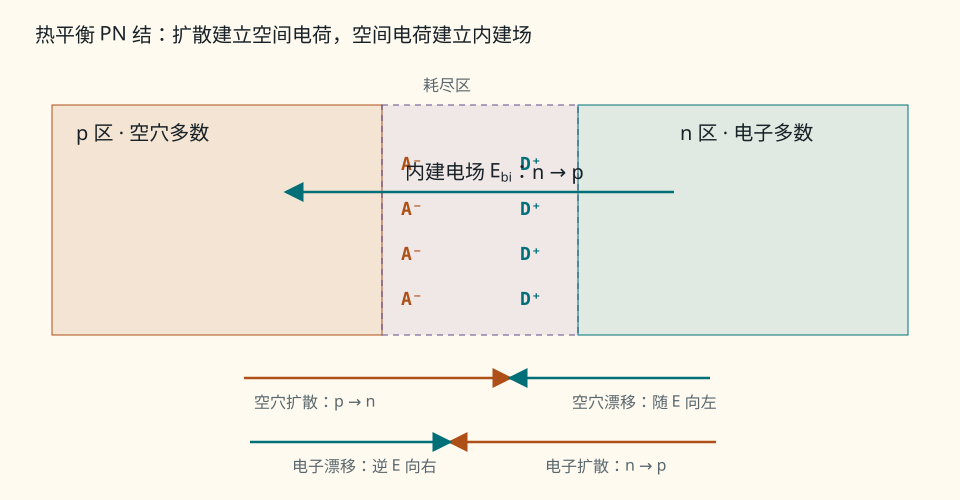
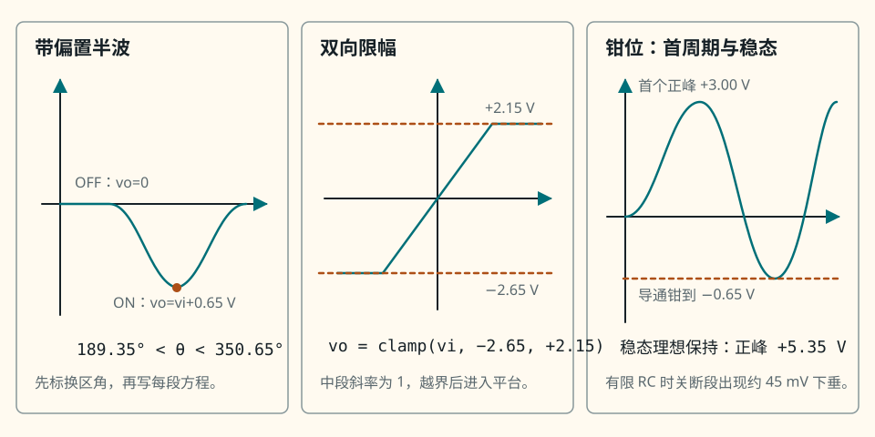
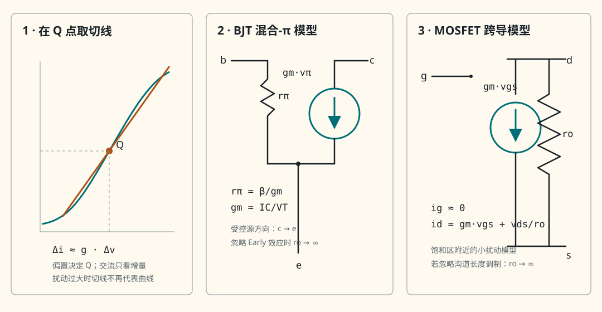
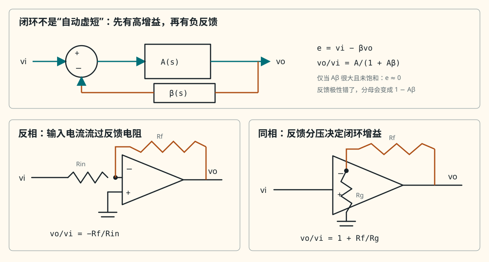
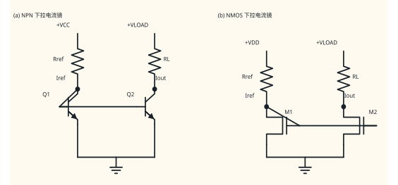

# 模拟电子技术练习详细解答

解答固定按“提示—关键步骤—完整解答—常见错误—面试追问”展开。先独立完成题目并写出模型与边界，再阅读本册；数值答案不能替代状态、单位和合理性检查。

## C-01

[返回题目 C-01](练习题.md#c-01)

**提示：** 先看参考电流是否流入电压正端，不要直接套 $p=vi$。

**关键步骤：** 当前电流流入 $b$（负端），所以吸收功率应写 $p_{abs}=-vi$；反向定义电流后，电流数值也变号。

**完整解答：** $v=V_a-V_b=12\ \mathrm V$，而 $i=0.5\ \mathrm A$ 从 $b$ 到 $a$，故不是关联参考方向。$p_{abs}=-vi=-6.0\ \mathrm W$，即元件向外发出 $6.0\ \mathrm W$。若把箭头改为 $a\to b$，则新变量 $i'=-0.5\ \mathrm A$；此时是关联参考方向，$p_{abs}=vi'=-6.0\ \mathrm W$。两种标法给出同一物理功率。量纲 $\mathrm{V\cdot A=W}$，符号一致。

**常见错误：** 只反转箭头却仍写 $i'=+0.5\ \mathrm A$，等于偷偷改变了物理电流。

**面试追问：** 若算得元件电流为负，是定律失效还是参考方向与实际方向相反？

## C-02

[返回题目 C-02](练习题.md#c-02)

**提示：** 电容电流由斜率决定，储能由电压平方决定。

**关键步骤：** 算 $dv/dt$，再用 $i=C\,dv/dt$ 与 $\Delta W=\tfrac12C(V_2^2-V_1^2)$；理想源边界用其端口约束与短/开路约束对照。

**完整解答：** $dv/dt=[3-(-1)]/(2\ \mathrm{ms})=2.00\times10^3\ \mathrm{V/s}$，故流入正端的 $i=(20\ \mu\mathrm F)(2.00\times10^3\ \mathrm{V/s})=40.0\ \mathrm{mA}$。储能变化 $\Delta W=\tfrac12(20\ \mu\mathrm F)(3^2-(-1)^2)\ \mathrm{V^2}=80.0\ \mu\mathrm J$，为增加。短路要求端压为零，与理想 $5\ \mathrm V$ 源约束矛盾；若用趋零内阻逼近，电流趋于无穷。开路要求支路电流为零，与理想 $2\ \mathrm{mA}$ 源约束矛盾；若用趋大并联电阻逼近，端压趋于无穷。真实源会受内阻、限流和击穿限制。

**常见错误：** 把储能变化写成 $\tfrac12C(V_2-V_1)^2$；这里必须先分别平方。

**面试追问：** 电压经过零点时电容储能怎样变化，电流为何仍可保持同号？

## C-03

[返回题目 C-03](练习题.md#c-03)

**提示：** 用带符号的参考方向列式；负号是结果，不是错误。

**关键步骤：** 节点写 $i_1=i_2+i_3$；串联回路先求 $3\ \mathrm{mA}$，任选绕行方向列压升压降。

**完整解答：** $i_3=i_1-i_2=4-7=-3.0\ \mathrm{mA}$，表示实际有 $3.0\ \mathrm{mA}$ 流入节点，与 $i_3$ 箭头相反。串联电流为 $9\ \mathrm V/(1+2)\ \mathrm{k\Omega}=3.0\ \mathrm{mA}$；沿电源负端到正端绕行，KVL 为 $+9-(3\ \mathrm{mA})(1\ \mathrm{k\Omega})-(3\ \mathrm{mA})(2\ \mathrm{k\Omega})=0$。若回路链接变化磁通，不能只把静电势差相加为零，应把法拉第感应电动势写入广义回路方程；集总电感模型已把该效应包含在 $v_L=L\,di/dt$ 中。

**常见错误：** 把“未知电流算负”当成 KCL 符号写错，强行取绝对值。

**面试追问：** 换一个绕行方向，KVL 的每一项和最终物理结论怎样变化？

## C-04

[返回题目 C-04](练习题.md#c-04)

**提示：** 在节点 $a$ 统一取流出为正。

**关键步骤：** 写 $(V_a-V_s)/R_1+V_a/R_2-I_s=0$，再代数求解并逐一取极限。

**完整解答：**

\[
V_a=\frac{V_s/R_1+I_s}{1/R_1+1/R_2}
=\frac{V_sR_2+I_sR_1R_2}{R_1+R_2}.
\]

$R_1\to0$ 时理想短路把 $a$ 钳到 $V_s$；$R_1\to\infty$ 时左支路断开，$V_a\to I_sR_2$；$R_2\to0$ 时 $a$ 被钳到地；$R_2\to\infty$ 时注入电流只能经 $R_1$ 流向 $V_s$，$V_a\to V_s+I_sR_1$。分子第一式单位为 A，分母为 S，所以结果为 V。正电阻且源未超额定时四个极限均合理。

**常见错误：** 在电流源项前写 $+I_s$，却又声称所有支路都取流出为正。

**面试追问：** 若电流源箭头反向，公式中哪一项改变，四个极限中的哪两个最能发现错误？

## C-05

[返回题目 C-05](练习题.md#c-05)

**提示：** 独立电压源置零为短路，独立电流源置零为开路。

**关键步骤：** 电压源单独作用时用分压；电流源单独作用时用 $I_s(2\parallel3)\ \mathrm{k\Omega}$。

**完整解答：** 只保留 $10\ \mathrm V$ 源时，节点电压 $V_{a,V}=10\times3/(2+3)=6.00\ \mathrm V$。只保留 $1.00\ \mathrm{mA}$ 注入源时，$2\parallel3=1.20\ \mathrm{k\Omega}$，故 $V_{a,I}=1.20\ \mathrm V$。总电压 $V_a=7.20\ \mathrm V$；直接回代 $(V_a-10)/2\mathrm k+V_a/3\mathrm k-1\mathrm{mA}=0$ 也成立。电阻功率 $P=V^2/R$ 是响应的二次函数，含两激励的交叉项，不能把两次功率相加。置零独立源时受控源必须保留；必要时加测试源求响应。

**常见错误：** 把电流源置零成短路，或把受控源也当成独立源关掉。

**面试追问：** 哪些量可以叠加，为什么晶体管增量电流可以而总功耗通常不可以？

## C-06

[返回题目 C-06](练习题.md#c-06)

**提示：** 等效只保持端口 $v$–$i$；原网络效率必须回到原电路计算。

**关键步骤：** 开路求 $V_{th}$、置零源求 $R_{th}$、短路求 $I_N$；匹配后分别采用两种功率分母。

**完整解答：** 图 1-8 中 $V_{th}=12\times4/(2+4)=8.00\ \mathrm V$，$R_{th}=2\parallel4=4/3\ \mathrm{k\Omega}$，$I_N=V_{th}/R_{th}=6.00\ \mathrm{mA}$。接 $R_L=R_{th}$ 时 $V_L=4.00\ \mathrm V$，$P_L=V_L^2/R_L=12.0\ \mathrm{mW}$。抽象戴维南模型的内阻也耗 $12.0\ \mathrm{mW}$，所以 $\eta_{Th}=50\%$。回原图，$R_2\parallel R_L=1.00\ \mathrm{k\Omega}$，实际 12 V 源电流 $4.00\ \mathrm{mA}$，源功率 $48.0\ \mathrm{mW}$，故 $\eta_{orig}=12/48=25\%$。$\eta_{Th}=R_L/(R_{th}+R_L)$ 随 $R_L$ 增大，但端口等效不保内部静态损耗，不能据此推出 $\eta_{orig}$ 单调上升。功率单位均为 mW，且 $8\ \mathrm V=(6\ \mathrm{mA})(4/3\ \mathrm{k\Omega})$ 交叉检查通过。

**常见错误：** 把戴维南内阻的功耗当作原网络全部内部功耗。

**面试追问：** 最大功率点不是最高效率点，为什么射频系统仍常做阻抗匹配？

## C-07

[返回题目 C-07](练习题.md#c-07)

**提示：** 从统一式 $v_C=V_f+(V_0-V_f)e^{-t/RC}$ 出发。

**关键步骤：** $\tau=RC$；按电流流入电容正端，$i_C=C\,dv_C/dt=(V_f-V_0)e^{-t/\tau}/R$。

**完整解答：** $\tau=(5.00\ \mathrm{k\Omega})(20.0\ \mu\mathrm F)=0.100\ \mathrm s$，

\[
v_C(t)=2.00+6.00e^{-t/0.100}\ \mathrm V,\qquad
i_C(t)=-1.20e^{-t/0.100}\ \mathrm{mA}.
\]

$0^+$ 时为 $(8.00\ \mathrm V,-1.20\ \mathrm{mA})$；$t=\tau$ 时为 $(4.21\ \mathrm V,-0.441\ \mathrm{mA})$；$t\to\infty$ 时为 $(2.00\ \mathrm V,0)$。$R$ 加倍使 $\tau$ 加倍、初始电流减半；$C$ 加倍使 $\tau$ 加倍，但初始电流仍由 $(V_f-V_0)/R$ 决定；$|V_f-V_0|$ 加倍使初始电流幅值加倍而 $\tau$ 不变。负电流表示实际电流与参考箭头相反，亦即电容放能。

**常见错误：** 把一倍时间常数后的电压写成 $0.632V_f$，漏掉非零初值。

**面试追问：** 若电容看到含受控源的一端口，怎样用测试源求 $R_{\rm seen}$？

## C-08

[返回题目 C-08](练习题.md#c-08)

**提示：** 每个“永远”都在隐藏模型；先声明模型，再给越界反例。

**关键步骤：** 依次检查位移电流、冲激电流、端口等效、效率分母和法拉第电磁感应。

**完整解答：** ①集总低频节点可对支路总电流用 KCL；高频若只统计导电电流而遗漏位移电流就不成立。②有限电流下理想电容电压连续；冲激电流、击穿或理想源强迫会让“永远连续”失效。③戴维南等效只保端口 $v$–$i$，不保内部支路、功耗、噪声和温升。④$R_L=R_{th}>0$ 最大化负载功率，却只给抽象戴维南模型 50% 效率；效率取决于分母及所有损耗。⑤集总电感的 $v_L=L\,di/dt$ 已纳入 KVL；若回路包围未建模的变化磁通，应改用法拉第方程。共同边界是频率、幅度、集总性和观测端口必须明确。

**常见错误：** 只说“现实有非理想”，却不给具体遗漏项和成立条件。

**面试追问：** 任选一句，把它改写成严格、可检验且没有“永远”的表述。

## C-09

[返回题目 C-09](练习题.md#c-09)

**提示：** 关联参考方向就是电流箭头流入所标电压正端。

**关键步骤：** 三只元件均可按被动符号约定定义端口变量；源是否供能由 $p$ 的符号决定。

**完整解答：** 参考图应把每只元件左端标“+”、右端标“−”，电流箭头从左端流入。此时电阻满足 $v=Ri$，电容满足 $i=C\,dv/dt$，三者吸收功率都定义为 $p=vi$；$p>0$ 吸收，$p<0$ 发出。理想电压源只规定 $v(t)$，电流由外电路决定，因此可吸收也可发出。若保持电容电压标法不变而令新电流 $i'$ 从右端流入，则 $i'=-i=-C\,dv/dt$，吸收功率应写 $p=-vi'$。波形关键点是 $dv/dt=0$ 时 $i=0$，并非 $v=0$ 时必有 $i=0$。

**常见错误：** 认为“电源”必须采用非关联方向，或者一定只能发出功率。

**面试追问：** 电容电压为负、电流为正时，它一定在充电吗？请用 $p$ 判断能量方向。

## C-10

[返回题目 C-10](练习题.md#c-10)

**提示：** 题目规定在节点 $a$ 统一取流出为正。

**关键步骤：** 写 $(V_a-10)/2\mathrm k+V_a/4\mathrm k+2\mathrm{mA}=0$。

**完整解答：** 方程乘 $4\ \mathrm{k\Omega}$ 得 $2(V_a-10)+V_a+8=0$，故 $V_a=4.00\ \mathrm V$。从 $a$ 指向 10 V 节点的参考电流为 $(4-10)/2\mathrm k=-3.00\ \mathrm{mA}$，实际由 10 V 节点流入 $a$；对地电阻流出 $4/4\mathrm k=1.00\ \mathrm{mA}$，电流源流出 $2.00\ \mathrm{mA}$。回代 $-3+1+2=0\ \mathrm{mA}$。结果单位为 V，且在本组源值下落于 0 与 10 V 之间，数量级合理。

**常见错误：** 因电流源箭头向下就机械写负号，忘了“流出为正”的统一约定。

**面试追问：** 若该电流源增至 $6\ \mathrm{mA}$，节点电压可否为负，这是否违反电源范围？

## C-11

[返回题目 C-11](练习题.md#c-11)

**提示：** “相同”只对选定端口、规定工作范围和允许负载成立。

**关键步骤：** 用相同端口特性定义等效，再列内部不保持量及测试额定边界。

**完整解答：** 两个线性一端口戴维南等效，是指在规定范围内都满足同一 $v=V_{th}-R_{th}i$；因此接任意允许负载时端口电压和电流相同。它不保证内部各支路电压、电流、独立源供能、元件功耗、温升、噪声、储能与故障应力相同。开路/短路法还要求测试不会引发过压、过流或工作区改变；含非线性器件时，所谓等效通常只在指定 Q 点附近的小信号范围有效。

**常见错误：** 把“从端口看不出差别”扩大成“内部所有物理量都一样”。

**面试追问：** 小信号戴维南等效能否预测大信号削顶，为什么？

## C-12

[返回题目 C-12](练习题.md#c-12)

**提示：** 先把 $V_{th}=0$ 的退化情形分离；非退化时再检查匹配点两侧的导数符号和两个端点极限。

**关键步骤：** 当 $V_{th}\ne0$ 时，$V_{th}^2>0$，导数符号才由 $R_{th}-R_L$ 唯一决定；再用 $(R_{th}+R_L)^2\ge4R_{th}R_L$ 作独立证明。

**完整解答：** 先取非退化条件 $V_{th}\ne0$。对 $R_L$ 求导得

\[
\frac{dP_L}{dR_L}=
\frac{V_{th}^2(R_{th}-R_L)}{(R_{th}+R_L)^3}.
\]

因 $R_{th}>0,R_L>0$，分母为正；又因 $V_{th}^2>0$，所以 $0<R_L<R_{th}$ 时导数严格为正，$R_L>R_{th}$ 时严格为负。故 $R_L=R_{th}$ 是唯一内部最大点，且

\[
P_{L,\max}=\frac{V_{th}^2}{4R_{th}}.
\]

AM-GM 给 $(R_{th}+R_L)^2\ge4R_{th}R_L$，于是对 $V_{th}^2>0$，

\[
P_L=\frac{V_{th}^2R_L}{(R_{th}+R_L)^2}
\le\frac{V_{th}^2}{4R_{th}},
\]

且正数 AM-GM 的等号仅在 $R_L=R_{th}$ 时成立，再次得到唯一性。端点检查为 $R_L\to0^+$ 时 $P_L\to0$，$R_L\to\infty$ 时 $P_L\sim V_{th}^2/R_L\to0$。

若 $V_{th}=0$，则对每个 $R_L>0$ 都有 $P_L=0$，导数也处处为 0；所有正负载都取得同一最大值 0，因此没有唯一最大化负载。此时不能从导数式删除零因子来声称变号，AM-GM 乘上 $V_{th}^2=0$ 后也无法保留等号唯一性。$V^2/\Omega=\mathrm W$，量纲正确；若 $R_{th}\le0$，上述被动正电阻证明同样不能直接使用。

**常见错误：** 只令一阶导数为零，不检查导数变号、端点及 $R_{th}>0,V_{th}\ne0$；尤其会漏掉 $V_{th}=0$ 时每个 $R_L>0$ 都同为最大值。

**面试追问：** 若允许复负载阻抗，最大平均功率条件怎样推广？

## D-01

[返回题目 D-01](练习题.md#d-01)

**提示：** 把扩散和漂移分成两组相反箭头；内建场由 n 侧正离子指向 p 侧负离子。

**关键步骤：** 画 p｜耗尽区｜n；p 侧耗尽区标 $A^-$，n 侧标 $D^+$，再用热平衡下两种电流逐项抵消解释净电流为零。

**完整解答：** 取 p 区在左（外端为 A）、n 区在右（外端为 K）。结附近自由载流子扩散离开后，p 侧留下 $A^-$，n 侧留下 $D^+$；因此内建电场 $\mathbf E_{bi}$ 从 n 侧 $D^+$ 指向 p 侧 $A^-$。电子浓度扩散方向是 n→p，空穴扩散方向是 p→n；电场使电子漂移 p→n、空穴漂移 n→p。热平衡时，对每种载流子，扩散电流与漂移电流大小相等、方向相反，所以端口净电流为零。外部传统正向电流参考取 A→K；电子运动总体与传统电流相反。$V_{bi}$ 是耗尽区内部电势变化，绕完整器件还要计中性区和接触电势，外端在平衡时测不到一只可持续供能的电池。

<figure class="ae-figure-frame" markdown="1">

{ .ae-figure }

<figcaption>热平衡时扩散与漂移仍同时存在，但两种电流相消，净端口电流为零。</figcaption>
</figure>

**常见错误：** 把电子运动方向直接当成传统电流方向，或把 $\mathbf E_{bi}$ 画成从 $A^-$ 指向 $D^+$。

**面试追问：** 加正向偏置后，势垒、耗尽层宽度以及扩散电流各怎样变化？

## D-02

[返回题目 D-02](练习题.md#d-02)

**提示：** 分别假设 OFF 与 ON，求完后用各自不等式审判。

**关键步骤：** OFF 时回路电流为零，故 $v_D=V_S$；ON 时写 $V_S=i_D(820\ \Omega)+0.60\ \mathrm V+i_D(20\ \Omega)$。

**完整解答：** OFF 候选为 $i_D=0,v_D=V_S$，自洽条件 $V_S<0.60\ \mathrm V$。ON 候选为

\[
i_D=\frac{V_S-0.60\ \mathrm V}{840\ \Omega},\qquad
v_D=0.60\ \mathrm V+(20\ \Omega)i_D,
\]

其自洽条件 $i_D\ge0$，即 $V_S\ge0.60\ \mathrm V$；等号按题意归 ON。因此

\[
(i_D,v_D)=
\begin{cases}
(0,V_S),&V_S<0.60\ \mathrm V,\\
((V_S-0.60)/840,\ 0.60+20(V_S-0.60)/840),&V_S\ge0.60\ \mathrm V,
\end{cases}
\]

其中电压用 V、电流用 A。交界两侧均给 $i_D=0,v_D=0.60\ \mathrm V$，连续；$V_S=5.0\ \mathrm V$ 时 $i_D=5.24\ \mathrm{mA}>0$，数量级受 $820\ \Omega$ 限流，合理。

**常见错误：** ON 后仍只除以 $820\ \Omega$，漏掉导通模型中的 $20\ \Omega$；或不给状态不等式。

**面试追问：** 若改用理想二极管模型，换区点和 ON 段斜率各怎样改变？

## D-03

[返回题目 D-03](练习题.md#d-03)

**提示：** 二极管只在输入足够负时导通；输出参考仍是负载上端对地。

**关键步骤：** 令 $\alpha=\sin^{-1}(0.65/4)$，在负半周找 $\pi+\alpha$ 与 $2\pi-\alpha$ 两个切换角。

**完整解答：** 状态关系为

\[
v_o(v_i)=\begin{cases}
0,&v_i\ge-0.65\ \mathrm V\quad(\mathrm{OFF}),\\
v_i+0.65\ \mathrm V,&v_i<-0.65\ \mathrm V\quad(\mathrm{ON}).
\end{cases}
\]

$\alpha=\sin^{-1}(0.1625)=9.35^\circ$，故每周期导通从 $180^\circ+9.35^\circ=189.35^\circ$ 到 $360^\circ-9.35^\circ=350.65^\circ$；时间关键点为 $t=0.526\ \mathrm{ms}$ 与 $0.974\ \mathrm{ms}$（周期 $1.00\ \mathrm{ms}$）。在 $270^\circ$ 输入为 $-4.00\ \mathrm V$，输出负峰为 $-3.35\ \mathrm V$，负载电流按“输出节点流向地”为 $-1.675\ \mathrm{mA}$，说明实际电流方向与该参考相反。换区点输出连续为 0；无滤波时其余区间沿零线。

<figure class="ae-figure-frame" markdown="1">

{ .ae-figure }

<figcaption>左图对应本题：导通区为 $189.35^\circ<\theta<350.65^\circ$，其余时段输出沿 $0\ \mathrm V$。</figcaption>
</figure>

**常见错误：** 把“负半波”画成正峰，或只写 $v_o=v_i$ 而漏 $0.65\ \mathrm V$ 门槛与起止角。

**面试追问：** 若源内阻不可忽略，导通段输出峰值与波形斜率怎样改变？

## D-04

[返回题目 D-04](练习题.md#d-04)

**提示：** 上限是参考电压加正向压降，下限是参考电压减正向压降。

**关键步骤：** 先画静态传输 $v_o=\min[2.15,\max(-2.65,v_i)]$，再用三角波斜率 $16.0\ \mathrm{V/ms}$ 换算时刻。

**完整解答：** 上管开始导通于 $v_o=1.5+0.65=2.15\ \mathrm V$，下管开始导通于 $v_o=-2.0-0.65=-2.65\ \mathrm V$。空载恒压降模型给

\[
v_o=\begin{cases}
-2.65\ \mathrm V,&v_i<-2.65\ \mathrm V,\\
v_i,&-2.65\le v_i\le2.15\ \mathrm V,\\
2.15\ \mathrm V,&v_i>2.15\ \mathrm V.
\end{cases}
\]

上升段斜率为 $16.0\ \mathrm{V/ms}$：从 $t=0$ 起在 $0.0844\ \mathrm{ms}$ 离开下限，在 $0.3844\ \mathrm{ms}$ 到上限。下降段从 $t=0.500\ \mathrm{ms}$ 起，在 $0.6156\ \mathrm{ms}$ 离开上限，在 $0.9156\ \mathrm{ms}$ 到下限；第二周期各时刻加 $1.000\ \mathrm{ms}$。$v_i=+4.0\ \mathrm V$ 时上管电流 $(4.0-2.15)/1\mathrm k=1.85\ \mathrm{mA}$；$v_i=-4.0\ \mathrm V$ 时下管电流幅值 $[-2.65-(-4.0)]/1\mathrm k=1.35\ \mathrm{mA}$。波形在换区点连续，限幅段斜率为零。

上图中间面板对应本题的传输特性：中段 $v_o=v_i$，上下平台分别为 $+2.15\ \mathrm V$ 与 $-2.65\ \mathrm V$；第二周期的换区时刻在第一周期基础上整体增加 $1.000\ \mathrm{ms}$。

**常见错误：** 把下限写成 $-2.0+0.65=-1.35\ \mathrm V$，没有沿二极管 A→K 方向检查压降。

**面试追问：** 若参考源有输出电阻，平台为何不再完全水平？

## D-05

[返回题目 D-05](练习题.md#d-05)

**提示：** A 问先处理明确的首次状态序列；B 问只用高时间常数近似，不能把二者混成同一精确过程。

**关键步骤：** 首周期在 $v_i=-0.65\ \mathrm V$ 导通，负峰达到 $v_C=-2.35\ \mathrm V$；稳态计算 $\tau=R_LC$、$T=1/f$ 和给定指数下垂式。

**完整解答：** A 问中 $v_C(0^-)=0$，起始 D 为 OFF，故在导通前 $v_o=v_i$。首个负半周输入到 $-0.65\ \mathrm V$ 时 D 进入 ON；随后 $v_o=-0.65\ \mathrm V$，$v_C=v_i+0.65\ \mathrm V$。第一负峰 $v_i=-3.00\ \mathrm V$ 时 $v_C=-2.35\ \mathrm V$，且 $dv_C/dt=0$，所以 $i_D=-C\,dv_C/dt=0$，位于 ON/OFF 边界；输入转而上升后 D 关断。此后理想无负载时 $v_C$ 保持 $-2.35\ \mathrm V$，故 $v_o=v_i+2.35\ \mathrm V$，输出负峰被钳在 $-0.65\ \mathrm V$，正峰为 $5.35\ \mathrm V$。B 问 $\tau=(220\ \mathrm{k\Omega})(0.47\ \mu\mathrm F)=0.1034\ \mathrm s$，$T=1/500=2.00\ \mathrm{ms}$，$\tau/T=51.7$。一周期下垂估计

\[
\Delta|v_C|\approx2.35[1-e^{-T/\tau}]=2.35(1-e^{-0.01934})=45.0\ \mathrm{mV}.
\]

稳态图应标每次短时补充导通、随后长时间指数下垂；精确启动需在 OFF 区解微分方程并联立切换条件。

上图右侧面板对应钳位过程：首周期先出现未钳位的 $+3.00\ \mathrm V$ 正峰，负峰附近首次导通并钳到约 $-0.65\ \mathrm V$；稳态理想保持极限的正峰为 $+5.35\ \mathrm V$，有限 $RC$ 使 OFF 段每周期下垂约 $45\ \mathrm{mV}$。

**常见错误：** 把 A 问 $R_L\to\infty$ 的首次导通时刻直接当作有限负载稳态的精确换区点。

**面试追问：** 为何增大 $C$ 会减小纹波，却可能增大二极管充电脉冲峰值？

## D-06

[返回题目 D-06](练习题.md#d-06)

**提示：** 两只管分别把输出限制在上界 $+1.70\ \mathrm V$ 和下界 $-0.70\ \mathrm V$。

**关键步骤：** 规定状态次序为 $(D_1,D_2)$。每个输入都检验四组：ON 管同时满足固定压降和 $i_D\ge0$，OFF 管满足 $v_D<0.70\ \mathrm V$；只保留全部约束同时成立的一组。

**完整解答：** 对 $D_1$，ON 要求 $v_o=1.70\ \mathrm V$ 且 $i_{D1}=(V_S-1.70)/1\mathrm{k\Omega}\ge0$，OFF 要求 $v_{D1}=v_o-1.00<0.70\ \mathrm V$。对 $D_2$，ON 要求 $v_o=-0.70\ \mathrm V$ 且 $i_{D2}=(-0.70-V_S)/1\mathrm{k\Omega}\ge0$，OFF 要求 $v_{D2}=-v_o<0.70\ \mathrm V$。逐项枚举如下；表中 ON/OFF 均按 $(D_1,D_2)$ 排列。

| $V_S$ | ON/ON | ON/OFF | OFF/ON | OFF/OFF | 唯一有效状态 |
|---:|---|---|---|---|---|
| $-2.0\ \mathrm V$ | 同时要求 $v_o=1.70$ 与 $-0.70\ \mathrm V$，矛盾 | $v_o=1.70\ \mathrm V$，但 $i_{D1}=(-2.0-1.70)/1\mathrm k=-3.70\ \mathrm{mA}<0$，无效 | $v_o=-0.70\ \mathrm V$，$i_{D2}=[-0.70-(-2.0)]/1\mathrm k=1.30\ \mathrm{mA}\ge0$；且 $v_{D1}=-1.70<0.70\ \mathrm V$，有效 | $v_o=V_S=-2.0\ \mathrm V$，但 $v_{D2}=2.0>0.70\ \mathrm V$，OFF 矛盾 | OFF/ON；$v_o=-0.70\ \mathrm V,i_{D2}=1.30\ \mathrm{mA}$ |
| $0.50\ \mathrm V$ | 同时要求两个不同的 $v_o$，矛盾 | $v_o=1.70\ \mathrm V$，但 $i_{D1}=(0.50-1.70)/1\mathrm k=-1.20\ \mathrm{mA}<0$，无效 | $v_o=-0.70\ \mathrm V$，但 $i_{D2}=(-0.70-0.50)/1\mathrm k=-1.20\ \mathrm{mA}<0$，无效 | $v_o=0.50\ \mathrm V$；$v_{D1}=-0.50<0.70\ \mathrm V$ 且 $v_{D2}=-0.50<0.70\ \mathrm V$，有效 | OFF/OFF；$v_o=0.50\ \mathrm V$，两管电流为 0 |
| $3.0\ \mathrm V$ | 同时要求两个不同的 $v_o$，矛盾 | $v_o=1.70\ \mathrm V$，$i_{D1}=(3.0-1.70)/1\mathrm k=1.30\ \mathrm{mA}\ge0$；且 $v_{D2}=-1.70<0.70\ \mathrm V$，有效 | $v_o=-0.70\ \mathrm V$，但 $i_{D2}=(-0.70-3.0)/1\mathrm k=-3.70\ \mathrm{mA}<0$，无效 | $v_o=3.0\ \mathrm V$，但 $v_{D1}=2.0>0.70\ \mathrm V$，OFF 矛盾 | ON/OFF；$v_o=1.70\ \mathrm V,i_{D1}=1.30\ \mathrm{mA}$ |

三行都恰有一个自洽状态；导通电流方向分别为地经 $D_2$ 流向节点，或节点经 $D_1$ 流向 $+1.0\ \mathrm V$ 参考。

**常见错误：** 只凭 $V_S$ 正负判管状态，未比较二极管两端的 A→K 电压。

**面试追问：** 若输出接一个耗流负载，哪个区间的传输特性首先改变？

## D-07

[返回题目 D-07](练习题.md#d-07)

**提示：** $R_D=V_D/I_D$ 是大信号割线；$r_d=nV_T/I_D$ 是 Q 点切线。

**关键步骤：** 先求两个电阻，再把 $r_d$ 与 $R_s$ 作小信号分压，最后用 $|\tilde v_d|/(nV_T)$ 验线性化。

**完整解答：** 取 $V_T=25.9\ \mathrm{mV}$，

\[
R_D=\frac{0.680\ \mathrm V}{2.00\ \mathrm{mA}}=340\ \Omega,
\qquad
r_d=\frac{(1.50)(25.9\ \mathrm{mV})}{2.00\ \mathrm{mA}}=19.4\ \Omega.
\]

小信号输出峰值为 $10.0\ \mathrm{mV}\times19.4/(100+19.4)=1.63\ \mathrm{mV}$。线性尺度 $1.63/(1.50\times25.9)=0.0419$，远小于 1，故一阶线性化合理；对应指数展开二阶/一阶约为该比值的一半，即约 2.1%。电阻量纲 V/A 为 $\Omega$，且 $r_d\ll R_D$ 符合指数曲线在该偏置点斜率较陡的直觉。若信号频率使结电容不可忽略，模型须改为动态阻抗。

**常见错误：** 用 $340\ \Omega$ 代替 $r_d$ 做交流分压，混淆 Q 点割线与切线。

**面试追问：** 保持小信号源不变而把偏置电流加倍，输出增量幅值怎样变化？

## D-08

[返回题目 D-08](练习题.md#d-08)

**提示：** 最低电源检查 $I_Z$ 下限，最高电源检查 $I_Z$ 上限。

**关键步骤：** 负载电流恒为 $I_L=V_Z/R_L$；串联电流为 $(V_S-V_Z)/R=I_L+I_Z$。

**完整解答：** $I_L=5.1\ \mathrm V/1.00\ \mathrm{k\Omega}=5.10\ \mathrm{mA}$。在 $V_{S,min}=10.0\ \mathrm V$ 要求 $(10-5.1)/R\ge5.10+2.00=7.10\ \mathrm{mA}$，故 $R\le690\ \Omega$；在 $V_{S,max}=14.0\ \mathrm V$ 要求 $(14-5.1)/R\le5.10+20.0=25.1\ \mathrm{mA}$，故 $R\ge355\ \Omega$。允许范围约 $355\le R\le690\ \Omega$，$470\ \Omega$ 合格。最高电源时 $I_R=8.9/470=18.94\ \mathrm{mA}$，$I_Z=13.84\ \mathrm{mA}$；$P_Z=(5.1)(13.84\ \mathrm{mA})=70.6\ \mathrm{mW}$，$P_R=8.9^2/470=169\ \mathrm{mW}$。最低电源时 $I_Z=5.33\ \mathrm{mA}>2\ \mathrm{mA}$，双端检查通过。齐纳工作电流参考为 K→A，若仍沿普通二极管 A→K 定义 $i_D$，则 $i_D=-I_Z$。

**常见错误：** 求电阻上下界时都只用同一个电源端点，或漏掉并联负载电流。

**面试追问：** 若负载可能开路，$470\ \Omega$ 是否仍满足 $I_Z\le20\ \mathrm{mA}$？

## D-09

[返回题目 D-09](练习题.md#d-09)

**提示：** 必须区分“电流被保持”与“电压被保持”，并说明哪些模型参数随温度变。

**关键步骤：** 固定 $I_D$ 时直接用 $V_T=kT/q$；固定 $V_D$ 时从 Shockley 式同时考虑 $I_S(T)$、$V_T(T)$ 和 $n(T)$。

**完整解答：** 若理想偏置源把 $I_D$ 保持不变，并暂取 $n$ 不变，则 $r_d=nV_T/I_D=nkT/(qI_D)$，随绝对温度近似线性增大；例如 300 K 到 330 K 约增 10%。若固定 $V_D$，则 $I_D\approx I_S(T)e^{V_D/[n(T)V_T(T)]}$：升温一方面增大 $V_T$、减小指数中的 $V_D/(nV_T)$，另一方面硅管的 $I_S$ 通常强烈增大，$n$ 也可能变化。常见正向工作区中总电流往往上升，$I_D$ 的增幅可超过 $V_T$，于是 $r_d=nV_T/I_D$ 反而下降；但不给 $I_S(T),n(T)$ 就不能断言唯一数值趋势。结论边界还包括自热、串联电阻和高注入。

**常见错误：** 看见式子分子有 $T$ 就断言任何偏置条件下 $r_d$ 都增大。

**面试追问：** 为什么数据手册常用“固定正向电流下 $V_F$ 随温度下降”描述温度特性？

## D-10

[返回题目 D-10](练习题.md#d-10)

**提示：** $0.7\ \mathrm V$ 是某电流、温度和器件下的工程近似，不是材料常数。

**关键步骤：** 从电流、温度、器件类型、反向工作和动态频率五个方向给反例，并匹配模型。

**完整解答：** 反例至少包括：①微安与安培级电流下，Shockley 指数和串联电阻使 $V_F$ 明显不同；②温度变化使固定电流下 $V_F$ 改变；③肖特基、LED、锗管和不同面积硅管的压降不同；④反向偏置在击穿前近似无电流、齐纳区则由 $V_Z$ 与动态电阻描述，不能写 $+0.7\ \mathrm V$；⑤高频开关还要计结/扩散电容、反向恢复与电荷存储。粗略整流幅值估算可用恒压降模型；精确 DC/Q 点可用 Shockley 加串联电阻；微小交流用 Q 点 $r_d$；反向稳压用击穿模型；快速波形用含电容和恢复电荷的动态模型。所有模型仍须检查电流、功率、温度和额定值。

**常见错误：** 只把 $0.7\ \mathrm V$ 改成另一个常数，却没有说明为何应换模型。

**面试追问：** 同一硅管正向电流增大十倍，忽略串联电阻时压降约增加多少？

## T-01

[返回题目 T-01](练习题.md#t-01)

**提示：** 先画本书规定的端口参考方向，再另画载流子运动；两套箭头不能混用。

**关键步骤：** NPN 标 $I_B,I_C$ 流入、$I_E$ 流出；NMOS 标 $I_D$ 入 D 出 S、体接源，并按节点差定义四个端电压。

**完整解答：** NPN 图应标 E/B/C，$I_B$ 从基极流入、$I_C$ 从集电极流入、$I_E$ 从发射极流出，并有 $I_E=I_B+I_C$；$V_{BE}=V_B-V_E,V_{CE}=V_C-V_E$。正向有源时，电子由重掺杂发射区注入薄基区，大部分穿过基区被集电结收集到 C；电子运动 E→C，而传统集电流方向 C→E。增强型 NMOS 图应标 G/D/S/B，题设体 B 与源 S 相连，$I_D$ 从 D 流入、从 S 流出；$V_{GS}=V_G-V_S,V_{DS}=V_D-V_S$。正栅压在栅下吸引电子形成 n 型反型沟道，电子主要由 S→D 漂移，传统 $I_D$ 为 D→S。低频理想绝缘栅近似 $I_G=0$，但这不是高频位移电流也为零的结论。

**常见错误：** 把 NPN 发射极箭头当成电子运动方向，或漏画 NMOS 体端与公共参考地。

**面试追问：** 为什么 BJT 的基极电流虽小却不能像理想 MOS 栅电流那样直接取零？

## T-02

[返回题目 T-02](练习题.md#t-02)

**提示：** NPN 判区优先看 BE、BC 两个 PN 结，不先使用 $I_C=\beta I_B$。

**关键步骤：** 逐组算 $V_{BE}=V_B-V_E$、$V_{BC}=V_B-V_C$ 与 $V_{CE}=V_C-V_E$。

**完整解答：** A 组：$V_{BE}=0.70\ \mathrm V,V_{BC}=-3.10\ \mathrm V,V_{CE}=3.80\ \mathrm V$，BE 正偏、BC 反偏，故为 BJT 正向有源区。B 组：$V_{BE}=0.10\ \mathrm V,V_{BC}=-4.90\ \mathrm V,V_{CE}=5.00\ \mathrm V$，两结均未正偏，故为 BJT 截止区（忽略漏电）。C 组：$V_{BE}=0.80\ \mathrm V,V_{BC}=0.60\ \mathrm V,V_{CE}=0.20\ \mathrm V$；BE 明显正偏，且 $V_{CE}$ 等于题设饱和值、BC 也已正向偏置到分段模型的 BJT 饱和状态，故为 BJT 饱和区。所有差值单位均为 V，且 $V_{CE}=V_{BE}-V_{BC}$ 三组都成立，是符号交叉检查。

**常见错误：** 只以 $V_{CE}>0$ 判断正向有源，忽略 BC 结可能已正偏。

**面试追问：** 若 BE 反偏、BC 正偏，这一状态叫什么，端子角色怎样理解？

## T-03

[返回题目 T-03](练习题.md#t-03)

**提示：** 先按正向有源求候选，再以 $V_{BC}<0$ 和负载线余量审判。

**关键步骤：** $I_B=(V_{CC}-V_{BE})/R_B$，$I_C=\beta I_B$，再由 $V_C=V_{CC}-I_CR_C$ 求节点电压。

**完整解答：** 正向有源候选为

\[
I_B=\frac{9.00-0.70}{330\ \mathrm{k\Omega}}=25.2\ \mu\mathrm A,
\quad I_C=80I_B=2.01\ \mathrm{mA},
\quad I_E=2.04\ \mathrm{mA}.
\]

$V_E=0,V_B=0.700\ \mathrm V$，$V_C=9.00-(2.012\ \mathrm{mA})(1.80\ \mathrm{k\Omega})=5.38\ \mathrm V$，故 $V_{CE}=5.38\ \mathrm V,V_{BC}=0.700-5.38=-4.68\ \mathrm V<0$，正向有源自洽。Q 点为 $(I_{CQ},V_{CEQ})=(2.01\ \mathrm{mA},5.38\ \mathrm V)$。外电路负载线 $I_C=(9.00-V_{CE})/1.80\ \mathrm{k\Omega}$ 连接 $(9.00\ \mathrm V,0)$ 与 $(0,5.00\ \mathrm{mA})$；更贴合饱和模型的低端是 $(0.20\ \mathrm V,4.89\ \mathrm{mA})$，候选离该边界充足。V/k$\Omega$=mA，量纲正确。

**常见错误：** 算出 $\beta I_B$ 后不检查集电电阻是否能提供该电流。

**面试追问：** 若把 $R_B$ 降低一半，怎样快速判断应切换到饱和模型？

## T-04

[返回题目 T-04](练习题.md#t-04)

**提示：** $g_m=I_C/V_T$ 和 $r_\pi=\beta/g_m$ 是所选 Q 点的局部参数；$r_e$ 的精确式含 $\alpha$。

**关键步骤：** 先求 $\alpha=\beta/(\beta+1)$，再以 $x=|\tilde v_{be}|/V_T$ 估指数展开二阶/一阶比 $x/2$。

**完整解答：**

\[
g_m=\frac{1.50\ \mathrm{mA}}{25.9\ \mathrm{mV}}=57.9\ \mathrm{mS},
\quad r_\pi=\frac{120}{57.9\ \mathrm{mS}}=2.07\ \mathrm{k\Omega}.
\]

$\alpha=120/121=0.9917$，故精确于该小信号模型的 $r_e=\alpha/g_m=17.1\ \Omega$；常用近似 $1/g_m=17.3\ \Omega$，二者相差约 $1/121=0.826\%$。$x=4.00/25.9=0.154$，指数式二阶项相对一阶项约 $x/2=7.72\%$（峰值处数量级），说明能做一阶分析但不属于很低失真。$\mathrm A/\mathrm V=\mathrm S$、$1/\mathrm S=\Omega$，单位一致；结论要求正向有源、温度固定、忽略 Early 效应和电容。

**常见错误：** 把 $r_e=1/g_m$ 说成无条件恒等式，或用总 $V_{BE}/I_E$ 代替增量电阻。

**面试追问：** 若要求二阶/一阶小于 1%，$|v_{be}|$ 约应小于多少？

## T-05

[返回题目 T-05](练习题.md#t-05)

**提示：** 用 $I_B=(V_{TH}-V_{BE})/[R_{TH}+(\beta+1)R_E]$，不要只凭口号判断。

**关键步骤：** 每问保持其余量不变，沿“候选电流→$V_E$→$V_C$→$V_{CE}$”检查；最后仍验 $V_{BC}<0$。

**完整解答：** A：$\beta$ 从 50 增至 150 时，$I_C=\beta(V_{TH}-V_{BE})/[R_{TH}+(\beta+1)R_E]$ 增大但远非三倍；本题由 $1.110$ 增至 $1.321\ \mathrm{mA}$，$V_E$ 上升，$V_C$ 下降，故 $V_{CE}$ 从 $8.425$ 降至 $7.763\ \mathrm V$。B：$R_E$ 增 20% 时 $I_C$ 降到约 $1.074\ \mathrm{mA}$，但 $V_E=I_ER_E$ 略升到 $1.302\ \mathrm V$；$V_C$ 上升得更多，本题 $V_{CE}$ 升到约 $8.34\ \mathrm V$。C：若只令模型 $V_{BE}$ 降低，分子增大，故 $I_C,V_E$ 上升、$V_C,V_{CE}$ 下降；这是为何 $R_E$ 的负反馈只能抑制而非消除温漂。D：$V_{TH}$ 固定而 $R_{TH}$ 降低，基极加载减弱，$I_B,I_C,V_E$ 上升，$V_{CE}$ 下降并趋向理想固定基压结果。上述具体 $V_{CE}$ 趋势依赖本题 $R_C,R_E$；任何变化若使 $V_{BC}\ge0$，就须改用饱和模型。

**常见错误：** 说“$R_E$ 增大所以 $V_E$ 必减小”；电流虽降，乘积 $I_ER_E$ 在本题反而略增。

**面试追问：** 为什么减小 $R_{TH}$ 可减弱 $\beta$ 敏感性，却会增加分压器静态功耗？

## T-06

[返回题目 T-06](练习题.md#t-06)

**提示：** $V_{OV}=V_{GS}-V_{TH}$ 固定；比较 $V_{DS}$ 与 $V_{OV}$ 后才能选电流式。

**关键步骤：** NMOS 三极管区用 $I_D=k_n(V_{OV}V_{DS}-V_{DS}^2/2)$，NMOS 饱和区用 $I_D=k_nV_{OV}^2/2$。

**完整解答：** $V_{OV}=2.60-0.80=1.80\ \mathrm V>0$。A 中 $0\le V_{DS}=0.70<1.80\ \mathrm V$，为三极管区，

\[
I_D=(0.80\ \mathrm{mA/V^2})[1.80(0.70)-0.70^2/2]
=0.812\ \mathrm{mA}.
\]

B 中 $V_{DS}=3.00\ge1.80\ \mathrm V$，为 NMOS 饱和区，$I_D=\tfrac12(0.80)(1.80)^2=1.296\ \mathrm{mA}$。在边界 $V_{DS}=V_{OV}=1.80\ \mathrm V$，NMOS 三极管区公式给 $k_n(V_{OV}^2-V_{OV}^2/2)=k_nV_{OV}^2/2=1.296\ \mathrm{mA}$，与 NMOS 饱和区公式连续。参数单位 mA/V² 乘 V² 得 mA；结论限于长沟道、强反型、体接源且忽略 $\lambda$。

**常见错误：** 只因 $V_{GS}>V_{TH}$ 就直接使用饱和平方律，漏检 $V_{DS}\ge V_{OV}$。

**面试追问：** 加入沟道长度调制后，B 点电流如何依赖 $V_{DS}$，输出电阻怎样定义？

## T-07

[返回题目 T-07](练习题.md#t-07)

**提示：** 理想 $I_G=0$ 使 $V_G$ 可先由分压求出；二次方程的每个根都必须做 $V_{OV}>0$ 和饱和检查。

**关键步骤：** 以 mA、k$\Omega$、V 为一致单位，令 $x=I_D/\mathrm{mA}$，写 $x=0.60(2.00-0.750x)^2$。

**完整解答：** $V_G=9.00\times1/(2+1)=3.00\ \mathrm V$，$V_S=0.750x\ \mathrm V$，所以 $V_{OV}=V_G-V_S-V_{TH}=2.00-0.750x$。饱和候选方程

\[
x=\tfrac12(1.20)(2.00-0.750x)^2
\]

给 $x=0.9707$ 与 $7.3256$。大根使 $V_{OV}=2-0.75(7.3256)=-3.49\ \mathrm V<0$，与建立平方律的先决条件矛盾，舍去。物理解为 $I_D=0.971\ \mathrm{mA}$，$V_S=0.728\ \mathrm V$，$V_{GS}=2.272\ \mathrm V$，$V_{OV}=1.272\ \mathrm V$；$V_D=9.00-(0.9707\ \mathrm{mA})(1.50\ \mathrm{k\Omega})=7.544\ \mathrm V$，$V_{DS}=6.816\ \mathrm V$。因 $V_{DS}=6.816\ge V_{OV}=1.272\ \mathrm V$，饱和假设自洽，Q 点为 $(0.971\ \mathrm{mA},6.82\ \mathrm V)$。回代平方律得约 $0.971\ \mathrm{mA}$，单位与数量级均正确。

**常见错误：** 因两个根都为正就全部保留；器件电流为正不等于过驱动电压与工作区自洽。

**面试追问：** 若增大 $R_D$ 直到 $V_{DS}<V_{OV}$，后续应怎样建立三极管区方程？

## T-08

[返回题目 T-08](练习题.md#t-08)

**提示：** A～C 先用体接源、$\lambda=0$ 的饱和模型；只有通过 $V_{DS}\ge V_{OV}$ 审判后，趋势才有效。

**关键步骤：** 由 $V_{OV}=V_G-I_DR_S-V_{TH}$ 与 $I_D=k_nV_{OV}^2/2$ 判断闭环趋势；$R_D$ 只出现在漏端余量中。

**完整解答：** A：$V_{TH}$ 增大时，固定 $V_G,R_S$ 下 $V_{OV}$ 减小，故 $I_D,g_m=k_nV_{OV}$ 减小；$V_S=I_DR_S$ 也减小，源极反馈会部分抵消但不会反转趋势。B：$R_S$ 增大使同一电流候选抬高 $V_S$、压低 $V_{GS},V_{OV}$，于是自洽 $I_D,g_m$ 减小；在本模型下 $V_S$ 通常上升并渐近 $V_G-V_{TH}$，不能由“电流下降”就断言 $V_S$ 下降。C：只增大 $R_D$ 且仍饱和、$\lambda=0$ 时，栅—源偏置方程未变，所以 $I_D,V_S,V_{OV},g_m$ 一阶不变；但 $V_D,V_{DS}$ 下降，最先威胁 $V_{DS}\ge V_{OV}$，跨界后必须改三极管式。D：

\[
r_o=\frac{1+\lambda V_{DSQ}}{\lambda I_{DQ}}
=\frac1{\lambda I_{DQ}}+\frac{V_{DSQ}}{I_{DQ}}.
\]

固定 $I_{DQ},V_{DSQ}$ 而 $\lambda$ 加倍，第一项减半、第二项不变，故 $r_o$ 减小但一般不恰好减半。电阻单位为 V/A=$\Omega$。

**常见错误：** 说 $R_D$ 增大必使 NMOS 饱和区的 $I_D$ 下降，却没有先说明是否考虑 $\lambda$ 或已经跨区。

**面试追问：** 若体固定接地而源极上升，体效应将怎样修改 A、B 两问？

## T-09

[返回题目 T-09](练习题.md#t-09)

**提示：** 一阶小信号误差由“增量/局部尺度”控制，频率或工作区变化则要求增加新的状态变量或模型。

**关键步骤：** 对每项指出误差方向、首个遗漏效应及原结论的边界。

**完整解答：** A：$|v_{be}|$ 从 1 增至 $20\ \mathrm{mV}$，相对 $V_T=25.9\ \mathrm{mV}$ 的比例由 0.039 到 0.772，指数非线性和谐波误差显著增大，应回到指数大信号或高阶展开。B：$|v_{gs}|/V_{OV}$ 从 0.01 到 0.5，平方律二次项相对一次项从约 0.005 增到 0.25，应保留二次项并检查瞬时 $V_{OV}$ 与区域。C：频率升至结/栅电容阻抗与电阻同量级，低频“输入开路”和纯电阻小信号模型误差增大，应加入 $C_\pi,C_\mu,C_{gs},C_{gd}$ 等动态元件。D：现代短沟道 NMOS 会偏离长沟道平方律，应考虑速度饱和、迁移率退化、DIBL 与更合适器件模型。E：$V_{CE}$ 靠近饱和时，正向有源的 $i_c=g_mv_{be}$ 与有限/无限 $r_o$ 模型均失真，应切到两结正偏的饱和大信号模型。以上趋势都限定其他条件不变且未击穿。

**常见错误：** 把所有误差都归因于“参数不准”，却不指出是幅度、频率、短沟道还是跨区导致。

**面试追问：** 为何 $|v_{be}|=20\ \mathrm{mV}$ 未必削顶，却已可能产生明显失真？

## T-10

[返回题目 T-10](练习题.md#t-10)

**提示：** 比较必须固定偏置电流，并把“输入近似开路”限定在低频小信号模型。

**关键步骤：** 分别计算 BJT 的 $g_m/I=1/V_T$ 与 MOS 的 $g_m/I=2/V_{OV}$，再讨论电容和偏置反馈。

**完整解答：** 在 $I=1.00\ \mathrm{mA},T=300\ \mathrm K$ 时，NPN $g_m=I_C/V_T=38.6\ \mathrm{mS}$。NMOS 在 $V_{OV}=0.40\ \mathrm V$ 时 $g_m=2I_D/V_{OV}=5.00\ \mathrm{mS}$，降到 $0.20\ \mathrm V$ 时变为 $10.0\ \mathrm{mS}$；因此与 BJT 的跨导差距缩小，但在题给强反型平方律下仍较小。BJT 基极低频输入需 $i_b=i_c/\beta$，不是开路；MOS 栅极 DC 近似不取电流，但两者在高频都受结/栅电容位移电流影响，MOS 驱动还需给栅电荷充放电。稳定 BJT 偏置可用发射极电阻产生“电流增→$V_E$ 增→$V_{BE}$ 减”的负反馈；MOS 可用源极电阻产生“电流增→$V_S$ 增→$V_{GS}$ 减”的反馈。上述跨导比较不包含噪声、输入电容、面积与弱反型效率。

**常见错误：** 由 MOS 栅极 $I_G\approx0$ 推出 MOS 在任何频率都不需要驱动功率。

**面试追问：** 若改为固定跨导而不是固定电流，两类器件的偏置电流与输入代价应怎样比较？

## T-11

[返回题目 T-11](练习题.md#t-11)

**提示：** 工作区是求解后要验证的假设，不是看到器件符号就能预先确定的标签。

**关键步骤：** 对每个候选模型都执行“列外电路方程→求端电压/电流→验不等式→失败则换区”。

**完整解答：** NPN 流程：先假设截止、正向有源或饱和；截止取结不正偏且电流近零，正向有源才可用 $V_{BE}$ 候选与 $I_C=\beta I_B$，饱和改用 $V_{BE,sat},V_{CE,sat}$；与电阻网络联立后，用 $V_{BE},V_{BC}$ 及电流方向审判。NMOS 流程：先算 $V_{GS},V_{DS},V_{OV}=V_{GS}-V_{TH}$；$V_{OV}\le0$ 候选截止，$V_{OV}>0$ 且 $0\le V_{DS}<V_{OV}$ 用三极管式，$V_{DS}\ge V_{OV}$ 才用饱和式；求解后重新检查全部不等式、体二极管和额定值。若 $\beta I_B$ 超过负载线能力，BJT 已不在正向有源；若平方律电流把 $V_D$ 拉到 $V_{DS}<V_{OV}$，MOS 已不在饱和。故任何一个区域式都不能“不审判地算到底”。

**常见错误：** 只检查控制端“已导通”，却不检查输出端余量决定的有源/饱和或三极管边界。

**面试追问：** 为什么 BJT 的“饱和”与 MOS 的“饱和区”虽然同名，物理含义却几乎相反？

## T-12

[返回题目 T-12](练习题.md#t-12)

**提示：** 指数展开的二阶/一阶幅值比约为 $|v_{be}|/(2V_T)$。

**关键步骤：** 用 $g_m=I_C/V_T,r_\pi=\beta/g_m$，再令 $|v_{be}|/(2V_T)<0.05$。

**完整解答：**

\[
g_m=\frac{2.00\ \mathrm{mA}}{25.9\ \mathrm{mV}}=77.2\ \mathrm{mS},
\quad r_\pi=\frac{150}{77.2\ \mathrm{mS}}=1.94\ \mathrm{k\Omega},
\quad \frac1{g_m}=12.95\ \Omega.
\]

若要求二阶项/一阶项小于 5%，则 $|v_{be,peak}|/(2V_T)<0.05$，即 $|v_{be,peak}|<0.10V_T=2.59\ \mathrm{mV}$。这是局部指数模型的峰值尺度估计，不等同于总谐波失真的精确上限；它要求正向有源、温度近似固定并忽略 Early 效应和结电容。单位检查：A/V=S，$1/$S=$\Omega$。

**常见错误：** 把 $5\%$ 条件写成 $|v_{be}|/V_T<0.05$，漏掉二阶项系数 $1/2$。

**面试追问：** 若采用差分对的对称输出，偶次非线性为何可能部分抵消？

## T-13

[返回题目 T-13](练习题.md#t-13)

**提示：** $g_m$ 是 $I_D$ 对 $V_{GS}$ 在 Q 点的偏导数，而不是 $I_D/V_{GS}$。

**关键步骤：** 对 $I_D=k_n(V_{GS}-V_{TH})^2/2$ 求导，再分别消去 $k_n$ 或 $V_{OV}$。

**完整解答：** 在长沟道强反型、饱和、$\lambda=0$ 且体接源时，

\[
g_m=\frac{\partial I_D}{\partial V_{GS}}=k_nV_{OV}.
\]

由 $I_D=k_nV_{OV}^2/2$ 得 $k_nV_{OV}=2I_D/V_{OV}$，又消去 $V_{OV}$ 得 $g_m=\sqrt{2k_nI_D}$；三式单位均为 A/V。固定 $I_D$ 而降低 $V_{OV}$，需通过增大 $k_n$（如增大 $W/L$）实现，$g_m=2I_D/V_{OV}$ 增大，且饱和所需的最小 $V_{DS}$ 降低，电压余量改善。但允许的 $|v_{gs}|/V_{OV}\ll1$ 绝对幅度也变小，参数失配与电容面积代价可能增大；继续降低会进入中等/弱反型，平方律不再适用。因此“低 $V_{OV}$ 永远更好”不成立。

**常见错误：** 在固定器件 $k_n$ 与固定 $I_D$ 的同时任意改变 $V_{OV}$，这三个量受平方律约束并非独立。

**面试追问：** 为什么模拟集成电路常用 $g_m/I_D$ 而不是只看 $g_m$ 选择工作区？

## T-14

[返回题目 T-14](练习题.md#t-14)

**提示：** “电压控制”描述的是低频端口近似，不表示栅端在动态和故障条件下永远零电流、零能量。

**关键步骤：** 分别检查静态绝缘、位移电流、漏电/保护、绝缘层额定和每周期栅电荷能量。

**完整解答：** 在氧化层完好、端压额定、温度正常的直流稳态下，MOS 栅极导电电流很小，偏置计算可取 $I_G\approx0$，漏电流主要由 $V_{GS}$ 建立的沟道控制。高频时，驱动器必须提供 $i_G=C_{gs}\,dv_{GS}/dt+C_{gd}\,d(v_G-v_D)/dt$ 等位移电流；开关过程中还要搬运总栅电荷 $Q_G$，典型动态驱动功耗量级为 $P\sim Q_GV_Gf$（或理想电容近似 $CV^2f$）。高温、污染或器件缺陷会增大漏电，ESD 保护二极管在端压越界时会导通；栅氧过压还可能造成不可逆击穿。因此安全表述是：在数据手册栅压、温度和低频/稳态范围内，导电 $I_G$ 相比漏电流可忽略；高频驱动、瞬态和保护动作必须显式计入栅电流与能量。

**常见错误：** 把 $I_G\approx0$ 从“直流导电分量”扩张成任意 $dv/dt$ 下的总端口电流恒为零。

**面试追问：** Miller 平台期间栅极电压近似不变，驱动电流主要在改变哪个器件量？

## A-01

[返回题目 A-01](练习题.md#a-01)

**提示：** DC 与 AC 是对同一实体电路采用不同激励/频率模型，不是两套互不相干的电路。

**关键步骤：** DC 中电容开路；中频小信号中足够大的耦合/旁路电容短路，独立 DC 电压源置零为交流地。

**完整解答：** DC 图应把 $C_{in},C_{out},C_E$ 全部开路：信号源和 $R_L$ 被隔离，$V_{CC}\to R_1/R_2\to$地建立基极偏置，$V_{CC}\to R_C\to C-E\to R_E\to$地建立 Q 点。中频图先保留 Q 点参数，再令 $V_{CC}$ 的小信号增量为零，故其正端与地是同一交流节点；$C_{in},C_{out},C_E$ 近似短路，信号源经 $R_s$ 驱动 B，$R_L$ 接到 C，E 被 $C_E$ 交流旁路。必须标 $v_{be}=v_b-v_e$、受控源 $g_mv_{be}$ 从 C 指向 E，并画每个支路到交流地的返回。总量关系始终是 $V_C(t)=V_{CQ}+v_c(t)$。$V_{CC}$ 在 DC 图是非零 12 V 电源，在 AC 图成为交流地仅因为它的增量为零，不是电源物理短路。

**常见错误：** 在 DC 图把旁路电容短路而消掉 $R_E$，从而破坏偏置；或在 AC 图保留一个“12 V 小信号”。

**面试追问：** 若 $C_E$ 在所给频率阻抗不可忽略，小信号图和增益应怎样改？

## A-02

[返回题目 A-02](练习题.md#a-02)

**提示：** 先用 DC 电路求 Q 点，再由 Q 点得到 $g_m,r_\pi$；最后才接入中频源和负载。

**关键步骤：** 基极分压作戴维南等效；AC 中 $R_C'=R_C\parallel R_L$，总增益还要乘 $R_{in}/(R_s+R_{in})$。

**完整解答：** 图 4-9 的 $V_{TH}=2.160\ \mathrm V,R_{TH}=14.760\ \mathrm{k\Omega}$。DC 时 $C_{out}$ 隔开 $R_L$；正向有源候选给 $I_{BQ}=12.61\ \mu\mathrm A,I_{CQ}=1.261\ \mathrm{mA},I_{EQ}=1.274\ \mathrm{mA}$，$V_{EQ}=1.274\ \mathrm V,V_{CQ}=9.225\ \mathrm V,V_{CEQ}=7.951\ \mathrm V$，且 $V_{BC}<0$，区域自洽。$g_m=I_C/V_T=48.70\ \mathrm{mS}$，$r_\pi=\beta/g_m=2.054\ \mathrm{k\Omega}$；$R_{in}=R_{TH}\parallel r_\pi=1.803\ \mathrm{k\Omega}$，中频 $C_{out}$ 近似短路，故 $R_{AC}=R_C\parallel R_L=2.20\parallel10.0=1.803\ \mathrm{k\Omega}$。于是

\[
\frac{v_L}{v_b}=-g_mR_C'=-87.81,
\quad \frac{v_b}{v_s}=\frac{1.803}{0.600+1.803}=0.7503,
\quad \frac{v_L}{v_s}=-65.88.
\]

$v_s=8.0\ \mathrm{mV_{peak}}$ 时，$v_b=6.00\ \mathrm{mV_{peak}}$、所需 $|v_L|_{peak}=0.527\ \mathrm V$。

摆幅必须用 **AC 负载线**，不能用 DC 电源余量代替。令小信号输出增量 $v_o(t)\equiv v_c(t)=V_C(t)-V_{CQ}$；假设 $C_{in},C_{out},C_E$ 在信号频率均近似短路、$V_E(t)\approx V_{EQ}$、$R_L$ 纯电阻、忽略 $r_o$，集电极 KCL 给

\[
i_C(t)=I_{CQ}-v_o(t)\left(\frac1{R_C}+\frac1{R_L}\right)
=I_{CQ}-\frac{v_o(t)}{R_{AC}},
\quad
V_C(t)=V_{CQ}-[i_C(t)-I_{CQ}]R_{AC}.
\]

截止侧令 $i_C=0$，可用正峰

\[
v_{o,cut}=I_{CQ}R_{AC}=(1.261\ \mathrm{mA})(1.803\ \mathrm{k\Omega})
=2.274\ \mathrm V,
\]

对应 $V_C(t)=11.500\ \mathrm V$。饱和侧取 $V_{CE,sat}=0.20\ \mathrm V$ 且发射极交流固定，交点为 $V_C(t)=V_{EQ}+V_{CE,sat}=1.474\ \mathrm V$，故负峰幅值

\[
|v_{o,sat}|=V_{CQ}-1.474=7.751\ \mathrm V,
\quad i_{C,sat}=I_{CQ}+\frac{7.751}{1.803}=5.560\ \mathrm{mA}.
\]

AC 负载线斜率为 $-1/R_{AC}$，经过 Q 点 $(9.225\ \mathrm V,1.261\ \mathrm{mA})$；两端分别是饱和候选 $(1.474\ \mathrm V,5.560\ \mathrm{mA})$ 与截止候选 $(11.500\ \mathrm V,0)$。沿负峰方向先碰饱和端，沿正峰方向先碰截止端。

因此不对称最大输出峰值由截止侧限制，为约 $2.27\ \mathrm V$，而所需 $0.527\ \mathrm V<2.274\ \mathrm V$，不会因截止/饱和削顶。另有 $|v_{be}|/V_T=0.232$，已非很小，即使不削顶也可能出现指数非线性谐波；增益无量纲，mS·k$\Omega$ 无量纲。

**常见错误：** 用负载 $R_L$ 改写 DC Q 点；它被 $C_{out}$ 隔直，只在中频加载。

**面试追问：** 为什么本题未削顶，却仍可能有可见谐波失真？

## A-03

[返回题目 A-03](练习题.md#a-03)

**提示：** 在忽略 Early 效应的题设中，$R_C$ 不进入基极偏置式，但会同时改变 DC 余量与 AC 负载。

**关键步骤：** 保持 $I_C,g_m,r_\pi,R_{in}$ 不变，重算 $V_C,V_{CE}$ 与 $R_C\parallel R_L$，最后检查区域与两侧摆幅。

**完整解答：** DC 时 $R_L$ 仍被 $C_{out}$ 隔开，所以 $I_{CQ}=1.261\ \mathrm{mA},V_{EQ}=1.274\ \mathrm V$ 不变。改为 $R_C=4.70\ \mathrm{k\Omega}$ 后，$V_{CQ}=12-(1.261\ \mathrm{mA})(4.70\ \mathrm{k\Omega})=6.072\ \mathrm V$，$V_{CEQ}=4.798\ \mathrm V$，仍为正向有源。中频 AC 负载为

\[
R_{AC}=R_C\parallel R_L=4.70\parallel10.0=3.197\ \mathrm{k\Omega},
\]

故带载级内增益约为 $-(48.70\ \mathrm{mS})(3.197\ \mathrm{k\Omega})=-155.7$。源分压仍给 $v_b=6.00\ \mathrm{mV_{peak}}$，所以所需输出为 $|v_L|_{peak}=0.935\ \mathrm V$。

沿用 A-02 的假设与 AC 负载线

\[
i_C(t)=I_{CQ}-\frac{v_o(t)}{R_{AC}},\qquad
V_C(t)=V_{CQ}-[i_C(t)-I_{CQ}]R_{AC},
\quad v_o(t)=V_C(t)-V_{CQ}.
\]

截止交点 $i_C=0$ 给

\[
v_{o,cut}=I_{CQ}R_{AC}=(1.261\ \mathrm{mA})(3.197\ \mathrm{k\Omega})
=4.033\ \mathrm V,
\quad V_{C,cut}=10.105\ \mathrm V.
\]

饱和交点仍取 $V_C(t)=V_{EQ}+V_{CE,sat}=1.474\ \mathrm V$，故

\[
|v_{o,sat}|=V_{CQ}-1.474=4.598\ \mathrm V,
\quad i_{C,sat}=I_{CQ}+\frac{4.598}{3.197}=2.699\ \mathrm{mA}.
\]

加入负载后，AC 负载线仍以斜率 $-1/R_{AC}$ 经过 Q 点 $(6.072\ \mathrm V,1.261\ \mathrm{mA})$；饱和候选为 $(1.474\ \mathrm V,2.699\ \mathrm{mA})$，截止候选为 $(10.105\ \mathrm V,0)$。

因此输出摆幅仍不对称，限制侧是截止侧的约 $4.03\ \mathrm V$，而 $0.935<4.033\ \mathrm V$，题给输入不会造成截止/饱和削顶。与 A-02 相比，增益和截止侧余量都增大，但饱和侧余量由 $7.751$ 降到 $4.598\ \mathrm V$；若继续增大 $R_C$，Q 点最终会逼近饱和。DC Q 点由 DC 负载线决定，耦合后的信号摆幅由 AC 负载线决定，二者不可混用。

**常见错误：** 只看 $-g_mR_C$，既漏 $R_L$ 并联，也漏 $R_C$ 对 $V_{CEQ}$ 的消耗。

**面试追问：** 若考虑 Early 效应，增大 $R_C$ 后为何连 $I_C$ 也可能略变？

## A-04

[返回题目 A-04](练习题.md#a-04)

**提示：** 未旁路 $R_E$ 时 $v_e\ne0$；从 $i_b$ 写 $v_b=v_\pi+v_e$ 最直接。

**关键步骤：** $R_C'=R_C\parallel R_L$，$i_c=\beta i_b,i_e=(\beta+1)i_b$，再分别写输入与输出。

**完整解答：** 中频时 $V_{CC}$ 为交流地、$R_C$ 与 $R_L$ 均从输出节点接到交流地；$r_o$ 已忽略。应先得到如下图，而不是把发射极误画成交流地：

<figure class="ae-figure-frame" markdown="1">

{ .ae-figure }

<figcaption>在本题的 BJT 小信号图中，$r_\pi$ 位于 B–E 之间，受控源 $g_mv_\pi$ 从 C 指向 E；$R_C$、$R_L$ 都从输出节点接到公共交流地，$R_E$ 则保留在发射极到交流地之间。</figcaption>
</figure>

$R_C'=3.30\parallel10.0=2.481\ \mathrm{k\Omega}$。由

\[
v_b=i_b[r_\pi+(\beta+1)R_E],\qquad
v_o=-\beta i_bR_C'
\]

得

\[
R_{in,b}=2.50\ \mathrm{k\Omega}+101(470\ \Omega)=49.97\ \mathrm{k\Omega},
\]

\[
\frac{v_o}{v_b}=-\frac{100(2.481\ \mathrm{k\Omega})}{49.97\ \mathrm{k\Omega}}=-4.97.
\]

用 $g_m$ 形式可写 $-g_mR_C'/[1+g_m(1+1/\beta)R_E]$，同样约 $-4.97$；在 $\beta\gg1,g_mR_E\gg1$ 时才进一步近似为 $-R_C'/R_E=-5.28$，相差约 6.3%。负号来自集电极电流增大使输出电压下降；结果要求 Q 点正向有源、小信号、中频且 $r_o\to\infty$。

**常见错误：** 仍把 E 当交流地而写 $-g_mR_C'$，等于忽略了题目核心的发射极退化。

**面试追问：** 发射极退化为什么降低增益，却通常提高线性并降低参数敏感性？

## A-05

[返回题目 A-05](练习题.md#a-05)

**提示：** 负载从发射极反射到基极约乘 $\beta+1$；测 $R_{out}$ 时必须移除 $R_L$ 并置零信号源。

**关键步骤：** 令 $R_E'=R_E\parallel R_L$，用 $i_e=(\beta+1)i_b$ 求跟随增益和输入；输出端把基极对地电阻缩小约 $\beta+1$。

**完整解答：** $R_E'=2.20\parallel1.00=0.6875\ \mathrm{k\Omega}$，

\[
\frac{v_L}{v_b}=\frac{101(0.6875)}{2.590+101(0.6875)}=0.9640.
\]

$R_{in,b}=2.590+101(0.6875)=72.03\ \mathrm{k\Omega}$，$R_{in}=47.0\parallel72.03=28.44\ \mathrm{k\Omega}$，故 $v_b/v_s=28.44/(28.44+1.00)=0.9660$，$v_L/v_s=0.9313$，均同相且小于 1。移除 $R_L$、置零源后，$R_B'=1.00\parallel47.0=0.9792\ \mathrm{k\Omega}$，

\[
R_{out}\approx2.20\ \mathrm{k\Omega}\parallel
\frac{2.590+0.9792}{101}\ \mathrm{k\Omega}=34.8\ \Omega.
\]

因此该级把约 $28.4\ \mathrm{k\Omega}$ 的输入接口变为约 $34.8\ \Omega$ 的输出接口，可提供远大于基极电流的负载电流；实际仍受 Q 点、截止/饱和、功耗和最大电流限制。

**常见错误：** 求输出电阻时保留 $R_L$，得到的是 $R_{out}\parallel R_L$；或漏掉 $R_s$ 对基极的终端作用。

**面试追问：** 为什么弱信号源的源电阻增大，会同时降低总传递并恶化跟随器输出电阻？

## A-06

[返回题目 A-06](练习题.md#a-06)

**提示：** 基极交流接地时 $v_\pi=v_b-v_e=-v_e$；正号必须从集电极 KCL 推出。

**关键步骤：** 先算 $r_\pi=\beta/g_m$ 与 $R_C'=R_C\parallel R_L$；发射极看入用 $r_\pi/(\beta+1)$。

**完整解答：** $r_\pi=120/(50.0\ \mathrm{mS})=2.40\ \mathrm{k\Omega}$，晶体管发射极看入

\[
R_{in,e}=\frac{2.40\ \mathrm{k\Omega}}{121}=19.8\ \Omega\approx\frac1{g_m}=20.0\ \Omega.
\]

总输入为 $1.00\ \mathrm{k\Omega}\parallel19.8\ \Omega=19.45\ \Omega$。$R_C'=2.70\parallel8.20=2.031\ \mathrm{k\Omega}$，故 $v_o/v_e=+g_mR_C'=+101.6$。因 $v_e$ 上升使 $v_{be}$ 减小、向下 $i_c$ 减小，$R_C'$ 压降减小，所以集电极电压上升，输出同相。本征电流传输幅值为 $|i_c/i_{in}|=\alpha=\beta/(\beta+1)=0.9917$；它不等于流入某个外部负载支路的电流比。所有结论要求正向有源、基极中频交流接地并忽略 $r_o$。

**常见错误：** 因 $v_\pi=-v_e$ 就直接断言输出反相，漏了集电极电阻又引入一个负号。

**面试追问：** CB 电压增益可大于 1，而电流增益小于 1，为什么不违反功率守恒？

## A-07

[返回题目 A-07](练习题.md#a-07)

**提示：** CS 与 CG 共用同一个 $R_D'=R_D\parallel R_L$，差别主要是输入端和符号；SF 用源端并联负载。

**关键步骤：** 先算 $R_D'=4.049\ \mathrm{k\Omega}$ 与 $R_S'=1.320\ \mathrm{k\Omega}$，再代三组态式。

**完整解答：** 对 CS/CG，$R_D'=6.80\parallel10.0=4.048\ \mathrm{k\Omega}$，所以

\[
A_{v,CS}=-g_mR_D'=-16.19,\qquad
A_{v,CG}=+g_mR_D'=+16.19.
\]

CG 源端输入电阻约 $1/g_m=250\ \Omega$。源极跟随器中 $R_S'=3.30\parallel2.20=1.320\ \mathrm{k\Omega}$，

\[
A_{v,SF}=\frac{g_mR_S'}{1+g_mR_S'}
=\frac{5.28}{6.28}=0.841.
\]

CS 以 S 为交流公共端、输出 D，反相；SF 以 D 为公共端、输出 S，同相；CG 以 G 为公共端、输出 D，同相。增益均无量纲，$1/g_m$ 为 $\Omega$。公式只在三个 Q 点都处于饱和、小信号、中频且 $r_o\to\infty,g_{mb}=0$ 时成立。

**常见错误：** 把 $R_D$ 与 $R_L$ 相加，或把源极跟随器也写成 $g_m(R_S\parallel R_L)$ 而忘记分母反馈项。

**面试追问：** 为什么 CS 与 CG 在本题增益绝对值相同，输入电阻却差异极大？

## A-08

[返回题目 A-08](练习题.md#a-08)

**提示：** 每个趋势都要说明保持 Q 点还是允许 Q 点随元件改变；本题默认从正常饱和 Q 点重新自洽。

**关键步骤：** 用退化分母、跟随器 $R_S'$、体跨导以及 $1/g_m$ 分别判断，同时检查饱和与摆幅。

**完整解答：** ①CS 未旁路 $R_S$ 增大：在 $-g_mR_D'/(1+g_mR_S)$ 的局部模型下 $|A_v|$ 降低、对 $g_m$ 敏感性和失真通常降低；栅端 $R_{in}$ 仍主要由偏置电阻决定，$r_o\to\infty$ 的单向模型下 $R_{out}\approx R_D$，但 DC 电流与余量会改变，须重求 Q 点。②SF 的 $R_L$ 变小使 $R_S'=R_S\parallel R_L$ 变小，增益 $g_mR_S'/(1+g_mR_S')$ 降低、负载电流增大；移除负载定义的级本征 $R_{out}$ 不因 $R_L$ 改变，但端口带载等效电阻更小。③固定衬底的 SF 体效应增强时，小信号源端多出 $g_{mb}$ 反馈，近似 $A_v=g_mR_S'/[1+(g_m+g_{mb})R_S']$，故跟随增益降低；$R_{out}$ 约按 $1/(g_m+g_{mb})$ 下降，输入栅电阻一阶不变。④CG 的 $g_m$ 增大时，$A_v\approx g_mR_D'$ 增大、$R_{in,s}\approx1/g_m$ 降低，$R_{out}\approx R_D$；但更大电流/跨导可能消耗摆幅并使 $r_o$、电容和带宽效应不可忽略。

**常见错误：** 把“负载变小后端口并联电阻变小”误说成放大级按移除负载定义的 $R_{out}$ 本身改变。

**面试追问：** 为什么体效应可能降低 SF 增益，却又降低其小信号输出电阻？

## A-09

[返回题目 A-09](练习题.md#a-09)

**提示：** 输入电阻按电流流入级定义；输出电阻测试必须移除负载、置零独立源并保留受控源。

**关键步骤：** 直接用 $R=v_t/i_t$；若负载未移除，测试得到的是级输出电阻与负载的并联。

**完整解答：** 输入端 $R_{in}=20.0\ \mathrm{mV}/5.00\ \mu\mathrm A=4.00\ \mathrm{k\Omega}$。输出测试图应把原 $R_L$ 断开，把独立输入电压源短路（其 $R_s$ 仍留在电路中），保留所有受控源，并从输出测试源正端向级内定义注入电流；于是 $R_{out}=100\ \mathrm{mV}/40.0\ \mu\mathrm A=2.50\ \mathrm{k\Omega}$。若忘记移除 $10.0\ \mathrm{k\Omega}$ 负载，测得的是 $2.50\parallel10.0=2.00\ \mathrm{k\Omega}$，不是级本身的 $R_{out}$。V/A=$\Omega$，且带载测量更小，符合并联极限。

**常见错误：** 把受控源也置零，或把测试源电流方向画成流出电路却仍用正比值。

**面试追问：** 含独立电流源的输出电阻测试中，置零该源后应开路还是短路？

## A-10

[返回题目 A-10](练习题.md#a-10)

**提示：** 开路级增益、源分压与输出加载必须各计一次。

**关键步骤：** 写 $k_s=R_{in}/(R_s+R_{in})$、$A_{vL}=A_{v0}R_L/(R_{out}+R_L)$、$G_v=k_sA_{vL}$。

**完整解答：**

\[
k_s=\frac5{1+5}=0.8333,
\quad A_{vL}=-40\frac4{1+4}=-32.0,
\quad G_v=-26.67.
\]

因此 $v_L=(-26.67)(12.0\ \mathrm{mV_{peak}})=-0.320\ \mathrm{V_{peak}}$，负号表示反相。若只把 $R_s$ 加倍，$k_s=5/(2+5)=0.7143$，其余项在“级参数保持”假设下不变，总增益绝对值下降。若只把 $R_L$ 减半，加载因子从 $4/5$ 降为 $2/3$，$A_{vL}=-26.67$，总增益同样下降。这里 $A_{v0}$ 明确是开路输出增益，所以只乘一次输出分压；若给的是已带载增益，再乘会重复加载。

**常见错误：** 把 $R_L$ 既并入级内增益，又在端口模型中乘一次分压。

**面试追问：** 若测得总增益下降，怎样用输入节点与空载输出测量区分源加载和输出加载？

## A-11

[返回题目 A-11](练习题.md#a-11)

**提示：** 先比较 DC Q 点是否改变，再沿 AC 信号路径找断点；电容开路与短路的证据不同。

**关键步骤：** 每项给“首要候选—一个断电/DC 验证—一个小信号验证”，并注意耦合电容还与所见电阻形成低频高通角点。

**完整解答：** ①$C_{in}$ 前有 AC、后无 AC而后级 DC 正常，首选 $C_{in}$ 开路/容量严重衰减；DC 测 B 点偏置仍正常，AC 扫频会见输入后信号显著衰减，且低频角 $f_L\sim1/[2\pi C_{in}(R_s+R_{\rm seen})]$ 上移。②接源后 $V_{BQ}$ 被拉向 0，首选 $C_{in}$ 漏电或短路，使信号源的 DC 输出电阻加载偏置；断开信号源或电容后 Q 点恢复，断电测绝缘/漏电并核对两侧 DC。③集电极有 AC、$R_L$ 无 AC，首选 $C_{out}$ 开路/虚焊；集电极 DC 正常、负载侧应无集电极 DC，AC 在电容两端出现明显差异。④Q 点正常但增益下降、$v_e$ 增大，首选 $C_E$ 开路、容量变小或 ESR 增大；DC 的 $V_E,I_C$ 近似不变，AC 扫频显示退化增强且旁路角点上移。若 $C_E$ 真正短路，它在 DC 也旁路 $R_E$，可能使电流急增、破坏偏置并过热；应断电限流排查，不可带电硬短接试验。

**常见错误：** 只凭“增益低”就换晶体管，不先用 DC/AC 分离定位电容路径与低频角点。

**面试追问：** 为什么 $C_E$ 容量不足通常主要影响低频，而其完全开路会影响整个中频增益？

## A-12

[返回题目 A-12](练习题.md#a-12)

**提示：** 先确认输出节点和极性；CE/CS 的集漏极输出与 CC/SF 的发射/源极输出边界不同。

**关键步骤：** 用“观察到的平台→瞬时器件区域→一个 DC Q 点与一个 AC 节点验证”逐项诊断。

**完整解答：** NPN CE 集电极顶部贴 $V_{CC}$ 表示 $i_C\to0$、器件趋截止；检查基极负半周 $V_{BE}$ 是否不足及 $V_{CQ}$ 是否过高。底部满足 $V_C\approx V_E+0.20\ \mathrm V$ 表示 BJT 饱和；检查正半周基极驱动与 $V_{BC}$ 正偏。NMOS CS 漏极顶部贴 $V_{DD}$ 表示 $I_D\to0$、趋截止；检查 $V_{GS}\le V_{TH}$。漏极底部且 $V_{DS}<V_{GS}-V_{TH}=V_{OV}$ 表示进入 NMOS 三极管区；检查瞬时 $V_D,V_S,V_G$ 并用三极管区公式。只接小 $R_L$ 后提前削顶，说明 AC 负载线变陡、所需输出电流增大；先比较空载/带载幅值与负载电流，不应误判 DC Q 点必变，因为 $C_{out}$ 隔直。CC/SF 输出取 E/S，正向摆幅受 C/D 端余量限制、负向受截止/下拉路径限制，不能把“顶部=截止、底部=饱和”的集漏极结论直接套用。波形应标输出对地、上下平台电压及相应输入半周。

**常见错误：** 不写输出取自哪个端子，只凭“顶部削平”给统一工作区结论。

**面试追问：** 如何用示波器同时观察输入与输出，区分器件削顶和信号源自身限幅？

## A-13

[返回题目 A-13](练习题.md#a-13)

**提示：** “共”指输入和输出共同参考的交流端，不代表该端没有 DC 电压或电流。

**关键步骤：** 在同一中频、小信号、正向有源、忽略 $r_o$ 的尺度下比较。

**完整解答：** CE：输入 B、输出 C、E 为交流公共端；电压反相，$R_{in}$ 为 $r_\pi$ 再并偏置网络，$R_{out}\approx R_C$，常作电压增益级。CC：输入 B、输出 E、C 为交流公共端；同相且增益略小于 1，负载经 $\beta+1$ 反射使输入较高，输出约为 $R_E\parallel(r_\pi+R_B')/(\beta+1)$，常作缓冲/电流驱动。CB：输入 E、输出 C、B 为交流公共端；同相，$R_{in,e}=r_\pi/(\beta+1)\approx1/g_m$ 很低，$R_{out}\approx R_C$，适合低阻电流型输入和高频概念用途。所有“高/低”都依赖偏置电阻、负载、$r_o$ 和频率，不能当器件固有常数。

**常见错误：** 说 CB 的基极“电压为零”；准确说法是基极有 DC 偏置而小信号增量近似为零。

**面试追问：** 若信号源内阻很高，三种组态中哪一种最不适合直接连接，为什么？

## A-14

[返回题目 A-14](练习题.md#a-14)

**提示：** 题设 $\beta\gg1$ 允许 $I_E\approx I_C$，但仍要说明这是近似。

**关键步骤：** 由 $I_C$ 依次求 $V_E,V_B,V_C,V_{CE}$，再用 $V_{BC}<0$ 和上下余量审判。

**完整解答：** $I_E\approx I_C=2.00\ \mathrm{mA}$，故 $V_E\approx(2.00\ \mathrm{mA})(1.00\ \mathrm{k\Omega})=2.00\ \mathrm V$，$V_B\approx V_E+0.70=2.70\ \mathrm V$。$V_C=12.0-(2.00\ \mathrm{mA})(2.00\ \mathrm{k\Omega})=8.00\ \mathrm V$，$V_{CE}=8.00-2.00=6.00\ \mathrm V$；$V_{BC}=2.70-8.00=-5.30\ \mathrm V<0$，正向有源自洽。若近似固定 $V_E$，集电极上余量 $12-8=4.00\ \mathrm V$，下余量 $8-(2.00+0.20)=5.80\ \mathrm V$，所以并非精确对称，正向（集电极上升）先受截止端限制。理想对称中点应为 $[12+(2.00+0.20)]/2=7.10\ \mathrm V$；实际还要按 AC 负载线和有限 $\beta$ 重算。

**常见错误：** 把 $I_E=I_C$ 写成恒等式，或只看 $V_{CE}=6\ \mathrm V$ 就声称摆幅必完全对称。

**面试追问：** 若要把 $V_C$ 调到约 $7.10\ \mathrm V$，应怎样修改偏置电流或 $R_C$？

## A-15

[返回题目 A-15](练习题.md#a-15)

**提示：** $-g_mR_C$ 是“基极节点到开路集电极”的特定中频近似，不是任何 CE 的总增益。

**关键步骤：** 依次检查输出并联、发射极反馈、输入分压、频率模型、Q 点和幅度。

**完整解答：** 严格的结论应分层写：E 被充分旁路、$r_o\gg R_C,R_L$ 时，带载级内增益约 $v_o/v_b=-g_m(R_C\parallel R_L\parallel r_o)$；若 $R_E$ 未旁路，分母出现 $1+g_mR_E$（有限 $\beta$ 时用精确反射式）；从信号源算还要乘 $R_{in}/(R_s+R_{in})$。低频时 $C_{in},C_{out},C_E$ 的阻抗带来角点和相移，高频时 $C_\pi,C_\mu$ 与 Miller 效应降低增益。若输入不够小，$g_m v_{be}$ 线性化产生失真；若 Q 点进截止/饱和，局部小信号式完全撤销。故“$A_v=-g_mR_C$”仅在正向有源、小信号、中频、E 交流接地、空载且忽略 $r_o$ 的节点增益近似成立。

**常见错误：** 发现实测总增益较小就认为 $g_m$ 算错，却漏掉源分压、负载和频率衰减。

**面试追问：** 怎样用三次节点测量把源加载、级内增益与输出加载分别测出来？

## A-16

[返回题目 A-16](练习题.md#a-16)

**提示：** 最大无削顶峰值是 Q 点到上下界两段距离的较小者；要最大化它，应让两段相等。

**关键步骤：** 令 $V_U=V_{CC}$、$V_L=V_E+V_{CE,sat}$，写 $V_{p,max}=\min(V_U-V_{CQ},V_{CQ}-V_L)$。

**完整解答：** 在 $V_L<V_{CQ}<V_U$ 内，若 $V_{CQ}<(V_U+V_L)/2$，下侧距离较小，提高 $V_{CQ}$ 会增大较小距离；若 $V_{CQ}>(V_U+V_L)/2$，上侧距离较小，降低 $V_{CQ}$ 会增大较小距离。因此唯一最大点满足

\[
V_U-V_{CQ}=V_{CQ}-V_L,
\quad V_{CQ}^*=\frac{V_U+V_L}{2}
=\frac{V_{CC}+V_E+V_{CE,sat}}2,
\]

最大峰值为 $(V_U-V_L)/2$，单位 V。该证明假设发射极 AC/DC 电压近似固定、上下边界固定且负载不改变轨迹。若输出耦合负载使 AC 负载线斜率改变，或 $v_E$ 随信号摆动、$r_o$ 与电源内阻显著，上下允许轨迹不再是两个固定电压，必须沿实际 AC 负载线求与截止/饱和边界的交点后再平分。

**常见错误：** 机械取 $V_{CQ}=V_{CC}/2$，漏掉非零 $V_E$ 与 $V_{CE,sat}$ 下界。

**面试追问：** 未旁路 $R_E$ 时，发射极随输入摆动会使哪一侧削顶边界移动？

## O-01

[返回题目 O-01](练习题.md#o-01)

**提示：** 开环题先算 $v_d=v_+-v_-$ 和 $Av_d$，再把候选输出与实际高、低限比较；不能预设虚短。

**关键步骤：** 三个差模电压分别是 $+40\ \mu\mathrm V,-100\ \mu\mathrm V,+20\ \mu\mathrm V$。

**完整解答：** 第一组 $v_d=0.50000-0.49996=40\ \mu\mathrm V$，线性候选 $v_o=(2.0\times10^5)(40\ \mu\mathrm V)=+8.0\ \mathrm V$，位于 $[-10.3,+10.8]\ \mathrm V$，故实际约 $+8.0\ \mathrm V$。第二组 $v_d=-0.100\ \mathrm{mV}$，候选 $-20.0\ \mathrm V$，越过负限，实际为 $V_{OL}=-10.3\ \mathrm V$。第三组 $v_d=+20\ \mu\mathrm V$，候选 $+4.0\ \mathrm V$，实际约 $+4.0\ \mathrm V$。V/V 乘 V 仍为 V；线性候选只有在摆幅、输入共模和负载电流均允许时才可接受。这里是开环状态，没有输出到输入的负反馈路径，$v_+=v_-$ 既非题设也非推论。

**常见错误：** 看见运放就令两输入相等，从而把题给的几十微伏差模强行抹掉。

**面试追问：** 若有限开环增益随频率下降，第一组正弦差模输入的输出幅相怎样变化？

## O-02

[返回题目 O-02](练习题.md#o-02)

**提示：** 虚短是“负反馈、足够环路增益、线性自洽”的结果，不是运放端口定律。

**关键步骤：** 对每项依次查反馈极性、候选输出范围及题给的共模/电流/动态条件。

**完整解答：** （a）反相器构成负反馈，候选 $-3.0\ \mathrm V$ 在 $\pm9.0\ \mathrm V$ 内，且其余边界题设合格，所以可在高环路增益近似下用 $v_-\approx v_+$。（b）拓扑仍是负反馈，但候选 $-12\ \mathrm V$ 越过负输出限，实际饱和；进入非线性后不能继续用虚短维持该候选。（c）开环同相比较器没有负反馈，输出由差模符号趋向某一饱和值，不可虚短。（d）输出回同相端是正反馈，微小变化被强化，形成施密特状态记忆，不可虚短。即使“有反馈”，若反馈为正、环路不稳定或输出/输入越界，虚短仍失效；虚断则来自高输入阻抗近似，也须考虑偏置电流和保护导通。

**常见错误：** 只检查输出是否接回输入，却不判接到“+”还是“−”所形成的反馈符号。

**面试追问：** 如何用一个假想的输出上升扰动判断未知连接的反馈极性？

## O-03

[返回题目 O-03](练习题.md#o-03)

**提示：** 先按理想负反馈求候选，再按轨、共模、输出总电流、噪声增益带宽和 SR 逐项审判。

**关键步骤：** 信号增益为 $-R_f/R_{in}$；带宽用噪声增益 $1+R_f/R_{in}$，输出电流要合计负载与反馈支路。

**完整解答：** 先画完整闭环及全部返回；取 $i_{in}$ 从 $v_i$ 经 $R_{in}$ 流入求和点，$i_f$ 从 $v_-$ 经 $R_f$ 指向 $v_o$，$i_L$ 从 $v_o$ 经 $R_L$ 指向地：

<figure class="ae-figure-frame" markdown="1">

{ .ae-figure }

<figcaption>本题采用反相结构：$i_{in}$ 从 $v_i$ 经 $R_{in}$ 流向 $v_-$，反馈电流按 $v_-\to R_f\to v_o$ 定义；$R_L$ 与所有节点电压都返回同一公共地。</figcaption>
</figure>

求和节点 KCL 为 $(v_i-v_-)/R_{in}=(v_--v_o)/R_f$。候选虚地 $v_-\approx0$ 给

\[
A_v=-\frac{39.0}{8.20}=-4.756,
\quad V_{op}=4.756(1.20)=5.71\ \mathrm V.
\]

轨检查：$5.71<8.5\ \mathrm V$；共模检查：$v_+\approx v_-\approx0$ 在 $[-8,+8]\ \mathrm V$。负载电流峰值 $5.71/4.70\mathrm k=1.21\ \mathrm{mA}$，反馈电流峰值 $5.71/39.0\mathrm k=0.146\ \mathrm{mA}$，最坏输出级合计约 $1.36\ \mathrm{mA}<8.0\ \mathrm{mA}$。噪声增益 $1+39/8.2=5.756$，一阶闭环带宽 $800\ \mathrm{kHz}/5.756=139\ \mathrm{kHz}>8.00\ \mathrm{kHz}$。所需 SR 为 $2\pi(8.00\ \mathrm{kHz})(5.71\ \mathrm V)=0.287\ \mathrm{V/\mu s}<0.60\ \mathrm{V/\mu s}$。所有候选检查通过，故输出为 $-5.71\sin(2\pi\cdot8\mathrm{kHz}t)\ \mathrm V$；电流单位与数量级均合理。

**常见错误：** 用信号增益 4.756 而不是噪声增益 5.756 估 GBW，或漏算反馈电阻也由输出级驱动。

**面试追问：** 若只提高输入频率，GBW 限制和 SR 限制各会先表现成什么波形特征？

## O-04

[返回题目 O-04](练习题.md#o-04)

**提示：** 有限 $A$ 时反相端不是严格零伏，而是 $v_-=-v_o/A$。

**关键步骤：** 将该关系代入 $(v_i-v_-)/R_{in}=(v_--v_o)/R_f$，不在推导中提前使用虚短。

**完整解答：** 整理 KCL 得

\[
\frac{v_o}{v_i}=-\frac{R_f/R_{in}}{1+(1+R_f/R_{in})/A}
=-\frac9{1+10/(5.0\times10^4)}=-8.9982.
\]

故候选 $v_o=(-8.9982)(0.500)=-4.4991\ \mathrm V$，在 $\pm13.0\ \mathrm V$ 内，线性状态自洽。相对理想幅值误差为 $(9-8.9982)/9=2.00\times10^{-4}=0.0200\%$，与一阶估计“噪声增益/$A=10/50000=0.0200\%$”一致。此时 $v_-=-v_o/A=+89.98\ \mu\mathrm V$，很小但并非严格为零；电阻比与增益无量纲。

**常见错误：** 一边声明有限 $A$，一边仍令 $v_-=0$，推导不可能得到有限增益误差。

**面试追问：** 为什么决定有限 $A$ 误差的是噪声增益 10，而不是信号增益的符号 $-9$？

## O-05

[返回题目 O-05](练习题.md#o-05)

**提示：** 候选输出在轨内不代表线性成立；输出级还要同时供负载与反馈网络电流。

**关键步骤：** 同相候选增益 $1+R_f/R_g=5.7$；然后算负载电流和 $R_f+R_g$ 分压链电流。

**完整解答：** 候选输出 $v_o=(1+47/10)(1.50)=8.55\ \mathrm V$，在 $[-10,+10]\ \mathrm V$ 内；输入/反相节点约 $1.50\ \mathrm V$，也在共模范围内。负载电流为 $8.55/1.00\mathrm k=8.55\ \mathrm{mA}$，反馈分压链电流 $8.55/(47+10)\mathrm k=0.150\ \mathrm{mA}$，合计约 $8.70\ \mathrm{mA}>6.0\ \mathrm{mA}$，所以实际会进入输出限流，候选 $8.55\ \mathrm V$ 与虚短均不能保持。缓冲比较中，直接连接时 $v_L=1.00\times2/(200+2)=9.90\ \mathrm{mV}$；经理想跟随器，输入近似 $1.00\ \mathrm V$，负载也约 $1.00\ \mathrm V$，输出电流 $1.00/2.00\mathrm k=0.500\ \mathrm{mA}$。能量来自运放电源，不是传感器凭空放大功率。

**常见错误：** 只用 $V_o/R_L$ 检查输出电流，漏掉反馈分压支路；或把跟随器说成“产生能量”。

**面试追问：** 若跟随器驱动大电容，静态电流合格为何仍可能振荡或限流？

## O-06

[返回题目 O-06](练习题.md#o-06)

**提示：** 每个 $v_k/R_k$ 是带符号流入虚地节点的电流，先求总和再乘 $-R_f$。

**关键步骤：** 在线性候选区写 $v_o=-R_f\sum v_k/R_k$；若越轨，整套叠加/虚短解同时撤销。

**完整解答：** 第一组输入的加权电流为

\[
\frac{0.40}{10\mathrm k}+\frac{-1.20}{20\mathrm k}+\frac{2.00}{60\mathrm k}
=40.0-60.0+33.3=13.3\ \mu\mathrm A,
\]

故 $v_o=-(30.0\ \mathrm{k\Omega})(13.3\ \mu\mathrm A)=-0.400\ \mathrm V$，在 $\pm4.2\ \mathrm V$ 内。只把 $v_1$ 改为 $2.0\ \mathrm V$ 后，总电流 $200-60+33.3=173.3\ \mu\mathrm A$，候选 $v_o=-5.20\ \mathrm V$ 越过负限；实际约停在 $-4.2\ \mathrm V$，反相端不再保持严格虚地，各支路实际电流必须用真实 $v_-$ 重算。$\mu\mathrm A\cdot k\Omega=\mathrm V$，单位检查通过。

**常见错误：** 候选越轨后仍把每路理想贡献相加，再把最终数值机械截断，却不承认节点电压和支路电流已改变。

**面试追问：** 若某一路信号源有不可忽略的源电阻，应怎样修改它的权重？

## O-07

[返回题目 O-07](练习题.md#o-07)

**提示：** 先满足 $R_2/R_1=R_4/R_3$，再检查实际输入引脚电压，而不只看 $v_2-v_1$。

**关键步骤：** $R_2/R_1=10$，所以 $R_4=10R_3$；同相节点为 $v_+=R_4v_2/(R_3+R_4)$。

**完整解答：** 匹配要求 $R_4=10(12.0\ \mathrm{k\Omega})=120\ \mathrm{k\Omega}$。于是理想差分候选

\[
v_o=10(v_2-v_1)=10(2.55-2.40)=1.50\ \mathrm V,
\]

在 $\pm10\ \mathrm V$ 内；$v_+=120/(12+120)\times2.55=2.318\ \mathrm V$，$v_-\approx v_+$，在 $[-1,+5]\ \mathrm V$ 共模范围内，故第一组静态状态自洽。两输入都加 $4.00\ \mathrm V$ 后，代数差仍 $0.150\ \mathrm V$，理想电阻式仍给 $1.50\ \mathrm V$；但 $v_+=10/11\times6.55=5.955\ \mathrm V>5.00\ \mathrm V$，输入级共模越界，实体运放不保证线性，虚短和差分公式必须撤销。匹配比/增益无量纲；输入源内阻或电阻比误差也会泄漏共模。

**常见错误：** 只检查输出轨和输入差值，认为共模变化绝不会影响差分器。

**面试追问：** 四只独立 1% 电阻为何不等于两个比值也能匹配到 1%？

## O-08

[返回题目 O-08](练习题.md#o-08)

**提示：** 题设定义 $v_C=v_--v_o$；线性负反馈时 $v_-\approx0$，所以初始输出是 $-v_C(0)$。

**关键步骤：** 用 $dv_o/dt=-v_i/(RC)$ 分两段积分，先检查是否在第一段碰轨，再找第二段首次到轨时间。

**完整解答：** $RC=(200\ \mathrm{k\Omega})(0.50\ \mu\mathrm F)=0.100\ \mathrm s$，且 $v_o(0)=-v_C(0)=-1.50\ \mathrm V$。在 $0\le t<0.20\ \mathrm s$，斜率为 $-0.25/0.100=-2.50\ \mathrm{V/s}$，故

\[
v_o(t)=-1.50-2.50t\quad(\mathrm V),
\]

在 $t=0.20\ \mathrm s$ 连续到 $-2.00\ \mathrm V$，未碰 $-5\ \mathrm V$。随后 $v_i=-0.10\ \mathrm V$，斜率为 $+1.00\ \mathrm{V/s}$，候选

\[
v_o(t)=-2.00+1.00(t-0.20)\quad(\mathrm V).
\]

它在 $-2+1(t-0.2)=+5$ 时首次碰轨，即 $t=7.20\ \mathrm s$；之后不能沿直线外推。波形关键点是 $(0,-1.50)$、$(0.20,-2.00)$、$(7.20,+5.00)$，时间轴单位 s、纵轴 V。若在 $C$ 并联 $R_f$，DC 时电容开路，输出趋向有限值 $-R_fv_i/R$，暂态以时间常数 $R_fC$ 泄放，不再无限积分微小 DC。

**常见错误：** 忘记 $v_C$ 的左正参考而写 $v_o(0)=+1.50\ \mathrm V$，或在输入换值处让电容电压跳变。

**面试追问：** 并联 $R_f$ 后，什么频率范围内仍可近似理想积分器？

## O-09

[返回题目 O-09](练习题.md#o-09)

**提示：** 先求理想微分输出，再把“输出幅值”和“输出自身最大斜率”分别与轨和 SR 比较。

**关键步骤：** $R_fC=102\ \mu\mathrm s$，$v_o=-R_fC(0.30\omega\cos\omega t)$，$\omega=2\pi\cdot5.0\ \mathrm{kHz}$。

**完整解答：**

\[
v_o(t)=-(102\ \mu\mathrm s)(0.30)(2\pi\cdot5000)
\cos(2\pi\cdot5000t)
=-0.961\cos(2\pi\cdot5000t)\ \mathrm V.
\]

输出峰值 $0.961<4.0\ \mathrm V$，轨检查通过。输出最大斜率为 $\omega V_{op}=2\pi(5000)(0.961)=3.02\times10^4\ \mathrm{V/s}=0.0302\ \mathrm{V/\mu s}<0.20\ \mathrm{V/\mu s}$。在 5 kHz，理想信号增益幅值 $\omega R_fC=3.20$，噪声增益量级约 $|1+j\omega R_fC|=3.36$，用 GBW/噪声增益作一阶估计仍远高于 5 kHz；但理想微分器的噪声增益随频率继续上升，不能仅凭这一点保证高频稳定。实用 $R_{in}$ 使高频增益封顶、限制输入电流；$C_f$ 在高频降低反馈阻抗，进一步抑噪并改善稳定性。结果单位由 s·V/s=V 得到。

**常见错误：** 把输入的最大斜率直接与运放 SR 比较；SR 限制的是输出 $dv_o/dt$。

**面试追问：** 理想阶跃输入为何会要求冲激输出，实体电路会由哪些因素把它变成有限尖峰？

## O-10

[返回题目 O-10](练习题.md#o-10)

**提示：** 这是开环同相比较，不是线性负反馈放大器；只比较 $v_i$ 与 $V_{ref}$ 的大小。

**关键步骤：** $v_d=v_+-v_-=v_i-0.750\ \mathrm V$；正、负差模分别映射到 $V_{OH},V_{OL}$，零差模保留不确定性。

**完整解答：** 状态表为：$v_i=0.60\ \mathrm V$ 时 $v_d=-0.15\ \mathrm V$，输出低电平约 $0.15\ \mathrm V$；$v_i=0.75\ \mathrm V$ 时理想差模为零，实际结果由失调、噪声、初态和有限增益决定，应标“阈值处不确定”，不能擅自取中间电压；$v_i=0.90\ \mathrm V$ 时 $v_d=+0.15\ \mathrm V$，输出高电平约 $4.8\ \mathrm V$。参考方向始终是 $v_d=v_+-v_-$。该电路没有输出到反相端的负反馈路径，稳定输出通常在饱和电平，故三行都不能使用 $v_+\approx v_-$；恰在阈值处也不是“虚短造成”，而是理想模型无法决定符号。

**常见错误：** 在 $v_i=V_{ref}$ 时武断输出 $(V_{OH}+V_{OL})/2$，或用虚短反推两输入必须相等。

**面试追问：** 输入在阈值附近带噪声时，为什么加入施密特滞回能减少多次翻转？

## O-11

[返回题目 O-11](练习题.md#o-11)

**提示：** 题设连接为 $v_o\to R_1\to v_+\to R_2\to V_{ref}$，所以 $\beta=R_2/(R_1+R_2)$。

**关键步骤：** 用当前高输出求上升输入的上阈值，用当前低输出求下降输入的下阈值；输入接反相端。

**完整解答：** $\beta=16/(24+16)=0.400$，且

\[
v_+=\beta v_o+(1-\beta)V_{ref}.
\]

当前输出为高时，上阈值

\[
V_{TH}=0.4(4.1)+0.6(0.25)=1.79\ \mathrm V.
\]

当前输出为低时，下阈值

\[
V_{TL}=0.4(-4.5)+0.6(0.25)=-1.65\ \mathrm V,
\]

滞回宽度 $V_H=V_{TH}-V_{TL}=3.44\ \mathrm V$。初始输出高，输入从 $-3\ \mathrm V$ 上升时一直保持高，越过 $+1.79\ \mathrm V$ 后因 $v_-=v_i>v_+$ 而翻到低；随后下降时在中间区保持低，降过 $-1.65\ \mathrm V$ 才翻回高。参考波形应标上升沿在 1.79 V 下跳、下降沿在 −1.65 V 上跳，区间内状态依赖历史。该反馈接“+”端，为正反馈，不得用虚短。

**常见错误：** 把 $R_1,R_2$ 的分压系数写反，或忽略实际高低输出不对称造成的阈值偏移。

**面试追问：** 若只增大 $R_2$，滞回宽度和阈值中心怎样变化？

## O-12

[返回题目 O-12](练习题.md#o-12)

**提示：** 先求“若理想线性成立”的候选，再按规定顺序逐项指出通过或失败；多个候选失败不代表实际波形同时达到各候选极限。

**关键步骤：** 信号增益 $-10$、噪声增益 11；输出总电流包含 $R_L$ 与 $R_f$，SR 用 $2\pi fV_{op}$。

**完整解答：** KCL 候选为 $v_o=-10v_i=-8.0\sin(2\pi\cdot20\mathrm{kHz}t)\ \mathrm V$。轨检查 $8.0<10.0\ \mathrm V$ 通过；反相/同相端候选约 $0\ \mathrm V$，落在题给共模范围 $[-9,+9]\ \mathrm V$ 内，共模检查通过。负载电流峰值 $8.0/1.00\mathrm k=8.0\ \mathrm{mA}$，反馈电流 $8.0/100\mathrm k=0.080\ \mathrm{mA}$，候选合计 $8.08\ \mathrm{mA}>5.0\ \mathrm{mA}$，电流检查失败。噪声增益 11 给一阶带宽 $1.1\ \mathrm{MHz}/11=100\ \mathrm{kHz}>20\ \mathrm{kHz}$，仅从这一项看通过但会有有限幅相误差。候选所需 SR 为 $2\pi(20\ \mathrm{kHz})(8.0\ \mathrm V)=1.01\ \mathrm{V/\mu s}>0.30\ \mathrm{V/\mu s}$，动态检查失败。因输出限流/压摆后不再跟随理想候选，不能在全过程继续用虚短；实际主导失真需结合运放限流与 SR 模型测量，不能把两个越界候选简单叠加。

**常见错误：** 看到输出幅值未碰轨就宣布线性成立，漏掉输出电流和 SR 两个独立边界。

**面试追问：** 若保持频率，只把输入幅值降小，哪个失败条件会按什么比例改善？

## O-13

[返回题目 O-13](练习题.md#o-13)

**提示：** 虚断来自高输入阻抗，虚短来自负反馈使有限输出对应很小差模；来源不同，检查也不同。

**关键步骤：** 从 $v_o=A(v_+-v_-)$ 推 $|v_+-v_-|=|v_o|/|A|$，再列线性闭环成立的边界。

**完整解答：** 理想输入电阻趋于无穷意味着输入端电流 $i_+,i_-\to0$，称“虚断”；它不表示输入节点没有外部电阻电流，也不表示真实偏置电流严格为零。开环关系 $v_o=A(v_+-v_-)$ 表明，在输出有限且 $|A|\gg1$ 时差模可很小；但只有输出经正确极性形成稳定负反馈、候选未饱和并通过共模、输出电流、GBW、SR 等检查时，环路才会自动调节到 $v_+\approx v_-$，称“虚短”。虚短不表示两个引脚物理短接，也不允许电流在两端之间直接流动；两节点可以电位近等而拓扑完全不同。使用清单是：反馈极性→稳定/环路增益→轨→共模→电流→频率与 SR。

**常见错误：** 把“虚短”当器件方程、把“虚断”误解为求和节点没有任何电流。

**面试追问：** 有限 $A=10^5$、输出 5 V 时，两输入差模约多大，这是否等于零？

## O-14

[返回题目 O-14](练习题.md#o-14)

**提示：** “有反馈”不等于“负反馈且线性稳定”，更不等于所有大信号与动态边界都满足。

**关键步骤：** 为每个反例指出因果链：哪项条件先失败，为什么 $v_+\approx v_-$ 不再由环路保证。

**完整解答：** 正反馈把输出扰动送回同相端并强化原变化，形成比较/滞回，不趋向零差模。负反馈拓扑中若候选越过输出轨，输出已无法继续调节，差模会增大；输入共模越界会使输入级失去规定增益/极性；输出限流使负载所需电压无法建立；GBW 不足使 $|A\beta|$ 下降，虚短误差增大并产生相位滞后；SR 不足是大信号斜率限制，输出跟不上所需轨迹；若多极点/延时使交越处总相位接近 $-180^\circ$，原负反馈可变成再生并振荡。故可用虚短的严格表述是：在目标频率与幅度下，闭环稳定、负反馈、环路增益足够大，且输入/输出所有线性范围检查通过。只要其中任一项失败，“有反馈就能虚短”就是错误结论。

**常见错误：** 只列一串非理想名词，却不说明它们如何切断“输出调节差模趋零”的因果链。

**面试追问：** 为什么单位增益跟随器常比高闭环增益配置更考验运放的单位增益稳定性？

## F-01

[返回题目 F-01](练习题.md#f-01)

**提示：** 题目已把比较点定义为减法，故 $T=A\beta$ 不再额外带负号；微分灵敏度只近似小变化。

**关键步骤：** 联立 $x_e=x_s-\beta x_o$ 与 $x_o=Ax_e$；固定 $\beta$ 求 $A_f=A/(1+T)$ 和 $S_A=1/(1+T)$。

**完整解答：** 断环定义是：$A=x_o/x_e$ 从误差点到输出，$\beta=x_f/x_o$ 从输出回到返回量，绕环乘积 $T=A\beta=400(0.0150)=6.00$，必须无量纲。于是 $A_f=400/(1+6)=57.1429$，$S_A=1/7=0.142857$，也均无量纲。$A$ 降 25% 时，初始点微分估计 $\Delta A_f/A_f\approx(1/7)(-25.0\%)=-3.571\%$。精确重算 $A'=300,T'=4.50,A_f'=300/5.50=54.5455$，相对变化 $54.5455/57.1429-1=-4.545\%$。两者方向/量级一致，差异源于 25% 不是无穷小变化；极限 $T\gg1$ 且相位合适时才有 $A_f\approx1/\beta$。

**常见错误：** 把负反馈的环路增益写成 $-A\beta$ 后又用 $1+T$，重复计入负号。

**面试追问：** 若 $\beta$ 自身漂移，为什么 $S_A=1/(1+T)$ 不能说明闭环对它也同样不敏感？

## F-02

[返回题目 F-02](练习题.md#f-02)

**提示：** 扰动能否被抑制取决于注入点是否在反馈取样之前，而不取决于它是否都叫“噪声”。

**关键步骤：** 分别只保留 $x_s,n_s,n_o$ 求传递；对取样后的 $n_L$ 明确实际负载量 $y=x_o+n_L$。

**完整解答：** 由 $x_o=A(x_s-\beta x_o)+n_o$ 得

\[
\frac{x_o}{x_s}=\frac{A}{1+T},\qquad
\frac{x_o}{n_s}=\frac{A}{1+T},\qquad
\frac{x_o}{n_o}=\frac1{1+T}.
\]

低频 $T=120(0.0500)=6.00$，前两者为 $120/7=17.1429$，输出端环内扰动为 $1/7=0.142857$。若 $n_L$ 在取样点后叠加到实际负载量 $y=x_o+n_L$，环路看不见它，故 $x_o/n_L=0$、$y/n_L=1$，不被反馈改变。高频给定 $T=0.200$ 且 $\beta=0.0500$ 不变，故相应 $A=T/\beta=4.00$；前两者降为 $4/1.2=3.333$，$x_o/n_o=1/1.2=0.8333$，说明环内扰动抑制明显变弱，而 $y/n_L$ 仍为 1。这里各传递的量纲取决于变量类型，但 $T$ 和 $1+T$ 必须无量纲；结果限定为线性独立小信号。

**常见错误：** 看到“负反馈”就把三种噪声都除以 $1+T$，忽略输入同点和环外注入位置。

**面试追问：** 若传感噪声加在反馈取样支路，它会怎样进入比较点，为什么可能被环路当成真实误差？

## F-03

[返回题目 F-03](练习题.md#f-03)

**提示：** 中文名按“输出取样—输入混合”：输出跨接看电压、串入看电流；输入作电压差是串联、同节点 KCL 是并联。

**关键步骤：** $1+T=16$；串联混合使 $R_{in}$ 乘 16，并联使其除 16；电压取样使 $R_{out}$ 除 16，电流取样使其乘 16。

**完整解答：** （a）跨负载的分压网络取得输出电压，返回量与信号源串接成误差电压，故为电压串联：$R_{in,f}=20.0\times16=320\ \mathrm{k\Omega}$，$R_{out,f}=800/16=50.0\ \Omega$。（b）输出电压经反馈电阻注入输入电流求和点，故为电压并联：$R_{in,f}=20.0/16=1.25\ \mathrm{k\Omega}$，$R_{out,f}=50.0\ \Omega$。（c）串入负载的传感器取得输出电流，返回量在输入端串接成误差电压，故为电流串联：$R_{in,f}=320\ \mathrm{k\Omega}$，$R_{out,f}=800\times16=12.8\ \mathrm{k\Omega}$。（d）同样取得输出电流，但返回电流注入输入求和点，故为电流并联：$R_{in,f}=1.25\ \mathrm{k\Omega}$，$R_{out,f}=12.8\ \mathrm{k\Omega}$。这些式子假设在该频带内 $T$ 为正实、反馈稳定，取样/混合器理想且测试 $R_{out}$ 时独立输入置零、反馈保留；若断环方式改变端口负载或 $T$ 为强复数，不能机械按幅值乘除。

**常见错误：** 看反馈电阻在图上“横着”就判串联混合；判断依据应是比较电压还是在同一节点比较电流。

**面试追问：** 反相运放为什么属于电压并联反馈，而不是“电阻串联反馈”？

## F-04

[返回题目 F-04](练习题.md#f-04)

**提示：** 输出取电容，故 $H_{LP}(s)=Z_C/(R+Z_C)=1/(1+sRC)$。

**关键步骤：** 令 $r=f/f_c$，则 $|H|=1/\sqrt{1+r^2}$、相位 $-\tan^{-1}r$。

**完整解答：** $\tau=RC=(6.80\ \mathrm{k\Omega})(4.70\ \mathrm{nF})=31.96\ \mu\mathrm s$，$f_c=1/(2\pi\tau)=4.980\ \mathrm{kHz}$。对 1.00 V rms 输入：$0.1f_c$ 时输出 $0.9950\ \mathrm{V_{rms}}$、$-0.0432\ \mathrm{dB}$、$-5.71^\circ$；$f_c$ 时 $0.7071\ \mathrm{V_{rms}}$、$-3.010\ \mathrm{dB}$、$-45.0^\circ$；$10f_c$ 时 $0.09950\ \mathrm{V_{rms}}$、$-20.043\ \mathrm{dB}$、$-84.29^\circ$。渐近幅频在 $f_c$ 前为 0 dB，之后斜率 $-20\ \mathrm{dB/dec}$，精确曲线在角点低 3.01 dB。零初值 1 V 阶跃响应

\[
v_o(t)=1.00[1-e^{-t/31.96\mu s}]\ \mathrm V,
\]

$t=\tau$ 时为 $0.6321\ \mathrm V$。$RC$ 为 s、$1/(2\pi RC)$ 为 Hz，低/高频极限分别为 1/0，合理。

<figure class="ae-figure-frame" markdown="1">

{ .ae-figure }

<figcaption>左图对应本题：$f_c=4.980\ \mathrm{kHz}$ 处为 $-3.010\ \mathrm{dB}$，$\tau=31.96\ \mu\mathrm s$ 时阶跃达到终值的 $63.2\%$。</figcaption>
</figure>

**常见错误：** 在 $10f_c$ 处只写渐近 $-20\ \mathrm{dB}$ 而把它当精确值，或把相位符号写成正。

**面试追问：** 为什么频域 $f_c$ 与阶跃达到 63.2% 的时间常数是同一系统参数的两种表述？

## F-05

[返回题目 F-05](练习题.md#f-05)

**提示：** 输出取电阻，故 $H_{HP}(s)=sRC/(1+sRC)$；输入阶跃瞬间电容电压连续，使输出先跳后衰减。

**关键步骤：** 用 $r=f/f_c$，$|H|=r/\sqrt{1+r^2}$、相位 $+\tan^{-1}(1/r)$。

**完整解答：** $RC=(22.0\ \mathrm{k\Omega})(100\ \mathrm{nF})=2.20\ \mathrm{ms}$，$f_c=72.34\ \mathrm{Hz}$。在 100 Hz，$r=1.382$，$|H|=0.8102$，$-1.828\ \mathrm{dB}$，相位 $+35.88^\circ$；在 $f_c$ 为 $0.7071,-3.010\ \mathrm{dB},+45.0^\circ$；在 10.0 kHz 为 $0.999974,-0.000227\ \mathrm{dB},+0.414^\circ$。零初值时输入由 0 跳至 2.00 V，电容电压不能瞬变，故 $v_o(0^+)=2.00\ \mathrm V$，随后

\[
v_o(t)=2.00e^{-t/(2.20\mathrm{ms})}\ \mathrm V.
\]

DC 稳态电容充到输入电压，电流为零，电阻压降/输出为零。高通低频极限 0、高频极限 1，与数值相符。

**常见错误：** 认为“高通不通过 DC”所以阶跃瞬间输出也必为零，忽略电容电压连续的初值约束。

**面试追问：** 若电容已有非零初始电压，$v_o(0^+)$ 应怎样由连续性重算？

## F-06

[返回题目 F-06](练习题.md#f-06)

**提示：** 每个高通因子在自身角点前贡献 $+20\ \mathrm{dB/dec}$，每个低通极点在角点后贡献 $-20\ \mathrm{dB/dec}$；同频段斜率代数相加。

**关键步骤：** 依次跨过 50 Hz、200 Hz、20 kHz、200 kHz；精确 $-3.01$ dB 点要令四个模因子乘积等于 $1/\sqrt2$（相对名义中频幅值 40）。

**完整解答：** 名义中频幅值为 40，即 $20\log_{10}40=32.04\ \mathrm{dB}$，负号只增加 $180^\circ$ 基础相位，不改变幅值。渐近斜率为：$f<50\ \mathrm{Hz}$ 时 $+40\ \mathrm{dB/dec}$；50～200 Hz 时 $+20\ \mathrm{dB/dec}$；200 Hz～20 kHz 时 0；20～200 kHz 时 $-20\ \mathrm{dB/dec}$；高于 200 kHz 时 $-40\ \mathrm{dB/dec}$。精确相对幅值为

\[
M(f)=\frac{f}{\sqrt{f^2+50^2}}
\frac{f}{\sqrt{f^2+200^2}}
\frac1{\sqrt{1+(f/20000)^2}}
\frac1{\sqrt{1+(f/200000)^2}}.
\]

数值解 $M=1/\sqrt2$ 得低端 $f_L=211.5\ \mathrm{Hz}$、高端 $f_H=19.80\ \mathrm{kHz}$。只取较大低频角 200 Hz、较小高频角 20 kHz 的粗估分别低约 5.8% 和高约 1.0%；低端误差较大是因为 50 Hz 高通因子在 200 Hz 附近仍未完全等于 1。每个角点的精确修正相对它自己的渐近线为 $-3.01\ \mathrm{dB}$，重叠时必须按总模相乘，不能为整机机械只减一次 3 dB。

上图中间面板对应本题：渐近斜率依次为 $+40\to+20\to0\to-20\to-40\ \mathrm{dB/dec}$，精确半功率点为 $f_L=211.5\ \mathrm{Hz}$、$f_H=19.80\ \mathrm{kHz}$。

**常见错误：** 把两个低频高通角直接相加，或把所有角点处的 3 dB 修正无条件累加到同一频率。

**面试追问：** 若两个低频角点完全重合，角点处相对中频幅值会是多少 dB？

## F-07

[返回题目 F-07](练习题.md#f-07)

**提示：** 把 $A(s)$ 直接代入 $A_f=A/(1+\beta A)$，再把分母整理成标准一阶形式。

**关键步骤：** $T_0=A_0\beta$；闭环 DC 增益除以 $1+T_0$，闭环极点频率乘以 $1+T_0$。

**完整解答：**

\[
A_f(s)=\frac{A_0}{1+T_0+s/\omega_p}
=\frac{A_0/(1+T_0)}{1+s/[\omega_p(1+T_0)]}.
\]

$T_0=(8.00\times10^4)(0.0200)=1600$，所以 $A_{f0}=80000/1601=49.9688$，$f_{Hf}=12.0(1601)=19.212\ \mathrm{kHz}$。乘积 $A_{f0}f_{Hf}=A_0f_p=960\ \mathrm{kHz}$；增益无量纲，乘积单位为 Hz。深反馈近似给 $1/\beta=50.0$、$f_{Hf}\approx T_0f_p=19.2\ \mathrm{kHz}$，与精确值接近但不相等。该结论要求只有一个 LHP 主极点、$\beta$ 为常数且闭环稳定；它是小信号幅频模型，没有给输出充放电电流或内部补偿电容，故不能推得压摆率。

**常见错误：** 把“增益带宽积近似恒定”推广到多极点或大信号 SR 限制，而不检查模型。

**面试追问：** 若再加入一个靠近 20 kHz 的极点，增益带宽积和稳定裕度各会怎样受影响？

## F-08

[返回题目 F-08](练习题.md#f-08)

**提示：** 对跨接电容电流 $i=C\,d(v_i-v_o)/dt$，用给定常数增益 $v_o=A_vv_i$ 分别折算到两端。

**关键步骤：** $C_{in}=C(1-A_v)$，$C_{out}=C(1-1/A_v)$；输入极点还要加原有对地电容。

**完整解答：** 对 $A_v=-80.0$，

\[
C_{in}=1.20(1-(-80))=97.2\ \mathrm{pF},
\]

\[
C_{out}=1.20\left(1-\frac1{-80}\right)=1.215\ \mathrm{pF}.
\]

输入总电容 $C_{tot}=97.2+8.00=105.2\ \mathrm{pF}$，与 $150\ \mathrm{k\Omega}$ 形成的一阶估计

\[
f_p\approx\frac1{2\pi(150\ \mathrm{k\Omega})(105.2\ \mathrm{pF})}=10.09\ \mathrm{kHz}.
\]

反相大增益使输入端跨接电容电压变化约为输入的 81 倍，因此 Miller 输入电容很大；输出等效只略大于原电容。k$\Omega$·pF 的量纲为 ns，倒数为 Hz。两端等效要求在所考察频带内端口增益关系已知；当 $A_v(s)$ 降幅、相位旋转时，$C(1-A_v)$ 与 $C(1-1/A_v)$ 成为频率相关的复导纳，不能继续当两只常数对地电容，更不能忽略反向传输。

**常见错误：** 只写输入 Miller 电容而漏掉输出端等效，或把 $1-A_v$ 误写成 $1-|A_v|$。

**面试追问：** 若跨接的是电阻而非电容，Miller 定理怎样写，两端等效还会是纯电阻吗？

## F-09

[返回题目 F-09](练习题.md#f-09)

**提示：** 相位裕度在增益交越处求，增益裕度在相位交越处求；纯延时只增加相位滞后，不改幅值。

**关键步骤：** $PM=180^\circ+\angle T(f_{gc})$，$GM=1/|T(f_{pc})|$；延时相位为 $-360^\circ f\tau_d$。

**完整解答：** 原相位裕度 $PM=180-128=52.0^\circ$。相位交越处 $|T|=0.250$，故线性 $GM=1/0.250=4.00$，dB 值 $20\log_{10}4=12.04\ \mathrm{dB}$。对题设常规最小相位、单主要交越系统，52° 通常对应稳定且有中等超调/振铃的阶跃，而不是无条件的精确超调百分比。加入 $4.00\ \mu\mathrm s$ 延时，在 40.0 kHz 额外相位为 $-360(40000)(4\times10^{-6})=-57.6^\circ$，新环路相位 $-185.6^\circ$，新 $PM=-5.6^\circ$，表示该交越附近已越过稳定裕度，预计增长振荡或失稳。PM/GM 只采样特定交越点；多交越、RHP 零极点、非最小相位或开环不稳定时必须用完整 Nyquist/特征根检查。

**常见错误：** 把 $|T|=0.25$ 直接报成 $-12.04\ \mathrm{dB}$ 的“增益裕度”；裕度应为其倒数，即 $+12.04\ \mathrm{dB}$。

**面试追问：** 降低增益交越频率为什么常能补回延时造成的相位裕度？代价是什么？

## F-10

[返回题目 F-10](练习题.md#f-10)

**提示：** 先给单主极点的小信号候选，再主动指出第二极点、大信号轨/电流和 SR 使哪些候选失去效力。

**关键步骤：** 低频 $T_0=A_0\beta=200$；电压串联使 $R_{in}$ 乘、$R_{out}$ 除 $1+T_0$；大信号按最坏候选和实际轨分别检查。

**完整解答：** 单主极点候选为 $A_{f0}=20000/201=99.50$，$f_{Hf}\approx100(201)=20.1\ \mathrm{kHz}$，$R_{in,f}\approx5.00\mathrm k(201)=1.005\ \mathrm{M\Omega}$，$R_{out,f}\approx1.20\mathrm k/201=5.97\ \Omega$。低频候选输出峰值 $99.50(0.300)=29.85\ \mathrm V$，已超过 $\pm10\ \mathrm V$；即便用单主极点在 30 kHz 的幅降 $1/\sqrt{1+(30/20.1)^2}$，候选仍约 $16.65\ \mathrm V$，仍越轨。低频候选负载电流约 $14.9\ \mathrm{mA}>8.0\ \mathrm{mA}$；即使只要求 10 V 正弦，所需 SR 为 $2\pi(30\ \mathrm{kHz})(10\ \mathrm V)=1.885\ \mathrm{V/\mu s}>0.50\ \mathrm{V/\mu s}$。所以实际必受轨、限流或 SR 中至少一项限制，线性增益、端口阻抗和虚短候选不能用于实际大信号波形。80 kHz 第二极点在环路交越附近增加幅降和相位滞后，不能假定 PM 不变；应在保持断环端口加载的条件下测 $T(j\omega)$，取得所有 $|T|=1$ 交越相位、$-180^\circ$ 处幅值，并结合 Nyquist/PM/GM 判断。可通过降低交越、主极点补偿或合适超前补偿改善裕度，但会牺牲带宽或噪声。

**常见错误：** 把单主极点的 20.1 kHz 带宽当成 30 kHz 下仍有 99.5 倍增益，也完全忽略第二极点相位。

**面试追问：** 在不改变输入幅值时，降低闭环增益能同时缓解哪三个大信号失败项？

## F-11

[返回题目 F-11](练习题.md#f-11)

**提示：** 反馈只能纠正“被取样看见、在环路带宽内、执行器仍有余量”的误差。

**关键步骤：** 对每个反例标注注入点、环路增益/相位以及执行器状态，不用“反馈有好有坏”空泛作答。

**完整解答：** 环内前向增益漂移和弱非线性，在相位合适且 $|T|$ 足够大的频带内可约按 $1/(1+T)$ 去敏；但输入端噪声与有用信号同样按闭环增益传递，取样点后的扰动环路完全看不见，反馈电阻还会自产热噪声。输出碰轨、限流或器件跨区后，前向通道没有纠错余量，原线性 $A$ 已失效。负反馈以降低低频增益换取带宽并不等于无限带宽；额外 LHP 极点带来负相位，RHP 零点也带来相位滞后，延时在频率上产生不断增加的滞后，均可使交越处反馈趋向再生并振荡。补偿能降低交越或增加局部相位裕度，却付出带宽、建立时间或噪声代价。因此“负反馈总能改善一切”缺少注入点、频带、相位和线性边界，是错误结论。

**常见错误：** 把失真已经削平后的波形仍除以 $1+T$，或者把环外噪声也套同一抑制因子。

**面试追问：** 为什么主极点补偿能提高稳定性，却会降低闭环速度？

## F-12

[返回题目 F-12](练习题.md#f-12)

**提示：** 先画 20 dB 的 DC 平台，再依次叠加 100 Hz 零点和 1 kHz、10 kHz 两个极点的斜率。

**关键步骤：** LHP 零点加 $+20\ \mathrm{dB/dec}$、LHP 极点加 $-20\ \mathrm{dB/dec}$；相位贡献分别为 $+\tan^{-1}(f/f_z)$ 与 $-\tan^{-1}(f/f_p)$。

**完整解答：** $f<100\ \mathrm{Hz}$ 时幅值渐近为 10，即 20 dB、斜率 0；100 Hz 后零点使斜率变 $+20\ \mathrm{dB/dec}$；1 kHz 后第一个极点抵消该斜率，恢复 0；10 kHz 后第二极点使斜率为 $-20\ \mathrm{dB/dec}$。在各自孤立角点，LHP 零点精确曲线比其相交渐近线高 $+3.01\ \mathrm{dB}$，LHP 极点低 $-3.01\ \mathrm{dB}$；若角点效应重叠，必须把所有精确模因子相乘，不能只作单角点修正。相位从三项相加：100 Hz LHP 零点由 0 趋 $+90^\circ$，1 kHz 与 10 kHz 两个 LHP 极点各由 0 趋 $-90^\circ$，在各自角点贡献 $\pm45^\circ$。这里明确是左半平面（LHP）因子；RHP 零点幅频相同但相位方向为负，RHP 极点则会带来不稳定性并呈相反相位方向，不能仅凭幅频图区分。

上图右侧面板对应零极点比较：本题斜率为 $0\to+20\to0\to-20\ \mathrm{dB/dec}$。LHP 与 RHP 零点可以具有相同幅频响应，但相位分别趋向 $+90^\circ$ 与 $-90^\circ$；极点的相位方向相反，RHP 极点还意味着系统含不稳定模态。

**常见错误：** 把“零点相位为正、极点相位为负”说成不带 LHP/RHP 条件的普遍规则。

**面试追问：** 若把 100 Hz 零点移到右半平面，幅频图为何不变，而闭环稳定性可能恶化？

## S-01

[返回题目 S-01](练习题.md#s-01)

**提示：** 差模/共模是可逆坐标；CMRR 中的 $A_d,A_c$ 必须对应同一输出定义、频率与负载。

**关键步骤：** 用 $v_{id}=v_1-v_2$、$v_{cm}=(v_1+v_2)/2$，再算 $|A_d/A_c|$ 与 $20\log_{10}$。

**完整解答：** $v_{id}=1.205-1.195=0.0100\ \mathrm V=10.0\ \mathrm{mV}$，$v_{cm}=(1.205+1.195)/2=1.200\ \mathrm V$。重构 $v_1=1.200+0.0100/2=1.205\ \mathrm V$，$v_2=1.200-0.0100/2=1.195\ \mathrm V$，一致。对题给同一单端输出，$\mathrm{CMRR}=|-80.0/0.00800|=1.00\times10^4$，$\mathrm{CMRR}_{dB}=20\log_{10}(10^4)=80.0\ \mathrm{dB}$；比值无量纲。两输入同加 2.00 V 时 $v_{id}$ 不变、$v_{cm}$ 变为 3.200 V，理想线性差模项不变，但两个引脚可能越过输入共模范围，使 $A_d,A_c$ 本身失去题设值；CMRR 不是共模允许范围。

**常见错误：** 把 $v_{cm}$ 定义成 $v_1+v_2$ 而漏除以 2，或把 dB 用 $10\log_{10}$ 处理电压增益比。

**面试追问：** 若改为差分输出，能否直接沿用本题单端测得的 $A_d,A_c$？为什么？

## S-02

[返回题目 S-02](练习题.md#s-02)

**提示：** 有限尾阻产生的是两侧共同移动；单端会看见，共同量在完全对称的差分相减中会抵消。

**关键步骤：** 始终分别讨论 $A_{c,se}=\partial v_{o1}/\partial v_{cm}$ 与 $A_{c,diff}=\partial(v_{o1}-v_{o2})/\partial v_{cm}$，不要把两种 CMRR 混为一个。

**完整解答：** 尾源小信号输出电阻较低时，共模上升会明显调制总尾电流；在左右完全匹配时，两支电流同向变化，$v_{o1},v_{o2}$ 同向移动，因此 $A_{c,se}\ne0$，但共同移动在 $v_{o1}-v_{o2}$ 中相消，$A_{c,diff}=0$。逐步增大尾阻，会减小总尾电流的共模调制，故 $|A_{c,se}|$ 下降、单端 CMRR 上升；理想完全对称差分读出的 $A_{c,diff}$ 仍为零、CMRR 理想为无穷。引入左右 $R_C$ 失配后，同样的共模电流变化产生不同电压变化，$A_{c,diff}$ 从零变为非零，差分 CMRR 下降、两侧对称性变差；单端 $A_{c,se}$ 的具体数值随选哪侧和失配方向而变。温度梯度又会改变两管 $V_{BE},g_m,\beta$ 与静态分流，产生输出失调并把共模转换成差分，通常使差分 CMRR/对称性恶化，方向需由具体温度模型决定。以上趋势保持偏置、差模幅值、频率与负载不变且器件均在有效区。

**常见错误：** 说“有限尾阻必使差分输出共模增益非零”，忽略完全对称相减能消除共同量。

**面试追问：** 为什么源阻抗不平衡即使晶体管完全匹配，也会把外部共模变成输入差模？

## S-03

[返回题目 S-03](练习题.md#s-03)

**提示：** 平衡时每管 $I_T/2$；纯差模让两输入围绕固定共模作 $\pm v_{id}/2$ 变化。

**关键步骤：** $\Delta i_{c1}=+g_mv_{id}/2$、$\Delta i_{c2}=-g_mv_{id}/2$；电阻负载再各引入一个负号。

**完整解答：** 平衡电流 $I_{C1Q}=I_{C2Q}=1.20/2=0.600\ \mathrm{mA}$，

\[
g_m=0.600\ \mathrm{mA}/25.9\ \mathrm{mV}=23.17\ \mathrm{mS}.
\]

按 $v_{id}=v_1-v_2$、$v_{od}=v_{o1}-v_{o2}$，

\[
A_{d,se}=\frac{v_{o1}}{v_{id}}=-\frac{g_mR_C}{2}=-45.17,
\quad A_{d,diff}=-g_mR_C=-90.35.
\]

$v_{id}=+1.00\ \mathrm{mV}$ 时，$\Delta i_{c1}=+11.58\ \mu\mathrm A$、$\Delta i_{c2}=-11.58\ \mu\mathrm A$；$\Delta v_{o1}=-(3.90\ \mathrm{k\Omega})(11.58\ \mu\mathrm A)=-45.17\ \mathrm{mV}$，$\Delta v_{o2}=+45.17\ \mathrm{mV}$，故 $\Delta v_{od}=-90.35\ \mathrm{mV}$。KCL 检查两电流增量和为零，输出差也等于 $A_{d,diff}v_{id}$。增益无量纲，且 $1.00\ \mathrm{mV}\ll V_T=25.9\ \mathrm{mV}$，因此输入小信号线性化检查通过。题目未给电源、集电极 Q 点、允许摆幅及后级负载，不能据此判断输出余量；输出是否削顶必须另用这些数据检查。

**常见错误：** 忘记单端增益的 $1/2$，或在定义 $v_{od}=v_{o1}-v_{o2}$ 后把差分符号写反。

**面试追问：** 若输出改取右侧 $v_{o2}$，哪个增益符号改变，CMRR 定义还需说明什么？

## S-04

[返回题目 S-04](练习题.md#s-04)

**提示：** 顺从不足是工作区改变，不是有限 $r_o$ 的小误差；两者必须分开描述。

**关键步骤：** 对每种变化先验 $V_{DS}\ge V_{OV}$，仍饱和才可用 $r_o\approx1/(\lambda I_D)$ 和正斜率。

**完整解答：** （a）输出电压降到 $V_{DS}<V_{OV}$ 时，输出管进入 NMOS 三极管区，$I_{out}$ 通常随 $V_{DS}$ 明显下降、低于理想镜像值；顺从条件失败，$1/(\lambda I_D)$ 的 NMOS 饱和区 $r_o$ 式不再适用。（b）输出管仍处于 NMOS 饱和区时提高 $V_{DS,out}$，沟道长度调制使 $I_{out}$ 略增，若参考管 $V_{DS}$ 不同则镜像误差增大；局部斜率 $\partial I/\partial V\approx1/r_o>0$。（c）增大沟道长度并使 $\lambda$ 减小，在相同设定电流的一阶比较下 $r_o=1/(\lambda I_D)$ 增大，输出电流随电压的斜率和误差减小；具体 $V_{OV}$/面积若也改变则要重新检查顺从。（d）输出管更热会同时降低迁移率、改变 $V_{TH}$ 和漏电：阈值降低倾向增流，迁移率降低倾向减流，净方向取决于偏置与模型；可确定的是热失配增加、精度恶化风险上升，并可能形成自热反馈。所有高电压端还需查 $P=V_{DS}I_D$、结温和击穿。

**常见错误：** 把进入三极管区后的陡峭电流变化仍解释成“$r_o$ 有限的一点误差”。

**面试追问：** 级联电流镜怎样提高 $r_o$，为什么同时要求更多顺从电压？

## S-05

[返回题目 S-05](练习题.md#s-05)

**提示：** 两种镜都要画参考支路与输出支路两条闭合能量路径；共享控制电压不等于无条件等电流。

**关键步骤：** BJT 在参考节点写含两份基极电流的 KCL；MOS 写尺寸比和输出管饱和条件；再用 $g_mR_{node}$ 解释有源负载。

**完整解答：** NPN 镜的参考路径是 $+V_{CC}\to R_{ref}\to$ 二极管连接 $Q_1\to0$，输出路径是 $+V_{LOAD}\to R_L\to Q_2\to0$。匹配且合规时共享 $V_{BE}$；有限 $\beta$ 下 $I_{ref}=I_C+2I_C/\beta$，故 $I_{out}\approx I_{ref}/(1+2/\beta)<I_{ref}$，并须让 $Q_2$ 保持正向有源。NMOS 镜的参考路径经漏栅短接 $M_1$，输出路径经 $M_2$；理想栅 DC 电流近零，电流比约为 $(W/L)_2/(W/L)_1$，但输出管需 $V_{DS2}\ge V_{OV2}$。两类镜都要有顺从电压；即使合规，BJT Early 效应给 $r_o\approx V_A/I_C$，MOS 沟长调制给 $r_o\approx1/(\lambda I_D)$，输出电压变化仍产生 $\Delta i\approx\Delta v/r_o$，另有失配和温差。作差分级有源负载时，高 $r_o$ 使节点电流转换为较大的 $v_o\sim g_mR_{node}$，镜还可把两支反向电流变化汇合到单端节点；代价是上下器件都需余量，输出摆幅变小，高阻节点与寄生电容形成较低极点，增益/稳定性和失配更敏感。

<figure class="ae-figure-frame" markdown="1">

{ .ae-figure }

<figcaption>BJT 参考节点必须计两份基极电流；NMOS 输出管必须满足 $V_{DS2}\ge V_{OV2}$。两种镜的高输出电阻都以足够顺从电压为前提。</figcaption>
</figure>

**常见错误：** 说“MOS 栅流为零所以镜像完全精确”，漏掉顺从、$r_o$、尺寸/阈值失配和动态栅电荷。

**面试追问：** 为什么高输出电阻既提高电压增益，又容易把寄生电容形成的极点推到更低频？

## S-06

[返回题目 S-06](练习题.md#s-06)

**提示：** 预偏置的作用是让两管在过零附近同时略导通；它用静态功耗和热风险换取更小的死区。

**关键步骤：** 保持电源、负载和输出幅值不变，只沿“静态电流→导通角→交越波形→结温反馈”判断。

**完整解答：** 从理想 B 类零静态偏置开始增加互补管预偏置，过零附近原先两管都不足以导通的死区缩小，所以交越失真下降；每只管导通角由约 $180^\circ$ 增至略大于 $180^\circ$，级逐渐成为 AB 类。与此同时静态电流 $I_Q$ 上升，双电源静态功耗量级 $P_Q\approx2V_{CC}I_Q$ 上升，结温提高；BJT 升温时同电流所需 $V_{BE}$ 下降，若偏置源不随温补偿，电流还可能继续增加而热失控。小发射极电阻产生“电流增→压降增→有效 $V_{BE}$ 减”的局部反馈，改善均流和热稳定，但消耗输出摆幅、功率并增加一定输出电阻。最优偏置应以静态电流、交越指标、SOA 与结温共同设定，绝不是越大越好。

**常见错误：** 只说 AB 类失真更小，却完全不报告静态功耗、热补偿和输出余量代价。

**面试追问：** 为什么偏置二极管或 $V_{BE}$ 乘法器常需要与输出管热耦合？

## S-07

[返回题目 S-07](练习题.md#s-07)

**提示：** 每个电源只在半周期供电，其全周期平均电流为 $I_p/\pi$；总 DC 功率要计正、负两路。

**关键步骤：** $I_p=V_p/R_L$、$P_L=V_pI_p/2$、$P_{DC}=2V_{CC}I_p/\pi$，再相除。

**完整解答：** 对 $v_o=V_p\sin\omega t$、$i_o=I_p\sin\omega t$，$I_p=8.00/5.00=1.60\ \mathrm A$。单个电源的半波电流全周期平均值为

\[
I_{DC,+}=\frac1{2\pi}\int_0^\pi I_p\sin\theta\,d\theta=\frac{I_p}{\pi},
\]

负电源同样提供该幅值，故

\[
P_{DC}=\frac{2V_{CC}I_p}{\pi}=\frac{2(10.0)(1.60)}{\pi}=10.19\ \mathrm W.
\]

$P_L=V_p^2/(2R_L)=8.00^2/(2\times5.00)=6.40\ \mathrm W$，$\eta=P_L/P_{DC}=(\pi/4)(V_p/V_{CC})=0.628=62.8\%$，总输出管平均耗散 $P_{D,tot}=10.19-6.40=3.79\ \mathrm W$。$\pi/4=78.5\%$ 只在理想 $V_p=V_{CC}$ 的最大不削顶极限取得，本工作点 $V_p/V_{CC}=0.8$。W、A、V 量纲和能量守恒均通过。实体选型还需每管瞬时 $I_C,V_{CE}$ 轨迹、SOA/二次击穿、$P_D$ 额定、$T_{J,max}$、$R_{\theta JC}$、绝缘片/散热器热阻、环境温度与驱动能力。

**常见错误：** 只计算一个电源的功率，或把 $\pi/4$ 当成任意输出幅值下的效率。

**面试追问：** B 类输出管最大平均耗散为何不一定出现在最大输出功率点？

## S-08

[返回题目 S-08](练习题.md#s-08)

**提示：** 小纹波近似 $\Delta V_{pp}\approx I_L/(f_rC)$ 只描述两次补充充电之间的放电，不给二极管脉冲峰值。

**关键步骤：** 全波桥 $f_r=2f_{line}$，相邻补充脉冲间隔 $\Delta t=1/f_r$，每脉冲需补电荷近似 $\Delta Q=I_L\Delta t$。$\Delta V_{pp}$ 可由电荷守恒估计，但峰值电流和导通角必须再给充电回路模型。

**完整解答：** （a）线频 50→60 Hz 时，$f_r$ 由 100→120 Hz，$\Delta t$ 由 $10.0$ 降至 $8.33\ \mathrm{ms}$。固定 $I_L,C$ 时

\[
\Delta V_{pp}\approx\frac{I_L}{f_rC},\qquad
\Delta Q\approx\frac{I_L}{f_r},
\]

所以纹波与单脉冲补充电荷都乘 $100/120=5/6$，下降约 $16.7\%$，而脉冲次数增加 $20\%$。但这些量只限定电流脉冲面积 $\int i_C\,dt\approx\Delta Q$，不能唯一给出峰值和导通角；还必须知道变压器次级幅值及绕组电阻/漏感、外加串联电阻、二极管压降与动态电阻/恢复特性、电容 ESR，以及负载的瞬时波形。即使采用零源阻、理想二极管的周期稳态模型，导通时也要用 $i_D=I_L+C\,dv_{rec}/dt$ 并以 $i_D=0$ 判关断，峰值和导通区仍依赖整流电压幅值、$C$ 与 $I_L$；若再遇启动时电容初值与理想源不匹配，模型甚至会给冲激电流，不能提供有限浪涌峰值。若另加“电压幅值不变、固定且较小的串联阻抗、大电容小纹波”的常见教材极限，更小的谷峰差通常使整流波形到更靠近峰顶才追上电容，电角度窗口趋窄；然而每脉冲所需电荷又更少，所以峰值可升、可降或近似不变，仍须解 ON 区微分方程。若电源明显限流，峰值常被阻抗或限流值钳住，减少的电荷需求主要表现为脉冲面积或持续时间减小。

（b）$C$ 加倍使一阶纹波减半；在固定小源阻、大电容极限下，补充导通常更集中于峰顶且峰值可能上升，但这不是无条件结论。（c）$I_L$ 加倍使一阶纹波及每周期需补电荷加倍；给定同一有限充电阻抗时，峰值和/或导通角必须增大以提供更大脉冲面积，二者各自的增幅仍依赖回路参数。（d）继续把 $C$ 做很大时纹波继续降低，但启动浪涌、重复峰值电流、二极管浪涌额定、变压器铜损、漏感、二极管恢复、电容 ESR/纹波电流和电磁干扰成为主导，简单式不能独立选型。以上只讨论隔离安全低压、桥正常且负载近似恒流的模型。

**常见错误：** 由 $C$ 增大使平均纹波变小，就推断二极管峰值电流也必变小。

**面试追问：** 电容 ESR 对纹波波形和自身发热分别有什么影响？

## S-09

[返回题目 S-09](练习题.md#s-09)

**提示：** 桥式每次有两只二极管导通；稳压检查比较的是滤波谷值与 $V_o+V_{dropout}$。

**关键步骤：** $V_{pk}=\sqrt2V_{rms}-2V_D$，$f_r=2f_{line}$，$\Delta V=I/(f_rC)$，$V_{valley}\approx V_{pk}-\Delta V$。

**完整解答：** 整流后峰值 $V_{pk}=\sqrt2(10.0)-2(0.700)=12.74\ \mathrm V$，$f_r=100\ \mathrm{Hz}$，

\[
\Delta V_{pp}\approx\frac{0.180}{(100)(1500\ \mu\mathrm F)}=1.20\ \mathrm V,
\quad V_{valley}\approx12.74-1.20=11.54\ \mathrm V.
\]

稳压器所需最低输入 $9.00+2.00=11.00\ \mathrm V$，名义谷值余量约 $0.54\ \mathrm V$，故在题给一阶值下能维持调整，但余量不大，仍要计电网/变压器容差、二极管温度、负载变化和脉冲源阻。平均输入粗估 $12.74-0.60=12.14\ \mathrm V$，调整管耗散约 $(12.14-9.00)(0.180)=0.566\ \mathrm W$，须查热阻与结温。增大 $C$ 提高谷值/余量却加重浪涌；降低 $V_o$ 增加 dropout 余量但在同一输入/电流下提高稳压器压降与发热；换更低 dropout 器件增加余量，但若 $V_{in},V_o,I$ 都不变，$(V_{in}-V_o)I$ 热耗并不会自动下降。这里只分析合规隔离低压次级；不得据此直接接线或操作市电，市电侧必须由合格设备与专业安全规范处理。

**常见错误：** 桥式只减一只二极管压降，或拿峰值而不是谷值检查 dropout。

**面试追问：** 若负载电流脉动很大，为什么 $I/(f_rC)$ 的恒流近似会低估某些瞬时跌落？

## S-10

[返回题目 S-10](练习题.md#s-10)

**提示：** 先沿信号路径画四级，再把偏置、电源和补偿作为跨模块支路补上；参数通常由多个模块共同决定。

**关键步骤：** 信号链写“差分输入→镜像有源负载/高增益节点→电平移动与补偿→AB 输出”，并逐项映射数据手册指标。

**完整解答：** 差分输入级把 $v_+-v_-$ 转成电流，输入晶体管失配主要形成 $V_{OS}$，尾源/器件匹配和输入结构决定 CMRR 与输入共模范围。有源负载/电流镜把差分电流转成单端并形成高阻高增益节点，决定 $A_0$ 的大部分，也带来低频极点；偏置镜给各级设定电流并把电源扰动耦合到 PSRR。电平移动让各级 DC 电位衔接，补偿电容与跨导/高阻节点共同决定主极点、GBW、相位裕度；给补偿电容充电的有限电流决定 SR，因此 GBW 与 SR 不是同一指标。互补 AB 输出级提供低输出电阻和负载电流，决定输出摆幅/限流/交越失真；其静态偏置、SOA、封装热阻和负载共同决定热边界。方框图可解释指标来源和权衡，却不能给出某型号的数值、轨到轨行为、容性负载稳定范围、保护恢复或温漂，必须查具体数据手册/晶体管级电路并实测。

将其连接到跨域电子系统可这样口述：数字处理或控制最终依赖传感器和执行器；差分前端/运放负责在共模干扰中调理微弱传感信号，ADC 前的带宽、噪声、饱和和电源完整性决定观测质量，输出驱动与稳压决定执行可靠性。模拟边界若被忽略，会把削顶、漂移或供电纹波变成不可逆的输入误差。任何硬件验证均使用合规隔离安全低电压，不提供市电接线步骤。

**常见错误：** 把一个指标只归因于一个方框，或凭通用结构推断某个具体运放必然轨到轨、单位增益稳定且能驱动任意负载。

**面试追问：** 面向低功耗边缘设备的传感前端，增大输入级偏置电流会怎样权衡噪声、$g_m$、带宽、功耗和电池寿命？
