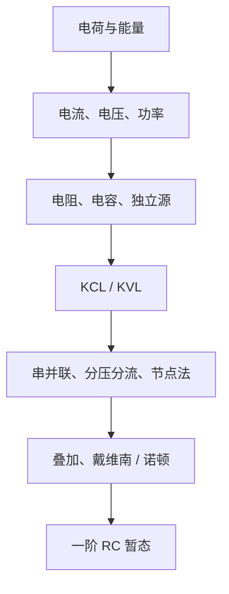
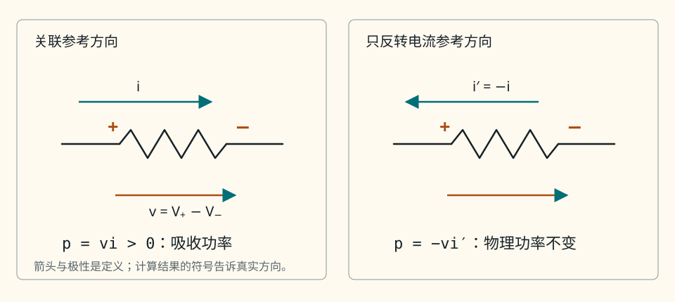
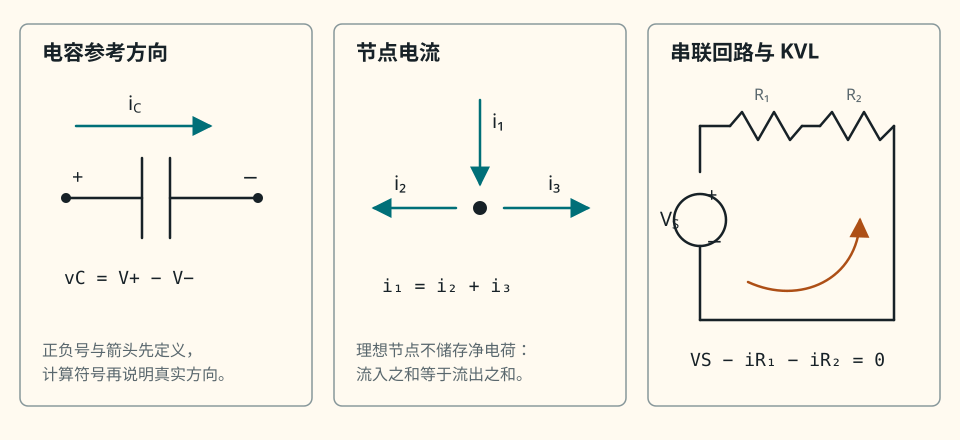
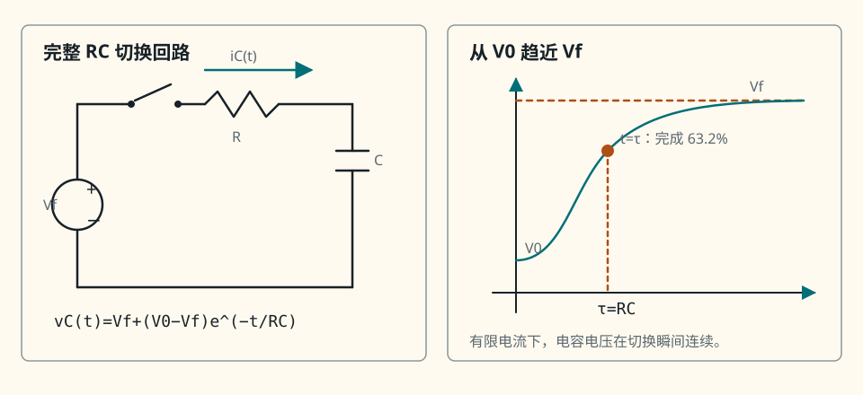

# 第 1 章　最小电路基础

本章建立整本书共同使用的“电路语言”。目标不是背公式，而是让每个结论都能沿着同一条链说清楚：**假设 → 模型 → 变量与参考方向 → 基本方程 → 求解 → 量纲检查 → 极限检查 → 失效条件**。

!!! important "冲刺必会"

    先学带 **P0** 标记的内容，并出声完成每段“30 秒回答”。本章的最低过关线是：会定参考方向、会列 KCL/KVL、会用节点法、会求戴维南等效、会判断一阶 RC 暂态。

!!! tip "面试加分"

    面试时不要只报公式。先说模型和参考方向，再给方程，最后主动补一句适用边界。

!!! note "考后深入"

    本章暂不处理分布参数传输线、强电磁耦合、非线性器件的大信号网络和随机噪声；这些内容都建立在本章语言之上。

## 1. 章节地图、目标与路线

前置知识只有高中代数：一元一次方程、指数函数、导数与定积分的直观含义。微分方程会在 RC 小节从头解出，不要求预先学过。

**图 1-1　知识依赖图。** 箭头表示“后者用到前者”，不是电流方向。

学完后，你应当能够：

1. 区分电荷、电流、电压、能量和功率，并按关联参考方向判断元件吸收还是发出功率；
2. 从元件模型写出电阻、电容和独立源的端口方程，解释理想模型的矛盾边界；
3. 从电荷守恒说明基尔霍夫电流定律（Kirchhoff's Current Law，KCL），从能量守恒和法拉第定律边界说明基尔霍夫电压定律（Kirchhoff's Voltage Law，KVL）；
4. 从 KCL/KVL 推出串并联、分压、分流和节点电压法；
5. 对线性一端口求戴维南、诺顿等效，并区分最大功率与最高效率；
6. 从 KCL 解出一阶 RC 阶跃响应，并用初值、终值和时间常数检查答案。

| 路线 | 阅读范围 | 建议动作 |
|---|---|---|
| 冲刺轨 | 所有 P0、例题、30 秒回答、C-01～C-08 | 约 3 小时，分两次完成 |
| 深入轨 | 90 秒回答、边界、能量说明和全部追问 | 冲刺内容过关后再读 |

## 2. P0：电荷、电流、电压、功率与参考方向

### 2.1 定义与直觉

电荷量记为 $q$，单位是库仑（C）。约定正电荷运动方向为**传统电流方向**；金属中电子实际漂移方向与它相反。

某截面在时间 $t$ 附近通过的电荷变化率定义为电流：

\[
i(t)=\frac{\mathrm dq(t)}{\mathrm dt}.
\]

其中 $i$ 是电流，单位安培（A）；$t$ 是时间，单位秒（s）。因此 $1\ \mathrm A=1\ \mathrm{C/s}$。若算得 $i<0$，不是“负电流不存在”，而是实际方向与预先画的参考箭头相反。

把单位正电荷从端点 $b$ 移到端点 $a$ 所需的能量变化定义为电压：

\[
v_{ab}=V_a-V_b=\frac{\mathrm dw}{\mathrm dq}.
\]

其中 $v_{ab}$ 是 $a$ 相对 $b$ 的电压，$V_a,V_b$ 是两点电势，$w$ 是能量，单位焦耳（J）；电压单位伏特（V），所以 $1\ \mathrm V=1\ \mathrm{J/C}$。

本章默认**集总、准静态电路模型**。“集总”是把电阻、储能等作用集中到尺寸可忽略的元件中，并忽略连接线传播延迟；“准静态”是信号变化相对电磁传播足够慢，使同一理想节点在所考察时刻可赋予一个电势。在这个模型内，电压总是两点之差；单说“某点电压”时，默认它相对于已选参考地。超出这个模型后，电场可能与路径有关，不能无条件沿用这句话。

水流类比只在两个地方有用：流量可帮助记忆“电流是单位时间通过量”，高度差可帮助记忆“电压是两点差”。它不能当作物理证明：导线里的电磁场传播、电子漂移、**位移电流**（变化电场在电流连续性中对应的电流项）、感应电动势和量子器件都不等同于水管现象。因此本章所有结论都从守恒律与元件模型出发。

### 2.2 关联参考方向与功率

对任意二端元件，先标电压正、负端，再让参考电流从电压“+”端流入，这叫**关联参考方向**（也称被动符号约定）：

<figure class="ae-figure-frame" markdown="1">

{ .ae-figure }

<figcaption>读图顺序：先选电压极性，再选电流参考方向，最后让 $p=vi$ 的符号说明能量方向；负值不是“算错”，而是实际方向与参考方向相反。</figcaption>
</figure>

在短时间 $\mathrm dt$ 内，流入元件的电荷为 $\mathrm dq=i\,\mathrm dt$，每单位电荷带来的能量为 $v=\mathrm dw/\mathrm dq$，所以

\[
\mathrm dw=v\,\mathrm dq=vi\,\mathrm dt,
\qquad
p=\frac{\mathrm dw}{\mathrm dt}=vi.
\]

其中 $p$ 是瞬时功率，单位瓦特（W）。在关联参考方向下：

- $p>0$：元件吸收能量；
- $p<0$：元件向外发出能量。

本章常用国际单位制前缀：千（$\mathrm k$）表示 $10^3$，毫（$\mathrm m$）表示 $10^{-3}$，微（$\mu$）表示 $10^{-6}$；例如 $1\ \mathrm{k\Omega}=10^3\ \Omega$。

例：某电阻按图 1-2 定义 $v=5\ \mathrm V,\ i=2\ \mathrm A$，则 $p=10\ \mathrm W$，电阻吸收 $10\ \mathrm W$。若一个电源仍按关联参考方向标注 $v=5\ \mathrm V$，但算得 $i=-2\ \mathrm A$，则 $p=-10\ \mathrm W$，表示电源发出 $10\ \mathrm W$。

### 2.3 证明链、量纲与极限检查

- **假设：** 电路可用集总端口量描述，$q(t)$ 和 $w(t)$ 在所考察时刻可微。
- **模型：** 一个二端元件，采用图 1-2 的关联参考方向。
- **变量与参考方向：** $i$ 流入“+”端，$v=V_+-V_-$。
- **基本方程：** $i=\mathrm dq/\mathrm dt,\ v=\mathrm dw/\mathrm dq$。
- **求解：** 链式相乘得 $p=\mathrm dw/\mathrm dt=vi$。
- **量纲检查：** $1\ \mathrm W=1\ \mathrm{V\cdot A}=1\ \mathrm{J/s}$；另有 $1\ \Omega=1\ \mathrm{V/A}$，其中 $\Omega$ 是欧姆。
- **极限检查：** $v=0$ 或 $i=0$ 时 $p=0$；保持 $v$ 不变而反转实际电流，$p$ 的符号反转。
- **失效条件：** 若端口不能用唯一的瞬时 $v,i$ 表示，或系统需要分布电磁场模型，仅靠 $p=vi$ 不能描述全部空间能流；应使用电磁场功率流。

### 适用边界

这里讨论的是集总电路端口的瞬时功率。正负号依赖于参考方向，不能脱离图判断“正功率一定是电源功率”。周期信号的平均功率还需对 $p(t)$ 做时间平均。

### 30 秒回答

“电流是电荷通过率 $i=\mathrm dq/\mathrm dt$，电压是单位电荷的能量差 $v=\mathrm dw/\mathrm dq$。若电流参考方向流入电压正端，就采用关联参考方向，此时 $p=vi$：正值表示吸收功率，负值表示发出功率。负的电流或功率只说明实际方向与参考定义相反。”

### 90 秒回答

“分析电路前我先定义参考方向。电压 $v_{ab}=V_a-V_b$，电流箭头可以任意假设；若让电流流入电压正端，就有 $p=vi$。这个式子来自 $\mathrm dw=v\,\mathrm dq$ 和 $\mathrm dq=i\,\mathrm dt$，因此量纲是 $\mathrm{V\cdot A=J/s=W}$。例如 $v=5\ \mathrm V,i=2\ \mathrm A$ 时元件吸收 $10\ \mathrm W$；同样的电压若 $i=-2\ \mathrm A$，它发出 $10\ \mathrm W$。参考箭头不是对实际方向的猜测，算出负值正是在告诉我实际方向相反。水流类比可帮助理解“通过率”和“两点差”，但不能解释感应电动势或电磁能流，所以不会用它代替守恒律。”

### 本节练习与递进追问

1. 一个元件按关联参考方向有 $v=-3\ \mathrm V,\ i=2\ \mathrm A$。它吸收还是发出功率？先只根据符号作答，再画出实际极性。
2. 追问：若把电压极性和电流箭头同时反转，$p=vi$ 的数值是否改变？若只反转一个呢？

## 3. P0：电阻、电容与独立源模型

### 3.1 电阻：把电压与电流联系起来

理想线性电阻的电阻值记为 $R$，单位欧姆（$\Omega$）。在关联参考方向下，欧姆定律是

\[
v=Ri.
\]

它不是由 KCL/KVL 推出的普遍自然定律，而是线性电阻的**元件本构模型**：实验表明在给定工作范围内 $v/i$ 为常数，于是定义 $R=v/i$。因此 $1\ \Omega=1\ \mathrm{V/A}$。结合 $p=vi$，有

\[
p_R=Ri^2=\frac{v^2}{R}\ge 0\qquad(R>0),
\]

理想正电阻只吸收功率并转化为热。

### 3.2 电容：储存电场能量

理想线性电容的电容值记为 $C$，单位法拉（F）。注意：斜体 $C$ 在公式中表示电容量，而正体 $\mathrm C$ 是电荷单位库仑。电容的端口模型是

\[
q=Cv_C,
\]

其中 $q$ 是正端极板上的电荷，$v_C$ 是正端相对负端的电压。电流 $i_C$ 流入正端：

<figure class="ae-figure-frame" markdown="1">

{ .ae-figure }

<figcaption>图 1-3　从元件到网络的三层参考图：先定义电容端口方向，再用节点图写 KCL，最后沿指定绕行方向写串联回路 KVL。</figcaption>
</figure>

若 $C$ 为常数，由电流定义直接得到

\[
i_C=\frac{\mathrm dq}{\mathrm dt}
=C\frac{\mathrm dv_C}{\mathrm dt}.
\]

从零电压缓慢充到 $v_C$ 时，储能为

\[
w_C=\int_0^t p\,\mathrm dt
=\int_0^{q}v\,\mathrm dq
=\int_0^{v_C}v\,C\,\mathrm dv
=\frac12Cv_C^2.
\]

其中 $w_C$ 的单位是焦耳；量纲为 $\mathrm{F\cdot V^2=(C/V)V^2=C\cdot V=J}$。

若电容电流始终有限，则

\[
v_C(t_2)-v_C(t_1)=\frac1C\int_{t_1}^{t_2}i_C(t)\,\mathrm dt.
\]

当 $t_2-t_1\to0$ 时积分趋于零，所以理想电容电压不能在有限电流下突变，即 $v_C(0^+)=v_C(0^-)$。若允许冲激电流，理想模型可以产生电压跳变，这正是“连续性”结论的边界。

直流稳态指电路经历足够长时间后所有端口量不再随时间变化。此时 $\mathrm dv_C/\mathrm dt=0$，故 $i_C=0$，理想电容对直流表现为开路；这不等于电容两端电压必为零。

### 3.3 独立源与不允许的理想连接

独立电压源规定端电压，不由负载电流决定；独立电流源规定支路电流，不由端电压决定：

<figure class="ae-figure-frame" markdown="1">

{ .ae-figure }

<figcaption>图 1-4　电压源规定端电压而电流由外电路决定；电流源规定支路电流而端电压由外电路决定。</figcaption>
</figure>

非零理想电压源不能被理想导线短路：电源要求 $v=V_s\ne0$，导线却要求 $v=0$，两个模型方程互相矛盾，并不存在有限解。若用很小的串联内阻 $r_s$ 逼近真实源，则短路电流 $I=V_s/r_s$，当 $r_s\to0^+$ 时电流及源的功率尺度趋于无穷。

非零理想电流源不能开路：电流源要求 $i=I_s\ne0$，开路却要求 $i=0$，同样无解。若用很大的并联内阻 $r_p$ 逼近真实源，开路电压 $V=I_s r_p$，当 $r_p\to\infty$ 时电压及功率尺度趋于无穷。真实电源会受内阻、限流、击穿和额定功率约束，不会真的产生无穷量。

### 3.4 证明链、量纲与极限检查

- **假设：** 元件线性、参数 $R,C$ 不随电压、电流、频率、温度或时间改变。
- **模型：** 电阻满足 $v=Ri$；电容满足 $q=Cv_C$；独立源只固定一种端口量。
- **变量与参考方向：** 电阻和电容均用关联参考方向，$i$ 流入电压正端。
- **基本方程：** $i=\mathrm dq/\mathrm dt,\ p=vi$ 以及各元件本构方程。
- **求解：** 得 $i_C=C\,\mathrm dv_C/\mathrm dt$ 和 $w_C=\tfrac12Cv_C^2$。
- **量纲检查：** $\mathrm{F\cdot V/s=(C/V)(V/s)=A}$；$\mathrm{F\cdot V^2=J}$。
- **极限检查：** $R\to0$ 接近短路、$R\to\infty$ 接近开路；直流稳态下电容电流为零；$C\to0$ 时同一电压下储能趋零。
- **失效条件：** 实际电阻会温漂和超功率，实际电容有漏电、等效串联电阻、击穿与寄生电感；源有内阻和额定范围。

### 适用边界

“电容直流开路”只描述直流稳态端口电流，不适用于刚切换后的暂态，也不表示初始储能消失。“电容电压连续”要求电流有限；“理想源不能短接/开路”是方程不相容，不是说任何实验电源一接就必然产生数学无穷。

### 30 秒回答

“电阻的线性模型是 $v=Ri$，电容先由 $q=Cv_C$ 定义，再由 $i=\mathrm dq/\mathrm dt$ 得到 $i_C=C\,\mathrm dv_C/\mathrm dt$，积分功率得到储能 $\tfrac12Cv_C^2$。直流稳态时电容电压不变，所以电流为零；有限电流不能让电容电压瞬间跳变。非零理想电压源短路、非零理想电流源开路都会造成模型方程矛盾。”

### 90 秒回答

“电阻和电容是不同类型的本构模型。线性电阻把同一时刻的电压、电流用 $v=Ri$ 联系起来，并有 $p=Ri^2\ge0$。电容把电荷和电压用 $q=Cv_C$ 联系起来，所以 $i_C=C\,\mathrm dv_C/\mathrm dt$；把 $v\,\mathrm dq$ 从零积分到当前电压，可得储能 $\tfrac12Cv_C^2$。因此直流稳态时它等效开路，但可以保有非零电压。由积分式可知，有限时间间隔趋于零且电流有限时，电压变化也趋零。理想源则只规定电压或电流；非零电压源并接理想短路会同时要求 $v=V_s$ 和 $v=0$，非零电流源开路会同时要求 $i=I_s$ 和 $i=0$，所以是理想模型无解。用非零内阻逼近时，相应电流或电压在极限中发散。”

### 本节练习与递进追问

1. 一个 $10\ \mu\mathrm F$ 电容的电压以 $2\ \mathrm{V/ms}$ 匀速上升；在所问时刻 $v_C=3\ \mathrm V$。按图 1-3 的方向求 $i_C$，并判断该时刻它吸收还是释放能量。
2. 追问一：直流稳态下电容开路，为什么电容两端仍可能测得 $5\ \mathrm V$？
3. 追问二：两个理想电压源能否并联？请分别讨论电压相同和不同的情形。

## 4. P0：KCL 与 KVL——守恒律怎样进入电路

### 4.1 KCL：节点不会“吃掉”电流

节点是若干支路的理想导体连接区。先对每条支路任意规定参考方向：

图 1-3 中间的节点图规定 $i_1$ 流入节点 $a$，$i_2,i_3$ 流出；箭头仍只是参考方向。

取包围节点的很小封闭面，电荷守恒给出

\[
\sum i_{\text{流入}}-\sum i_{\text{流出}}
=\frac{\mathrm dq_a}{\mathrm dt},
\]

其中 $q_a$ 是封闭面内积累的净电荷。在**集总、准静态**模型中，理想节点不储存宏观电荷，即 $\mathrm dq_a/\mathrm dt=0$，于是

\[
i_1-i_2-i_3=0,
\qquad\text{或}\qquad
\sum_k i_k=0
\]

（后一式约定流出为正，所有支路电流作代数求和）。电流不会在节点被“消耗”；能量可以在元件中转化，但电荷必须连续守恒。若节点对地存在电容，支路电流 $i_C=C\,\mathrm dv_C/\mathrm dt$ 已经是电容介质中位移电流的集总表示，把这一条电容支路计入 KCL 即可，不能再额外加一条“位移电流”而重复计算。

### 4.2 KVL：符号来自绕行方向，不是“电压全为正”

考虑一个电压源和两个串联电阻，回路电流参考方向为顺时针：

图 1-3 右侧给出了完整回路。沿顺时针按“电压降为正”记录：跨过电源是从“−”到“+”，所以它贡献 $-V_s$。

若回路没有未建模的时变磁通，单位电荷绕闭合路径一周回到原状态，净能量变化为零，因此各段电压降的代数和为零：

\[
-V_s+R_1i+R_2i=0,
\qquad
i=\frac{V_s}{R_1+R_2}.
\]

KVL 的“和为零”从不意味着每项都为正；每项符号由绕行方向与元件标注共同决定。换成逆时针绕行，方程整体乘以 $-1$，物理解不变。

更一般地，法拉第电磁感应定律给出

\[
\oint \mathbf E\cdot\mathrm d\mathbf l
=-\frac{\mathrm d\Phi_B}{\mathrm dt},
\]

其中 $\mathbf E$ 是电场，$\Phi_B$ 是回路所围磁通。若右端不可忽略，把所有电压仅当作静电势差后直接令其和为零会失败。集总电路仍可把感应效应建模成电感或一个感应电动势支路，再对**包含该支路电压**的网络列 KVL；若外部时变磁通未被建模，就不能机械套用零和式。

### 4.3 完整证明链

- **假设：** 电路尺寸远小于有关信号波长，传播延迟可忽略；节点无未建模的净电荷积累；回路无未建模的时变磁通。
- **模型：** 导线为等势连接，器件由集总支路代替。
- **变量与参考方向：** 图 1-5 明确各支路流入/流出；图 1-6 明确顺时针绕行与每个电压极性。
- **基本方程：** 电荷守恒 $\sum i_{\rm in}-\sum i_{\rm out}=\mathrm dq_a/\mathrm dt$；单位电荷闭路能量平衡，或将感应电动势显式计入。
- **求解：** 理想节点令右端为零得到 KCL；闭路净能量变化为零得到 KVL。
- **量纲检查：** KCL 每项均为 A；KVL 每项均为 V。不能把电流与电压放在同一个代数和中。
- **极限检查：** 只有一条支路接到孤立节点时 KCL 强制该支路电流为零；令 $R_1=0$，单回路解退化为 $i=V_s/R_2$。
- **失效条件：** 高频长互连、强辐射、显著传播延迟、未建模寄生电容或外部变化磁通下，简单集总图不再充分，应补元件或改用分布参数/电磁场模型。

### 适用边界

KCL 的根源始终是电荷守恒，但“所有导电电流瞬时相加为零”的简式依赖集总准静态模型；电介质中的位移电流效应要通过相应电容支路计入，不能在电容支路之外再重复相加。KVL 的零和式要求所有感应电动势已经包含在支路模型中。含电感不等于 KVL 失效，漏掉外部磁耦合才是常见问题。

### 30 秒回答

“KCL 来自电荷守恒。对理想节点没有净电荷积累，所以流入电流之和等于流出电流之和；电流不会在节点被消耗。KVL 是闭合回路的能量平衡，沿指定方向各电压升降作代数和为零，不是所有电压都取正。它们都建立在集总准静态模型上；外部时变磁通产生的感应电动势必须显式计入。”

### 90 秒回答

“我会先画参考方向再列式。对节点取一个小封闭面，电荷守恒是流入减流出等于内部电荷变化率；集总模型把理想节点的储能和电荷积累忽略，所以得到 KCL。对闭合回路，若没有未建模的时变磁通，单位电荷绕行一周净能量变化为零，得到各电压变化的代数和为零。比如图中的顺时针方程是 $-V_s+R_1i+R_2i=0$，负号表示跨电源是电压上升，并不表示电源电压本身“是负的”。法拉第定律说明若回路穿过变化磁通，场的闭路积分等于 $-\mathrm d\Phi_B/\mathrm dt$；这时应把感应电动势或电感纳入模型，否则朴素的电势差零和式不成立。”

### 含负号的口述判断

仍用图 1-5 的方向。若 $i_1=2\ \mathrm{mA}$、$i_3=5\ \mathrm{mA}$，则

\[
i_1-i_2-i_3=0
\quad\Rightarrow\quad
i_2=-3\ \mathrm{mA}.
\]

应口述为：“$i_2$ 相对所画的流出方向为负，所以实际有 $3\ \mathrm{mA}$ 流入节点。”不能说“出现了不可能的负电流”。代回检查：流入 $2+3=5\ \mathrm{mA}$，等于流出 $5\ \mathrm{mA}$。

### 本节练习与递进追问

1. 图 1-5 中若 $i_1=-1\ \mathrm{mA},\ i_2=2\ \mathrm{mA}$，求 $i_3$，并把每个负号翻译成实际方向。
2. 追问一：节点接了一个对地电容后，能否仍说“流入等于流出”？怎样把电容电流计入？
3. 追问二：把导线绕在快速变化磁场附近，电压表读数可能依赖测试引线围成的路径，为什么这提示朴素 KVL 的边界？

## 5. P0：串并联、分压分流与节点电压法

### 5.1 串联和分压从 KCL/KVL 得出

两个元件**串联**，是指它们首尾相接且中间节点没有其他支路。由该中间节点的 KCL，两者通过同一个电流 $i$。对两个串联电阻列 KVL：

\[
v=v_1+v_2=R_1i+R_2i=(R_1+R_2)i.
\]

因此串联等效电阻

\[
R_{\mathrm{eq}}=R_1+R_2.
\]

若总电压为 $V_s$，则 $i=V_s/(R_1+R_2)$，所以

\[
v_1=V_s\frac{R_1}{R_1+R_2},
\qquad
v_2=V_s\frac{R_2}{R_1+R_2}.
\]

这就是两电阻分压。它成立的关键是两只电阻电流相同；若分压点接入负载，负载会与其中一只电阻并联，不能继续使用未加载的公式。

### 5.2 并联和分流从 KCL/KVL 得出

两个元件**并联**，是指它们的两端分别接到同一对节点。由端点定义，两者电压相同为 $v$。总电流为 $I$ 时，KCL 给出

\[
I=i_1+i_2=\frac{v}{R_1}+\frac{v}{R_2}
=v\left(\frac1{R_1}+\frac1{R_2}\right).
\]

故

\[
\frac1{R_{\mathrm{eq}}}=\frac1{R_1}+\frac1{R_2},
\qquad
R_{\mathrm{eq}}=\frac{R_1R_2}{R_1+R_2}.
\]

由 $v=IR_{\mathrm{eq}}$ 得两支路分流公式

\[
i_1=I\frac{R_2}{R_1+R_2},
\qquad
i_2=I\frac{R_1}{R_1+R_2}.
\]

电流分配与本支路电阻成反比。也可定义电导 $G=1/R$，单位西门子（S），其中 $1\ \mathrm S=1\ \mathrm{A/V}$；此时 $i_1=I\,G_1/(G_1+G_2)$，更不容易记反。

### 5.3 完整两节点例题：选地—标节点—列 KCL—求解

下图只有两个本质节点：参考地 $b$ 和未知节点 $a$。左侧理想电压源使已知节点为 $V_s=12\ \mathrm V$；$R_1=2\ \mathrm{k\Omega}$，$R_2=4\ \mathrm{k\Omega}$；独立电流源 $I_s=1\ \mathrm{mA}$ 从地向节点 $a$ 注入电流。

<figure class="ae-figure-frame" markdown="1">
{ .ae-figure }
</figure>

**图 1-7　两节点例题与一端口等效。** 左图给出有完整返回路径的两节点网络：电压源使节点 $s$ 对地电压 $V_s=12\ \mathrm V$，电流源由地 $b$ 向节点 $a$ 注入电流。在节点 $a$ 统一采用“流出为正”，所以 $i_{R1}=(V_a-V_s)/R_1$、$i_{R2}=V_a/R_2$，注入源在流出和式中写成 $-I_s$。右图预览第 6 节使用的戴维南与诺顿端口模型。

1. **选地：** 令 $V_b=0$。
2. **标节点：** 令 $V_a$ 为节点 $a$ 相对地的电压，单位 V。
3. **列 KCL：** \(\displaystyle
   \frac{V_a-V_s}{R_1}+\frac{V_a}{R_2}-I_s=0
   \)。

4. **求解：** \(\displaystyle
   V_a=
   \frac{V_s/R_1+I_s}{1/R_1+1/R_2}
   =
   \frac{12\ \mathrm V/(2\ \mathrm{k\Omega})+1\ \mathrm{mA}}
   {1/(2\ \mathrm{k\Omega})+1/(4\ \mathrm{k\Omega})}
   =\frac{7\ \mathrm{mA}}{0.75\ \mathrm{mS}}
   =9.33\ \mathrm V
   \)。

5. **回代：** 经 $R_1$ 流出的电流为 $(9.33-12)\ \mathrm V/(2\ \mathrm{k\Omega})=-1.33\ \mathrm{mA}$，即实际从 $12\ \mathrm V$ 端流入节点；经 $R_2$ 流出 $2.33\ \mathrm{mA}$。于是 $-1.33+2.33-1=0\ \mathrm{mA}$。

### 5.4 证明链、量纲与极限检查

- **假设：** 电阻为线性正电阻，连接线是理想导线，独立源处于额定模型范围。
- **模型：** 串联共享电流、并联共享电压；节点电压是相对所选参考地的电势差。
- **变量与参考方向：** 图 1-7 对节点 $a$ 统一取流出电流为正。
- **基本方程：** 电阻满足 $i=(V_{\rm 起点}-V_{\rm 终点})/R$，节点满足 KCL，闭路满足 KVL。
- **求解：** 合并同类项得到 $V_a=(V_s/R_1+I_s)/(1/R_1+1/R_2)$。
- **量纲检查：** 分子是 A，分母是 S（A/V），所以结果是 V；分压与分流系数均无量纲。
- **极限检查：** 图 1-7 中 $R_1\to0$ 时 $V_a\to V_s$；$R_1\to\infty$ 时 $V_a\to I_sR_2=4\ \mathrm V$；$R_2\to0$ 时 $V_a\to0$；$R_2\to\infty$ 时 $V_a\to V_s+I_sR_1=14\ \mathrm V$。
- **失效条件：** 电阻非线性、源饱和、地线有明显阻抗或电路进入分布参数范围时，必须修改模型；分压点被加载时要把负载并入网络重算。

### 适用边界

“串联”不是“图上画成一排”，“并联”也不是“看起来上下平行”，只能根据节点连接判断。节点法对线性与非线性集总网络都能列 KCL，但非线性网络得到的通常不是线性方程。遇到两个非参考节点由理想电压源相连时，可用超节点，本文暂不展开。

### 30 秒回答

“串联共享电流，所以由 KVL 得 $R_{\rm eq}=\sum R$ 和分压；并联共享电压，所以由 KCL 得 $1/R_{\rm eq}=\sum1/R$ 和分流。节点电压法先选地，再给未知节点标电压，把每条支路电流都用节点电压表示，最后列 KCL。符号由统一的流入或流出约定决定。”

### 90 秒回答

“串并联公式不是独立背诵项。串联中间节点没有第三条支路，KCL 迫使电流相同；再由 KVL 把各电阻压降相加，得到串联等效和分压。并联元件跨接同一对节点，所以电压相同；KCL 将各支路电流相加，得到并联等效和分流。节点法就是系统化应用 KCL：选一个参考地，给其他节点定义电压，按 $(V_a-V_b)/R$ 写支路电流。例如图 1-7 取流出为正，方程是 $(V_a-V_s)/R_1+V_a/R_2-I_s=0$。算出负支路电流只说明实际方向与假设相反。最后用 A/S=V 检查量纲，并检查短路、开路极限。”

### 本节练习与递进追问

1. 把图 1-7 的 $I_s$ 改为从 $a$ 流向地，重新列式，不必先算数值。
2. 追问一：若在节点 $a$ 再接一个 $4\ \mathrm{k\Omega}$ 负载到地，$V_a$ 上升还是下降？先判断再计算。
3. 追问二：两个标称 $1\ \mathrm{k\Omega}$ 的电阻“首尾相接”，什么情况下仍不能称为串联？

## 6. P0：叠加、戴维南与诺顿等效

### 6.1 叠加定理：线性响应可以拆开算

若网络中元件关系和控制关系均为线性，并且所求量是电压或电流，还要假设选定参考地和模型约束后方程**相容且解唯一**。这等价于下式的系数矩阵 $\mathbf A$ 对所求响应非奇异，线性方程组可写成

\[
\mathbf A\mathbf x
=\mathbf b_1+\mathbf b_2+\cdots,
\]

其中 $\mathbf x$ 是未知电压、电流列向量，$\mathbf A$ 由网络参数决定，$\mathbf b_k$ 是第 $k$ 个独立源的激励。因为

\[
\mathbf x
=\mathbf A^{-1}\mathbf b_1+\mathbf A^{-1}\mathbf b_2+\cdots,
\]

总响应等于各独立源单独作用的响应之和，这就是叠加定理。

单独保留一个独立源时，其他**独立源置零**：

- 理想独立电压源置为 $0\ \mathrm V$，等效为短路；
- 理想独立电流源置为 $0\ \mathrm A$，等效为开路；
- 受控源由电路变量决定，**不能简单置零**，必须保留；求等效电阻时通常在端口加测试源。

叠加直接适用于电压和电流，不直接适用于功率，因为 $p=v^2/R$ 或 $p=i^2R$ 是二次量。含电容、电感的线性动态电路若有非零初始条件，应把初始条件视为额外激励，不能悄悄忽略。线性本身不保证问题良定：冲突的理想源约束会使方程无解，悬浮节点或冗余理想约束可能使解不唯一；这些情形中 $\mathbf A^{-1}$ 不存在，应先修正参考节点或源模型，不能套用上面的求逆推导。

### 6.2 同一个一端口求戴维南和诺顿等效

一端口是从外部只看到端子 $a,b$ 的网络。仍使用图 1-7 左侧网络，并把节点 $a$ 与参考地 $b$ 看作输出端口。端口电压定义为 $v=V_a-V_b$；端口输出电流 $i$ 从 $a$ 流向外部负载。开路时外部支路的 $i=0$。

**开路电压 $V_{\rm th}$。** 端口开路时外部电流为零，内部仍是 $R_1,R_2$ 分压：

\[
V_{\rm th}=V_{\rm oc}
=12\ \mathrm V\frac{4\ \mathrm{k\Omega}}
{2\ \mathrm{k\Omega}+4\ \mathrm{k\Omega}}
=8\ \mathrm V.
\]

其中 $V_{\rm th}$ 是戴维南电压，$V_{\rm oc}$ 是开路电压，单位均为 V。

**等效电阻 $R_{\rm th}$。** 将独立 $12\ \mathrm V$ 源置零，即用短路代替。从 $a,b$ 看进去，$R_1,R_2$ 并联：

\[
R_{\rm th}=R_1\parallel R_2
=\frac{R_1R_2}{R_1+R_2}
=\frac43\ \mathrm{k\Omega}.
\]

若网络含受控源，受控源保持工作，在端口加测试电压 $V_t$，求流入网络的测试电流 $I_t$，再用 $R_{\rm th}=V_t/I_t$；不能把受控源“关掉”。

**短路电流 $I_N$。** 将 $a,b$ 理想短接，$R_2$ 被旁路，短路中从 $a$ 流向 $b$ 的电流为

\[
I_N=I_{\rm sc}=\frac{12\ \mathrm V}{2\ \mathrm{k\Omega}}
=6\ \mathrm{mA}.
\]

其中 $I_N$ 是诺顿电流，$I_{\rm sc}$ 是端口短路电流。诺顿等效画成电流源 $I_N$ 与 $R_N$ 并联；电流源内部箭头由 $b$ 指向 $a$，这样它向短路交付的外部电流方向是 $a\to b$。并且

\[
R_N=R_{\rm th},\qquad
V_{\rm th}=I_NR_{\rm th}
=6\ \mathrm{mA}\times\frac43\ \mathrm{k\Omega}
=8\ \mathrm V.
\]

图 1-7 右侧画出了同一线性一端口的戴维南与诺顿等效。它们只保证端口 $v$-$i$ 关系相同，不保证内部电压、电流或功耗相同。

### 6.3 两种有限等效何时同时存在

线性电阻一端口的端口特性是仿射直线，但直线可能水平或竖直，不一定同时具有两种**有限参数**等效。一般写成

\[
a v+b i=c,
\]

其中 $a,b,c$ 是由内部线性网络与独立源决定的常数，$v,i$ 仍采用图 1-8 的参考方向。若 $a\ne0$ 且 $b\ne0$，既能解出电压形式

\[
v=\frac ca-\frac ba i
=V_{\rm th}-R_{\rm th}i,
\]

也能解出电流形式

\[
i=\frac cb-\frac ab v
=I_N-\frac{v}{R_N}.
\]

此时开路和短路操作都有有限解，并且

\[
V_{\rm th}=V_{\rm oc}=\frac ca,\qquad
I_N=I_{\rm sc}=\frac cb,\qquad
R_{\rm th}=R_N=\frac ba,
\]

\[
V_{\rm th}=I_NR_{\rm th}.
\]

因此，戴维南与诺顿的普通有限源变换要求有限的 $V_{\rm oc}$、$I_{\rm sc}$ 和有限非零的端口电阻；还要确保实际开路、短路测试不会让器件超额定值。图 1-8 满足这些条件，所以前面的 $8\ \mathrm V$、$\tfrac43\ \mathrm{k\Omega}$ 和 $6\ \mathrm{mA}$ 可相互转换。

奇异直线必须单独处理：

- 非零理想电流源满足 $i=I_s$，相当于 $a=0$。端口开路又要求 $i=0$，两式不相容，所以没有有限开路电压，也没有有限参数的戴维南形式；它的理想诺顿形式对应并联电阻趋于无穷。
- 非零理想电压源满足 $v=V_s$，相当于 $b=0$。端口短路又要求 $v=0$，两式不相容，所以没有有限短路电流，也没有有限参数的诺顿形式；它的理想戴维南形式对应串联电阻为零。

### 6.4 最大功率传输不等于最高效率

以下证明进一步要求 $R_{\rm th}>0$。在戴维南等效端接正负载电阻 $R_L$（单位 $\Omega$），负载功率为

\[
P_L
=\left(\frac{V_{\rm th}}{R_{\rm th}+R_L}\right)^2R_L
=\frac{V_{\rm th}^2R_L}{(R_{\rm th}+R_L)^2}.
\]

对 $R_L$ 求导：

\[
\frac{\mathrm dP_L}{\mathrm dR_L}
=\frac{V_{\rm th}^2(R_{\rm th}-R_L)}
{(R_{\rm th}+R_L)^3}.
\]

当 $R_L<R_{\rm th}$ 时导数为正，当 $R_L>R_{\rm th}$ 时导数为负，所以唯一最大点为

\[
R_L=R_{\rm th},
\qquad
P_{L,\max}=\frac{V_{\rm th}^2}{4R_{\rm th}}.
\]

若只考察**抽象戴维南发生器**，把 $R_{\rm th}$ 当作它唯一的内部损耗电阻，可定义该等效模型的发生器效率

\[
\eta_{\rm Th}=\frac{P_L}{P_L+P_{R_{\rm th}}}
=\frac{R_L}{R_{\rm th}+R_L}.
\]

在最大功率点 $R_L=R_{\rm th}$，有 $\eta_{\rm Th}=50\%$：负载与等效串联电阻耗散相同功率。在这个抽象模型的口径内，增大 $R_L$ 会使 $\eta_{\rm Th}$ 趋近 $100\%$，但负载功率反而趋近零。因此“最大功率”与“最高效率”是不同优化目标。

**不要把这 50% 当作原网络从实际独立源到负载的总效率。** 戴维南等效只保持端口 $v$-$i$ 关系，不保持内部静态功耗。以图 1-8 为例，在 $R_L=R_{\rm th}=\tfrac43\ \mathrm{k\Omega}$ 时，负载电压为 $4\ \mathrm V$、负载功率为

\[
P_L=\frac{(4\ \mathrm V)^2}{(4/3)\ \mathrm{k\Omega}}
=12\ \mathrm{mW}.
\]

抽象戴维南源的电流为 $3\ \mathrm{mA}$，它提供 $8\ \mathrm V\times3\ \mathrm{mA}=24\ \mathrm{mW}$，其中 $12\ \mathrm{mW}$ 耗在 $R_{\rm th}$，所以 $\eta_{\rm Th}=50\%$。但在原图中，$R_2\parallel R_L=1\ \mathrm{k\Omega}$，实际 $12\ \mathrm V$ 源电流为 $4\ \mathrm{mA}$，源提供

\[
P_{\rm source}=12\ \mathrm V\times4\ \mathrm{mA}
=48\ \mathrm{mW},
\qquad
\eta_{\rm orig}=\frac{P_L}{P_{\rm source}}
=\frac{12}{48}=25\%.
\]

其余 $32\ \mathrm{mW}$ 耗在 $R_1$，$4\ \mathrm{mW}$ 耗在 $R_2$。因此，$\eta_{\rm Th}$ 是端口等效模型的串联内阻核算，$\eta_{\rm orig}$ 才是图 1-8 原始 12 V 源到负载的效率；仅凭增大 $R_L$ 不能断言 $\eta_{\rm orig}$ 单调上升。

### 6.5 完整证明链、量纲与极限检查

- **假设：** 一端口在所考察工作范围内线性，参数不随激励幅度改变；若要在两种有限等效间转换，还要求 $a,b\ne0$，开路与短路均有有限解且测试不会超出器件额定范围。
- **模型：** 先用一般端口直线 $av+bi=c$；在 $a,b\ne0$ 时改写为 $v=V_{\rm th}-R_{\rm th}i$。
- **变量与参考方向：** $v=V_a-V_b$；$i$ 是网络从 $a$ 向负载交付的电流。
- **基本方程：** KCL/KVL、线性叠加以及端口开路/短路定义。
- **求解：** 在对应操作存在有限解时，取 $i=0$ 得 $V_{\rm th}$，将独立源置零或加测试源得 $R_{\rm th}$，取 $v=0$ 得 $I_N$。
- **量纲检查：** $V_{\rm th}/R_{\rm th}$ 的单位为 V/$\Omega$=A；$V_{\rm th}^2/R_{\rm th}$ 的单位为 W。
- **极限检查：** $R_L\to0$ 时 $V_L\to0,P_L\to0$；$R_L\to\infty$ 时 $I_L\to0,P_L\to0$，因此中间存在功率峰值。公共例题中 $I_NR_{\rm th}=8\ \mathrm V=V_{\rm th}$。
- **失效条件：** $a=0$ 或 $b=0$ 时只有一种非有限参数形式；非线性器件跨越多个工作区、开短路会损坏网络、参数随温度显著改变、或一端口含能量初值且观察暂态时，单一常数 $V_{\rm th},R_{\rm th}$ 不能全局描述。

### 适用边界

戴维南/诺顿等效只保证指定端口对外行为相同，不保留内部功率分配或原独立源提供的总功率，因此 $\eta_{\rm Th}=50\%$ 不能替代原电路的源到负载效率。含受控源的线性网络仍可等效，但求 $R_{\rm th}$ 时必须保留受控源并使用测试源。非零理想电流源没有有限 $V_{\rm oc}$，不能变成有限参数的戴维南源；非零理想电压源没有有限 $I_{\rm sc}$，不能变成有限参数的诺顿源。零端口电阻会使普通有限源变换退化；负的有限非零增量电阻仍可作端口源变换，但上述正电阻最大功率和 $\eta_{\rm Th}=50\%$ 结论不适用。非线性电路只可在选定工作点附近做小信号线性化后局部使用。

### 30 秒回答

“线性一端口的端口特性是直线。若开路电压、短路电流均有限且端口电阻有限非零，才可同时写成戴维南和诺顿形式，并有 $V_{\rm th}=V_{\rm oc}$、$I_N=I_{\rm sc}$、$V_{\rm th}=I_NR_{\rm th}$。求电阻时独立源置零，但受控源必须保留。非零理想电流源没有有限开路电压，非零理想电压源没有有限短路电流，是两个奇异反例。对正内阻，$R_L=R_{\rm th}$ 时负载功率最大；抽象戴维南发生器效率 $\eta_{\rm Th}$ 为 50%，但原网络总效率要回到内部电路另算。”

### 90 秒回答

“线性一端口的本质是端口特性为仿射直线 $av+bi=c$。当 $a,b$ 都非零时，可以分别解成 $v=V_{\rm th}-R_{\rm th}i$ 与 $i=I_N-v/R_N$；开路和短路给出有限的 $V_{\rm th}=V_{\rm oc}$ 与 $I_N=I_{\rm sc}$，并有 $R_N=R_{\rm th}$、$V_{\rm th}=I_NR_{\rm th}$。把独立电压源短路、独立电流源开路可求端口电阻；若有受控源，必须保留并加测试源。若 $a=0$，非零理想电流源开路无有限解；若 $b=0$，非零理想电压源短路无有限解，所以不能无条件互换。对 $R_{\rm th}>0$ 的普通情形，接负载后求导得 $R_L=R_{\rm th}$ 时功率最大；此时负载与等效串联电阻功率相等，故抽象戴维南发生器的 $\eta_{\rm Th}=50\%$。等效不保持原网络内部功率，图 1-8 从实际 12 V 源计只有 $\eta_{\rm orig}=25\%$，两种效率不能混用。”

### 本节练习与递进追问

1. 对图 1-8 不重算内部支路，直接用两种等效分别求接入 $R_L=4\ \mathrm{k\Omega}$ 后的负载电流。
2. 追问一：一个只含受控源和电阻的一端口，关掉全部独立源后能否直接说 $R_{\rm th}=0$？为什么？
3. 追问二：若求最大功率时得到 $R_L=R_{\rm th}$，如何用 $R_L\to0$ 和 $R_L\to\infty$ 两个极限排除它是最小值？

## 7. P0：一阶 RC 暂态

配合[RC 阶跃响应实验](../labs/rc-step-response.html)使用：先算出 $\tau$ 与 $v_C(\tau)$，再分别只改变 $R$、$C$、$V_f$ 或 $V_0$，说明横向快慢、起点、终点和变化方向各由谁决定。

### 7.1 电路、初值和最终值

开关在 $t=0$ 接通后，理想恒压源 $V_f$ 经电阻 $R$ 驱动电容 $C$。$V_0$ 表示切换前一瞬间的电容电压 $v_C(0^-)$；$V_f$ 也是该电路在足够长时间后的目标电压。

<figure class="ae-figure-frame" markdown="1">
{ .ae-figure }
</figure>

**图 1-8　串联 RC 阶跃电路与指数响应。** 左图中电源使节点 $s$ 对地 $b$ 的电压为 $V_f$；$v_C=V_a-V_b$，$i_C$ 流入电容正端，采用关联参考方向。开关闭合后，电阻电流与 $i_C$ 相同。右图同时标出初值、终值与一倍时间常数的位置。

有限电流下电容电压连续，所以

\[
v_C(0^+)=v_C(0^-)=V_0.
\]

当 $t\to\infty$，电路进入直流稳态，$i_C\to0$，电阻压降 $Ri_C\to0$，故

\[
v_C(\infty)=V_f.
\]

### 7.2 从 KCL 与微分方程完整推导

对电容上端节点列 KCL。流过电阻、进入电容的电流相同：

\[
\frac{V_f-v_C}{R}
=i_C
=C\frac{\mathrm dv_C}{\mathrm dt}.
\]

整理：

\[
\frac{\mathrm dv_C}{\mathrm dt}
=-\frac{1}{RC}(v_C-V_f).
\]

令误差 $x(t)=v_C(t)-V_f$，则

\[
\frac{\mathrm dx}{\mathrm dt}=-\frac{x}{RC}.
\]

对 $x\ne0$ 的区间分离变量，并从 $0^+$ 积分到 $t$：

\[
\int_{x(0^+)}^{x(t)}\frac{\mathrm dx}{x}
=-\int_0^t\frac{\mathrm dt}{RC},
\]

\[
\ln\left|\frac{x(t)}{x(0^+)}\right|=-\frac{t}{RC},
\qquad
x(t)=x(0^+)e^{-t/(RC)}.
\]

其中 $\ln$ 表示自然对数，$e\approx2.718$ 是自然对数的底。解在有限时间内保持与 $x(0^+)$ 同号，所以去掉绝对值时符号由初值确定；若 $x(0^+)=0$，则直接得到特殊解 $x(t)=0$。

由于 $x(0^+)=V_0-V_f$，得到统一形式

\[
\boxed{v_C(t)=V_f+(V_0-V_f)e^{-t/(RC)},\qquad t\ge0.}
\]

定义时间常数

\[
\tau=RC,
\]

单位为秒，因为 $\Omega\cdot\mathrm F=(\mathrm{V/A})(\mathrm{C/V})=\mathrm{C/A}=\mathrm s$。$\tau$ 描述误差缩小到原来的 $e^{-1}\approx36.8\%$ 所需时间。因此在 $t=\tau$ 时，电容已经完成总变化量的

\[
1-e^{-1}\approx63.2\%.
\]

“63.2%”是从初值朝终值走过的比例，所以放电时也适用，不能误说成“电压总是等于终值的 63.2%”。

电容电流为

\[
i_C(t)=C\frac{\mathrm dv_C}{\mathrm dt}
=\frac{V_f-V_0}{R}e^{-t/\tau}.
\]

若 $V_f>V_0$，按图中方向 $i_C>0$，$v_C$ 向代数值更大的终值变化；若 $V_f<V_0$，则 $i_C<0$，实际电流与箭头相反，$v_C$ 向代数值更小的终值变化。电流符号本身不能判断电容吸收还是释放能量；瞬时功率仍要按关联参考方向计算 $p_C(t)=v_C(t)i_C(t)$。

例如 $V_0=-1\ \mathrm V,\ V_f=-2\ \mathrm V$ 时，虽然 $V_f<V_0$ 且 $i_C<0$，过渡过程中 $v_C<0$，所以 $p_C=v_Ci_C>0$，电容反而吸收能量。若波形跨过 $v_C=0$，$p_C$ 还可能在过渡过程中改变符号。

### 7.3 三点法检查与波形

图 1-8 右侧给出 $V_f>V_0$ 时的指数电压上升波形：斜率随误差缩小而减小，曲线渐近终值而不超调；是否净吸收能量还要比较 $|V_f|$ 与 $|V_0|$。

拿到任何一阶 RC 答案，至少检查三点：

1. **初值：** 代 $t=0^+$，指数为 1，得 $v_C(0^+)=V_0$；
2. **一倍时间常数：** 代 $t=\tau$，得 $v_C(\tau)=V_f+(V_0-V_f)e^{-1}$，已完成 63.2%；
3. **终值：** 令 $t\to\infty$，指数趋零，得 $v_C(\infty)=V_f$。

再看参数趋势：

- $R$ 增大：$\tau=RC$ 增大，变化更慢；初始电流幅值 $|V_f-V_0|/R$ 变小；
- $C$ 增大：$\tau$ 增大，变化更慢；在同一 $R$ 和电压阶跃下初始电流不变，但持续更久；
- 输入幅度 $V_f-V_0$ 加倍：响应幅度和电流幅度加倍，$\tau$ 不变；
- $R\to\infty$：$\tau\to\infty$，有限时间内几乎不变；
- $R\to0^+$：$\tau\to0^+$，公式趋向瞬时变化，同时初始电流趋于无穷；这与“有限电流下电压连续”不矛盾，而是理想零电阻极限允许冲激电流，说明模型出现奇异边界。

### 7.4 能量说明

电容从 $V_0$ 变化到 $V_f$ 的储能变化为

\[
\Delta W_C
=\frac12C(V_f^2-V_0^2).
\]

因此 $|V_f|>|V_0|$ 时电容净吸收能量，$|V_f|<|V_0|$ 时电容净释放能量；这取决于电压绝对值而不是 $V_f-V_0$ 的正负。上面的反例有

\[
\Delta W_C
=\frac12C\left[(-2\ \mathrm V)^2-(-1\ \mathrm V)^2\right]
=\frac32C(1\ \mathrm V)^2>0.
\]

以 $V_0=0$ 充到 $V_f>0$ 为例，电源输送的总能量记为 $W_s$：

\[
W_s=\int_0^\infty V_f i_C(t)\,\mathrm dt
=CV_f^2.
\]

电容最终储存的能量记为 $W_C$：

\[
W_C=\frac12CV_f^2,
\]

另有 $\tfrac12CV_f^2$ 在电阻中耗散。更一般地，从 $V_0$ 过渡到 $V_f$ 时电阻耗散的能量记为 $W_R$：

\[
W_R=\int_0^\infty i_C^2R\,\mathrm dt
=\frac12C(V_f-V_0)^2.
\]

在理想恒压源、线性电阻模型里，把 $R$ 减小只能让过程更快，并不会减少这次从零充电的电阻总耗能；当 $R\to0$ 时，功率脉冲变得无限高、无限窄，但积分仍有限。这是理想模型的极限结论，真实电路受寄生参数和源限流影响。

### 7.5 完整证明链、量纲与极限检查

- **假设：** $t\ge0$ 时 $V_f$ 恒定，$R,C$ 为正常数，开关理想，电容电流有限且只有一个独立储能状态。
- **模型：** 电阻满足 $v_R=Ri_C$，电容满足 $i_C=C\,\mathrm dv_C/\mathrm dt$。
- **变量与参考方向：** 图 1-10 中 $v_C$ 上正下负，$i_C$ 流入正端。
- **基本方程：** KCL 给出 $(V_f-v_C)/R=C\,\mathrm dv_C/\mathrm dt$，连续性给出 $v_C(0^+)=V_0$。
- **求解：** 对误差 $v_C-V_f$ 分离变量并积分，得到指数通解。
- **量纲检查：** 指数 $t/(RC)$ 必须无量纲；$RC$ 单位为 s；电流式的单位 V/$\Omega$=A。
- **极限检查：** 三点法给出 $0^+,\tau,\infty$；$V_f=V_0$ 时全程 $v_C=V_f,i_C=0$。
- **失效条件：** 非线性电容、漏电、等效串联电阻/电感、开关有限速度、源输出电阻或限流、多个独立储能元件、分布效应显著时，单一指数模型需修改。

### 适用边界

统一式适用于切换后拓扑不再改变、能够化为一阶线性常系数方程的 RC 网络。更一般的一阶网络只有在线性化自然响应稳定，且对正常数 $C$ 有 $R_{\rm seen}>0$ 时，才能把 $\tau=R_{\rm seen}C>0$ 写进“终值 +（初值−终值）指数衰减”；这里 $R_{\rm seen}$ 是独立源置零后电容看到的等效电阻。若含受控源的一端口给出 $R_{\rm seen}\le0$，应回到特征方程判断稳定性，不能把增长响应伪装成衰减。多个相互独立的电容通常产生多个时间常数，也不能强套一个指数。

### 30 秒回答

“对串联 RC 阶跃电路列 KCL：$(V_f-v_C)/R=C\,\mathrm dv_C/\mathrm dt$。电容电压在有限电流下连续，所以初值是 $V_0$；直流稳态电流为零，所以终值是 $V_f$。解微分方程得到 $v_C=V_f+(V_0-V_f)e^{-t/(RC)}$，时间常数 $\tau=RC$。一倍 $\tau$ 后误差剩 36.8%，也就是完成 63.2% 的总变化。”

### 90 秒回答

“我先定电容电压上正下负、电流流入正端。切换后 KCL 是 $(V_f-v_C)/R=C\,\mathrm dv_C/\mathrm dt$。令 $x=v_C-V_f$，就得到 $\mathrm dx/\mathrm dt=-x/(RC)$，分离变量积分后有 $x(t)=x(0^+)e^{-t/(RC)}$。有限电流不能让电容电压跳变，因此 $x(0^+)=V_0-V_f$，最终得到统一式。$\tau=RC$ 的量纲是秒；在 $t=\tau$ 时误差剩 $e^{-1}=36.8\%$，即完成 63.2%。我会用 $t=0^+$、$t=\tau$、$t\to\infty$ 三点检查。增大 $R$ 或 $C$ 只让理想响应变慢，不改变给定源下的初终值；增大阶跃幅度会同比增大响应和电流幅度，但不改 $\tau$。若有多个储能元件、非线性或寄生参数，则单指数模型可能失效。”

### 本节练习与递进追问

1. 已知 $R=10\ \mathrm{k\Omega},C=10\ \mu\mathrm F,V_0=1\ \mathrm V,V_f=6\ \mathrm V$，只写出 $v_C(t)$ 与 $i_C(t)$，并标明单位。
2. 追问一：若 $R$ 加倍、$C$ 减半，波形和初始电流分别怎样变？
3. 追问二：若测得电容电压瞬间出现跳变，至少给出两种解释：测量/模型遗漏与理想冲激电流各是什么？

## 8. 面试答题的统一框架

面对陌生电路，不要从“套哪个公式”开始。按下列顺序口述，基本能覆盖老师的连续追问：

~~~mermaid
flowchart TD
    A["1. 说假设与工作状态"] --> B["2. 画参考方向、选地"]
    B --> C["3. 选元件模型"]
    C --> D["4. 列 KCL / KVL"]
    D --> E["5. 求解并解释负号"]
    E --> F["6. 查单位、初终值和极限"]
    F --> G["7. 主动说明失效边界"]
~~~

**图 1-12　口试证明链。** 若时间只有 30 秒，至少完成 2、4、6；若有 90 秒，补上假设和边界。

三条特别有效的自问是：

1. **符号题：** “负号是在说物理量不存在，还是实际方向与参考方向相反？”
2. **模型题：** “这是元件本构关系、拓扑守恒关系，还是由二者共同推得的结果？”
3. **边界题：** “若某个电阻趋零/无穷，时间趋 $0^+/\infty$，结论还合理吗？”

## 9. 概念检查表与常见错误

### 9.1 概念检查表

完成本章后，遮住正文逐项自测：

- [ ] 我能定义 $i=\mathrm dq/\mathrm dt$、$v=\mathrm dw/\mathrm dq$、$p=vi$，并说出每个符号与单位。
- [ ] 我能只凭参考方向和 $p$ 的符号判断吸收/发出功率。
- [ ] 我能推导 $i_C=C\,\mathrm dv_C/\mathrm dt$ 和 $w_C=\tfrac12Cv_C^2$。
- [ ] 我能解释电容直流稳态开路与电压连续分别需要什么条件。
- [ ] 我能用“方程不相容”和非理想极限解释理想源的禁忌连接。
- [ ] 我能从电荷守恒讲清 KCL，并说明节点不消耗电流。
- [ ] 我能按绕行方向写 KVL 的正负号，并说明时变磁通边界。
- [ ] 我能从 KCL/KVL 推出串并联、分压与分流，而不是只背公式。
- [ ] 我能完整写出图 1-7 的节点方程，并用短路/开路极限检查。
- [ ] 我知道叠加只直接用于线性电压、电流响应，受控源不能随意置零。
- [ ] 我能用同一端口说明 $V_{\rm th}$、$R_{\rm th}$、$I_N$ 与 $V_{\rm th}=I_NR_{\rm th}$。
- [ ] 我能证明最大功率条件，并区分匹配时 $\eta_{\rm Th}=50\%$ 与图 1-8 原网络 $\eta_{\rm orig}=25\%$ 的不同核算边界。
- [ ] 我能从 KCL 推导 RC 统一式，并做 $0^+,\tau,\infty$ 三点检查。

### 9.2 常见错误表

| 常见说法或做法 | 为什么错 | 修正动作 |
|---|---|---|
| “电流在电阻或节点里被用掉了” | 被转化的是能量；集总节点满足电荷守恒 | 对节点标流入/流出并列 KCL |
| “负电流不可能” | 箭头是参考方向，不是预言 | 口述“实际方向与箭头相反” |
| “KVL 要把所有电压写成正数” | KVL 是沿指定方向的代数和 | 每跨一个元件写清是升还是降 |
| “任何回路电势差之和都无条件为零” | 未建模时变磁通会产生感应电动势 | 把感应项纳入模型或改用场描述 |
| “电容稳态开路，所以两端是 0 V” | 开路约束是 $i=0$，不是 $v=0$ | 用终值电路另求电容电压 |
| “电容电压绝对不能跳变” | 连续性以电流有限为前提 | 检查是否出现冲激或模型奇异 |
| “两个电阻画在一条线上就是串联” | 中间节点若有第三支路，电流不相同 | 按节点拓扑判断 |
| “分压公式永远可用” | 分压点加载会改变下臂等效电阻 | 先合并负载再分压 |
| “叠加后把各源的功率相加” | 功率是电压/电流的二次量 | 先叠加 $v$ 或 $i$，再算总功率 |
| “求 $R_{\rm th}$ 时所有源都关掉” | 受控源不是独立激励 | 保留受控源并加测试源 |
| “最大功率点就是最高效率点” | 匹配时仅有抽象戴维南发生器的 $\eta_{\rm Th}=50\%$；原网络还可能有静态支路功耗 | 明确效率分母，分别计算 $\eta_{\rm Th}$ 与 $\eta_{\rm orig}$ |
| “一倍 $\tau$ 后电压一定是终值的 63.2%” | 63.2% 指完成初值到终值的变化比例 | 写统一式再代 $t=\tau$ |

## 10. 章末练习 C-01～C-08

完整题目集合见[练习题](../exercises/练习题.md)。本章不展示完整答案；完成推理后，按题号前往[详细解答](../exercises/详细解答.md)核对。

### C-01　参考方向与功率

一个二端元件标注 $v=V_a-V_b=12\ \mathrm V$，参考电流从 $b$ 流向 $a$，计算得到 $i=0.5\ \mathrm A$。先判断当前标注是否为关联参考方向，再判断元件吸收或发出多少功率；随后把电流箭头反向重写结果。

[核对 C-01](../exercises/详细解答.md#c-01)

### C-02　电容与理想源边界

一个 $20\ \mu\mathrm F$ 电容的电压从 $-1\ \mathrm V$ 线性变化到 $3\ \mathrm V$，历时 $2\ \mathrm{ms}$。按电流流入正端求电流和储能变化。再分别用方程矛盾与非理想极限解释：为何 $5\ \mathrm V$ 理想电压源不能短路、$2\ \mathrm{mA}$ 理想电流源不能开路。

[核对 C-02](../exercises/详细解答.md#c-02)

### C-03　KCL/KVL 与负号

某三支路节点中，$i_1$ 参考流入，$i_2,i_3$ 参考流出。已知 $i_1=4\ \mathrm{mA},i_2=7\ \mathrm{mA}$，求 $i_3$ 并口述负号。另对一个 $9\ \mathrm V$ 源串联 $1\ \mathrm{k\Omega}$ 与 $2\ \mathrm{k\Omega}$ 的回路，任选绕行方向列 KVL，并说明若有未建模变化磁通应怎样修正。

[核对 C-03](../exercises/详细解答.md#c-03)

### C-04　节点电压与四个极限

对图 1-7 保留符号 $V_s,I_s,R_1,R_2$，独立推导 $V_a$。再分别讨论 $R_1\to0$、$R_1\to\infty$、$R_2\to0$、$R_2\to\infty$ 的物理意义，并用至少两个极限检查公式。

[核对 C-04](../exercises/详细解答.md#c-04)

### C-05　叠加与受控源

一个节点经 $2\ \mathrm{k\Omega}$ 接 $10\ \mathrm V$ 节点，经 $3\ \mathrm{k\Omega}$ 接地，另有 $1\ \mathrm{mA}$ 独立电流源从地注入该节点。用叠加分别求两独立源贡献，再求总节点电压。说明为什么不能叠加两次计算出的电阻功率；若并联一只受控电流源，置零独立源时怎样处理它？

[核对 C-05](../exercises/详细解答.md#c-05)

### C-06　戴维南、诺顿与最大功率

对图 1-8 求 $V_{\rm th},R_{\rm th},I_N$，用 $V_{\rm th}=I_NR_{\rm th}$ 交叉检查。接入 $R_L=R_{\rm th}$ 后求负载电压与负载功率，并分别计算：（a）抽象戴维南发生器口径 $\eta_{\rm Th}=P_L/(P_L+P_{R_{\rm th}})$；（b）原图从实际 12 V 源到负载的 $\eta_{\rm orig}=P_L/P_{\rm source}$。解释为何前者为 50%、后者为 25%，并说明增大 $R_L$ 虽会单调提高 $\eta_{\rm Th}$，却不能据此断言 $\eta_{\rm orig}$ 也单调提高。

[核对 C-06](../exercises/详细解答.md#c-06)

### C-07　RC 三点法与参数变化

$R=5\ \mathrm{k\Omega}$、$C=20\ \mu\mathrm F$，电容初值 $V_0=8\ \mathrm V$，切换后的终值 $V_f=2\ \mathrm V$。写出 $v_C(t)$ 和 $i_C(t)$，求 $\tau$，并给出 $0^+,\tau,\infty$ 三点。再判断 $R$、$C$、$|V_f-V_0|$ 各自加倍对时间常数和初始电流的影响。

[核对 C-07](../exercises/详细解答.md#c-07)

### C-08　模型审判题

依次判断下列说法的适用条件或反例：“KCL 在任何频率都可直接对导电电流使用”“电容电压永远连续”“戴维南等效保留内部功耗”“最大功率传输就是最高效率”“回路中只要有电感，KVL 就失效”。每项必须按“假设—模型—结论—失效条件”作答。

[核对 C-08](../exercises/详细解答.md#c-08)

---

如果 C-01～C-08 中任一题只能写答案、不能说明参考方向和边界，就返回对应 P0 小节复述“90 秒回答”；能在纸上完成推导并通过三点/极限检查后，再进入下一章。
