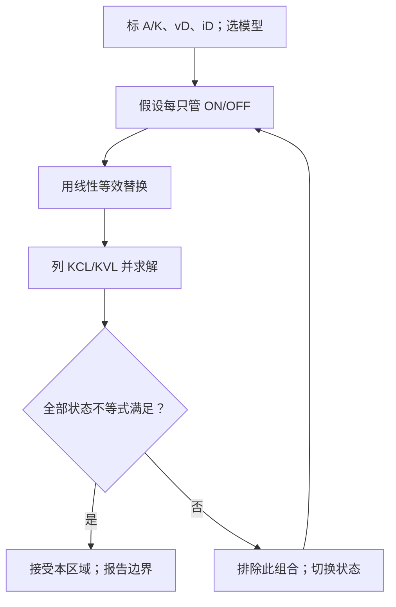

# 第 2 章　二极管与半导体基础

二极管是本书遇到的第一个非线性器件。本章不把它当成“只许一个方向通电”的黑盒，而是沿着统一链条回答：**假设 → 模型 → 变量与参考方向 → 基本方程 → 求解 → 量纲检查 → 极限检查 → 失效条件**。你既要会解释 PN 结为什么整流，也要会在电路里选模型、假设状态并检查结果。

!!! important "冲刺必会"

    先掌握所有 **P0**：PN 结偏置、四类大信号模型、二极管状态判断、整流/限幅/钳位和击穿限流。最低过关线是能在图上标出 $v_D=v_A-v_K$ 与 $i_D$，并对每个假设写出检查不等式。

!!! tip "面试加分"

    不要把“硅管压降为 $0.7\ \mathrm V$”说成材料定律。先说明所选模型，再解释它是指数特性在有限电流范围内的工程近似，最后主动补温度、频率和额定值边界。

!!! note "考后深入"

    费米能级、载流子统计、连续性方程和半导体工艺只用于加深物理图像；冲刺轨不重复一门固体物理课程，也不靠这些内容完成基本电路计算。

## 1. 章节地图、学习结果与前置知识

先确认已掌握[第 1 章](01-最小电路基础.md)的参考方向、KCL/KVL、戴维南等效和一阶 RC 暂态。特别是：负电流表示实际方向与参考箭头相反，电容电压在有限电流下不能突变。


**图 2-1　章节知识依赖图。** 箭头表示后一个主题依赖前一个主题，不表示电流方向。

学完后，你应当能够：

1. 用“扩散—复合—空间电荷—内建电场—漂移平衡”解释 PN 结；
2. 统一使用阳极（anode，A）到阴极（cathode，K）的 $i_D$，以及 $v_D=v_A-v_K$；
3. 在理想、恒压降、分段线性、指数和小信号模型之间作有依据的选择；
4. 按状态假设算法求解含一个或多个二极管的电路，并检查全部状态不等式；
5. 画出半波整流、对称限幅和钳位电路的分段波形；
6. 说明反向漏电、击穿、电容、反向恢复、温度和额定值怎样使简化模型失效。

| 路线 | 阅读范围 | 一个月备考建议 |
|---|---|---|
| 冲刺轨 | 所有 P0、30 秒回答、四个例题、D-01～D-08 | 约 4 小时，分两次读；每题必须画参考方向并检查状态 |
| 深入轨 | 90 秒回答、费米能级、动态效应与全部追问 | P0 过关后再读，用来应对“为什么”和“何时失效” |

## 2. P0：载流子、能带与掺杂——电流由谁携带

### 2.1 从能带到电子—空穴对

孤立原子的电子能量取离散值；许多原子形成晶体后，相近能级展宽成允许能带。对纯净硅，低温时价电子主要占据**价带**，其上是可参与导电的**导带**，二者之间没有允许态的能量区称为禁带，宽度为带隙 $E_g$，单位电子伏特（eV）或焦耳（J）。室温硅的带隙约为 $1.12\ \mathrm{eV}$，这里的数值只用于建立尺度感。

```text
能量 E ↑
       │      导带：有电子时可导电      e⁻ 运动 →
 Ec ───┼────────────────────────────
       │          禁带 Eg = Ec − Ev
 Ev ───┼────────────────────────────
       │      价带：缺一个电子记作 h⁺  ← 空穴等效运动
       └────────────────────────────→ 位置 x
```

**图 2-2　最小能带图。** $E_c$、$E_v$ 分别是导带底和价带顶；纵轴是电子能量而不是电压。图中相邻价电子依次填空位，等效为空穴 $h^+$ 向电子相反方向移动。

温度高于绝对零度时，少量价带电子获得热能跃迁到导带，留下一个未占据的键态。这个“空位”称为空穴，带等效正电荷 $+q$；$q\approx1.602\times10^{-19}\ \mathrm C$ 是元电荷量。空穴不是凭空产生的正电子，而是大量价电子运动的集体、等效描述：相邻电子向左填补空位，看起来空位向右移动。

没有有意掺杂的材料称为**本征半导体**。热激发每产生一个导带电子就留下一个空穴，所以平衡时电子浓度 $n_e$ 与空穴浓度 $p_h$ 相等，均为本征浓度 $n_i$。这里浓度单位为 $\mathrm{m^{-3}}$ 或常见的 $\mathrm{cm^{-3}}$，下标用于避免把电子浓度 $n_e$ 与 Shockley 方程的理想因子 $n$ 混淆。

传统电流方向定义为正电荷运动方向。因此：

- 导带电子向左漂移，对应传统电流向右；
- 空穴向右运动，也对应传统电流向右；
- 电路图中的 $i$ 始终是传统电流，不跟随电子箭头。

### 2.2 掺杂怎样改变多数与少数载流子

向硅中加入能额外提供一个弱束缚价电子的施主杂质，形成 **n 型**材料；电子是多数载流子，空穴是少数载流子。加入容易接受一个价电子的受主杂质，形成 **p 型**材料；空穴是多数载流子，电子是少数载流子。整体晶体仍近似电中性：“n 型”不等于带负净电荷，“p 型”也不等于带正净电荷。

```text
                多数载流子                     少数载流子
 n 型硅：  施主 D → 释放 e⁻         e⁻ e⁻ e⁻ e⁻             h⁺
 p 型硅：  受主 A ← 接受 e⁻         h⁺ h⁺ h⁺ h⁺             e⁻
           掺杂前后体材料体区近似电中性；D⁺/A⁻ 被移动载流子补偿
```

**图 2-3　掺杂与载流子分类。** $D$、$A$ 分别表示施主、受主；多数/少数是浓度比较，不是说少数载流子为零。

### 2.3 分析链、检查与边界

- **假设：** 晶体接近热平衡、温度均匀，讨论低到中等电场下的定性输运。
- **模型：** 价带与导带由 $E_g$ 分开；热能产生电子—空穴对；浅能级掺杂在室温附近近似电离。
- **变量与参考方向：** $n_e,p_h$ 为电子、空穴浓度，单位 $\mathrm{m^{-3}}$；传统电流沿正电荷运动方向。
- **基本方程：** 本征材料中 $n_e=p_h=n_i$；一个电子—空穴对的净电荷为 $-q+q=0$。
- **求解：** 施主提高自由电子浓度形成 n 型；受主提高空穴浓度形成 p 型。载流子移动产生电流，但材料体区不因此永久积累净电荷。
- **量纲检查：** 浓度是“个数/体积”；$q n_e$ 的单位为 $\mathrm{C/m^3}$，是电荷密度而不是电流。
- **极限检查：** 当温度趋近 $0\ \mathrm K$ 时，热激发与杂质电离都会减弱；温度升高时本征载流子迅速增加，足够高时可能压过掺杂效应。
- **失效条件：** 强电场、极高掺杂、非平衡注入、量子限域或温度极端时，简单能带加多数/少数载流子图像不足。

### 适用边界

本节只为理解普通硅二极管提供最小物理基础，不从量子力学推导能带，也不计算迁移率、复合寿命。空穴是有效载流子，不能把它误说成真实的带正电基本粒子。

### 30 秒回答

“半导体的价带和导带由带隙分开。热激发把电子送入导带并在价带留下空穴；空穴是价电子集体运动的有效正载流子。施主掺杂形成 n 型，电子为多数载流子；受主掺杂形成 p 型，空穴为多数载流子。传统电流按正电荷方向定义，所以与电子运动方向相反、与空穴运动方向相同。”

### 90 秒回答

“纯净半导体中，热激发成对产生导带电子和价带空穴，所以本征平衡时 $n_e=p_h=n_i$。空穴不是一颗真实正粒子，而是相邻价电子依次填补空位后的有效描述，它带等效电荷 $+q$。施主提供额外电子形成 n 型，受主接受电子形成 p 型；多数和少数说的是浓度，材料整体仍近似电中性。电路中的参考电流遵循传统电流定义：电子向左漂移对应电流向右，空穴向右也对应电流向右。这个图像适用于普通温度和场强；极端温度、强场与高注入需要更完整的载流子输运模型。”

### 本节练习与递进追问

1. 画出一个价电子向左填补空位的三步示意图，并标出空穴的等效运动方向和传统电流方向。
2. 追问一：n 型材料为什么通常仍是电中性的？固定施主离子与移动电子分别在哪里？
3. 追问二：温度持续升高时，为什么“多数载流子浓度只由掺杂决定”的近似会逐渐失效？

#### 深入轨：费米能级只告诉我们什么

费米能级 $E_F$ 是平衡载流子占据概率的化学势参数。掺入施主通常使 $E_F$ 靠近导带，掺入受主通常使它靠近价带；它帮助定量连接掺杂与载流子浓度，但不是一条可直接拿万用表测量的“电子高度线”。面试若未追问统计物理，到这里即可。

## 3. P0：PN 结——从扩散到单向导电

### 3.1 接触以后：扩散建立自己的反向电场

把 p 型与 n 型材料形成连续结区。刚接触时，n 区电子浓度高、p 区电子浓度低，电子因浓度梯度由 n 向 p **扩散**；空穴由 p 向 n 扩散。它们越过结后与对方多数载流子复合，结附近留下不能自由移动的离化杂质：n 侧留下带正电的固定施主离子 $D^+$，p 侧留下带负电的固定受主离子 $A^-$。

这片缺少移动载流子的区域称为**耗尽区**或空间电荷区。固定离子产生从 n 侧正离子指向 p 侧负离子的内建电场 $\mathbf E_{bi}$。该电场驱使电子向 n 侧、空穴向 p 侧漂移，方向恰好反抗多数载流子的继续扩散。

```text
        p 区                  耗尽区                         n 区
  多数 h⁺          固定受主离子             固定施主离子         多数 e⁻
 h⁺ h⁺ h⁺       A⁻  A⁻  A⁻ │结│ D⁺  D⁺  D⁺       e⁻ e⁻ e⁻

 空穴扩散：        h⁺ ───────────────→
 电子扩散：                          ←─────────────── e⁻
 内建电场：                   ← E_bi（n → p）
 空穴漂移：                   ← h⁺
 电子漂移：                         e⁻ →
                       p 侧电势低      n 侧电势高
```

**图 2-4　零外加偏置下的 PN 结。** 扩散方向由浓度梯度决定；漂移方向由内建电场决定。平衡时两种电流的总和为零，并非载流子完全不动。

内建电势差记为 $V_{bi}$，单位 V；载流子跨结对应的势垒能量尺度为 $qV_{bi}$，单位 J。热平衡最终满足

\[
J_{\text{扩散}}+J_{\text{漂移}}=0,
\]

其中 $J$ 是电流密度，单位 $\mathrm{A/m^2}$。内建电压**不是一节可以从结两端自由取能、在平衡时测出的电池电压**：同一器件的接触区和外部测量端还存在相应的接触电势；沿完整平衡回路电势变化相互抵消，端口没有持续可用的电动势。

### 3.2 外加偏置怎样改变势垒

本章统一规定：二极管阳极 A 接 p 区，阴极 K 接 n 区；参考电流 $i_D$ 从 A 流向 K，电压

\[
v_D=v_A-v_K.
\]

```text
完整测试回路（同一参考定义）

                                  iD →
             ┌──────/\/\/ R─────● A ──|>|── K ●──┐
          +  │                    +   vD   −       │
 可调 Vs ( )                                      │
          −  │                                      │
             └──────────────────────────────────────┘

 正向偏置：Vs > 0，使 A 相对 K 为正；势垒降低、耗尽区变窄。
 反向偏置：反转 Vs 极性，使 A 相对 K 为负；势垒升高、耗尽区变宽。
```

**图 2-5　PN 二极管的端口方向与完整偏置回路。** 串联 $R$ 负责限制电流；符号竖线一侧是阴极 K。外加源必须通过返回导线构成闭合路径。

正向偏置 $v_D>0$ 时，外电场部分抵消内建场，势垒降低、耗尽区变窄，多数载流子越过结并在对侧成为少数载流子，扩散电流迅速增大。反向偏置 $v_D<0$ 时，外电场加强内建场，势垒升高、耗尽区变宽，多数载流子被拉离结区；仅有热产生的少数载流子形成很小的反向电流，直到击穿机制出现。

### 3.3 Shockley 方程与“0.7 V”从哪里来

在一维、稳态、低注入、结温均匀、尚未击穿，且串联电阻与产生—复合等非理想效应可忽略时，PN 二极管常用 Shockley 方程：

\[
i_D=I_S\!\left[\exp\!\left(\frac{v_D}{nV_T}\right)-1\right],
\qquad
V_T=\frac{kT}{q}\approx25.9\ \mathrm{mV}\quad(T=300\ \mathrm K).
\]

符号与单位：$i_D$ 为 A→K 的端口电流，单位 A；$v_D$ 为 A 相对 K 的电压，单位 V；$I_S$ 是强烈依赖器件面积、掺杂和温度的反向饱和电流，单位 A；$n$ 是无量纲理想因子，常在约 $1$ 到 $2$；$V_T$ 是热电压，$k\approx1.381\times10^{-23}\ \mathrm{J/K}$ 是玻尔兹曼常数，$T$ 是绝对温度（K）。

```text
 iD ↑
    │                               /
    │                            .´      正向：指数增长
    │                         .´
    │_______________________.______________________→ vD
    │      反向约 −IS      0       0.6~0.8 V 不是固定拐点
    │───────────────·
    │  击穿区 ←  .´
    ↓
       −VBR                （横纵轴均为定性、非等比例）
```

**图 2-6　二极管静态 $i_D$–$v_D$ 特性。** $V_{BR}>0$ 表示反向击穿电压的幅值；Shockley 式不描述图左侧击穿，也不包含大电流串联电阻效应。

量纲检查：$kT/q$ 的单位为 $\mathrm{J/C=V}$，故 $v_D/(nV_T)$ 无量纲，指数函数合法；右侧 $I_S$ 乘无量纲因子，结果单位为 A。极限检查：$v_D=0$ 时 $i_D=0$；$v_D\ll-nV_T$ 且未击穿时 $i_D\to-I_S$；$v_D\gg nV_T$ 时 $-1$ 可忽略，电流近似指数增长。

当 $v_D\gg nV_T$ 时，两点电流之比满足

\[
\frac{I_2}{I_1}\approx
\exp\!\left(\frac{V_2-V_1}{nV_T}\right),
\qquad
V_2-V_1\approx nV_T\ln\frac{I_2}{I_1}.
\]

因此正向电流改变一个数量级所需电压约为 $nV_T\ln10$，在 $300\ \mathrm K$ 时约 $59.6n\ \mathrm{mV}$。所谓硅管“$0.7\ \mathrm V$”只是某些器件、温度与毫安级电流附近的**恒压降模型参数**，不是一到 $0.7\ \mathrm V$ 才突然导通的恒定材料定律。

温度升高时 $V_T=kT/q$ 线性增加，同时 $I_S$ 通常更强烈地增加。因此在**固定正向电流**、普通硅结和常见电流范围内，正向压降常见温度系数约为 $-2\ \mathrm{mV/K}$；这不是所有器件、所有电流和所有温区的精确常数。

### 3.4 分析链、检查与边界

- **假设：** 突变 PN 结处于热平衡或准静态偏置，尚未进入击穿与显著自热。
- **模型：** 扩散留下空间电荷，内建场产生反向漂移；端口用 Shockley 式描述。
- **变量与参考方向：** A=p、K=n，$v_D=v_A-v_K$，$i_D$ 从 A 到 K。
- **基本方程：** 平衡时 $J_{\text{扩散}}+J_{\text{漂移}}=0$；偏置时 $i_D=I_S(e^{v_D/(nV_T)}-1)$。
- **求解：** 正向偏置降低势垒并使扩散电流指数增加；反向偏置提高势垒，电流在击穿前近似 $-I_S$。
- **量纲检查：** $v_D/(nV_T)$ 无量纲；$qV_{bi}$ 为 J；电流密度为 $\mathrm{A/m^2}$。
- **极限检查：** $v_D=0\Rightarrow i_D=0$；强反偏、未击穿时 $i_D\to-I_S$；升高正向电压使 $i_D$ 单调增加。
- **失效条件：** 击穿、大电流串联电阻、自热、高注入、快速开关与显著结电容时，静态 Shockley 模型不够。

### 适用边界

“正偏导通、反偏截止”是数量级近似，不表示正向电流在某阈值以下严格为零，也不表示反向电流永远为零。内建电势解释结区势垒，却不能当成外部可串联使用的电池。

### 30 秒回答

“PN 结刚形成时，多数载流子因浓度梯度跨结扩散并复合，留下固定离子，形成耗尽区和从 n 指向 p 的内建电场。这个场造成与扩散相反的漂移，平衡时两种电流抵消。正向偏置降低势垒、缩窄耗尽区，所以扩散电流指数上升；反向偏置提高势垒、加宽耗尽区，击穿前只剩很小的少数载流子电流。”

### 90 秒回答

“我先规定 A 是 p 侧、K 是 n 侧，$v_D=v_A-v_K$，$i_D$ 从 A 到 K。接触后电子由 n 向 p、空穴由 p 向 n 扩散和复合，留下 p 侧 $A^-$、n 侧 $D^+$，形成耗尽区。内建场从 n 指向 p，它驱动载流子漂移去反抗扩散；平衡不是没有载流子运动，而是净电流为零。正偏抵消一部分内建场，势垒降低，于是 $i_D=I_S(e^{v_D/(nV_T)}-1)$ 近似指数增长；反偏增强势垒，击穿前电流约为 $-I_S$。$0.7\ \mathrm V$ 只是特定工作范围的恒压降近似。Shockley 式还要求低注入、温度均匀并忽略串联电阻、动态电容和击穿。”

### 本节练习与递进追问

1. 在图 2-4 上逐项说明：为什么固定离子的电场方向从 n 指向 p？它分别使电子和空穴向哪里漂移？
2. 追问一：热平衡时扩散和漂移都存在，为什么外部电流仍为零？
3. 追问二：若 $n=1.5$、温度为 $300\ \mathrm K$，正向电流增为原来的 10 倍，压降约增加多少毫伏？说明忽略 $-1$ 项的条件。

## 4. P0：五种模型、负载线与小信号

### 4.1 模型不是“谁更真”，而是谁足够回答问题

| 模型 | 端口关系（A→K） | 适合回答 | 典型失效方式 |
|---|---|---|---|
| 理想二极管 | ON：$v_D=0,i_D\ge0$；OFF：$i_D=0,v_D<0$ | 快速判断拓扑、波形形状 | 不能预测压降、微小电流、温漂和损耗 |
| 恒压降 | ON：$v_D=V_\gamma,i_D\ge0$；OFF：$i_D=0,v_D<V_\gamma$ | 硅管毫安级手算，常取 $V_\gamma=0.7\ \mathrm V$ | 把工作点相关压降误当常数；低电流/大电流/温变不准 |
| 分段线性 | ON：$v_D=V_\gamma+i_Dr_s,i_D\ge0$；OFF：$i_D=0,v_D<V_\gamma$ | 要估算导通斜率与大电流压降 | $V_\gamma,r_s$ 只在拟合区有效，不能描述反向与动态 |
| 指数模型 | $i_D=I_S(e^{v_D/(nV_T)}-1)$ | 求精确静态工作点、比较温度/电流数量级 | 可能需数值解；击穿、自热、串联电阻、高频时不够 |
| 小信号模型 | 偏置点附近 $\tilde v_d=r_d\tilde i_d$ | 叠加在直流偏置上的微小交流响应 | 不能替代大信号开关，也不能跨越很宽电压范围 |

其中 $V_\gamma$ 是等效开启压降，单位 V；$r_s$ 是导通段等效串联电阻，单位 $\Omega$。为使区域标签唯一，本章把交界等号统一归入 ON：理想模型在 $v_D=0,i_D=0$，恒压降和分段线性模型在 $v_D=V_\gamma,i_D=0$ 时均记为 ON；相应 OFF 区使用严格小于号。ON/OFF 是所选分段模型的区域标签，不是说真实载流子会在一个精确电压处突然出现或消失。

```text
端口 A→K：      A ●──|>|──● K       iD →，vD = vA − vK

 iD ↑                    iD ↑                    iD ↑
    │  理想 ON              │ 分段线性              │ 指数曲线
    │  │                    │        / 斜率 1/rs     │       .´
────┼──┼────→ vD        ────┼──────/────→ vD    ────┼───.´────→ vD
    │  0                    │    Vγ                 │
  OFF 沿负横轴           OFF 沿 vD<Vγ 横轴       反向约 −IS
```

**图 2-7　三种大信号特性的并列比较。** 各图横轴都是 $v_D$，纵轴都是 $i_D$；分段线性导通支路延长线在 $V_\gamma$ 处与横轴相交。

### 4.2 偏置点线性化：$r_d$ 不是 $V_D/I_D$

设直流偏置点为 $(V_D,I_D)$，叠加小变化

\[
v_D(t)=V_D+\tilde v_d(t),\qquad
i_D(t)=I_D+\tilde i_d(t).
\]

大写量表示直流/静态量，带波浪号的小写量表示增量。对 Shockley 式在偏置点作一阶泰勒展开：

\[
\tilde i_d\approx
\left.\frac{\mathrm di_D}{\mathrm dv_D}\right|_{V_D}\tilde v_d,
\]

\[
\frac{\mathrm di_D}{\mathrm dv_D}
=\frac{I_S}{nV_T}\exp\!\left(\frac{v_D}{nV_T}\right)
=\frac{i_D+I_S}{nV_T}.
\]

正向偏置且 $I_D\gg I_S$ 时，

\[
r_d\equiv\left(\left.\frac{\mathrm di_D}{\mathrm dv_D}\right|_{V_D}\right)^{-1}
\approx\frac{nV_T}{I_D},
\qquad
\tilde v_d=r_d\tilde i_d.
\]

$r_d$ 的单位为 $\mathrm{V/A=\Omega}$。例如 $T=300\ \mathrm K,n=1,I_D=1.00\ \mathrm{mA}$，有 $r_d=25.9\ \mathrm{mV}/1.00\ \mathrm{mA}=25.9\ \Omega$。它是曲线在偏置点的**切线斜率倒数**；直流电阻 $R_D=V_D/I_D$ 是原点到偏置点的割线斜率倒数。若 $V_D=0.700\ \mathrm V$，则 $R_D=700\ \Omega$，显然不等于 $25.9\ \Omega$。

量纲与极限检查：$nV_T/I_D$ 是 $\mathrm{V/A=\Omega}$；偏置电流增大时曲线变陡，所以 $r_d$ 应减小，公式一致；若 $I_D\to0$，近似式给出无穷大，但此时 $I_D\gg I_S$ 和该工作点附近的正向近似已可能失效，应回到精确导数。

### 4.3 负载线：器件方程与外电路方程的交点

把电源 $V_S$、电阻 $R$ 与二极管串联。KVL 给外电路线性约束

\[
i_D=\frac{V_S-v_D}{R}.
\]

它在 $i_D$–$v_D$ 平面上是一条斜率为 $-1/R$ 的直线；二极管曲线与负载线的交点就是同时满足器件与外电路方程的工作点 Q。

```text
完整回路                         iD ↑
             iD →                   │● Vs/R
       ┌──/\/\/ R──A |>| K──┐       │  \  外电路负载线
    +  │                     │       │    \      ● Q
 Vs( )                       │       │      \  .´ 二极管曲线
    −  │                     │       └───────●────────→ vD
       └─────────────────────┘               Vs
```

**图 2-8　串联二极管的完整回路与负载线。** 增大 $R$ 会让负载线绝对斜率变小；改变 $V_S$ 会移动截距，Q 点随之变化。

### 4.4 分析链、检查与边界

- **假设：** 先区分大信号静态/开关问题与偏置点附近的小交流问题。
- **模型：** 按所需精度选择理想、恒压降、分段线性或指数；只有先求出 Q 点才使用小信号模型。
- **变量与参考方向：** $v_D=v_A-v_K$，$i_D$ 从 A 到 K；$V_D,I_D$ 是总量的直流分量，$\tilde v_d,\tilde i_d$ 是增量。
- **基本方程：** 器件方程与 KCL/KVL 同时成立；$r_d=(\mathrm di/\mathrm dv)^{-1}$。
- **求解：** 负载线交点给 Q；对指数曲线在 Q 点一阶展开得 $r_d\approx nV_T/I_D$。
- **量纲检查：** 负载线两项都是 A；$r_d$ 和 $R_D$ 都是 $\Omega$，但几何定义不同。
- **极限检查：** $R\to\infty$ 时负载电流趋零；$I_D$ 增大时 $r_d$ 减小；增量趋零时一阶线性化误差相对减小。
- **失效条件：** 小信号幅度足以显著改变斜率、跨越截止/击穿，或频率高到结电容与载流子存储不可忽略时，纯电阻 $r_d$ 模型失效。

### 适用边界

模型选择由问题目标和允许误差决定。只问拓扑可用理想模型；要估压降可用恒压降/分段线性；要比较温度或数量级用指数模型；只有“直流偏置 + 足够小的交流扰动”才用小信号模型。

### 30 秒回答

“二极管模型要按问题选：理想模型判断通断，恒压降模型估算普通硅管压降，分段线性再加入导通斜率，Shockley 指数模型描述静态非线性。小信号电阻只能在已知偏置点附近使用，$r_d\approx nV_T/I_D$，是切线电阻，不是直流比值 $V_D/I_D$。工作点是二极管曲线和外电路负载线的交点。”

### 90 秒回答

“我先问这是大信号状态问题还是偏置点附近的小信号问题。大信号快速手算可选理想或恒压降；若导通压降随电流的变化不可忽略，用 $v_D=V_\gamma+i_Dr_s$；若要研究电流数量级和温度，用 Shockley 式。外电路 KVL 给一条负载线，和器件曲线的交点是 Q 点。小信号时写 $v_D=V_D+\tilde v_d$、$i_D=I_D+\tilde i_d$，在 Q 点一阶展开得到 $r_d=(\mathrm di/\mathrm dv)^{-1}\approx nV_T/I_D$。它与 $V_D/I_D$ 不同：前者是切线，后者是割线。若交流幅度大到斜率明显改变，或涉及截止、击穿和高频电容，就必须回到非线性或动态模型。”

### 本节练习与递进追问

1. $T=300\ \mathrm K,n=2,I_D=2.0\ \mathrm{mA}$ 时求 $r_d$；若另知 $V_D=0.68\ \mathrm V$，再求 $R_D$ 并解释差异。
2. 追问一：同一串联电路中 $V_S$ 不变而 $R$ 增大，负载线和 Q 点怎样移动？
3. 追问二：为什么不能把小信号 $r_d$ 直接拿来计算从 $0\ \mathrm V$ 加到 $0.8\ \mathrm V$ 的大信号导通过程？

## 5. P0：状态假设算法——先解线性电路，再审判假设

含理想、恒压降或分段线性二极管的电路，本质上是多个**候选线性区域**拼成的非线性问题。最可靠的手算顺序是：

1. **标参考：** 对每只二极管标 A、K、$v_D=v_A-v_K$、$i_D$（A→K），并标节点电压和源极性。
2. **选模型：** 写明理想、恒压降还是分段线性；不要算到一半换模型。
3. **假设状态/区域：** 每只管先假设 ON 或 OFF。$N$ 只二极管理论上最多有 $2^N$ 组，但可用对称性和明显极性先剪枝。
4. **替换器件：** 理想 ON 换短路；恒压降 ON 换成 A 到 K 的 $V_\gamma$ 压降；分段线性 ON 换 $V_\gamma+r_si_D$；OFF 换开路。
5. **列 KCL/KVL 求解：** 得到全部节点电压、支路电流。
6. **检查不等式：** 理想 ON 要 $i_D\ge0$、OFF 要 $v_D<0$；恒压降 ON 要 $i_D\ge0$、OFF 要 $v_D<V_\gamma$；分段线性 ON 还必须同时满足 $v_D=V_\gamma+i_Dr_s$ 与 $i_D\ge0$，OFF 则满足 $i_D=0,v_D<V_\gamma$。等号边界统一归入 ON，避免同一个解被重复归类。
7. **若矛盾就换状态：** 不是修改算出的负号，而是回到第 3 步选择另一候选区域；所有二极管同时满足才是自洽解。



**图 2-9　二极管状态分析闭环。** “求出一个数”不等于完成；检查假设是算法的一部分。

### 5.1 例题 A：串联电阻限流

已知 $V_S=5.0\ \mathrm V$、$R=1.00\ \mathrm{k\Omega}$，硅二极管采用 $V_\gamma=0.70\ \mathrm V$ 恒压降模型，求 $i_D$、电阻与二极管功率。

```text
                         iD →
             ┌────────/\/\/ R───● A ──|>|── K ●───┐
          +  │                     +  vD  −         │
       Vs( )                                       │
          −  │                                       │
             └───────────────────────────────────────┘
             Vs = 5.0 V，R = 1.00 kΩ，Vγ = 0.70 V
```

**图 2-10　带限流电阻的完整二极管回路。** 返回导线闭合；$i_D$ 流入二极管电压正端。

沿标准链分析：

- **假设：** 直流稳态，电源与电阻理想，二极管结温不因几毫瓦损耗显著改变。
- **模型：** 恒压降模型，先假设 D 为 ON，故 $v_D=0.70\ \mathrm V$。
- **变量与参考方向：** $i_D$ 顺时针，即 A→K；$v_D=v_A-v_K$。
- **基本方程：** KVL 为 $-V_S+i_DR+V_\gamma=0$。
- **求解：**

\[
i_D=\frac{V_S-V_\gamma}{R}
=\frac{5.0-0.70}{1.00\times10^3}
=4.30\ \mathrm{mA}.
\]

\[
P_R=i_D^2R=18.5\ \mathrm{mW},\qquad
P_D=V_\gamma i_D=3.01\ \mathrm{mW}.
\]

- **量纲检查：** $\mathrm{V/\Omega=A}$；$\mathrm{V\cdot A=W}$。电源提供 $V_Si_D=21.5\ \mathrm{mW}$，等于 $P_R+P_D=21.5\ \mathrm{mW}$（按给定位数）。
- **极限检查：** $R\to\infty$ 时 $i_D\to0$；$V_S\downarrow V_\gamma$ 时 $i_D\downarrow0$；去掉 $R$ 会使理想源和恒压降模型不能给出有限电流。
- **检查假设：** 算得 $i_D=4.30\ \mathrm{mA}\ge0$，ON 自洽。反若假设 OFF，则 $i_D=0$ 且 $v_D=V_S=5.0\ \mathrm V>V_\gamma$，与 OFF 条件矛盾。
- **失效条件：** 电流使实际压降偏离 $0.70\ \mathrm V$、电阻/二极管超额定、自热显著或电源有不可忽略内阻时要换模型。

若改用分段线性参数 $V_\gamma=0.65\ \mathrm V,r_s=10\ \Omega$，同一 KVL 给

\[
i_D=\frac{V_S-V_\gamma}{R+r_s}
=\frac{4.35\ \mathrm V}{1.01\ \mathrm{k\Omega}}
=4.31\ \mathrm{mA},
\]

且 $v_D=0.65\ \mathrm V+(4.31\ \mathrm{mA})(10\ \Omega)=0.693\ \mathrm V$。状态检查为 $i_D=4.31\ \mathrm{mA}\ge0$ 且 $v_D\ge V_\gamma$，所以分段线性 ON 假设自洽；若假设 OFF，则 $v_D=5.0\ \mathrm V\not<0.65\ \mathrm V$，故排除。这也说明“$0.7\ \mathrm V$”可以是局部拟合的结果，不是先验常数。

### 适用边界

状态算法适用于能被有限个分段区域描述的静态或逐时刻准静态电路。若使用指数模型，通常直接联立非线性方程或用负载线/数值迭代；若含电容，还必须加入初值和微分方程，不能只逐点猜状态。

### 30 秒回答

“解含二极管电路，我先标 A/K 和 $v_D,i_D$，声明模型，再假设每只管 ON 或 OFF，用相应线性等效替换，列 KCL/KVL 求解。最后检查：理想 ON 要 $i_D\ge0$、OFF 要 $v_D<0$；恒压降和分段线性 OFF 要 $v_D<V_\gamma$，ON 要 $i_D\ge0$。本章把等号边界归入 ON。任一不等式矛盾就排除该组合并换状态，全部同时满足才接受。”

### 90 秒回答

“多二极管问题不是凭感觉看通断，而是枚举候选区域。以恒压降模型为例，ON 时写 $v_D=V_\gamma$ 并在解后验证 $i_D\ge0$，OFF 时写 $i_D=0$ 并验证 $v_D<V_\gamma$。每组状态把非线性网络变成线性网络，可用 KCL/KVL 解；负的假设导通电流不是把箭头擦掉，而是证明该状态不自洽。$N$ 只管最多 $2^N$ 组，但明显反偏、对称性和前一时刻状态能剪枝。若用指数模型则联立器件方程与外电路，负载线交点给工作点；含电容还要保留电容电压连续性和动态方程。”

### 本节练习与递进追问

1. 将图 2-10 的电源改为 $0.50\ \mathrm V$，分别从 ON 与 OFF 假设出发，写出哪一个状态在哪条不等式上失败。
2. 追问一：两只串联同向二极管均取 $V_\gamma=0.70\ \mathrm V$，导通的电源门槛怎样变化？
3. 追问二：若两只二极管方向相反串联且均未击穿，在理想/恒压降模型下是否存在非零直流？说明每组状态为何自洽或矛盾。

## 6. P0：整流、限幅与钳位——波形被怎样改变

先用一句话区分三者：**整流**利用单向传导选择输入极性；**限幅（clipping）**把超过边界的部分削平；**钳位（clamping）**借助电容储能平移直流电平，理想情况下尽量保留峰峰值。钳位电路有时也被称为箝位器；本章统一写“钳位”。

### 6.1 例题 B：半波整流与门槛效应

输入为 $v_i(t)=5\sin(2\pi ft)\ \mathrm V$，负载 $R_L=1.00\ \mathrm{k\Omega}$，二极管采用 $V_\gamma=0.70\ \mathrm V$，忽略反向漏电且输出端无其他负载。

```text
                         iD →
             ┌──────────● A ──|>|── K ●────┬── vo(+)
          +  │                              /\/\/ RL
    vi(t)(~)                                 │
          −  │                              │
             └──────────────────────────────┴── 0 V (−)
```

**图 2-11　无滤波的串联半波整流器。** 输入源、二极管和负载形成闭合回路；$v_o$ 是负载上端相对返回节点的电压。

逐个输入时刻按状态求解：

- 假设 ON：$v_D=V_\gamma$，KVL 给 $v_o=v_i-V_\gamma$、$i_D=v_o/R_L$。检查 $i_D\ge0$ 得 $v_i\ge V_\gamma$。
- 假设 OFF：$i_D=0$，故 $v_o=0$；此时 $v_D=v_i-v_o=v_i$。检查 $v_D<V_\gamma$ 得 $v_i<V_\gamma$。

因此

\[
v_o(t)=
\begin{cases}
0, & v_i(t)<0.70\ \mathrm V,\\
v_i(t)-0.70\ \mathrm V, & v_i(t)\ge0.70\ \mathrm V.
\end{cases}
\]

输出峰值为 $5.0-0.70=4.30\ \mathrm V$，峰值负载电流为 $4.30\ \mathrm{mA}$。令 $\theta=2\pi ft$，正半周导通条件是 $5\sin\theta\ge0.70$，所以

\[
\theta_0=\sin^{-1}(0.70/5.0)=8.05^\circ,
\qquad
8.05^\circ\le\theta\le171.95^\circ.
\]

```text
 vi (V)
 +5       /\          /\
  0 _____/  \________/  \______→ t
 −5     /    \      /    \

 vo (V)       阈值后才出现，峰值 4.30 V
 +4.3      /\          /\
  0 ______/  \________/  \______→ t
          ↑  ↑
        8.05° 171.95°；整个负半周为 0
```

**图 2-12　半波整流输入/输出对齐波形。** 恒压降使输出降低 $0.70\ \mathrm V$，并使正半周靠近过零处也截止；不是完整正半周都导通。

量纲检查：$v_o/R_L$ 为 A，反三角函数的输入 $0.70/5.0$ 无量纲。极限检查：$V_\gamma\to0$ 时退化为理想半波 $v_o=\max(v_i,0)$、$\theta_0\to0$；若输入峰值小于 $V_\gamma$，输出全周期为零。失效条件：频率高时反向恢复和结电容会使换向不再瞬时；负载、电源内阻和温度也会改变波形。

### 6.2 例题 C：$\pm2.7\ \mathrm V$ 偏置对称限幅器

输入经 $R=1.00\ \mathrm{k\Omega}$ 接输出；输出无额外负载。上支路二极管 $D_+$ 的 A 在 $v_o$、K 接 $+2.0\ \mathrm V$，下支路 $D_-$ 的 A 接 $-2.0\ \mathrm V$、K 在 $v_o$。两管均用 $V_\gamma=0.70\ \mathrm V$。

```text
             R                         D+：A→K
 vi ●──────/\/\/──────● vo ───────A |>| K──● +2.0 V
    │                  │                         │
  + │                  │                       + │ 2 V
 (~) vi(t)             │                       ( )
  − │                  │                       − │
    │                  │                         └── 0 V
    │                  │
    │                  ● K ───────|<| A──● −2.0 V
    │                              D−       │
    │                                     − │ 2 V
    │                                     ( )
    │                                     + │
    └────────────── 0 V ────────────────────┘
```

**图 2-13　带独立参考源的对称限幅器。** 两个参考源都有到公共地的返回路径；$D_-$ 的导通电流从 $-2.0\ \mathrm V$ 节点经二极管流向 $v_o$，再经 $R$ 流向更负的输入源。

分三种候选区域：

1. 两管 OFF：输出无电流，$v_o=v_i$。检查 $D_+$ 有 $v_o-2.0<0.70$，$D_-$ 有 $-2.0-v_o<0.70$，合并得 $-2.70<v_i<2.70\ \mathrm V$。
2. $D_+$ ON、$D_-$ OFF：$v_o=2.0+0.70=2.70\ \mathrm V$，电流 $i_+=(v_i-2.70)/R\ge0$ 要求 $v_i\ge2.70\ \mathrm V$；另一只管确为反偏。
3. $D_-$ ON、$D_+$ OFF：$v_o=-2.0-0.70=-2.70\ \mathrm V$，电流大小 $i_-=(-2.70-v_i)/R\ge0$ 要求 $v_i\le-2.70\ \mathrm V$。

故边界处连续的传输特性为

\[
v_o=
\begin{cases}
-2.70\ \mathrm V, & v_i\le-2.70\ \mathrm V,\\
v_i, & -2.70\ \mathrm V<v_i<2.70\ \mathrm V,\\
2.70\ \mathrm V, & v_i\ge2.70\ \mathrm V.
\end{cases}
\]

例如 $v_i=4.00\ \mathrm V$，上管电流为 $(4.00-2.70)/1.00\ \mathrm{k\Omega}=1.30\ \mathrm{mA}\ge0$；$v_i=-4.00\ \mathrm V$ 时下管电流大小同为 $1.30\ \mathrm{mA}$。

```text
 传输 vo ↑                         时间波形（若 vi 峰值 ±4 V）
 +2.7 ─────────┐                  +2.7  ┌────┐        ┌────┐
               │ /                      /    \        /    \
      0 ───────┼/──────→ vi          0 ──────\______/──────\___→ t
              /│                             └────┘        └──
 −2.7 ───────┘ │                  −2.7    负峰同样削平
       −2.7  0  +2.7
```

**图 2-14　对称限幅器的分段传输与波形。** 传输中间斜率为 1、上下段斜率为 0；输出峰峰值被限制为约 $5.4\ \mathrm V$。

量纲检查：$(v_i-2.70)/R$ 为 A。极限检查：$V_\gamma\to0$ 时限幅电平变成参考源的 $\pm2.0\ \mathrm V$；参考源设为 $0$ 时变为约 $\pm0.70\ \mathrm V$ 的无偏置限幅。失效条件：负载会和 $R$ 分压，参考源非理想会移动限幅电平；实际管的指数转折使“平台”不是无限尖锐，过流仍会损坏器件。

### 6.3 例题 D：带负载的正向钳位器与实际下垂

输入 $v_i(t)=5\sin(2\pi\cdot10^3t)\ \mathrm V$，$C=1.00\ \mu\mathrm F$，$R_L=100\ \mathrm{k\Omega}$。二极管 A 接地、K 接输出，采用 $V_\gamma=0.70\ \mathrm V$；先假设电源内阻 $R_s=0$，且系统已经进入稳态周期。定义电容电压 $v_C=v_i-v_o$（左正右负），并规定 $i_C$ 的参考方向流入电容左侧正端；因此后文使用 $i_C=C\,\mathrm dv_C/\mathrm dt$。

```text
                         C          vo(+)
          vi ●─────────●─||─●────────●────┬──/\/\/──┐
             │         +  − vC             │    RL    │
           + │                              K          │
     vi(t)(~)                               |<| D      │
           − │                              A          │
             └──────── 0 V ─────────────────┴──────────┘
                         D 的 iD 方向：0 V（A）→ vo（K）
```

**图 2-15　正向钳位器的完整回路。** 当输出企图低于 $-0.70\ \mathrm V$ 时 D 导通；$R_L$ 同时提供关断期间电容缓慢放电的路径。

先看理想的“保持电荷”极限 $R_LC\gg T$：

1. 负峰附近 $v_i=-5.0\ \mathrm V$，若输出继续下降会使 $v_D=0-v_o\ge0.70\ \mathrm V$，故 D 导通并把 $v_o$ 近似钳在 $-0.70\ \mathrm V$。
2. 此时电容充到

\[
v_C=v_i-v_o=-5.0-(-0.70)=-4.30\ \mathrm V.
\]

3. 离开负峰后 D 截止，若 $v_C$ 一周期内近似不变，则

\[
v_o=v_i-v_C\approx v_i+4.30\ \mathrm V,
\]

所以输出约在 $-0.70\ \mathrm V$ 到 $9.30\ \mathrm V$ 之间，峰峰值仍约 $10.0\ \mathrm V$。它改变直流电平而不是削掉峰值。

```text
 vi (V)     +5       /\          /\
              0 ____/  \________/  \____→ t
             −5    /    \      /    \

 vo (V)    +9.3       /\          /\       理想保持
           +4.3 _____/  \________/  \____→ t
           −0.7  ●──        ●──              负峰被钳住

 实际 vo：正峰后基线缓慢下垂 ↘，下一负峰由 D 短暂补充电荷
```

**图 2-16　钳位前后波形及下垂方向。** 理想近似保留 $10\ \mathrm V$ 峰峰值；有限 $R_LC$ 使储存电压在两次补充之间衰减，输出不再是严格竖直平移。

这里周期 $T=1/f=1.00\ \mathrm{ms}$，关断时电容看到的近似时间常数

\[
\tau_{\text{off}}\approx(R_s+R_L)C=(0+100\ \mathrm{k\Omega})(1.00\ \mu\mathrm F)
=0.100\ \mathrm s=100T.
\]

因 $T/\tau=0.010\ll1$，保持近似合理。若用一个周期的指数衰减粗估储存电压变化，

\[
\Delta |v_C|\approx4.30\left(1-e^{-T/\tau}\right)
=4.30(1-e^{-0.010})\approx42.8\ \mathrm{mV}.
\]

这是下垂的数量级估算，不是精确波形；精确值要联立二极管有限导通时间、源内阻和负载电流求稳态周期解。若从未充电的 $v_C(0)=0$ 启动，第一个负峰经历充电暂态，不能把稳态公式提前用于整个第一周期。有限 $R_L$ 下，即使 D 尚未导通，关断段也满足 $R_LC\,\mathrm dv_C/\mathrm dt+v_C=v_i$，所以首次导通的精确输入值和时刻需由微分方程与切换条件共同求出；只有在 $R_L\to\infty$ 或首周期忽略负载电流的领先阶近似中，才能直接使用 $v_i=-V_\gamma$ 的启动阈值。

量纲检查：$RC$ 为 $\Omega\cdot\mathrm F=\mathrm s$；指数 $T/\tau$ 无量纲。极限检查：$R_LC/T\to\infty$ 时下垂趋零；$C\to0$ 时无法保持电荷，钳位作用消失；$V_\gamma\to0$ 时负峰趋于 $0\ \mathrm V$、正峰趋于 $10\ \mathrm V$。失效条件：$R_LC$ 不够大、源阻抗过大导致充电不足、频率高到反向恢复/电容寄生显著，或输出超出后级额定范围。

### 6.4 统一分析链与三类电路辨析

- **假设：** 半波整流和限幅按准静态恒压降模型逐时刻分析；钳位器还要求稳态周期且 $\tau_{\text{off}}\gg T$。
- **模型：** ON 为固定压降、OFF 为开路；钳位器增加 $i_C=C\,\mathrm dv_C/\mathrm dt$ 和电容电压连续性。
- **变量与参考方向：** 所有二极管均用 A→K 的 $i_D$ 和 $v_A-v_K$；输入/输出相对公共返回节点定义；钳位电容用 $v_C=v_i-v_o$。
- **基本方程：** 每一候选状态列 KCL/KVL；动态储能电路同时满足电容方程。
- **求解：** 整流得到 $\max(v_i-V_\gamma,0)$；对称限幅得到三段传输；钳位由导通时设定 $v_C$、关断时近似保持 $v_C$。
- **量纲检查：** 电流是 V/$\Omega$，时间常数是 $\Omega\cdot$F=s，导通角的反三角函数自变量无量纲。
- **极限检查：** $V_\gamma\to0$ 回到理想二极管；钳位的 $RC/T\to\infty$ 时峰峰值近似不变；输入未越过门槛时相应二极管始终 OFF。
- **失效条件：** 有限源阻抗、负载效应、反向漏电、动态电容、反向恢复、自热、击穿和额定值限制都会改变结果。

### 适用边界

这里的分段波形是周期稳态或逐时刻准静态结果。整流器若加滤波电容，就不再是图 2-12；钳位器若没有足够大的保持时间常数，就会明显下垂；限幅平台若接重负载，会被分压改变。

### 30 秒回答

“整流是选择输入极性，半波整流在 $v_i\ge V_\gamma$ 时输出 $v_i-V_\gamma$，其余为零。限幅器在信号越界时让二极管导通，把输出削在参考电平加二极管压降。钳位器则靠电容在某个峰值时充电、其余时间保持电压，从而平移波形的直流电平；理想情况下峰峰值不变，但有限 $RC$ 会下垂。”

### 90 秒回答

“三者都用状态假设，但功能和储能不同。无滤波半波整流在正半周超过 $V_\gamma$ 后导通，输出 $\max(v_i-V_\gamma,0)$，所以有门槛和导通角。偏置限幅器用参考源设边界，例如上管接 $+2\ \mathrm V$ 后在约 $+2.7\ \mathrm V$ 导通，下管在约 $-2.7\ \mathrm V$ 导通，中间区域输出跟随输入，超出部分被削平。钳位器含电容：负峰时二极管导通并设定电容电压，关断时若 $R_LC\gg T$，电荷近似保持，整个波形被平移。有限时间常数产生下垂，启动时还要考虑初始电压；高频时则要加入结电容和反向恢复。”

### 本节练习与递进追问

1. 把图 2-11 的二极管反向，仍定义 $v_o$ 为负载上端相对地；画一个周期输出并写分段式。
2. 追问一：图 2-13 若上参考源从 $+2.0\ \mathrm V$ 改为 $+1.0\ \mathrm V$，只有哪一段边界改变？输出还对称吗？
3. 追问二：图 2-15 若把二极管反向，稳态钳位电平、直流移动方向和峰值范围分别怎样变化？
4. 追问三：一个电路把峰峰值从 $10\ \mathrm V$ 压到 $5.4\ \mathrm V$，另一个近似保持 $10\ \mathrm V$ 但平均值改变；哪一个是限幅、哪一个是钳位？

## 7. P0：非理想效应、击穿与额定值

### 7.1 反向漏电与击穿：电压必须配合限流

Shockley 式在中等反偏下给 $i_D\approx-I_S$，但实际漏电还受表面缺陷、结面积、温度和制造工艺影响，通常随温度明显增大。它可能比理想化的 $I_S$ 大很多，因此高阻节点不能默认“反偏电流严格为零”。

当反向电压幅值接近 $V_{BR}$ 时，强电场可通过隧穿（常称齐纳机制）或碰撞电离（雪崩机制）使反向电流急剧增大。击穿本身不一定立刻破坏器件；真正危险的是**没有外部限流而导致结温和功耗失控**。专用稳压二极管（齐纳二极管）规定了击穿电压、测试电流和允许功耗，可在设计电流范围内反向工作；普通整流/开关二极管通常不保证重复击穿性能，不能因为“也会击穿”就拿来稳压。

```text
反向稳压的完整回路（电流按稳压支路方向标）

                         IZ →
       ┌──────/\/\/ R───● K ──|<|── A ●──┐
    +  │                 +   VZ   −        │
 VS( )                                      │
    −  │                                      │
       └──────────────────────────────────────┘
              二极管反向击穿；R 必须限流
```

**图 2-17　反向稳压二极管的安全限流回路。** 此处 $I_Z$ 是从 K 到 A 的反向电流大小，不沿本章 $i_D$ 的 A→K 正参考；因此器件参考电流为 $i_D=-I_Z$，参考电压 $v_D=-V_Z$。

例：$V_S=12.0\ \mathrm V$、$V_Z=5.1\ \mathrm V$，希望 $I_Z\approx5.0\ \mathrm{mA}$，忽略动态电阻，则

\[
R=\frac{V_S-V_Z}{I_Z}
=\frac{6.9\ \mathrm V}{5.0\ \mathrm{mA}}
=1.38\ \mathrm{k\Omega}.
\]

若选 $1.50\ \mathrm{k\Omega}$，实际 $I_Z=4.60\ \mathrm{mA}$，$P_Z=V_ZI_Z=23.5\ \mathrm{mW}$，$P_R=I_Z^2R=31.7\ \mathrm{mW}$。两者之和 $55.2\ \mathrm{mW}$ 与电源输出 $12.0\times4.60=55.2\ \mathrm{mW}$ 一致。若有负载并联在稳压管两端，还必须从串联电流中减去负载电流，按电源和负载的最坏组合检查 $I_{Z,\min}$ 与 $I_{Z,\max}$。

### 7.2 结电容、扩散电容与反向恢复

耗尽区相当于两侧导电区夹着绝缘/低载流子区域，因而具有**结电容** $C_j$。反向偏置增大时耗尽区变宽，$C_j$ 通常减小；常用经验式为

\[
C_j(V_R)=\frac{C_{j0}}{(1+V_R/\Phi_0)^m},
\]

其中 $V_R=-v_D\ge0$ 是反偏幅值，单位 V；$C_{j0}$ 是零偏结电容，单位 F；$\Phi_0$ 是拟合电势参数，单位 V；$m$ 是无量纲指数。该式是器件数据手册工作区内的近似，不应外推到击穿。

正向导通时，注入到中性区的少数载流子形成存储电荷 $Q_s$，电流改变会表现为**扩散电容**。粗略地，若载流子存储时间为 $\tau_F$，则

\[
C_d\approx\tau_F\frac{\mathrm d i_D}{\mathrm d v_D}
\approx\frac{\tau_F I_D}{nV_T}.
\]

电路从正向导通突然切到反偏时，必须先抽走这些存储电荷，反向电流才降到漏电水平，这段过程称为**反向恢复**。反向恢复时间记为 $t_{rr}$。令 $t_1$ 为正向电流过零、开始出现恢复反向电流的时刻，$t_2$ 为数据手册按规定阈值或外推法认定恢复结束的时刻；若 $i_{R,\text{leak}}$ 是稳态反向漏电基线，则恢复电荷可写为

\[
Q_{rr}=\int_{t_1}^{t_2}\left|i_R(t)-i_{R,\text{leak}}\right|\,\mathrm dt,
\]

单位 C。这样积分只计入反向恢复的超额电流，不把恢复后的稳态漏电无限累加；实际比较器件时应遵从对应数据手册对 $t_1,t_2$ 与基线的具体定义。

```text
 iD ↑
 IF │──────────────┐  换向命令
    │              │
  0 ┼──────────────┼────────────────────────→ t
    │              └──────\____
    │                  反向抽取 \____  回到漏电
−IR │                    <--- trr --->
                         阴影面积量级 = Qrr
```

**图 2-18　二极管反向恢复电流波形。** $I_F$ 是换向前正向电流，$I_R$ 是反向恢复电流的幅值示意；实际波形由器件、正向电流、反向驱动和温度共同决定。

当开关周期 $T_s$ 不再远大于 $t_{rr}$，或结电容阻抗 $1/(2\pi fC_j)$ 已与电路电阻同量级时，理想“瞬时开/关”会严重失真并增加损耗、电磁干扰。选型应查看数据手册而不是只凭“二极管”三个字。

### 7.3 温度、功率与数据手册额定值

在固定正向电流、普通硅 PN 结和常见工作区，正向压降常见约 $-2\ \mathrm{mV/K}$：温度升高，达到同一电流所需 $v_D$ 往往降低。但在极低电流、很高电流、自热明显、不同材料或不同器件结构下，数值和甚至主导机制会改变。固定**电压**时，指数特性可能使电流随温度大幅上升，不能把“负温度系数”简化成永远安全。

设计至少检查：

- 最大重复反向电压 $V_{RRM}$ 或峰值反向电压（PIV），必须高于电路最坏反偏并留裕量；
- 平均正向电流 $I_{F(AV)}$ 是规定波形与散热条件下的周期平均值；均方根正向电流 $I_{F(RMS)}$ 约束稳态导通发热；重复峰值正向电流 $I_{FRM}$ 允许按规定占空比反复出现；非重复浪涌电流 $I_{FSM}$ 只适用于数据手册规定的单次/少次数脉冲波形、持续时间、初始结温和冷却条件。这些额定量不能互相替代；
- 最大功耗 $P_D$ 与最高结温 $T_{j,\max}$；稳态热近似可写 $T_j\approx T_A+P_D\theta_{JA}$。$T_A,T_j$ 是温度，可统一用 $^\circ\mathrm C$ 或 K 表示；$P_D\theta_{JA}$ 是温升，温升可用 $^\circ\mathrm C$ 或 K 表示（两者数值相同）。热阻 $\theta_{JA}$ 相应使用 $^\circ\mathrm C/W$ 或 $\mathrm{K/W}$；
- 反向恢复、结电容、封装寄生和脉冲降额；峰值没超额定也不代表平均温升一定安全。

### 7.4 分析链、检查与边界

- **假设：** 数据手册额定值对应规定散热、波形、温度和测试条件，不是脱离条件的保证。
- **模型：** 静态加入漏电/击穿及串联限流；动态加入 $C_j,C_d,t_{rr}$；热模型用功耗和热阻估算结温。
- **变量与参考方向：** 本章 $i_D$ 仍取 A→K；稳压应用常把 K→A 的电流大小另记为 $I_Z=-i_D>0$。
- **基本方程：** $P=vi$、KCL/KVL、$i_C=C\,\mathrm dv/\mathrm dt$、$T_j\approx T_A+P_D\theta_{JA}$。
- **求解：** 对电源/负载/温度的最坏组合分别算反压、电流、功耗、结温和开关时间尺度，而不是只算“典型值”。
- **量纲检查：** $Q_{rr}$ 为 $\mathrm{A\cdot s=C}$；$P_D\theta_{JA}$ 为 $\mathrm W\cdot{}^\circ C/W={}^\circ C$ 温升；$1/(fC)$ 为 $\Omega$。
- **极限检查：** 限流 $R\to\infty$ 时击穿电流趋零；$f\to0$ 时电容和恢复效应减弱；$P_D\to0$ 时结温趋近环境温度。
- **失效条件：** 脉冲热阻、热失控、寄生电感、非正弦波与制造离散性显著时，需要数据手册曲线、瞬态热模型或实测，而非单一典型参数。

### 适用边界

典型值只用于估算，额定最大值不是推荐工作点。普通二极管进入未保证的反向击穿可能产生局部热点；专用稳压管也必须限流、降额，并满足最小稳压电流和最大功耗。

### 30 秒回答

“反偏并非绝对零电流；漏电随器件和温度变化。达到击穿后电流会急增，是否损坏取决于外部限流和功耗。齐纳管规定了反向工作区，普通二极管通常没有这种保证。高频还要考虑结电容、扩散电容和反向恢复，选型同时检查反压、电流、功耗、结温与开关参数。”

### 90 秒回答

“击穿是强电场导致隧穿或雪崩倍增，器件端电压变化不大而反向电流急增。它不是天然稳压源：必须用串联电阻或恒流源限制电流，并在电源、负载和温度最坏情况下验证最小稳压电流、最大电流和 $P_Z=V_ZI_Z$。普通管未必允许重复击穿，专用齐纳管才给出相应规格。动态上，反偏耗尽区形成随偏压变化的结电容，正偏少数载流子存储形成扩散电容；换向时要先抽走存储电荷，产生 $t_{rr}$ 和 $Q_{rr}$。热上还要用 $T_j\approx T_A+P_D\theta_{JA}$ 检查结温；固定电流下硅管压降常约每 K 降 $2\ \mathrm{mV}$，但这只是有限工作区的典型趋势。”

### 本节练习与递进追问

1. 图 2-17 中若误把 $1.50\ \mathrm{k\Omega}$ 换成理想导线，器件模型和外电路分别试图规定什么量？为什么不能得到安全有限电流？
2. 追问一：同一二极管的反向偏置加大，耗尽区宽度和结电容分别怎样变化？
3. 追问二：一个二极管静态电流额定足够，为什么仍可能不适合 $10\ \mathrm{MHz}$ 开关电源？至少说出两个动态参数。
4. 追问三：两只普通硅二极管直接并联均流时，温升为什么可能使电流分配更不均？

## 8. 面试高频口答索引

下面不是新知识，而是把本章结论压缩成“结论—理由—边界”。练习时先遮住右两列，出声回答。

| 问题 | 30 秒回答要点 | 90 秒回答扩展 |
|---|---|---|
| 为什么正向偏置会导通？ | 正偏部分抵消内建场，势垒降低、耗尽区变窄，多数载流子扩散电流指数增加。 | 补上接触后的扩散、复合、固定离子、漂移—扩散平衡，再写 $i_D=I_S(e^{v_D/(nV_T)}-1)$ 及低注入/未击穿边界。 |
| 硅管压降是恒定 $0.7\ \mathrm V$ 吗？ | 不是；它是特定电流和温度附近的恒压降近似。 | 用每十倍电流约增加 $nV_T\ln10$ 说明曲线斜率；补大电流串阻、固定电流下约 $-2\ \mathrm{mV/K}$ 的有限边界。 |
| 多只二极管怎样判状态？ | 假设 ON/OFF，换模型，列 KCL/KVL，检查每只管的电流和电压不等式，矛盾就换组合。 | 明确理想/恒压降各自条件，说明 $2^N$ 候选可通过极性与对称性剪枝；含电容时还要保留状态和初值。 |
| 整流、限幅、钳位有何区别？ | 整流选择极性，限幅削掉越界部分，钳位借电容平移直流电平。 | 分别给 $\max(v_i-V_\gamma,0)$、三段限幅传输、$v_o\approx v_i-v_C$；补钳位 $RC\gg T$、下垂和启动暂态。 |
| 什么是二极管小信号电阻？ | Q 点附近 $r_d=(\mathrm di/\mathrm dv)^{-1}\approx nV_T/I_D$，是增量切线电阻。 | 区分 $v_D=V_D+\tilde v_d$ 和 $R_D=V_D/I_D$；说明信号太大、跨区域或高频时不能只用 $r_d$。 |
| 击穿是否一定损坏二极管？ | 不一定；关键是是否限流并满足功耗/结温额定。 | 区分专用齐纳管与普通管，写 $R=(V_S-V_Z)/I_Z$，再检查电源/负载最坏情况、$P_Z$、$V_{RRM}$ 和热阻。 |

### 适用边界

口答模板用于组织答案，不替代题图和假设。若面试官改变器件材料、温度、频率、负载或参考方向，应回到模型与方程重新判断，不要机械复述结论。

## 9. 章末概念检查表

在进入晶体管章节前，逐项确认自己能**画图、列式并口述边界**：

- [ ] 能标 A=p、K=n、$v_D=v_A-v_K$、$i_D$ 从 A 到 K；
- [ ] 能解释空穴、传统电流方向及 n/p 型的多数/少数载流子；
- [ ] 能画出扩散、固定离子、内建场与漂移方向，并说明内建电压不是可用电池；
- [ ] 能写 Shockley 方程，定义 $I_S,n,V_T,k,T,q$ 和适用条件；
- [ ] 能说明 $0.7\ \mathrm V$ 是模型，并比较五种模型的选用场景；
- [ ] 能由导数推出 $r_d\approx nV_T/I_D$，并区分总量、增量和 $V_D/I_D$；
- [ ] 能按“假设—替换—求解—不等式检查”处理多二极管状态；
- [ ] 能画半波整流、对称限幅和有下垂的钳位波形；
- [ ] 能区分反向漏电、可控击穿与无保护过流；
- [ ] 能检查结电容、反向恢复、温度、反压、电流、功耗与结温额定。

## 10. 常见错误与快速纠正

| 常见错误 | 为什么错 | 快速纠正 |
|---|---|---|
| 把阴极箭头方向当电流方向 | 二极管符号没有箭头；竖线标 K，传统正向电流 A→K | 每次在图旁写 $v_A-v_K$ 与 A→K |
| 说“低于 $0.7\ \mathrm V$ 完全没电流” | 真实特性连续且近似指数 | 先声明恒压降模型；问物理时回到 Shockley 式 |
| ON 假设算出负电流仍接受 | 负值违反 ON 区域条件 | 写完方程必须把结果代回状态不等式 |
| 只判断一只管，不检查其余管 | 多器件状态必须同时自洽 | 为每只管列一行 ON/OFF 检查表 |
| 把 $r_d$ 当 $V_D/I_D$ | 一个是局部切线，一个是原点割线 | 先写总量加增量，再在 Q 点求导 |
| 把限幅与钳位混为一谈 | 限幅改变峰峰值，钳位主要移动直流电平 | 看是否有储能电容，并比较输入/输出峰峰值 |
| 击穿时只算电压不算电流 | 无限流时功耗与结温可能失控 | 同时算串联电阻、最坏 $I_Z$、$P_Z$ |
| 用直流模型分析高速开关 | 忽略 $C_j,C_d,t_{rr},Q_{rr}$ | 比较信号周期、RC 与反向恢复时间尺度 |
| 用典型温度系数替代热设计 | $-2\ \mathrm{mV/K}$ 有工作区边界且存在自热反馈 | 查数据手册曲线并验证 $T_j$ 与降额 |

## 11. 章末练习（恰好 8 题）

只列题目，不给完整答案。每题先写“假设 → 模型 → 变量与参考方向 → 基本方程 → 求解 → 量纲检查 → 极限检查 → 失效条件”，再核对链接中的解答。更多同类题见[练习题总表](../exercises/练习题.md)。

### D-01　从载流子到端口方向

在一张图上画出零偏 PN 结的 p/n 区、$A^-/D^+$、耗尽区、$\mathbf E_{bi}$、电子/空穴扩散及漂移方向；另在外部导线上标 A→K 的传统电流。解释平衡时为何净电流为零，以及为何不能把 $V_{bi}$ 当成外接电池。假设室温、热平衡、无外加偏置，不要求载流子浓度数值。[详细解答](../exercises/详细解答.md#d-01)｜[题库同类题](../exercises/练习题.md)

### D-02　分段线性串联限流

$V_S$ 从 $-1.0\ \mathrm V$ 缓慢扫描到 $5.0\ \mathrm V$，经 $R=820\ \Omega$ 接二极管后返回电源；A 接电阻、K 接返回端，$i_D$ 取 A→K。采用分段线性模型：OFF 为 $i_D=0,v_D<0.60\ \mathrm V$；ON 为 $v_D=0.60\ \mathrm V+i_D(20\ \Omega),i_D\ge0$，等号边界归入 ON。求 $i_D(V_S)$、$v_D(V_S)$ 的分段式并检查交界连续性；假设直流稳态、无击穿、自热可忽略。[详细解答](../exercises/详细解答.md#d-02)｜[题库同类题](../exercises/练习题.md)

### D-03　画带门槛的负半波整流波形

把图 2-11 的二极管反向，输入 $v_i(t)=4\sin(2\pi\cdot1\,000t)\ \mathrm V$，$R_L=2.0\ \mathrm{k\Omega}$，恒压降 $V_\gamma=0.65\ \mathrm V$，输出仍取负载上端对地。**画出至少一个完整周期的分段输入/输出波形**，标峰值、零电平、导通起止角，并写 $v_o(v_i)$；假设无滤波电容、稳态周期、源内阻为零、无击穿。[详细解答](../exercises/详细解答.md#d-03)｜[题库同类题](../exercises/练习题.md)

### D-04　画非对称偏置限幅波形

按图 2-13 拓扑，把上参考改为 $+1.5\ \mathrm V$、下参考保持 $-2.0\ \mathrm V$；$R=1.0\ \mathrm{k\Omega}$，两管均取 $V_\gamma=0.65\ \mathrm V$。输入为在 $\pm4.0\ \mathrm V$ 间线性变化、周期 $1.0\ \mathrm{ms}$ 的对称三角波；定义 $v_i(0)=-4.0\ \mathrm V$ 且最初线性上升，在 $0.50\ \mathrm{ms}$ 到达 $+4.0\ \mathrm V$，随后线性下降。**画传输特性和从 $t=0$ 起两周期的分段输出波形**，标出每次换区的绝对时刻，并求输入峰值处两管电流；假设输出空载、参考源理想、准静态。[详细解答](../exercises/详细解答.md#d-04)｜[题库同类题](../exercises/练习题.md)

### D-05　画启动与稳态钳位波形

按图 2-15，$v_i(t)=3\sin(2\pi\cdot500t)\ \mathrm V$，$C=0.47\ \mu\mathrm F$，$V_\gamma=0.65\ \mathrm V$，定义 $v_C=v_i-v_o$；已知接通前 $v_C(0^-)=0$，且 $v_i(0)=0$ 后先上升。假设源内阻为零、无反向恢复。分开完成以下两问：

**A. 无负载首周期状态。** 为隔离启动机制，本问取 $R_L\to\infty$，等价于在首周期忽略负载电流。首次负半周中，输入降到 $v_i=-V_\gamma=-0.65\ \mathrm V$ 时 D 开始 ON；输入继续下降到第一负峰期间 D 保持 ON，并有 $v_o=-V_\gamma$、$v_C=v_i+V_\gamma$。用 $i_D=-C\,\mathrm dv_C/\mathrm dt$ 说明到第一负峰时 $i_D=0$，处于 ON/OFF 边界；输入随后上升时 D 转为 OFF。按此状态序列**画第一个周期的分段波形**，标出导通起点、第一负峰和关断方向。

**B. 有限负载稳态下垂。** $R_L=220\ \mathrm{k\Omega}$ 只在本问恢复，并假设电路已进入稳态周期、$\tau=R_LC\gg T$。画出带轻微下垂的稳态周期波形，计算 $\tau/T$，再用 $\Delta|v_C|\approx(3.0-0.65)[1-\exp(-T/\tau)]\ \mathrm V$ 估计一周期下垂量级。本问采用高时间常数近似，不把 A 问的首次导通阈值或时刻当作有限 $R_L$ 下的精确值；若要求精确启动过程，需在 D 为 OFF 时求解 $R_LC\,\mathrm dv_C/\mathrm dt+v_C=v_i$ 并结合切换条件。[详细解答](../exercises/详细解答.md#d-05)｜[题库同类题](../exercises/练习题.md)

### D-06　两只二极管的状态枚举

一个理想电压源 $V_S$ 经 $1.0\ \mathrm{k\Omega}$ 接空载节点 $v_o$。$D_1$ 的 A 接 $v_o$、K 接理想 $+1.0\ \mathrm V$ 参考；$D_2$ 的 A 接地、K 接 $v_o$。两管均用 $V_\gamma=0.70\ \mathrm V$，参考源都返回公共地。对 $V_S=-2.0,0.50,3.0\ \mathrm V$ 分别列出四种 ON/OFF 组合，排除矛盾组合，求 $v_o$ 与所有导通电流；假设直流稳态、无击穿。[详细解答](../exercises/详细解答.md#d-06)｜[题库同类题](../exercises/练习题.md)

### D-07　直流电阻与小信号电阻

某硅二极管在 $T=300\ \mathrm K$ 的偏置点为 $I_D=2.00\ \mathrm{mA},V_D=0.680\ \mathrm V$，理想因子 $n=1.50$。一个幅值 $10.0\ \mathrm{mV}$ 的小信号电压源经 $R_s=100\ \Omega$ 驱动该已由理想偏置网络保持的工作点，输出取二极管增量电压。求 $R_D=V_D/I_D$、$r_d$ 和小信号输出幅值，并用 $|\tilde v_d|/(nV_T)$ 评价线性化是否充分小；假设偏置网络对交流不加载、忽略结电容。[详细解答](../exercises/详细解答.md#d-07)｜[题库同类题](../exercises/练习题.md)

### D-08　齐纳稳压的最坏情况限流

理想齐纳管 $V_Z=5.1\ \mathrm V$ 与 $R_L=1.00\ \mathrm{k\Omega}$ 并联，输入 $V_S$ 经串联电阻 $R$ 供电；$V_S$ 在 $10.0$～$14.0\ \mathrm V$ 之间，要求稳压时 $2.0\ \mathrm{mA}\le I_Z\le20.0\ \mathrm{mA}$。求 $R$ 的允许范围，判断 $470\ \Omega$ 是否满足，并在最坏电源下计算齐纳管、电阻功耗；假设直流稳态、齐纳动态电阻为零、负载恒定，明确 K→A 的 $I_Z$ 与 A→K 的 $i_D$ 符号关系。[详细解答](../exercises/详细解答.md#d-08)｜[题库同类题](../exercises/练习题.md)

完成后不要只对数值：把错因写成“参考方向、模型选择、方程、状态检查、动态初值、额定值”之一，再回到对应小节复述一次边界。
