# 第 3 章　BJT 与 MOSFET

晶体管不是“自动放大”的三端黑盒。本章只建立器件层面的主线：先用直流偏置把器件放在合适工作区，再把非线性特性在静态工作点 Q 附近局部线性化，微小增量才可能获得近似线性的受控变化。共射、共源等完整放大拓扑留到[第 4 章](04-基本放大电路.md)。

!!! important "冲刺必会"

    先学所有 **P0**，并对每个直流电路执行“假设工作区 → 选模型 → 求解 → 检查工作区 → 矛盾则换区”。最低过关线是：能定义全部端口方向，能判断 BJT/MOSFET 工作区，能求两类偏置 Q 点，能从 Q 点推出 \(g_m,r_\pi\) 或 \(g_m\)，并说清小信号模型边界。

!!! tip "面试加分"

    不要无条件说“BJT 是电流控制、MOSFET 是电压控制”。更严谨的说法是：在所选静态模型中，BJT 的集电极电流主要由 \(V_{BE}\) 的指数关系决定，\(\beta I_B\) 是正向有源区的端口近似；增强型 MOSFET 的漏电流主要由栅源过驱动和漏源电压决定，理想直流栅电流近零。小信号时二者都可写成跨导受控电流源。

!!! note "考后深入"

    Early 效应、沟道长度调制、体效应和反向有源区放在深入轨。高速寄生电容、噪声、击穿、功率器件、短沟道效应和完整放大器频率响应不在本章主线内。

!!! abstract "第一次阅读：每次只回答两个问题"

    对 BJT：两个 PN 结各是什么偏置？对 NMOS：$V_{GS}$ 是否超过阈值，且 $V_{DS}$ 与 $V_{OV}$ 谁大？先用这两个问题判工作区，再学习偏置与小信号。标题含“第二遍”的分析链、边界、参数敏感性和 90 秒展开可以后读。

## 1. 章节地图、学习结果与双轨路线

前置知识是[第 1 章](01-最小电路基础.md)的 KCL/KVL 与戴维南等效，以及[第 2 章](02-二极管与半导体基础.md)第 4 节的偏置点与切线小信号思想、PN 结偏置、指数方程和状态假设算法。本章会把“曲线在 Q 点用切线近似”的方法完整应用到 BJT 与 MOSFET，不假定第 1 章已经讲过器件线性化。默认温度 \(T=300\ \mathrm K\)，因此热电压

\[
V_T=\frac{kT}{q}\approx25.9\ \mathrm{mV}.
\]

~~~mermaid
flowchart TD
    A["PN 结与状态假设"] --> B["NPN 载流子输运"]
    B --> C["BJT 工作区与直流偏置"]
    C --> D["Q 点局部线性化"]
    A --> E["增强型 NMOS 场控沟道"]
    E --> F["MOS 工作区与直流偏置"]
    F --> G["Q 点局部线性化"]
    D --> H["BJT / MOS 严谨比较"]
    G --> H
    H --> I["第 4 章：基本放大电路"]
~~~

**图 3-1　器件层知识地图。** 箭头表示知识依赖，不表示载流子或端口电流方向。

学完后，你应当能够：

1. 从 NPN 结构解释发射极、基极、集电极的分工，而不把“基极电流导致集电极电流”当成微观因果；
2. 区分恒成立的 \(I_E=I_B+I_C\)、正向有源近似 \(I_C\approx\beta I_B\) 与输运指数式；
3. 用两个 PN 结的偏置判断 BJT 截止、正向有源和饱和，并检查假设；
4. 用基极固定偏置和分压—发射极电阻偏置求 Q 点，解释负载线、\(\beta\) 与温度敏感性；
5. 在 Q 点推出 BJT 的 \(g_m,r_\pi,r_e\)；
6. 从绝缘栅、耗尽、反型和沟道形成解释增强型 NMOS；
7. 用长沟道平方律判断 NMOS 截止、三极管区和饱和区，并验证边界连续；
8. 求两类 NMOS 偏置 Q 点，在 NMOS 饱和区推出 \(g_m\)，并说明 \(r_o\) 与体效应的边界；
9. 用端口控制关系、输入电流、跨导、阻抗和非理想参数比较 BJT 与 MOSFET。

| 路线 | 阅读范围 | 一个月备考动作 |
|---|---|---|
| 第一遍 | 所有 P0、四个完整直流例题、每类至少 3 个代表状态案例、30 秒回答，以及 T-01～T-14 中标为 P0 的题 | 7～9 小时，分 4～5 次；每次计算都写工作区检查 |
| 完整掌握 | 十二个状态案例全做、90 秒回答、Early 效应、沟道长度调制、体效应、反向有源与全部追问 | 合计约 14～18 小时；以陌生偏置电路能独立判区为准 |

本章所谓“放大”始终是两步：**偏置**建立非零 Q 点；**局部线性化**把 Q 点附近的非线性曲线换成切线。没有偏置，信号很容易跨区；增量太大，切线也不再代表曲线。

## 2. P0：NPN 的结构、输运与三种电流关系

!!! abstract "先分清恒等式与区域模型"

    $I_E=I_B+I_C$ 来自 KCL，跨工作区仍成立；$I_C\approx\beta I_B$ 只在正向有源区近似成立；指数式解释 $V_{BE}$ 怎样控制注入。第一次不要把三者当成可以无条件同时使用的公式。

### 2.1 三个区域与两个 PN 结

典型 NPN 由重掺杂 \(n^+\) 发射区、很薄且较轻掺杂的 p 型基区，以及面积较大、可承受反偏的 n 型集电区构成。它不是两个独立二极管简单背靠背：薄基区让从发射极注入的电子有较大比例穿过基区，随后被集电结电场收集；若真把两个分立二极管连接起来，不会自动获得同样的载流子耦合。

<figure class="ae-figure-frame" markdown="1">
{ .ae-figure }
</figure>

**图 3-2　NPN 结构、端子角色与统一参考方向。** 发射极负责高效注入，薄基区负责让大部分载流子通过，集电极负责收集并承受反偏；所有图均沿用右侧端口定义。

- **发射极 E：** 重掺杂，使正向偏置 BE 结时电子从 E 注入 B 的效率高；
- **基极 B：** 很薄且轻掺杂，使注入电子只有一小部分在基区复合；维持复合与端口电荷平衡会体现为基极电流；
- **集电极 C：** BC 结在正向有源区反偏，其耗尽区电场把到达结边缘的电子扫入 C；结构还要兼顾耐压和散热。

因此更准确的物理链是：\(V_{BE}\) 降低 BE 势垒 → 发射极向基区注入少数载流子 → 载流子在薄基区扩散 → 少量复合贡献 \(I_B\)，大部分到达反偏 BC 结并被收集形成 \(I_C\)。\(I_B\) 与 \(I_C\) 相关，但不应说成“几个基极电子命令许多集电极电子流动”。

<figure class="ae-figure-frame" markdown="1">
{ .ae-figure }
</figure>

**图 3-3　正向有源区的载流子输运链。** 电子由 E 向 C 运动；传统电流方向相反。基区必须薄，才有较大的输运因子 \(\alpha\)。

### 2.2 恒等式、端口近似与输运式不能混用

按图 3-2 的参考方向，对器件整体列 KCL：

\[
I_E=I_B+I_C.
\]

这只来自电荷守恒，对截止、正向有源、饱和以及任意瞬时都成立；若某电流实际反向，代数值会变负。

在**正向有源区、给定工作点附近**，常定义

\[
\alpha=\frac{I_C}{I_E},\qquad
\beta=\frac{I_C}{I_B}.
\]

把 \(I_B=I_E-I_C=(1-\alpha)I_E\) 代入，可得

\[
\beta=\frac{\alpha}{1-\alpha},\qquad
\alpha=\frac{\beta}{\beta+1},\qquad
I_C\approx\beta I_B.
\]

\(\alpha,\beta\) 都是无量纲比值。普通小信号管的 \(\beta\) 可能从几十到数百，并随器件个体、\(I_C\)、\(V_{CE}\) 和温度改变；数据手册常给范围而非一个可靠常数。所以 \(I_C\approx\beta I_B\) 适合在已确认正向有源时估算端口关系，不适合强行把 BJT 饱和区电流算成无限大，也不适合用单个典型 \(\beta\) 做精密偏置。

从载流子输运看，在正向有源、低到中等注入、温度固定且忽略 Early 效应时，

\[
I_C\approx I_S\exp\!\left(\frac{V_{BE}}{V_T}\right).
\]

这里 \(I_S\) 是该晶体管的输运尺度电流，单位 A；指数自变量无量纲。这个式子说明 \(V_{BE}\) 对注入的控制比“基极电流是原因”更接近器件物理。实际分析有两条一致路线：

1. **端口工程模型：** 选 \(V_{BE}\approx0.70\ \mathrm V\) 和给定 \(\beta\)，求偏置，再检查正向有源；
2. **输运模型：** 给 \(I_S,T\)，由指数式求 \(I_C\)，再用局部 \(\beta\) 或更完整模型求 \(I_B\)。

不要在同一道饱和题里一边用 \(I_C=\beta I_B\) 强制集电流，一边又用两个结都正偏的饱和模型；两套假设互相冲突。\(V_{BE}\approx0.70\ \mathrm V\) 也只是所选直流分段模型，不是硅的普适常数。

### 2.3 完整分析链

- **假设：** NPN 在 \(300\ \mathrm K\) 附近，先讨论低频、低到中等注入、未击穿、无显著自热。
- **模型：** BE 结控制注入，薄基区输运，BC 结收集；正向有源时可选 \(\beta\) 端口模型或指数输运模型。
- **变量与参考方向：** \(I_B,I_C\) 流入器件，\(I_E\) 流出；\(V_{BE}=V_B-V_E,\ V_{CE}=V_C-V_E\)。
- **基本方程：** KCL 恒有 \(I_E=I_B+I_C\)；正向有源近似有 \(I_C=\beta I_B\) 或 \(I_C=I_Se^{V_{BE}/V_T}\)。
- **求解：** 只在确认或假设正向有源后使用相应近似；由 \(\alpha=I_C/I_E\) 推出 \(\beta=\alpha/(1-\alpha)\)。
- **量纲检查：** \(\alpha,\beta\) 无量纲；\(V_{BE}/V_T\) 无量纲；\(I_S e^{(\cdot)}\) 的单位为 A。
- **极限检查：** \(\alpha\to1^-\) 时 \(\beta\to\infty\)，显示很小的基区复合比例可对应很大的 \(\beta\)；这不表示真实器件能提供无限电流。
- **失效条件：** 截止、饱和、反向有源、高注入、击穿、自热、高频存储电荷或显著 Early 效应下，简单正向有源关系不足。

### 第二遍：适用边界

结构图给出的是普通 NPN 的一阶物理图像。精确电流还受基区宽度调制、复合、串联电阻、结温和制造工艺影响。任何使用 \(\beta\) 的计算都应说明其取值来源和允许范围。

### 30 秒回答

“NPN 的发射极重掺杂、基区薄且轻掺杂、集电极用于收集并承受反偏。正向有源时，\(V_{BE}\) 降低 BE 势垒，电子由发射极注入并穿过薄基区；少量复合对应基极电流，大部分被反偏 BC 结收集成集电极电流。KCL 恒有 \(I_E=I_B+I_C\)，而 \(I_C\approx\beta I_B\) 只是在正向有源区的近似，\(\beta\) 会变化。”

### 第二遍：90 秒回答

“我先区分恒等式和器件模型。按 \(I_B,I_C\) 流入、\(I_E\) 流出的参考方向，电荷守恒永远给 \(I_E=I_B+I_C\)。在正向有源区，BE 结正偏、BC 结反偏，\(V_{BE}\) 控制发射极注入；因为基区很薄，大部分电子到达 BC 耗尽区并被收集，只有少量在基区复合。因此可定义 \(\alpha=I_C/I_E\)、\(\beta=I_C/I_B\)，由 KCL 得 \(\beta=\alpha/(1-\alpha)\)。输运上 \(I_C\approx I_Se^{V_{BE}/V_T}\)，端口计算常用 \(I_C\approx\beta I_B\)。后者不是 BJT 饱和区规律，\(\beta\) 也随个体、偏置和温度变化，所以不能把它当精密常数。”

### 本节练习与递进追问

1. 若正向有源区测得 \(\alpha=0.990\)，求对应 \(\beta\)；若 \(\alpha\) 增至 \(0.995\)，只判断 \(\beta\) 怎样变化并解释敏感性。
2. 为什么“基极电流打开集电极电流”适合粗略记忆，却不是充分的微观因果解释？
3. 若已知 \(I_C=2.0\ \mathrm{mA},\beta=99\)，按本章方向求 \(I_B,I_E\)；再说明其中哪个等式跨工作区仍成立。

## 3. P0：BJT 工作区与状态假设算法

!!! abstract "先看两个结"

    先算 $V_{BE}$ 与 $V_{BC}$：BE 正偏、BC 反偏才是正向有源；两个结都正偏是 BJT 饱和。只有判为正向有源后才使用 $I_C=\beta I_B$。

### 3.1 用两个结的偏置判断，而不是只背 VCE

定义 \(V_{BC}=V_B-V_C=V_{BE}-V_{CE}\)。以普通硅 NPN 的分段模型为例：

| 工作区 | BE 结 | BC 结 | 常用计算模型 | 检查要点 |
|---|---|---|---|---|
| 截止区 | 未正偏 | 未正偏 | \(I_B\approx I_C\approx0\) | 求得 \(V_{BE}<V_{BE,\mathrm{on}}\)，且 BC 也未正偏 |
| 正向有源区 | 正偏 | 反偏 | \(V_{BE}\approx0.70\ \mathrm V,\ I_C\approx\beta I_B\) | \(I_B\ge0,\ V_{BC}<0\)，等价于 \(V_{CE}>V_{BE}\) 的严格结偏置检查 |
| BJT 饱和区 | 正偏 | 正偏 | 可选 \(V_{BE,\mathrm{sat}}\approx0.80\ \mathrm V,\ V_{CE,\mathrm{sat}}\approx0.20\ \mathrm V\) | \(I_B\ge0,I_C\ge0,\ V_{BC}\approx0.60\ \mathrm V>0\) |

<figure class="ae-figure-frame" markdown="1">

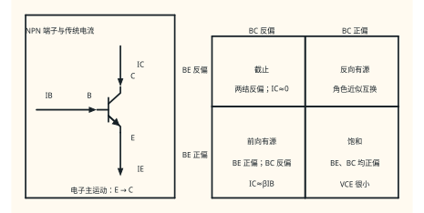{ .ae-figure }

<figcaption markdown="1">判断 NPN 工作区时同时检查 BE、BC 两个结。只有 BE 正偏且 BC 反偏时，才可把 $I_C\approx\beta I_B$ 当作候选模型。</figcaption>
</figure>

门槛和压降是所选模型参数，不是突然跳变的自然常数。工程题也常用 \(V_{CE}\lesssim0.2\ \mathrm V\) 作为“BJT 深饱和”标志，但定义本质仍是两个结都正偏。

<figure class="ae-figure-frame" markdown="1">
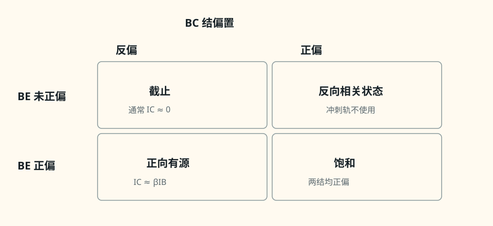{ .ae-figure }
</figure>

**图 3-4　由 BE、BC 两个结偏置构成的 BJT 工作区地图。** “BJT 饱和”指两个 PN 结都正偏，和后文“MOS 饱和区”的物理含义完全不同。

**状态算法（冲刺必会）：** BJT 状态题固定写五步：**假设工作区 → 换入该区模型 → 列 KCL/KVL 求解 → 检查 \(V_{BE},V_{BC}\)（或题目给定的 \(V_{CE,\mathrm{sat}}\) 边界）及电流方向 → 不一致就换区重算**。算出一个数但未检查，不算完成。

~~~mermaid
flowchart TD
    A["假设：截止 / 正向有源 / 饱和"] --> B["只代入该区模型"]
    B --> C["按既定 IB、IC、IE 与电压方向列方程"]
    C --> D["求节点电压和支路电流"]
    D --> E{"VBE、VBC、VCE 与电流 满足该区条件吗？"}
    E -- "是" --> F["接受结果并写 Q 点"]
    E -- "否" --> G["指出矛盾，切换工作区"]
    G --> B
~~~

**图 3-5　BJT 状态判断闭环。** 若正向有源假设算出 \(V_{BC}>0\) 或 \(V_{CE}<V_{CE,\mathrm{sat}}\)，就必须停止使用 \(I_C=\beta I_B\) 并换饱和模型。

### 3.2 BJT 饱和与 MOS 饱和不是同一件事

BJT 饱和时 BE、BC 两结都正偏，集电极电流被外部电路限制，通常是开关“压得很低”的状态。NMOS 饱和时漏端沟道发生夹断但电流仍由源端注入并流过夹断区，常是建立跨导放大的工作区。相同术语来自不同器件特性，绝不能据名字类推。

#### 深入轨：反向有源

若 BE 结反偏、BC 结正偏，集电极与发射极角色互换，称反向有源区。因为器件掺杂和几何不对称，反向电流增益通常远小于正向 \(\beta\)。冲刺题若未明确反接，不使用该区；但工作区地图保留它，避免误以为只有三种数学可能。

### 3.3 完整分析链

- **假设：** 低频直流、普通硅 NPN、未击穿；题目若未另说，分段参数取 \(V_{BE,\mathrm{on}}=0.70\ \mathrm V\)、\(V_{BE,\mathrm{sat}}=0.80\ \mathrm V\)、\(V_{CE,\mathrm{sat}}=0.20\ \mathrm V\)。
- **模型：** 截止开路；正向有源用 BE 恒压降加 \(\beta\)；饱和用两个给定端电压，不使用 \(\beta\) 强制集电流。
- **变量与参考方向：** 沿用图 3-2；另有 \(V_{BC}=V_B-V_C\)。
- **基本方程：** 外电路 KCL/KVL、\(I_E=I_B+I_C\) 和候选工作区模型。
- **求解：** 对候选区求节点电压与电流，再用结偏置和电流方向检查。
- **量纲检查：** 电阻压降 \(IR\) 为 V；由 V/\(\Omega\) 求得 A；\(\beta\) 无量纲。
- **极限检查：** 基极驱动趋零时应走向截止；基极驱动不断增大而集电极电阻固定时，\(I_C\) 最终受负载限制并进入 BJT 饱和区。
- **失效条件：** 击穿、自热、快速开关的存储电荷、准饱和和器件参数离散会使简单分段模型不足。

### 第二遍：适用边界

工作区边界在真实器件上是连续过渡，不是一条无限锋利的线。题目若给了不同 \(V_{BE}\)、\(V_{CE,\mathrm{sat}}\) 或 Ebers–Moll 模型，应以题设为准。

### 30 秒回答

“我用两个结判断 NPN：BE、BC 都未正偏是截止；BE 正偏且 BC 反偏是正向有源，此时才可用 \(I_C\approx\beta I_B\)；两个结都正偏是 BJT 饱和，此时集电流主要由外电路限制。算法是先假设区域、代模型、列式求解，再检查 \(V_{BE}\)、\(V_{BC}\) 或给定 \(V_{CE}\) 边界，不一致就换区。”

### 第二遍：90 秒回答

“先定义 \(V_{BE}=V_B-V_E\)、\(V_{BC}=V_B-V_C\)。在分段模型里，截止要求两个结不正偏；正向有源要求 BE 正偏、BC 反偏，所以除 \(V_{BE}\approx0.7\ \mathrm V\) 外还要检查 \(V_{BC}<0\)，这时 \(I_C=\beta I_B\) 才自洽；饱和时两个结都正偏，常用 \(V_{BE,\mathrm{sat}}\approx0.8\ \mathrm V,V_{CE,\mathrm{sat}}\approx0.2\ \mathrm V\)，不能继续强迫 \(I_C=\beta I_B\)。我会把假设、求解、结偏置检查写成闭环。BJT 饱和意味着两结正偏，而 MOS 饱和是沟道夹断后仍有电流，两者不能混同。”

### 本节练习与递进追问

1. 某 NPN 三端测得 \(V_E=0,\ V_B=0.72\ \mathrm V,\ V_C=3.0\ \mathrm V\)。只按结偏置判断候选工作区，并写出 \(V_{BC}\)。
2. 为什么只看到 \(V_{BE}\approx0.7\ \mathrm V\) 还不能断定正向有源？
3. 正向有源假设给出 \(V_C=0.10\ \mathrm V,V_B=0.70\ \mathrm V,V_E=0\)。指出哪条检查失败，以及下一步该换什么模型。

## 4. P0：BJT 直流偏置、Q 点与负载线

!!! abstract "偏置题固定顺序"

    先假设正向有源并求 $I_B,I_C,I_E$，再求 $V_B,V_C,V_E$，最后用 $V_{BC}<0$ 检查。图 3-6 训练基本流程，图 3-8 再加入发射极反馈；第一次先完成 Q 点，不必同时消化全部温漂和参数敏感性。

静态工作点（quiescent point，Q 点）通常写作 \((I_{CQ},V_{CEQ})\)。偏置网络提供没有交流输入时的直流电压与电流；它的任务不是“制造信号”，而是让后来叠加的小信号不轻易撞进截止或饱和。

### 4.1 例题 A：固定基极偏置

已知 \(V_{CC}=10.0\ \mathrm V,\ R_B=470\ \mathrm{k\Omega},\ R_C=2.00\ \mathrm{k\Omega}\)，发射极接地。采用 \(V_{BE}=0.70\ \mathrm V,\ \beta=100\) 的正向有源模型；忽略 Early 效应和自热。

<figure class="ae-figure-frame" markdown="1">
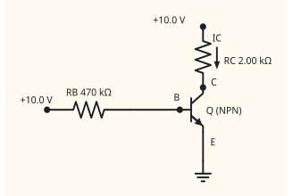{ .ae-figure }
</figure>

**图 3-6　固定基极偏置完整电路。** 两条直流回路共享 \(V_{CC}\) 与地；电源返回路径没有省略。

沿证明链求解：

1. **假设：** NPN 正向有源。
2. **模型：** \(V_{BE}=0.70\ \mathrm V,\ I_C=\beta I_B,\ I_E=I_B+I_C\)。
3. **变量与参考方向：** 采用图 3-6；\(V_E=0\)。
4. **基本方程：** \(\displaystyle I_B=\frac{V_{CC}-V_{BE}}{R_B},\qquad V_C=V_{CC}-I_CR_C.\)

5. **求解：** \(\displaystyle I_B=\frac{10.0-0.70}{470\ \mathrm{k\Omega}} =19.8\ \mu\mathrm A,\) \(\displaystyle I_C=100I_B=1.98\ \mathrm{mA},\quad I_E=2.00\ \mathrm{mA},\) \(\displaystyle V_{CE}=V_C=10.0-(1.98\ \mathrm{mA})(2.00\ \mathrm{k\Omega}) =6.04\ \mathrm V.\)

6. **量纲：** \(\mathrm{V/k\Omega=mA}\)，\(\beta\) 无量纲，故各电流与压降单位正确。
7. **工作区检查：** \(V_B=0.70\ \mathrm V\)，所以 \(V_{BC}=0.70-6.04=-5.34\ \mathrm V<0\)；BE 正偏、BC 反偏，正向有源假设成立。Q 点为 \(\displaystyle \boxed{I_{CQ}=1.98\ \mathrm{mA},\quad V_{CEQ}=6.04\ \mathrm V}.\)

8. **极限与失效：** \(R_B\to\infty\) 时 \(I_B,I_C\to0\)；若把 \(R_B\) 降得很小，\(\beta I_B\) 可能超过集电回路能提供的电流，必须换饱和模型。

集电回路还给出直流负载线

\[
V_{CE}=V_{CC}-I_CR_C=10.0-(2.00\ \mathrm{k\Omega})I_C.
\]

它连接 \((V_{CE}=10.0\ \mathrm V,I_C=0)\) 和 \((V_{CE}=0,I_C=5.00\ \mathrm{mA})\)。器件特性与这条外电路线的交点才是 Q 点。

<figure class="ae-figure-frame" markdown="1">
{ .ae-figure }
</figure>

**图 3-7　图 3-6 的直流负载线。** 改变 \(R_C\) 改变斜率，改变 \(V_{CC}\) 改变截距；Q 点必须同时满足器件模型与外电路方程。

#### 第二遍：参数敏感性

若只把 \(\beta\) 改为 50 或 150，分别得 \(I_C=0.989\ \mathrm{mA},V_{CE}=8.02\ \mathrm V\) 与 \(I_C=2.97\ \mathrm{mA},V_{CE}=4.06\ \mathrm V\)，仍为正向有源，但 Q 点变化很大。若 \(\beta=250\)，有源假设会给 \(I_C=4.95\ \mathrm{mA},V_{CE}=0.106\ \mathrm V\)，此时 \(V_{BC}=0.594\ \mathrm V>0\)，检查失败，真实 BJT 进入饱和区而不是继续服从 \(\beta I_B\)。固定 \(V_{CC}\) 时，温度升高通常使达到同一电流所需 \(V_{BE}\) 降低；在恒压降—\(\beta\)模型里可把 \(V_{BE}\) 的变化代回 \(I_B=(V_{CC}-V_{BE})/R_B\)，但真实 \(\beta\) 和漏电也随温度变，固定偏置缺少强稳定机制。

### 4.2 例题 B：分压偏置加发射极电阻

已知 \(V_{CC}=12.0\ \mathrm V,\ R_1=82.0\ \mathrm{k\Omega},R_2=18.0\ \mathrm{k\Omega},R_C=2.20\ \mathrm{k\Omega},R_E=1.00\ \mathrm{k\Omega}\)，采用 \(V_{BE}=0.70\ \mathrm V,\beta=100\) 的正向有源模型。

<figure class="ae-figure-frame" markdown="1">
{ .ae-figure }
</figure>

**图 3-8　分压—发射极电阻偏置完整电路。** 不能先假定分压器完全不受基极电流加载；先作戴维南等效可得到精确于所选模型的结果。

基极左侧网络的戴维南等效为

\[
V_{\mathrm{TH}}=V_{CC}\frac{R_2}{R_1+R_2}
=12.0\frac{18.0}{100.0}=2.16\ \mathrm V,
\]

\[
R_{\mathrm{TH}}=R_1\parallel R_2
=14.76\ \mathrm{k\Omega}.
\]

1. **假设与模型：** 假设正向有源，用 \(V_{BE}=0.70\ \mathrm V,\ I_C=\beta I_B,\ I_E=(\beta+1)I_B\)。
2. **基本方程：** \(\displaystyle V_{\mathrm{TH}}=I_BR_{\mathrm{TH}}+V_{BE}+I_ER_E.\)

3. **求解：** \(\displaystyle I_B=\frac{V_{\mathrm{TH}}-V_{BE}} {R_{\mathrm{TH}}+(\beta+1)R_E} =\frac{1.46\ \mathrm V}{115.76\ \mathrm{k\Omega}} =12.61\ \mu\mathrm A.\)

    因而 \(\displaystyle I_C=1.261\ \mathrm{mA},\quad I_E=1.274\ \mathrm{mA},\) \(\displaystyle V_E=I_ER_E=1.274\ \mathrm V,\quad V_B=V_E+0.70=1.974\ \mathrm V,\) \(\displaystyle V_C=12.0-I_CR_C=9.225\ \mathrm V,\quad V_{CE}=V_C-V_E=7.951\ \mathrm V.\)

4. **量纲与检查：** 电压除以电阻得到电流；用未舍入值计算得 \(V_{BC}=-7.251\ \mathrm V<0\)，所以正向有源成立。Q 点是 \(\displaystyle \boxed{I_{CQ}=1.261\ \mathrm{mA},\quad V_{CEQ}=7.951\ \mathrm V}.\)

5. **负载线与极限：** 精确 KVL 为 \(\displaystyle V_{CE}=V_{CC}-I_CR_C-I_ER_E.\)

    当 \(\beta\) 足够大时 \(I_E\approx I_C\)，近似负载线为 \(V_{CE}\approx V_{CC}-I_C(R_C+R_E)\)。\(R_E\to0\) 时失去发射极直流反馈；\(R_{\mathrm{TH}}\to0\) 时基极电压更接近理想固定值。

#### 第二遍：为什么更稳

当 \(I_C\) 因 \(\beta\) 或温度趋向增大时，\(I_E\) 增大使 \(V_E=I_ER_E\) 上升；在 \(V_B\) 近似固定时 \(V_{BE}=V_B-V_E\) 被压低，反过来抑制电流。这是直流负反馈。直接重算可见：\(\beta=50\) 时 \(I_C=1.110\ \mathrm{mA},V_{CE}=8.425\ \mathrm V\)；\(\beta=150\) 时 \(I_C=1.321\ \mathrm{mA},V_{CE}=7.763\ \mathrm V\)。相比图 3-6 的固定偏置，集电流变化明显变小。若模型参数 \(V_{BE}\) 降低 \(0.10\ \mathrm V\)，分子只由 \(1.46\) 增至 \(1.56\ \mathrm V\)，所选模型下电流约增 \(6.85\%\)；真实温漂还须结合 \(\beta,I_S\)、自热和元件公差。

### 4.3 完整分析链与边界

- **假设：** 直流稳态、低频、未击穿且结温近似固定；先假设正向有源。
- **模型：** BE 恒压降、局部给定 \(\beta\)，分压器用戴维南等效；负载线只来自外电路 KVL。
- **变量与参考方向：** 沿用图 3-6、图 3-8；Q 点为 \((I_{CQ},V_{CEQ})\)。
- **基本方程：** \(I_E=I_B+I_C\)、候选区器件模型和各回路 KVL。
- **求解：** 先求 \(I_B\)，再求各节点电压；不先把正向有源当成已证结论。
- **量纲检查：** V/\(\Omega\)=A，\(IR\)=V；Q 点两个坐标单位分别为 A、V。
- **极限检查：** 基极驱动趋零时截止；预测电流碰到负载线低 \(V_{CE}\) 端时应检查饱和；\(R_E\) 增大能提高稳定性，但也会改变可用电压余量。
- **失效条件：** 工作区检查失败、器件自热、参数超出题设范围、交流旁路与动态电容显著时，当前直流模型不足。

### 第二遍：适用边界

这里比较的是直流 Q 点稳定性，不分析共射电压增益、输入/输出电阻和旁路电容；这些属于第 4 章。负载线是外电路约束，不依赖晶体管是否服从恒定 \(\beta\)。

### 30 秒回答

“求 BJT 偏置时，我先假设正向有源，用给定 \(V_{BE}\) 和 \(\beta\) 求 \(I_B,I_C,I_E\) 与节点电压，再以 \(V_{BC}<0\) 检查。固定基极电阻的 Q 点直接随 \(\beta\) 变；分压加发射极电阻时，电流增大会抬高 \(V_E\)、压低 \(V_{BE}\)，形成直流负反馈，因此对 \(\beta\) 和温度更稳。外电路 KVL 给出负载线，Q 点是它与器件特性的交点。”

### 第二遍：90 秒回答

“以分压偏置为例，我先把基极网络化成 \(V_{\mathrm{TH}},R_{\mathrm{TH}}\)，而不是忽略基极加载。正向有源假设下，\(I_E=(\beta+1)I_B\)，所以
\(I_B=(V_{\mathrm{TH}}-V_{BE})/[R_{\mathrm{TH}}+(\beta+1)R_E]\)。再算 \(V_E=I_ER_E,V_C=V_{CC}-I_CR_C,V_{CE}=V_C-V_E\)，最后检查 \(V_{BC}=V_B-V_C<0\)。\(R_E\) 让电流上升转化为发射极电压上升，从而降低 \(V_{BE}\)，这是稳定 Q 点的负反馈。若检查落入饱和，就丢弃 \(I_C=\beta I_B\)，改用饱和端压模型。负载线始终由 \(V_{CC}=I_CR_C+V_{CE}+I_ER_E\) 给出。”

### 本节练习与递进追问

1. 图 3-6 中只把 \(R_C\) 增大，负载线的电流截距和斜率怎样变化？先作趋势判断，不求新 Q 点。
2. 图 3-8 中若分压器电流与 \(I_B\) 同量级，为什么不能直接写 \(V_B=V_{CC}R_2/(R_1+R_2)\)？
3. 保持图 3-8 其他参数不变，只增大 \(R_E\)，说明 Q 点稳定性和 \(V_{CE}\) 余量之间的权衡。

## 5. P0：BJT 在 Q 点的小信号线性化

!!! abstract "先把三类量分开"

    大写量是 Q 点直流值，带波浪号的是围绕 Q 点的小增量，小写瞬时量是两者之和。$g_m$ 是曲线在 Q 点的斜率，不是总电流除以总电压。第一次先会由 $I_{CQ}$ 求 $g_m,r_\pi$。

### 5.1 总量、直流量与增量必须分开

在正向有源、温度固定且暂时忽略 Early 效应时，

\[
i_C(t)=I_S\exp\!\left(\frac{v_{BE}(t)}{V_T}\right).
\]

把瞬时总量分解为

\[
v_{BE}(t)=V_{BEQ}+\tilde v_{be}(t),\qquad
i_C(t)=I_{CQ}+\tilde i_c(t).
\]

大写 \(V_{BEQ},I_{CQ}\) 是直流 Q 点；带波浪号的小写量是绕 Q 点的增量；\(v_{BE}(t),i_C(t)\) 是两者相加后的瞬时总量。代入指数式：

\[
i_C=I_Se^{V_{BEQ}/V_T}e^{\tilde v_{be}/V_T}
=I_{CQ}e^{\tilde v_{be}/V_T}.
\]

当 \(|\tilde v_{be}|/V_T\ll1\) 时，用 \(e^x\approx1+x\)：

\[
i_C\approx I_{CQ}\left(1+\frac{\tilde v_{be}}{V_T}\right),
\]

\[
\tilde i_c\approx \frac{I_{CQ}}{V_T}\tilde v_{be}
=g_m\tilde v_{be},
\qquad
\boxed{g_m=\frac{I_{CQ}}{V_T}}.
\]

\(g_m\) 的单位为 A/V，即西门子（S）。它是 Q 点处曲线斜率，不是一个独立的直流电流源。

<figure class="ae-figure-frame" markdown="1">

{ .ae-figure }

<figcaption markdown="1">共同分析链是“先求 DC 的 Q 点，再把器件换成增量模型”。模型中的受控源只描述 Q 点附近斜率，不能脱离偏置单独存在。</figcaption>
</figure>

<figure class="ae-figure-frame" markdown="1">
{ .ae-figure }
</figure>

**图 3-9　BJT 指数特性在 Q 点的局部线性化。** 偏置决定切点和 \(g_m\)；信号幅度决定切线近似是否足够准确。

若把 \(\beta\) 视为 Q 点附近的局部小信号电流增益，则

\[
\tilde i_b=\frac{\tilde i_c}{\beta}
=\frac{g_m}{\beta}\tilde v_{be},
\]

\[
\boxed{r_\pi=\frac{\tilde v_{be}}{\tilde i_b}
=\frac{\beta}{g_m}}.
\]

由于 \(\tilde i_e=\tilde i_b+\tilde i_c\)，从发射极看入的内在增量电阻精确到该模型为

\[
r_e=\frac{\tilde v_{be}}{\tilde i_e}
=\frac{1}{g_m(1+1/\beta)}
=\frac{\alpha}{g_m}
\approx\boxed{\frac1{g_m}}\qquad(\beta\gg1).
\]

以图 3-8 的 \(I_{CQ}=1.261\ \mathrm{mA},\beta=100,T=300\ \mathrm K\) 为例：

\[
g_m=\frac{1.261\ \mathrm{mA}}{25.9\ \mathrm{mV}}
=48.7\ \mathrm{mS},
\]

\[
r_\pi=\frac{100}{48.7\ \mathrm{mS}}=2.05\ \mathrm{k\Omega},
\qquad
r_e\approx\frac1{48.7\ \mathrm{mS}}=20.5\ \Omega.
\]

量纲检查：A/V=S，\(1/\mathrm S=\Omega\)，所以 \(r_\pi,r_e\) 的单位正确。

### 5.2 “足够小”到底有多小

线性化要求 \(|\tilde v_{be}|\ll V_T\)，且整个瞬时轨迹都留在同一正向有源邻域。用泰勒展开看，二阶项相对一阶项的幅度约为 \(|\tilde v_{be}|/(2V_T)\)：在 \(300\ \mathrm K\) 时，峰值 \(2.5\ \mathrm{mV}\) 对应约 \(4.8\%\)，峰值 \(5\ \mathrm{mV}\) 对应约 \(9.7\%\) 的二阶/一阶尺度。可把几毫伏作为手算起点，但允许多大取决于失真指标；不能把“\(5\ \mathrm{mV}\)”当普适硬门槛。

此外，小信号模型不是把直流量抹掉。先用直流模型求 \(I_{CQ}\)，再把独立直流电压源在增量电路中置零，最后算 \(\tilde v,\tilde i\)；瞬时结果仍是“Q 点 + 增量”。

#### 深入轨：Early 效应与输出电阻 rₒ

正向有源区的集电流会随 \(V_{CE}\) 略增，可用

\[
I_C\approx I_S e^{V_{BE}/V_T}\left(1+\frac{V_{CE}}{V_A}\right)
\]

表示，其中 \(V_A>0\) 是 Early 电压的正幅值参数。固定 \(V_{BE}\) 在 Q 点求输出斜率：

\[
g_o=\left.\frac{\partial I_C}{\partial V_{CE}}\right|_Q
\approx\frac{I_{CQ}}{V_A+V_{CEQ}}>0,
\qquad
\boxed{r_o=\frac{V_A+V_{CEQ}}{I_{CQ}}}
\approx\frac{V_A}{I_{CQ}}\quad(V_{CEQ}\ll V_A).
\]

这里 \(I_{CQ}\) 是包含 \((1+V_{CEQ}/V_A)\) 因子后的实际偏置电流；因此第一式是所显示 Early 模型在 Q 点的局部结果，只有 \(V_{CEQ}\ll V_A\) 时才化成常用的 \(r_o\approx V_A/I_{CQ}\)。按 \(I_C\) 流入集电极、\(V_{CE}\) 为正的定义，\(V_{CE}\) 增大使 \(I_C\) 略增，输出电导为正。该模型还要求器件仍在正向有源，且 \(V_A\) 作为正幅值使用；靠近饱和、击穿或高注入时不能外推。

### 5.3 完整分析链

- **假设：** 已有正向有源 Q 点，\(T=300\ \mathrm K\)，\(|\tilde v_{be}|/V_T\ll1\)，低频且先忽略 Early 效应。
- **模型：** \(i_C=I_Se^{v_{BE}/V_T}\)，在 Q 点作一阶泰勒展开；局部 \(\beta\) 给出输入支路。
- **变量与参考方向：** 总量等于大写直流量加带波浪号增量；电流方向沿用图 3-2。
- **基本方程：** \(\tilde i_c=(\partial i_C/\partial v_{BE})_Q\tilde v_{be}\)，以及 \(\tilde i_e=\tilde i_b+\tilde i_c\)。
- **求解：** 得 \(g_m=I_{CQ}/V_T,\ r_\pi=\beta/g_m,\ r_e=\alpha/g_m\approx1/g_m\)。
- **量纲检查：** \(g_m\) 为 S，\(r_\pi,r_e,r_o\) 为 \(\Omega\)。
- **极限检查：** \(I_{CQ}\to0\) 时本模型给 \(g_m\to0,r_\pi\to\infty\)；这提示器件走向截止，不能继续依赖同一有源线性模型。
- **失效条件：** 增量太大、轨迹跨入截止/饱和、温度显著变化、频率高到结电容重要，或 Early 效应不能忽略。

### 第二遍：适用边界

本节只得到器件的增量参数，不计算任何共射/共基/共集放大器的完整增益。\(r_e\approx1/g_m\) 是内在发射结增量关系，不等于外接发射极电阻，也不是用万用表在任意偏置下测得的直流电阻。

### 30 秒回答

“晶体管先由直流偏置建立 Q 点，再在 Q 点把指数特性作一阶泰勒展开。写 \(v_{BE}=V_{BEQ}+\tilde v_{be}\)、\(i_C=I_{CQ}+\tilde i_c\)，由 \(i_C=I_Se^{v_{BE}/V_T}\) 得 \(\tilde i_c=g_m\tilde v_{be}\)，其中 \(g_m=I_{CQ}/V_T\)。若局部 \(\beta\) 已知，\(r_\pi=\beta/g_m\)，且 \(\beta\) 大时 \(r_e\approx1/g_m\)。只在增量足够小且不跨工作区时有效。”

### 第二遍：90 秒回答

“放大的器件基础是偏置加局部线性化。正向有源时 \(i_C=I_Se^{v_{BE}/V_T}\)。令 \(v_{BE}=V_{BEQ}+\tilde v_{be}\)，则 \(i_C=I_{CQ}e^{\tilde v_{be}/V_T}\)。当 \(|\tilde v_{be}|\ll V_T\) 时保留一阶项，得到 \(\tilde i_c=(I_{CQ}/V_T)\tilde v_{be}\)，所以 \(g_m=I_{CQ}/V_T\)。再用 \(\tilde i_c=\beta\tilde i_b\) 得 \(r_\pi=\tilde v_{be}/\tilde i_b=\beta/g_m\)，KCL 给 \(r_e=\alpha/g_m\approx1/g_m\)。它们都是 Q 点附近的增量参数；信号过大、跨区、高频寄生或 Early 效应明显时要换更完整模型。”

### 本节练习与递进追问

1. 在 \(300\ \mathrm K\) 下把 \(I_{CQ}\) 加倍而局部 \(\beta\) 不变，\(g_m,r_\pi,r_e\) 各怎样变化？先只作趋势判断。
2. 为什么 \(r_\pi\) 不是 \(V_{BEQ}/I_{BQ}\)？请用“切线”和“割线”说明。
3. 若 \(\tilde v_{be}\) 峰值由 \(2\ \mathrm{mV}\) 增至 \(20\ \mathrm{mV}\)，为什么线性增益预测的误差会明显增大？

## 6. P0：增强型 NMOS——绝缘栅怎样建立沟道

!!! abstract "先建立一幅物理图"

    栅极几乎不取直流导电电流，但栅压通过电场改变表面载流子；达到阈值后形成反型沟道。阈值不是“电流突然从零跳起”的精确开关点。

### 6.1 从耗尽到反型

增强型 NMOS 通常在 p 型体区中制作两个 \(n^+\) 区作为源极 S 和漏极 D，栅极 G 由很薄的氧化层与半导体绝缘。本章先假设**体端 B 与源端 S 相连、\(V_{DS}\ge0\)**，并统一定义：

\[
V_{GS}=V_G-V_S,\qquad
V_{DS}=V_D-V_S,
\]

参考漏电流 \(I_D\) 从漏极流入器件、从源极流出。理想氧化层不允许稳态导电电流穿过，所以低频直流 \(I_G\approx0\)；但栅—源、栅—漏和栅—体存在电容，电压变化时仍有

\[
i_G=C\,\frac{\mathrm dv}{\mathrm dt}
\]

型的充放电电流。真实器件还有极小漏电和有限绝缘耐压，因此“栅极永远无电流”是错误的。

<figure class="ae-figure-frame" markdown="1">
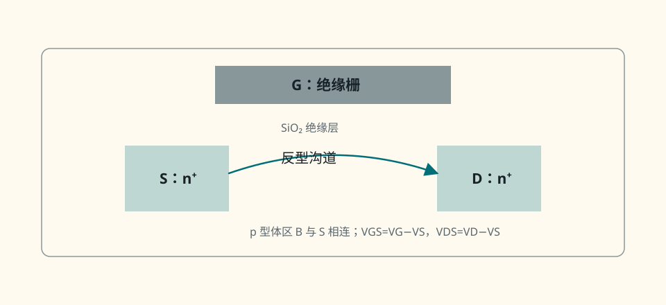{ .ae-figure }
</figure>

**图 3-10　增强型 NMOS 的截面直觉与端口参考。** 栅氧把直流输入端绝缘；截面中的沟道箭头只表示形成位置，端口传统电流 \(I_D\) 仍从 D 进入、从 S 流出。

当 \(V_{GS}=0\) 时，源与漏之间隔着 p 型体区，没有现成的 n 型导电沟道。栅相对源逐渐变正时：

1. 正栅电场排斥表面的空穴，先形成缺少多数载流子的**耗尽层**；
2. 电压继续升高，电子被吸引到氧化层下方，表面由 p 型有效转为 n 型，称为**反型**；
3. 当反型层足以连接源漏并按约定模型开始显著导电时，对应阈值电压 \(V_{TH}\)；
4. 超过阈值的栅源电压称为过驱动电压 \(\displaystyle \boxed{V_{OV}=V_{GS}-V_{TH}}.\)

\(V_{TH}\) 是器件、体偏压、温度和所用定义共同决定的参数，不是所有 NMOS 都相同的硬门槛。所谓“场效应”是栅电场改变表面载流子密度与沟道电导；栅极不需要持续注入与漏电流等量的电荷。

<figure class="ae-figure-frame" markdown="1">
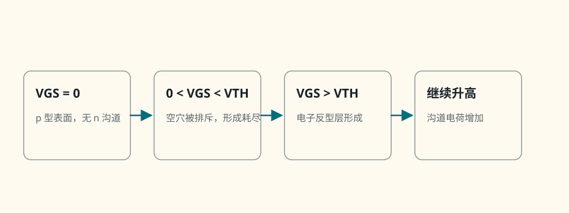{ .ae-figure }
</figure>

**图 3-11　增强型 NMOS 的零栅偏、耗尽与反型序列。** 长沟道平方律把 \(V_{GS}=V_{TH}\) 作为强反型导电模型的分界，真实过渡连续。

### 6.2 完整分析链

- **假设：** 增强型长沟道 NMOS，体接源，\(V_{DS}\ge0\)，温度近似固定，氧化层未击穿。
- **模型：** 栅—氧—半导体形成电容结构；栅场先耗尽空穴，再建立电子反型层。
- **变量与参考方向：** \(I_D\) 流入 D、流出 S；\(V_{GS}=V_G-V_S,\ V_{DS}=V_D-V_S\)。
- **基本方程：** 直流理想 \(I_G=0\)；动态有位移/充电电流 \(i_G=C\,\mathrm dv/\mathrm dt\)；定义 \(V_{OV}=V_{GS}-V_{TH}\)。
- **求解：** \(V_{OV}<0\) 时强反型沟道模型关闭；\(V_{OV}\ge0\) 后由沟道电荷和 \(V_{DS}\) 决定 \(I_D\)。
- **量纲检查：** \(V_{OV}\) 是电压；\(C\,\mathrm dv/\mathrm dt\) 为 \(\mathrm{F\cdot V/s=A}\)。
- **极限检查：** 栅电压恒定时理想电容电流趋零；电压变化越快，充放电电流越大。
- **失效条件：** 亚阈值电流、栅漏电、氧化层击穿、高频寄生、体偏置、短沟道和强场效应显著时需更完整模型。

### 第二遍：适用边界

“\(I_G=0\)”只属于理想直流模型。真实数字开关即使平均栅漏很小，也必须反复搬运栅电荷；真实模拟输入也受栅电容和偏置泄漏限制。

### 30 秒回答

“增强型 NMOS 的栅由氧化层绝缘。正 \(V_{GS}\) 先排斥 p 型表面的空穴形成耗尽层，再吸引电子形成反型 n 沟道；超过 \(V_{TH}\) 后，用 \(V_{OV}=V_{GS}-V_{TH}\) 表示过驱动。理想直流栅电流近零，但栅有电容，所以电压变化时需要 \(C\,\mathrm dv/\mathrm dt\) 的充放电电流，也受漏电和氧化层耐压限制。”

### 第二遍：90 秒回答

“我先定义 \(V_{GS}=V_G-V_S,V_{DS}=V_D-V_S\)，并让 \(I_D\) 从漏极流入、源极流出，暂取体接源且 \(V_{DS}\ge0\)。器件在 p 型体区里有两个 \(n^+\) 区，栅与半导体由氧化层绝缘。正栅场先使表面耗尽空穴，再吸引电子形成反型层；达到模型定义的 \(V_{TH}\) 后，反型层连接源漏，\(V_{OV}=V_{GS}-V_{TH}\) 描述沟道电荷尺度。稳态时绝缘层使理想 \(I_G=0\)，但栅本质是电容端，切换和交流下有充放电电流。阈值随工艺、温度和体偏压变化，亚阈值也不是严格零电流。”

### 本节练习与递进追问

1. 只提高栅电压而保持其他端电压不变时，p 型表面的空穴、耗尽层和电子反型电荷依次怎样变化？
2. 为什么万用表测得直流栅电流近零，仍不能推出驱动 MOSFET 不耗动态功率？
3. 若源极电压上升而栅极绝对电压不变，\(V_{GS}\) 与 \(V_{OV}\) 怎样变化？

## 7. P0：NMOS 长沟道工作区与平方律

!!! abstract "工作区只看两个量"

    先算 $V_{OV}=V_{GS}-V_{TH}$。若 $V_{OV}\le0$，候选截止；若 $V_{OV}>0$，再比较 $V_{DS}$ 与 $V_{OV}$，前者较小时用三极管区式，前者不小时用饱和区式。公式算完还要重新检查不等式。

### 7.1 三个工作区

定义长沟道参数

\[
\boxed{k_n=\mu_n C_{\mathrm{ox}}\frac WL},
\]

其中 \(\mu_n\) 是电子迁移率，\(C_{\mathrm{ox}}\) 是单位面积栅氧电容，\(W/L\) 是沟道宽长比。\(k_n\) 的单位为 \(\mathrm{A/V^2}\)。在体接源、\(V_{DS}\ge0\)、忽略沟道长度调制的长沟道强反型模型中：

| 工作区 | 条件 | 漏电流模型 |
|---|---|---|
| 截止区 | \(V_{GS}<V_{TH}\) | \(I_D\approx0\) |
| 三极管区（线性/欧姆区） | \(V_{GS}\ge V_{TH},\ 0\le V_{DS}<V_{OV}\) | \(I_D=k_n[V_{OV}V_{DS}-V_{DS}^2/2]\) |
| NMOS 饱和区 | \(V_{GS}\ge V_{TH},\ V_{DS}\ge V_{OV}\) | \(I_D=\frac12k_nV_{OV}^2\) |

<figure class="ae-figure-frame" markdown="1">

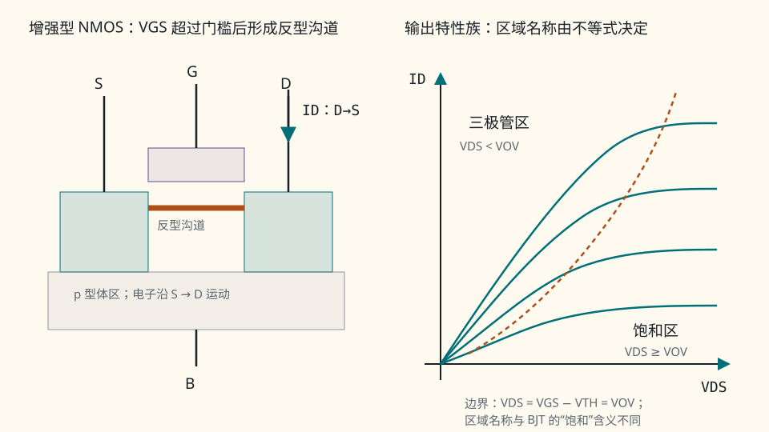{ .ae-figure }

<figcaption markdown="1">先由 $V_{GS}$ 判断是否形成强反型沟道，再用 $V_{DS}$ 与 $V_{OV}$ 比较区分三极管区和饱和区；MOS 饱和不表示器件“关断”。</figcaption>
</figure>

为使区域标签唯一，本书把 $V_{GS}=V_{TH}$ 视为导通侧的零电流边界；在 $V_{DS}\ge0$ 时它落入上表 NMOS 饱和边界并给 $I_D=0$。把 $V_{DS}=V_{OV}$ 归入 NMOS 饱和区；三极管式在该点也给同一个 $I_D=k_nV_{OV}^2/2$。这些只是长沟道分段模型的边界约定，不表示实体器件在阈值处突然从严格零电流跳变。

注意本书把 \(k_n\) 定义为 \(\mu_nC_{\mathrm{ox}}W/L\)，所以饱和式前有 \(1/2\)。有些教材把 \(1/2\) 吸收到参数定义中，套公式前必须核对。

<figure class="ae-figure-frame" markdown="1">
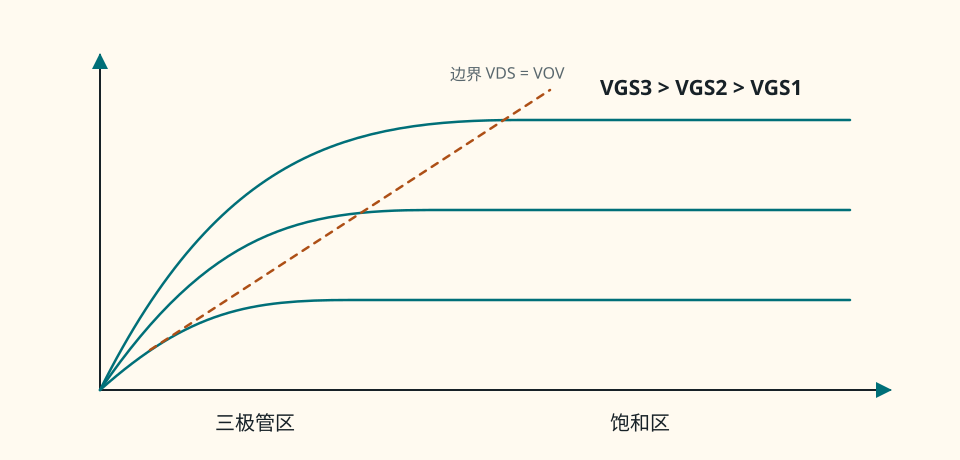{ .ae-figure }
</figure>

**图 3-12　长沟道 NMOS 输出特性的区域图。** NMOS 三极管区电流同时依赖 \(V_{OV},V_{DS}\)；理想 NMOS 饱和区忽略 \(V_{DS}\) 依赖，实际曲线会因沟道长度调制略上扬。

### 7.2 第二遍：三极管式从哪里来

沿沟道从源到漏定义局部电势 \(V(x)\)，源端 \(V(0)=0\)，漏端 \(V(L)=V_{DS}\)。在渐变沟道近似下，单位长度反型电荷的大小与局部过驱动成正比：

\[
|Q_i(x)|=WC_{\mathrm{ox}}[V_{OV}-V(x)].
\]

漂移电流约为“迁移率 × 电荷/长度 × 电场”：

\[
I_D=\mu_n |Q_i(x)|\frac{\mathrm dV}{\mathrm dx}.
\]

整理并从源积分到漏：

\[
I_D\,\mathrm dx
=\mu_nWC_{\mathrm{ox}}[V_{OV}-V]\,\mathrm dV,
\]

\[
I_DL=\mu_nWC_{\mathrm{ox}}
\int_0^{V_{DS}}(V_{OV}-V)\,\mathrm dV,
\]

\[
\boxed{I_D=k_n\left(V_{OV}V_{DS}-\frac{V_{DS}^2}{2}\right)}.
\]

当 \(V_{DS}\) 增至 \(V_{OV}\) 时，漏端局部反型电荷在这个一阶模型中降到零，称为漏端**夹断**。把边界代入三极管式：

\[
I_D=k_n\left(V_{OV}^2-\frac{V_{OV}^2}{2}\right)
=\frac12k_nV_{OV}^2,
\]

恰与饱和式相等，所以电流在边界连续。

夹断不表示源漏之间“断路”或电流变零。源端仍向沟道注入载流子；载流子到达夹断点后由漏端强电场扫过短的耗尽区。因此理想长沟道模型把 \(I_D\) 近似钳在由 \(V_{OV}\) 决定的值。

<figure class="ae-figure-frame" markdown="1">
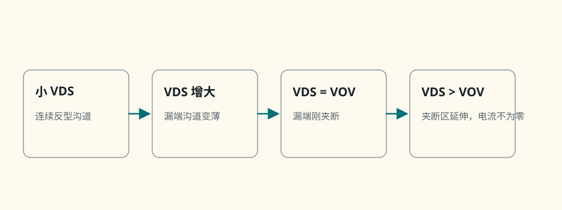{ .ae-figure }
</figure>

**图 3-13　沟道渐变与夹断。** 图中的电子输运方向 S→D 与传统漏电流 \(I_D\) 的 D→S 相反。

### 7.3 状态假设算法

**状态算法（冲刺必会）：** NMOS 状态题固定写：**假设截止/三极管/饱和 → 代入对应模型 → 求 \(I_D,V_G,V_S,V_D\) → 重算 \(V_{GS},V_{DS},V_{OV}\) → 检查不等式 → 矛盾则换区**。若方程有多个根，还要排除违反 \(V_{OV}\ge0\)、电压范围或候选区条件的根。

~~~mermaid
flowchart TD
    A["定义 ID、VGS、VDS，先取体接源且 VDS≥0"] --> B["假设截止 / 三极管 / 饱和"]
    B --> C["代入该区 ID 方程与外电路 KCL/KVL"]
    C --> D["求全部候选根"]
    D --> E{"VGS 与 VDS 是否满足 该区全部不等式？"}
    E -- "是" --> F["接受 Q 点"]
    E -- "否" --> G["排除根或切换工作区"]
    G --> B
~~~

**图 3-14　NMOS 工作区判断闭环。** “先用饱和式算电流”只是候选假设；必须用算出的 \(V_{DS}\) 检查 \(V_{DS}\ge V_{OV}\)。

### 7.4 完整分析链

- **假设：** 长沟道、强反型、渐变沟道、低场迁移率近似常数，体接源，\(V_{DS}\ge0\)，忽略沟道长度调制。
- **模型：** 局部反型电荷随 \(V_{OV}-V(x)\) 线性变化，载流子漂移形成漏电流。
- **变量与参考方向：** \(I_D\) 入 D 出 S；\(V_{GS}=V_G-V_S,\ V_{DS}=V_D-V_S,\ V_{OV}=V_{GS}-V_{TH}\)。
- **基本方程：** 截止 \(I_D\approx0\)；三极管式；饱和平方律。
- **求解：** 将候选区方程与外部负载方程联立，并排除不满足区间的根。
- **量纲检查：** \(k_n[\mathrm{V^2}]\) 为 A；\(V_{DS}/V_{OV}\) 为无量纲区域比较。
- **极限检查：** 三极管式在 \(V_{DS}=0\) 给 \(I_D=0\)；在 \(V_{DS}=V_{OV}\) 与饱和式连续；\(V_{OV}\to0^+\) 时强反型平方律电流趋零。
- **失效条件：** 亚阈值、速度饱和、迁移率退化、短沟道、沟道长度调制、体效应、自热或反向 \(V_{DS}\) 显著时需更完整模型。

### 第二遍：适用边界

平方律是长沟道近似。现代短沟道器件常因速度饱和等效应明显偏离平方律，实际设计应使用工艺模型或数据手册。本章最初假设 \(V_{DS}\ge0\)；若漏源反接，体二极管、端子互换和负电流参考都必须重新处理。

### 30 秒回答

“先算 \(V_{OV}=V_{GS}-V_{TH}\)。若 \(V_{GS}<V_{TH}\)，长沟道强反型模型给 NMOS 截止区；若 \(V_{GS}\ge V_{TH}\) 且 \(0\le V_{DS}<V_{OV}\)，是 NMOS 三极管区，用 \(I_D=k_n(V_{OV}V_{DS}-V_{DS}^2/2)\)；若 \(V_{DS}\ge V_{OV}\)，是 NMOS 饱和区，用 \(I_D=k_nV_{OV}^2/2\)。漏端夹断不等于零电流，边界代入两式得到相同电流。”

### 第二遍：90 秒回答

“我先声明体接源、\(V_{DS}\ge0\) 和长沟道平方律。栅源过驱动 \(V_{OV}=V_{GS}-V_{TH}\) 决定反型电荷。三极管区的局部沟道电荷与 \(V_{OV}-V(x)\) 成正比，沿沟道积分得到 \(I_D=k_n[V_{OV}V_{DS}-V_{DS}^2/2]\)。当 \(V_{DS}=V_{OV}\) 时漏端电荷趋零而夹断，把边界代入得到 \(I_D=k_nV_{OV}^2/2\)，与饱和式连续。夹断后载流子仍由源端注入并被漏端电场扫走，不是开路。每题仍要假设区域、求解、重算 \(V_{GS},V_{DS},V_{OV}\) 并检查不等式。”

### 本节练习与递进追问

1. 固定 \(V_{OV}>0\)，让 \(V_{DS}\) 从 0 缓慢增至 \(V_{OV}\)，只判断沟道漏端厚度与 \(I_D\) 的趋势。
2. 把 \(V_{DS}=V_{OV}\) 分别代入三极管式和饱和式，验证数值和量纲都连续。
3. 为什么看到“夹断”二字不能得出 \(I_D=0\)？载流子怎样通过夹断区？

## 8. P0：NMOS 直流偏置与工作区自洽

!!! abstract "偏置题固定顺序"

    由外电路先写 $V_G,V_S,V_D$，再算 $V_{GS},V_{OV},V_{DS}$；选候选区域联立求 $I_D$，最后逐个排除违反物理条件的代数根。图 3-15 练基本流程，图 3-16 再加入源极反馈。

### 8.1 例题 C：固定栅压、电阻负载

已知 \(V_{DD}=10.0\ \mathrm V,\ R_D=2.00\ \mathrm{k\Omega}\)，理想栅压源 \(V_G=3.00\ \mathrm V\)，源和体接地。采用长沟道模型 \(V_{TH}=1.00\ \mathrm V,\ k_n=1.00\ \mathrm{mA/V^2}\)，忽略沟道长度调制。

<figure class="ae-figure-frame" markdown="1">
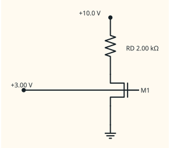{ .ae-figure }
</figure>

**图 3-15　固定栅压的电阻负载 NMOS 完整电路。** 栅压源虽不提供理想直流栅电流，仍必须定义相对源极的返回参考。

沿状态算法：

1. **假设：** NMOS 在饱和区。
2. **模型与变量：** \(\displaystyle V_{GS}=3.00\ \mathrm V,\quad V_{OV}=V_{GS}-V_{TH}=2.00\ \mathrm V,\) \(\displaystyle I_D=\frac12k_nV_{OV}^2.\)

3. **求解：** \(\displaystyle I_D=\frac12(1.00\ \mathrm{mA/V^2})(2.00\ \mathrm V)^2 =2.00\ \mathrm{mA},\) \(\displaystyle V_D=V_{DD}-I_DR_D =10.0-(2.00\ \mathrm{mA})(2.00\ \mathrm{k\Omega}) =6.00\ \mathrm V,\)

    所以 \(V_{DS}=6.00\ \mathrm V\)。

4. **量纲与区域检查：** \((\mathrm{mA/V^2})(\mathrm{V^2})=\mathrm{mA}\)；\(V_{DS}=6.00\ \mathrm V\ge V_{OV}=2.00\ \mathrm V\)，饱和假设成立。Q 点为 \(\displaystyle \boxed{I_{DQ}=2.00\ \mathrm{mA},\quad V_{DSQ}=6.00\ \mathrm V}.\)

5. **负载线与极限：** \(\displaystyle I_D=\frac{V_{DD}-V_{DS}}{R_D}.\)

    它连接 \((V_{DS}=10.0\ \mathrm V,I_D=0)\) 与 \((V_{DS}=0,I_D=5.00\ \mathrm{mA})\)。\(V_G\) 降到阈值以下时 Q 点趋向截止端；增大 \(V_G\) 时平方律预测电流增加，但若算出的 \(V_{DS}<V_{OV}\)，就必须切到三极管区。

#### 第二遍：阈值敏感性

只把 \(V_{TH}\) 改为 \(1.50\ \mathrm V\)，则 \(V_{OV}=1.50\ \mathrm V,I_D=1.125\ \mathrm{mA},V_{DS}=7.75\ \mathrm V\)，仍饱和；若 \(V_{TH}=0.50\ \mathrm V\)，则 \(V_{OV}=2.50\ \mathrm V,I_D=3.125\ \mathrm{mA},V_{DS}=3.75\ \mathrm V\)，也仍满足饱和。可见固定栅压偏置直接暴露于阈值与工艺变化。

### 8.2 例题 D：栅分压加源极电阻

已知 \(V_{DD}=12.0\ \mathrm V,\ R_1=1.00\ \mathrm{M\Omega},R_2=500\ \mathrm{k\Omega},R_D=2.00\ \mathrm{k\Omega},R_S=1.00\ \mathrm{k\Omega}\)。体接源，采用 \(V_{TH}=1.00\ \mathrm V,\ k_n=1.00\ \mathrm{mA/V^2}\) 的长沟道模型，忽略沟道长度调制和栅漏电。

<figure class="ae-figure-frame" markdown="1">
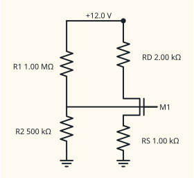{ .ae-figure }
</figure>

**图 3-16　栅分压—源极电阻偏置完整电路。** 分压节点通过水平导线连接到 G，双竖线表示栅与沟道绝缘；理想 \(I_G=0\) 使分压器不被栅端直流加载，\(R_S\) 提供局部直流负反馈。

理想直流栅电流为零，因此

\[
V_G=V_{DD}\frac{R_2}{R_1+R_2}
=12.0\frac{500}{1500}=4.00\ \mathrm V.
\]

分压支路本身仍有 \(12.0\ \mathrm V/1.50\ \mathrm{M\Omega}=8.00\ \mu\mathrm A\)，不能把“栅不吸电流”误说成“分压器不耗电”。

1. **假设：** NMOS 饱和。
2. **模型：** \(\displaystyle V_S=I_DR_S,\quad V_{OV}=V_G-V_S-V_{TH}=3.00\ \mathrm V-I_D(1.00\ \mathrm{k\Omega}),\) \(\displaystyle I_D=\frac12k_nV_{OV}^2.\)

3. **求解。** 用 mA、k\(\Omega\)、V 为一致单位，令 \(x=I_D/\mathrm{mA}\)，则 \(V_S=x\ \mathrm V\)： \(\displaystyle x=\frac12(3-x)^2 \quad\Longrightarrow\quad x^2-8x+9=0,\) \(\displaystyle x=4\pm\sqrt7.\)

    两个代数根约为 \(1.354\) 与 \(6.646\)。第二根会给 \(V_{OV}=3-6.646<0\)，违反饱和模型先决条件，必须排除。因此 \(\displaystyle I_D=1.354\ \mathrm{mA},\quad V_S=1.354\ \mathrm V,\) \(\displaystyle V_{GS}=4.00-1.354=2.646\ \mathrm V,\quad V_{OV}=1.646\ \mathrm V,\) \(\displaystyle V_D=12.0-(1.354\ \mathrm{mA})(2.00\ \mathrm{k\Omega}) =9.292\ \mathrm V,\) \(\displaystyle V_{DS}=V_D-V_S=7.937\ \mathrm V.\)

4. **区域与量纲检查：** \(V_{GS}>V_{TH}\)，且 \(7.937\ \mathrm V\ge1.646\ \mathrm V\)，饱和假设成立；Q 点为 \(\displaystyle \boxed{I_{DQ}=1.354\ \mathrm{mA},\quad V_{DSQ}=7.937\ \mathrm V}.\)

5. **极限与稳定性：** 若 \(I_D\) 趋向增大，\(V_S=I_DR_S\) 上升，使 \(V_{GS}\) 和 \(V_{OV}\) 下降，抑制原来的变化；这是源极退化的直流负反馈。\(R_S\to0\) 时回到固定 \(V_{GS}\) 的强参数敏感偏置。若体不是接源而是接地，\(V_S>0\) 会产生体偏置并改变 \(V_{TH}\)，本题结果不再自洽。

### 8.3 完整分析链与边界

- **假设：** 直流稳态、体接源、\(V_{DS}\ge0\)，采用长沟道平方律并先假设饱和。
- **模型：** 理想 \(I_G=0\)；饱和式或三极管式与电阻网络联立。
- **变量与参考方向：** 沿用图 3-15、图 3-16；Q 点写作 \((I_{DQ},V_{DSQ})\)。
- **基本方程：** 分压、KCL/KVL、\(V_{OV}=V_{GS}-V_{TH}\) 和候选区电流式。
- **求解：** 允许出现非线性方程；保留全部代数根后，再按物理电压和区域条件筛选。
- **量纲检查：** 用 mA 与 k\(\Omega\) 时乘积为 V；平方律参数为 \(\mathrm{mA/V^2}\)。
- **极限检查：** \(V_G<V_{TH}+V_S\) 时趋向截止；负载线预测的 \(V_{DS}\) 降到 \(V_{OV}\) 以下时转三极管区；\(R_S\) 增大能增强直流反馈，但会消耗电压余量。
- **失效条件：** 短沟道、体偏置、沟道长度调制、栅漏电、自热、器件阈值范围超出题设时需重建模型。

### 第二遍：适用边界

这里仍只求器件 Q 点，不计算共源、源极跟随器等完整拓扑的增益。分压器可因 \(I_G\approx0\) 选得很大，但电阻热噪声、漏电和栅电容形成的带宽限制会阻止它无限增大。

### 30 秒回答

“NMOS 偏置也按假设—求解—检查。先由外电路求 \(V_G,V_S,V_D\)，算 \(V_{GS},V_{OV},V_{DS}\)，再用候选区方程求 \(I_D\)，最后检查全部不等式。固定栅压对 \(V_{TH}\) 很敏感；加入 \(R_S\) 后，电流上升会抬高源极电压、降低 \(V_{GS}\) 和 \(V_{OV}\)，形成直流负反馈。非线性方程有多个根时，必须排除违反区域条件的根。”

### 第二遍：90 秒回答

“以栅分压加源电阻为例，理想直流 \(I_G=0\)，所以先由分压得到 \(V_G\)，但分压电阻仍有直流功耗。假设饱和后，写 \(V_S=I_DR_S\)、\(V_{OV}=V_G-I_DR_S-V_{TH}\)，再与 \(I_D=k_nV_{OV}^2/2\) 联立。二次方程的根不能照单全收，要逐个检查 \(V_{OV}\ge0\)；随后算 \(V_D=V_{DD}-I_DR_D\) 和 \(V_{DS}=V_D-V_S\)，验证 \(V_{DS}\ge V_{OV}\)。若失败就切换三极管式。源电阻通过 \(I_D\uparrow\to V_S\uparrow\to V_{GS}\downarrow\to I_D\downarrow\) 稳定 Q 点。”

### 本节练习与递进追问

1. 图 3-15 中只增大 \(R_D\)，负载线怎样转动？Q 点是否必然仍在 NMOS 饱和区？
2. 图 3-16 中只增大 \(R_S\)，\(I_D,V_S,V_{OV}\) 的趋势各是什么？不需求新数值。
3. 二次方程得到两个正的 \(I_D\) 根时，为什么仍可能只有一个物理解？

## 9. P0：NMOS 在 Q 点的小信号参数

!!! abstract "先掌握一条斜率关系"

    在长沟道饱和平方律下，$g_m$ 是 $I_D$ 对 $V_{GS}$ 的 Q 点斜率，可写成 $k_nV_{OV}$、$2I_D/V_{OV}$ 或 $\sqrt{2k_nI_D}$。先会在已知两项时求第三项，再读 $r_o$ 与体效应。

### 9.1 从平方律推出跨导 gₘ

在 NMOS 饱和区、体接源并忽略沟道长度调制时，

\[
i_D(t)=\frac12k_n[v_{GS}(t)-V_{TH}]^2.
\]

把总量分为

\[
v_{GS}(t)=V_{GSQ}+\tilde v_{gs}(t),\qquad
i_D(t)=I_{DQ}+\tilde i_d(t),
\]

并定义 \(V_{OVQ}=V_{GSQ}-V_{TH}>0\)。在 Q 点求导：

\[
g_m=\left.\frac{\partial i_D}{\partial v_{GS}}\right|_Q
=k_n(V_{GSQ}-V_{TH})
=\boxed{k_nV_{OVQ}}.
\]

又因 \(I_{DQ}=\frac12k_nV_{OVQ}^2\)，所以

\[
\boxed{g_m=k_nV_{OVQ}=\frac{2I_{DQ}}{V_{OVQ}}},
\qquad
\tilde i_d\approx g_m\tilde v_{gs}.
\]

这两种形式只在同一个饱和平方律 Q 点上等价。\(g_m\) 单位是 A/V=S。

<figure class="ae-figure-frame" markdown="1">
{ .ae-figure }
</figure>

**图 3-17　NMOS 饱和平方律在 Q 点的局部线性化。** 切线参数由 \(I_{DQ},V_{OVQ}\) 决定；它不是跨截止或三极管区仍有效的全局直线。

以图 3-16 的 Q 点为例，

\[
g_m=k_nV_{OVQ}
=(1.00\ \mathrm{mA/V^2})(1.646\ \mathrm V)
=1.646\ \mathrm{mS}.
\]

用另一式复核：

\[
\frac{2I_{DQ}}{V_{OVQ}}
=\frac{2(1.354\ \mathrm{mA})}{1.646\ \mathrm V}
=1.645\ \mathrm{mS},
\]

差异只来自前面小数舍入。

平方律精确展开还显示二阶项：

\[
\tilde i_d
=k_nV_{OVQ}\tilde v_{gs}
+\frac12k_n\tilde v_{gs}^2.
\]

二阶项相对一阶项的尺度为 \(|\tilde v_{gs}|/(2V_{OVQ})\)，因此小信号要求 \(|\tilde v_{gs}|\ll V_{OVQ}\)，且瞬时 \(V_{DS}\) 始终满足饱和边界。允许幅度由失真指标决定，不存在脱离 Q 点的统一毫伏门槛。

### 9.2 第二遍：沟道长度调制、输出电阻 rₒ 与体效应

实际长沟道 NMOS 夹断区随 \(V_{DS}\) 增大而略向源端延伸，有效沟道长度变短，饱和电流略增。常用一阶模型

\[
I_D\approx\frac12k_nV_{OV}^2(1+\lambda V_{DS}),
\]

其中 \(\lambda\ge0\) 的单位为 \(\mathrm{V^{-1}}\)。在 Q 点、固定 \(V_{GS}\)：

\[
g_o=\left.\frac{\partial I_D}{\partial V_{DS}}\right|_Q
\approx\frac{\lambda I_{DQ}}{1+\lambda V_{DSQ}}>0,
\qquad
\boxed{r_o=\frac{1+\lambda V_{DSQ}}{\lambda I_{DQ}}}
\approx\frac1{\lambda I_{DQ}}
\quad(\lambda V_{DSQ}\ll1).
\]

所以增量漏电流更完整地写成

\[
\tilde i_d\approx g_m\tilde v_{gs}+\frac{\tilde v_{ds}}{r_o}.
\]

这里 \(I_{DQ}\) 是包含 \((1+\lambda V_{DSQ})\) 因子后的实际偏置电流；因此盒中式是所显示沟道长度调制模型的局部结果，只有 \(\lambda V_{DSQ}\ll1\) 时才采用常见近似。这里用 \(I_D\) 入漏、\(V_{DS}=V_D-V_S\)，故输出电导为正。若 \(\lambda=0\)，理想模型给 \(r_o\to\infty\)。

若体端不与源端等电位，源—体电压 \(V_{SB}=V_S-V_B\) 会改变阈值，称为**体效应**。常见模型

\[
V_{TH}=V_{TH0}+\gamma
\left(\sqrt{2\phi_F+V_{SB}}-\sqrt{2\phi_F}\right)
\]

该式要求源—体 PN 结保持反偏；按本章 NMOS 约定，通常取 \(V_{SB}=V_S-V_B\ge0\)。此时 \(V_{SB}>0\) 通常提高 \(V_{TH}\)，减小同一 \(V_{GS}\) 下的电流；小信号会额外出现体跨导 \(g_{mb}\)。\(\gamma\) 的单位为 \(\mathrm{V^{1/2}}\)，根号内是电压。若 \(V_{SB}\) 足够负，源—体结会正偏；若体接源而漏端反向到足够低的电位，漏—体寄生二极管也会正偏。此时只调整阈值的体效应模型以及最初的 \(V_{DS}\ge0\) 方程都失效，必须显式加入体二极管。图 3-16 明确体接源且 \(V_{DS}\ge0\)，因而不启用这些效应。

### 9.3 完整分析链

- **假设：** 已有 NMOS 饱和区 Q 点，长沟道、体接源，\(|\tilde v_{gs}|\ll V_{OVQ}\)，低频且先令 \(\lambda=0\)。
- **模型：** \(i_D=\frac12k_n(v_{GS}-V_{TH})^2\)，在 Q 点作一阶泰勒展开。
- **变量与参考方向：** 总量为大写直流量加带波浪号增量；\(I_D\) 入 D 出 S。
- **基本方程：** \(\tilde i_d=(\partial i_D/\partial v_{GS})_Q\tilde v_{gs}\)；深入轨再加 \((\partial i_D/\partial v_{DS})_Q\tilde v_{ds}\)。
- **求解：** \(g_m=k_nV_{OVQ}=2I_{DQ}/V_{OVQ}\)；有沟道长度调制时 \(r_o=(1+\lambda V_{DSQ})/(\lambda I_{DQ})\)，在 \(\lambda V_{DSQ}\ll1\) 时近似为 \(1/(\lambda I_{DQ})\)。
- **量纲检查：** \(k_nV_{OV}\) 与 \(I_D/V_{OV}\) 均为 S；\(1/(\lambda I_D)\) 为 \(\Omega\)。
- **极限检查：** \(V_{OVQ}\to0^+\) 时平方律给 \(I_D\to0,g_m\to0\)，器件接近截止；\(\lambda\to0\) 时 \(r_o\to\infty\)。
- **失效条件：** 增量跨入截止/三极管、短沟道偏离平方律、体不接源、高频电容、自热或大信号失真显著。

### 第二遍：适用边界

\(g_m=2I_D/V_{OV}\) 不是所有 MOSFET 在所有工艺和反型程度下的精确规律；它来自本章长沟道强反型平方律。现代短沟道器件要用工艺模型或测得的 \(g_m/I_D\)。

### 30 秒回答

“在长沟道 NMOS 饱和区，\(I_D=k_nV_{OV}^2/2\)。在 Q 点对 \(V_{GS}\) 求导，得到 \(g_m=k_nV_{OVQ}\)；再利用 Q 点电流式，得到等价形式 \(g_m=2I_{DQ}/V_{OVQ}\)。于是小信号有 \(\tilde i_d\approx g_m\tilde v_{gs}\)。它只在偏置点附近、增量远小于过驱动且不跨工作区时成立。”

### 第二遍：90 秒回答

“先写 \(v_{GS}=V_{GSQ}+\tilde v_{gs}\)、\(i_D=I_{DQ}+\tilde i_d\)。饱和平方律是 \(i_D=k_n(v_{GS}-V_{TH})^2/2\)，所以 Q 点斜率
\(g_m=(\partial i_D/\partial v_{GS})_Q=k_nV_{OVQ}\)。因为 \(I_{DQ}=k_nV_{OVQ}^2/2\)，也可写成 \(2I_{DQ}/V_{OVQ}\)。精确展开的二阶/一阶尺度是 \(|\tilde v_{gs}|/(2V_{OVQ})\)，这给出小信号边界。若考虑沟道长度调制，\(I_D\) 还乘 \(1+\lambda V_{DS}\)，局部结果为 \(r_o=(1+\lambda V_{DSQ})/(\lambda I_{DQ})\)；只有 \(\lambda V_{DSQ}\ll1\) 时才近似为 \(1/(\lambda I_{DQ})\)。体不接源时还会有阈值变化和 \(g_{mb}\)。”

### 本节练习与递进追问

1. 在相同 \(I_{DQ}\) 下把 \(V_{OVQ}\) 减半，长沟道平方律的 \(g_m\) 怎样变化？为保持同一电流，\(k_n\) 必须怎样变化？
2. 只把 \(\lambda\) 加倍而 Q 点电流近似不变，\(r_o\) 怎样变化？
3. 为什么 MOS 的“小信号足够小”应与 \(V_{OVQ}\) 比较，而 BJT 常与 \(V_T\) 比较？

## 10. P0：BJT 与 MOSFET 的严谨比较

!!! abstract "比较时先固定条件"

    不说“谁一定更好”。先固定偏置电流、工作区、频率和输出余量，再比较跨导、输入电流、参数离散与反馈方式；BJT 饱和和 MOS 饱和只是同名，物理含义不同。

### 10.1 先说控制端口，再说口语简称

<figure class="ae-figure-frame" markdown="1">
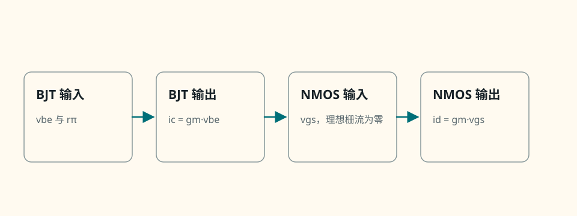{ .ae-figure }
</figure>

**图 3-18　两类晶体管的端口控制表述。** 小信号模型都以端口电压控制增量输出电流；差别之一是 BJT 输入端有 \(r_\pi\)，理想 MOS 栅端直流开路但含电容。

| 比较维度 | BJT（NPN 为例） | 增强型 NMOS | 必须附带的边界 |
|---|---|---|---|
| 主要控制变量 | 正向有源输运中 \(I_C\) 对 \(V_{BE}\) 近似指数；端口也常用 \(I_C\approx\beta I_B\) | 沟道电荷由 \(V_{GS}-V_{TH}\) 控制，\(I_D\) 还依赖 \(V_{DS}\) 与工作区 | “BJT 电流控制、MOS 电压控制”只可作粗略端口记忆，不能替代器件方程 |
| 理想直流输入电流 | \(I_B=I_C/\beta\ne0\) | \(I_G\approx0\) | MOS 动态仍要给栅电容充放电，真实栅有漏电 |
| 工作区 | 截止、正向有源、饱和；由 BE/BC 结偏置定义 | 截止、三极管、饱和；由 \(V_{GS}\) 与 \(V_{DS}\) 不等式定义 | BJT 饱和与 MOS 饱和含义相反，不能类比 |
| 小信号跨导 | \(g_m=I_C/V_T\) | 长沟道强反型饱和时 \(g_m=2I_D/V_{OV}\) | 两式都依赖 Q 点；短沟道/弱反型需换模型 |
| 同电流的 \(g_m\) | 本章模型下 \(g_m/I_C=1/V_T\approx38.6\ \mathrm{V^{-1}}\)（300 K） | \(g_m/I_D=2/V_{OV}\)，如 \(V_{OV}=0.20\ \mathrm V\) 时为 \(10\ \mathrm{V^{-1}}\) | 在给定强反型过驱动的比较中 BJT 常有更高 \(g_m\)，不是所有工艺/反型区的绝对结论 |
| 低频输入阻抗 | 基极看入约有 \(r_\pi=\beta/g_m\) | 理想栅端近似无穷大 | 偏置电阻、漏电和电容会降低实际输入阻抗 |
| 参数与温度 | \(\beta,V_{BE},I_S\) 随个体、偏置和温度；热反馈要谨慎 | \(V_{TH},k_n,\lambda\) 随工艺、体偏压和温度；短沟道偏离平方律 | 偏置设计应靠反馈和范围分析，不靠单个典型值 |
| 常见器件级用途 | 高跨导模拟前端、精密匹配结构、开关 | 高输入阻抗模拟端、集成电路与功率/数字开关 | 具体优劣还取决于噪声、速度、面积、功耗、耐压和工艺 |

**同电流示例。** 在 \(T=300\ \mathrm K,\ I_Q=1.00\ \mathrm{mA}\) 时，BJT 模型给

\[
g_{m,\mathrm{BJT}}=\frac{1.00\ \mathrm{mA}}{25.9\ \mathrm{mV}}
=38.6\ \mathrm{mS}.
\]

若长沟道 NMOS 的 \(V_{OV}=0.20\ \mathrm V\)，则

\[
g_{m,\mathrm{MOS}}=\frac{2(1.00\ \mathrm{mA})}{0.20\ \mathrm V}
=10.0\ \mathrm{mS}.
\]

这个算例只比较给定模型和给定过驱动，不证明“任何 BJT 永远优于任何 MOSFET”。若改变反型程度、器件尺寸、噪声目标、速度或工艺，结论可能变化。

### 10.2 完整分析链

- **假设：** 两器件都已偏置在可线性化的放大工作区，比较低频小信号，BJT 取正向有源，NMOS 取长沟道强反型饱和。
- **模型：** BJT 指数模型与 \(r_\pi\)；MOS 平方律与理想绝缘栅。
- **变量与参考方向：** BJT 用 \(\tilde v_{be},\tilde i_c\)，NMOS 用 \(\tilde v_{gs},\tilde i_d\)，均沿各自已定义方向。
- **基本方程：** \(g_{m,\mathrm{BJT}}=I_C/V_T\)，\(g_{m,\mathrm{MOS}}=2I_D/V_{OV}\)。
- **求解：** 只有在给定同电流、温度、过驱动和模型后才比较数值；其他维度逐项说明条件。
- **量纲检查：** \(g_m/I\) 的单位为 \(\mathrm{V^{-1}}\)，输入阻抗单位为 \(\Omega\)。
- **极限检查：** 理想 MOS 频率趋零时栅电容电流趋零；频率升高时输入不再表现为纯开路。
- **失效条件：** 弱反型、短沟道、高频、噪声、功率、击穿或热约束成为主导时，表中一阶比较不够。

### 第二遍：适用边界

比较表用于建立选择维度，不是器件选型结论。实际电路还要比较封装、成本、匹配、输入共模、输出摆幅、可靠性和制造平台。

### 30 秒回答

“更严谨地说，正向有源 BJT 的 \(I_C\) 主要由 \(V_{BE}\) 的指数输运决定，\(I_C\approx\beta I_B\) 是端口近似；NMOS 的 \(I_D\) 由 \(V_{GS}-V_{TH}\)、\(V_{DS}\) 和工作区决定。小信号时二者都可写成跨导受控电流源。BJT 需要非零基极输入电流并有 \(r_\pi\)，理想 MOS 直流栅电流近零但有动态栅电容。”

### 第二遍：90 秒回答

“我不会只说 BJT 电流控制、MOS 电压控制。BJT 微观上由 \(V_{BE}\) 改变载流子注入，正向有源端口关系可写 \(I_C\approx\beta I_B\)，但 \(\beta\) 不稳定；MOS 由绝缘栅电场改变反型沟道，直流 \(I_G\approx0\)，动态仍要搬运栅电荷。偏置后，两者都线性化成 \(\tilde i_o=g_m\tilde v_i\)。同电流时 BJT 模型有 \(g_m/I=1/V_T\)，长沟道强反型 MOS 有 \(g_m/I=2/V_{OV}\)，所以要给温度和过驱动才能比较。还要区分各自工作区，特别是 BJT 饱和是两结正偏，而 MOS 饱和是夹断后仍有电流。”

### 本节练习与递进追问

1. 在 \(300\ \mathrm K\)、同为 \(0.50\ \mathrm{mA}\) 时，比较 BJT 与 \(V_{OV}=0.25\ \mathrm V\) 长沟道 NMOS 的 \(g_m/I\)；先说明模型边界。
2. 为什么“MOS 输入阻抗无穷大”在高频不成立？若频率加倍、栅电压幅值不变，电容电流趋势如何？
3. 若任务最重视偏置对器件离散不敏感，为什么两类器件都仍需要反馈或退化，而不能只选“参数看起来更稳定”的类型？

## 11. 十二个状态判断微型案例

!!! abstract "第一次与第二遍的分工"

    第一次分别完成 B-1、B-3、B-5 和 M-1、M-3、M-5，覆盖截止、正常放大区与电压余量不足。其余六例不是删去，而是在第二遍作为只改变一个条件的迁移训练全部完成。

以下案例专门训练“假设—求解—检查”。每幅图都给出足够的独立源、电阻、模型参数和返回节点；答案紧跟案例，但不与章末 T 题重复。BJT 案例统一取 \(\beta=100\)，正向有源 \(V_{BE}=0.70\ \mathrm V\)，饱和 \(V_{BE,\mathrm{sat}}=0.80\ \mathrm V,V_{CE,\mathrm{sat}}=0.20\ \mathrm V\)；NMOS 案例统一取体接源、\(V_{DS}\ge0,V_{TH}=1.00\ \mathrm V,k_n=1.00\ \mathrm{mA/V^2}\)，忽略沟道长度调制。

### 11.1 BJT 六例

#### 状态案例 B-1：零基极驱动

<figure class="ae-figure-frame" markdown="1">
{ .ae-figure }
</figure>

**图 3-19　BJT 状态案例 B-1。** 先独立判断，再展开核对。

??? success "核对 B-1"

    截止假设给 \(I_B=I_C=0,V_B=0,V_C=5\ \mathrm V\)；\(V_{BE}=0<0.70\ \mathrm V,V_{BC}=-5\ \mathrm V\)，故答案为**截止**。

#### 状态案例 B-2：小基极驱动

<figure class="ae-figure-frame" markdown="1">
{ .ae-figure }
</figure>

**图 3-20　BJT 状态案例 B-2。** 先独立判断，再展开核对。

??? success "核对 B-2"

    假设正向有源，\(I_B=(1.0-0.70)/100\ \mathrm{k\Omega}=3.0\ \mu\mathrm A\)，\(I_C=0.300\ \mathrm{mA}\)，\(V_C=4.70\ \mathrm V\)。\(V_{BC}=0.70-4.70=-4.00\ \mathrm V<0\)，故答案为**正向有源**。

#### 状态案例 B-3：强驱动导致饱和

<figure class="ae-figure-frame" markdown="1">
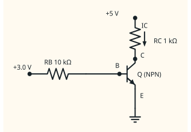{ .ae-figure }
</figure>

**图 3-21　BJT 状态案例 B-3。** 先独立判断，再展开核对。

??? success "核对 B-3"

    有源假设给 \(I_B=0.230\ \mathrm{mA},I_C=23.0\ \mathrm{mA}\)，却要求 \(V_C=5-23=-18\ \mathrm V\)，与集电负载不自洽。换饱和模型得 \(I_B=(3.0-0.80)/10\ \mathrm{k\Omega}=0.220\ \mathrm{mA}\)，\(I_C=(5.0-0.20)/1\ \mathrm{k\Omega}=4.80\ \mathrm{mA}\)，\(V_{BC}=0.60\ \mathrm V>0\)，故答案为**饱和**；此处不再令 \(I_C=\beta I_B\)。

#### 状态案例 B-4：抬高发射极后截止

<figure class="ae-figure-frame" markdown="1">
{ .ae-figure }
</figure>

**图 3-22　BJT 状态案例 B-4。** 先独立判断，再展开核对。

??? success "核对 B-4"

    截止假设给 \(V_B=1.2\ \mathrm V,V_E=1.0\ \mathrm V\)，故 \(V_{BE}=0.20\ \mathrm V<0.70\ \mathrm V\)；\(V_C=5.0\ \mathrm V,V_{BC}=-3.8\ \mathrm V\)。答案为**截止**。

#### 状态案例 B-5：抬高发射极但仍有源

<figure class="ae-figure-frame" markdown="1">
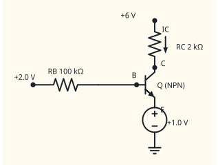{ .ae-figure }
</figure>

**图 3-23　BJT 状态案例 B-5。** 先独立判断，再展开核对。

??? success "核对 B-5"

    有源假设给 \(V_B=1.70\ \mathrm V\)，\(I_B=(2.0-1.70)/100\ \mathrm{k\Omega}=3.0\ \mu\mathrm A\)，\(I_C=0.300\ \mathrm{mA}\)，\(V_C=5.40\ \mathrm V\)。\(V_{CE}=4.40\ \mathrm V,V_{BC}=-3.70\ \mathrm V\)，故答案为**正向有源**。

#### 状态案例 B-6：低集电电源限制电流

<figure class="ae-figure-frame" markdown="1">
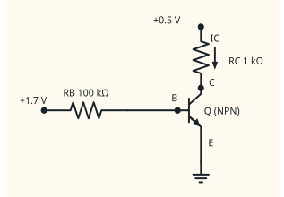{ .ae-figure }
</figure>

**图 3-24　BJT 状态案例 B-6。** 先独立判断，再展开核对。

??? success "核对 B-6"

    有源假设给 \(I_B=10.0\ \mu\mathrm A,I_C=1.00\ \mathrm{mA},V_C=-0.50\ \mathrm V\)，从而 \(V_{BC}>0\)，失败。饱和模型给 \(I_B=9.0\ \mu\mathrm A,I_C=0.300\ \mathrm{mA},V_{BC}=0.60\ \mathrm V\)；答案为**饱和**，强迫电流增益 \(I_C/I_B=33.3<100\)。

### 11.2 NMOS 六例

#### 状态案例 M-1：栅压低于阈值

<figure class="ae-figure-frame" markdown="1">
{ .ae-figure }
</figure>

**图 3-25　NMOS 状态案例 M-1。** 先独立判断，再展开核对。

??? success "核对 M-1"

    \(V_{GS}=0.50\ \mathrm V<V_{TH}\)，截止模型给 \(I_D=0,V_D=5.0\ \mathrm V,V_{DS}=5.0\ \mathrm V\)。答案为**截止**。

#### 状态案例 M-2：有足够漏源余量

<figure class="ae-figure-frame" markdown="1">
{ .ae-figure }
</figure>

**图 3-26　NMOS 状态案例 M-2。** 先独立判断，再展开核对。

??? success "核对 M-2"

    \(V_{OV}=2.0-1.0=1.0\ \mathrm V\)。NMOS 饱和区假设给 \(I_D=0.500\ \mathrm{mA},V_{DS}=V_D=4.50\ \mathrm V\ge1.0\ \mathrm V\)，故答案为 **NMOS 饱和区**。

#### 状态案例 M-3：大栅压把器件推入三极管区

<figure class="ae-figure-frame" markdown="1">
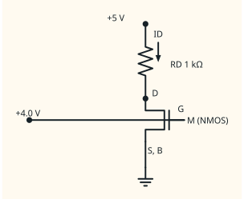{ .ae-figure }
</figure>

**图 3-27　NMOS 状态案例 M-3。** 先独立判断，再展开核对。

??? success "核对 M-3"

    饱和假设给 \(I_D=4.50\ \mathrm{mA},V_{DS}=0.50\ \mathrm V<3.0\ \mathrm V\)，失败。三极管区联立负载线 \(I_D=(5-V_{DS})/1\ \mathrm{k\Omega}\) 得 \(V_{DS}^2-8V_{DS}+10=0\)。根为 \(4\pm\sqrt6\ \mathrm V\)，只保留 \(V_{DS}=1.551\ \mathrm V<3.0\ \mathrm V\)，于是 \(I_D=3.449\ \mathrm{mA}\)。答案为**三极管区**。

#### 状态案例 M-4：源极抬高造成截止

<figure class="ae-figure-frame" markdown="1">
{ .ae-figure }
</figure>

**图 3-28　NMOS 状态案例 M-4。** 先独立判断，再展开核对。

??? success "核对 M-4"

    \(V_{GS}=1.8-1.0=0.80\ \mathrm V<V_{TH}\)，所以 \(I_D=0,V_D=5.0\ \mathrm V,V_{DS}=4.0\ \mathrm V\)。答案为**截止**。

#### 状态案例 M-5：源极抬高后仍饱和

<figure class="ae-figure-frame" markdown="1">
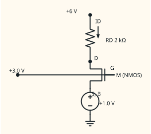{ .ae-figure }
</figure>

**图 3-29　NMOS 状态案例 M-5。** 先独立判断，再展开核对。

??? success "核对 M-5"

    \(V_{GS}=2.0\ \mathrm V,V_{OV}=1.0\ \mathrm V\)。NMOS 饱和区公式给 \(I_D=0.500\ \mathrm{mA},V_D=5.0\ \mathrm V,V_{DS}=4.0\ \mathrm V\ge1.0\ \mathrm V\)，故答案为 **NMOS 饱和区**。

#### 状态案例 M-6：低漏电源迫使三极管区

<figure class="ae-figure-frame" markdown="1">
{ .ae-figure }
</figure>

**图 3-30　NMOS 状态案例 M-6。** 先独立判断，再展开核对。

??? success "核对 M-6"

    饱和式给 \(I_D=2.00\ \mathrm{mA},V_{DS}=0<2.0\ \mathrm V\)，失败。三极管式与 \(I_D=(2-V_{DS})/1\ \mathrm{k\Omega}\) 联立，得 \(V_{DS}^2-6V_{DS}+4=0\)。只保留 \(V_{DS}=3-\sqrt5=0.764\ \mathrm V<2.0\ \mathrm V\)，于是 \(I_D=1.236\ \mathrm{mA}\)。答案为**三极管区**。

### 11.3 状态画廊的共同检查

- 六个 BJT 案例都由 \(V_{BE},V_{BC}\) 判区；低 \(V_C\) 使 BC 结正偏时，不能继续用 \(\beta I_B\)。
- 六个 MOS 案例都先算 \(V_{OV}\)，再比较 \(V_{DS}\)；大 \(V_G\) 不保证饱和，负载可能把 \(V_D\) 拉低而进入三极管区。
- 每个二次方程都同时用了器件方程和负载线；排除根的依据是候选区不等式与电源可实现范围，而不是“挑看起来顺眼的根”。

### 第二遍：适用边界

画廊使用统一的分段 BJT 模型和长沟道 NMOS 模型，只用于状态训练。真实边界连续，且参数、温度、体效应、自热、击穿及短沟道效应会移动结果。

## 12. 面试高频口答索引

下面把分散在各 P0 节的答案压成“结论—理由—边界”。练习时遮住后三列，先画参考方向，再出声回答。

| 高频问题 | 30 秒回答 | 90 秒回答扩展 | 适用边界与递进追问 |
|---|---|---|---|
| 为什么 BJT 能放大？ | 先用直流偏置建立正向有源 Q 点，再让小 \(v_{be}\) 通过 \(g_m=I_{CQ}/V_T\) 产生较大的可预测 \(i_c\) 增量；能量来自直流电源，不来自输入信号本身。 | 补发射极注入—薄基区扩散—BC 结收集的物理链，再从指数式在 Q 点求导；说明无偏置或信号过大会跨截止/饱和并失真。 | 边界：正向有源、低频、\(\lvert\tilde v_{be}\rvert\ll V_T\)。追问一：输出能量从哪里来？追问二：为什么 Q 点太靠近截止会失真？ |
| \(\beta\) 是什么，为什么不可靠？ | 正向有源时 \(\beta=I_C/I_B\)，且 \(\beta=\alpha/(1-\alpha)\)；它随个体、偏置、温度和 \(V_{CE}\) 变，不能当精密常数。 | 从 \(I_E=I_B+I_C\) 推出与 \(\alpha\) 的关系；强调 \(\beta I_B\) 是端口近似，饱和时集电流由外电路限制，应靠发射极反馈稳定偏置。 | 边界：只在给定正向有源工作点附近。追问一：\(\alpha\) 接近 1 时为何 \(\beta\) 很敏感？追问二：怎样降低偏置对 \(\beta\) 的依赖？ |
| 怎样判断 BJT 工作区？ | 假设区域、代模型、列 KCL/KVL、求解，再检查 \(V_{BE},V_{BC}\) 和电流方向；矛盾就换区。 | 截止是两结不正偏，正向有源是 BE 正偏/BC 反偏，饱和是两结都正偏；有源假设若给 \(V_{BC}>0\)，立即停止使用 \(\beta I_B\)。 | 边界：结偏置过渡连续，分段压降由题设决定。追问一：为何只看 \(V_{CE}\) 不够根本？追问二：BJT 饱和与 MOS 饱和有何不同？ |
| 为什么 MOS 栅电流约为零？ | 栅与半导体之间有绝缘氧化层，理想稳态没有导电通路，所以 \(I_G\approx0\)。 | 栅电场仍能通过电容耦合改变表面电荷，先耗尽再反型；动态时有 \(i=C\,\mathrm dv/\mathrm dt\) 和栅电荷，实际还有漏电与氧化层击穿。 | 边界：只指理想低频直流。追问一：开关损耗为何仍与栅电荷有关？追问二：输入电阻能否在任意频率都视为无穷大？ |
| NMOS 三个区怎样区分？ | 先算 \(V_{OV}=V_{GS}-V_{TH}\)：低于阈值截止；\(0\le V_{DS}<V_{OV}\) 为三极管；\(V_{DS}\ge V_{OV}\) 为饱和。 | 给出两区电流式，说明 \(V_{DS}=V_{OV}\) 时连续；夹断是漏端反型电荷趋零，载流子仍被电场扫到漏端。 | 边界：体接源、\(V_{DS}\ge0\)、长沟道强反型。追问一：为何大 \(V_G\) 仍可能处于三极管区？追问二：夹断为何不是断路？ |
| 怎样推导 \(g_m\)？ | 在 Q 点对控制电压求导：BJT 得 \(I_{CQ}/V_T\)，长沟道饱和 NMOS 得 \(k_nV_{OVQ}=2I_{DQ}/V_{OVQ}\)。 | 先写总量=直流+增量，再作一阶泰勒展开；BJT 的小量尺度是 \(V_T\)，MOS 平方律的尺度是 \(V_{OVQ}\)，并说明二阶项和跨区边界。 | 边界：必须已有稳定 Q 点且增量足够小。追问一：同电流时两者 \(g_m/I\) 如何比较？追问二：信号变大后首先丢失什么？ |
| 怎样严谨表述 BJT 与 MOS 的“控制”？ | BJT 正向有源电流主要由 \(V_{BE}\) 指数输运决定，\(\beta I_B\) 是端口关系；MOS 漏电流由栅场建立的 \(V_{OV}\) 与 \(V_{DS}\) 决定。 | 小信号时两者都可写电压控制的跨导源；BJT 基极有非零电流和 \(r_\pi\)，理想 MOS 直流栅电流近零但有电容。选择还受噪声、速度、功率与工艺约束。 | 边界：口语简称不能替代模型。追问一：为何 MOS 不是“完全不需要输入电流”？追问二：为何不能无条件说 BJT 的 \(g_m\) 总更大？ |

### 第二遍：适用边界

口答索引不能替代题图。面试官一旦改变温度、参考方向、体连接、漏源极性、频率或器件模型，应回到“假设 → 模型 → 变量与参考方向 → 基本方程 → 求解 → 量纲 → 极限 → 失效条件”重新作答。

## 13. 章末概念检查表

进入基本放大电路前，逐项确认自己能在白纸上完成：

- [ ] 能画 NPN 的 E/B/C 结构，标 \(I_B,I_C\) 入器件、\(I_E\) 出器件，以及 \(V_{BE},V_{CE},V_{BC}\)；
- [ ] 能解释发射极注入、薄基区扩散与集电结收集，不把 \(I_B\) 当作简单微观原因；
- [ ] 能区分永远成立的 \(I_E=I_B+I_C\)、正向有源的 \(\beta,\alpha\) 关系和指数输运式；
- [ ] 能由两个 PN 结偏置判断 BJT 截止、正向有源、饱和，并执行假设检查；
- [ ] 能求固定偏置与分压—发射极电阻偏置 Q 点，画外电路负载线并讨论敏感性；
- [ ] 能从指数式推出 \(g_m=I_{CQ}/V_T,r_\pi=\beta/g_m,r_e\approx1/g_m\)；
- [ ] 能画增强型 NMOS 截面，说明耗尽、反型、阈值、绝缘栅和动态栅电流；
- [ ] 能定义 \(I_D,V_{GS},V_{DS},V_{OV},k_n\)，并写出三个工作区条件和两条电流式；
- [ ] 能证明 \(V_{DS}=V_{OV}\) 时三极管式与饱和式连续，并解释夹断不等于零电流；
- [ ] 能求固定栅压和栅分压—源电阻偏置 Q 点，筛除非物理解并检查区域；
- [ ] 能推出 MOS \(g_m=k_nV_{OVQ}=2I_{DQ}/V_{OVQ}\)，说明 \(\lambda,r_o\) 与体效应；
- [ ] 能用完整限定语比较 BJT 与 MOS，而不机械背“电流控制/电压控制”。

## 14. 常见错误与快速纠正

| 常见错误 | 为什么错 | 快速纠正 |
|---|---|---|
| 把 \(I_B\) 说成 \(I_C\) 的简单微观原因 | 两者来自同一载流子注入与输运过程 | 先说 \(V_{BE}\) 改变注入，再说少量复合和大部分收集 |
| 在任何区都写 \(I_C=\beta I_B\) | \(\beta\) 近似只适用于正向有源 | 饱和时改用两个结正偏或给定 \(V_{CE,\mathrm{sat}}\) 模型 |
| 忘记 \(I_E=I_B+I_C\) 的参考方向 | KCL 是代数关系，箭头不同会改符号 | 每图先标 \(I_B,I_C\) 入、\(I_E\) 出 |
| 把 \(V_{BE}=0.70\ \mathrm V\) 当材料定律 | 它是有限工作区的恒压降模型 | 说明模型；问物理时回到指数式和温度依赖 |
| 有源假设求完不查 \(V_{BC}\) | 可能已经把集电极压得比基极低 | 计算 \(V_{BC}=V_B-V_C\)，失败就换饱和模型 |
| 把 BJT 饱和与 MOS 饱和混为一谈 | 前者两结正偏，后者沟道夹断后仍导电 | 分别用结偏置与 \(V_{DS}\ge V_{OV}\) 定义 |
| 说 MOS 栅极完全没有电流 | 只在理想直流下近零 | 动态加栅电容/栅电荷，真实器件加漏电与耐压 |
| 只看 \(V_{GS}>V_{TH}\) 就说 MOS 饱和 | 这只说明强反型候选 | 还必须比较 \(V_{DS}\) 与 \(V_{OV}\) |
| 把夹断说成沟道断路 | 夹断区仍由电场输运载流子 | 用边界连续和 \(I_D\ne0\) 反证 |
| 二次方程两个根都保留 | 某根常违反 \(V_{OV}\ge0\) 或区域范围 | 把每个根代回全部不等式 |
| 混淆 Q 点总量和小信号增量 | \(g_m,r_\pi\) 是切线参数，不是直流比值 | 明写 \(v=V_Q+\tilde v\)、\(i=I_Q+\tilde i\) |
| 无条件套用平方律 | 现代短沟道、弱反型会明显偏离 | 先声明长沟道强反型，否则用工艺模型 |
| 忽略 \(r_o\) 的正负号与参考 | 输出电流随输出电压的斜率依方向而定 | 沿本章方向写 \(g_o>0,r_o=1/g_o>0\) |
| 用典型 \(\beta\) 或 \(V_{TH}\) 做唯一偏置结论 | 器件和温度离散会移动 Q 点 | 做参数范围分析并引入发射极/源极反馈 |

## 15. 章末练习：使用带图题库

本章题面统一放在[练习题 T-01～T-14](../exercises/练习题.md#t-01)。端子、工作区、偏置电路与趋势题已附对应图；纯模型边界和参数证明题刻意不配装饰性图。

!!! warning "作答顺序"

    先判工作区，再选模型和列方程；算完必须回查 BJT 两个结或 MOS 的 $V_{GS},V_{DS},V_{OV}$。独立完成后再打开[详细解答 T-01～T-14](../exercises/详细解答.md#t-01)。

能从 Q 点进入小信号模型后，再进入[第 4 章](04-基本放大电路.md)。
