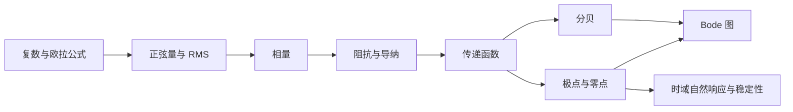
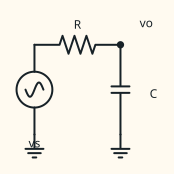

# 工具章　交流、相量、拉普拉斯与频域分析

本章补齐从时域电路进入频率响应所需的数学与电路工具。它不要求预先学过复变函数或拉普拉斯变换；每个新符号都从正弦信号、元件本构关系和 KCL/KVL 引入。

!!! important "冲刺必会"

    第一次阅读完成第 1～7 节、第 8.1～8.2 节、第 9.1 节、第 10.1～10.2 节和第 10.4 节。目标是会把同频正弦量变成相量、写出 $R/L/C$ 的阻抗、求 $H(j\omega)$，并把一阶 RC 的极点、Bode 图、截止频率和时间常数连起来。第 9.2 节的右半平面零点和第 10.3 节的多转折例题放在第二遍。

!!! warning "三组符号不能混用"

    $v(t)$ 是随时间变化的真实量，$\tilde V$ 是某一频率下的复相量，$V(s)$ 是拉普拉斯域函数；$s=\sigma+j\omega$ 是复变量，而 $j\omega$ 只是虚轴上的取值。每次计算先声明自己处在哪个域。

!!! tip "面试加分"

    不只报结论，还要能从元件本构关系推出阻抗，从传递函数的因子解释 Bode 斜率与相位，并把 RC 的极点、时间常数、截止频率和阶跃快慢连成同一条因果链。

!!! note "考后深入"

    第二遍再系统学习复功率、拉普拉斯变换的更多初值情形、右半平面零点、多转折精确叠加和非最小相位系统。第一次仍需读第 8.1～8.2 节与第 9.1 节，因为后续反馈章会直接使用 $s$、极点和左/右半平面的基本含义。

## 1. 从正弦量到频率响应

前置知识是[第 1 章](01-最小电路基础.md)的参考方向、KCL/KVL、电阻与电容本构关系和一阶 RC 暂态。线性代数只用到复数的加、乘、除；微积分只用到正弦的导数和指数函数。

**图 T-1　工具之间的依赖。** 相量是稳态正弦计算工具；拉普拉斯变换还能描述暂态和初始条件；Bode 图是传递函数在 $s=j\omega$ 上的幅值与相位表示。

学完后，你应当能够：

1. 在直角式、极坐标式和指数式之间转换复数，并正确做乘除；
2. 区分峰值、峰峰值和有效值（RMS），从定义推出正弦的 RMS；
3. 说明相量法为何把微分变成乘 $j\omega$，并说出它的适用范围；
4. 从元件本构关系推出 $Z_R,Z_L,Z_C$，用复数 KCL/KVL 求稳态幅相；
5. 区分 $H(s)$ 与 $H(j\omega)$，从电路推导 RC 低通和高通；
6. 正确使用 $20\log_{10}$ 与 $10\log_{10}$，解释 $-3.0103\ \mathrm{dB}$；
7. 从极点、零点手绘 Bode 渐近线，判断自然响应和稳定性。

| 阅读层级 | 必须完成 | 建议用时 |
|---|---|---:|
| 第一遍 | 第 1～7 节、8.1～8.2、9.1、10.1～10.2、10.4，以及自检 1～5、7 | 4～6 小时 |
| 完整掌握 | 第 8～10 节全部推导、练习与口述 | 8～12 小时 |

## 2. 复数不是额外的物理量，而是二维运算工具

### 2.1 三种表示

虚数单位记为 $j$，满足 $j^2=-1$。电路中不用 $i$ 表示虚数单位，是为了避免与电流 $i(t)$ 混淆。复数

\[
z=x+jy
\]

的实部为 $x$，虚部为 $y$。它在复平面上对应点 $(x,y)$，因此模与相角为

\[
|z|=\sqrt{x^2+y^2},\qquad
\angle z=\operatorname{atan2}(y,x).
\]

用欧拉公式

\[
e^{j\theta}=\cos\theta+j\sin\theta
\]

可把同一个复数写成

\[
z=x+jy=|z|(\cos\theta+j\sin\theta)=|z|e^{j\theta}=|z|\angle\theta.
\]

最后一个“角形式”是工程简写，不是普通乘法符号。由指数律直接得到：

\[
z_1z_2=|z_1||z_2|e^{j(\theta_1+\theta_2)},\qquad
\frac{z_1}{z_2}=\frac{|z_1|}{|z_2|}e^{j(\theta_1-\theta_2)}.
\]

所以复数**加减用直角式方便，乘除用极坐标式方便**。例如

\[
(3+j4)=5\angle53.13^\circ,
\qquad
\frac{10\angle20^\circ}{2\angle(-40^\circ)}=5\angle60^\circ.
\]

### 2.2 共轭、模平方与象限

$z=x+jy$ 的共轭是 $z^*=x-jy$，并有

\[
zz^*=x^2+y^2=|z|^2,
\qquad
\frac1z=\frac{z^*}{|z|^2}.
\]

求相角不能只算 $\arctan(y/x)$，因为它无法区分相差 $180^\circ$ 的象限。应使用带象限信息的 $\operatorname{atan2}(y,x)$，或先看实部、虚部符号再修正。

### 2.3 为什么欧拉公式能表示旋转

把指数级数分别收集偶次项和奇次项：

\[
e^{j\theta}
=1+j\theta+\frac{(j\theta)^2}{2!}+\frac{(j\theta)^3}{3!}+\cdots
=\left(1-\frac{\theta^2}{2!}+\cdots\right)
+j\left(\theta-\frac{\theta^3}{3!}+\cdots\right),
\]

括号内正是 $\cos\theta$ 与 $\sin\theta$ 的级数。乘 $e^{j\theta}$ 会保持模不变并让相角增加 $\theta$，所以复指数天然描述平面旋转。

## 3. 正弦信号、相位与有效值

### 3.1 四个参数必须分清

正弦电压可写成

\[
v(t)=V_m\cos(\omega t+\phi),
\]

其中 $V_m\ge0$ 是峰值，

\[
\omega=2\pi f,\qquad T=\frac1f=\frac{2\pi}{\omega}
\]

分别是角频率、频率和周期；
$\phi$ 是初相位。峰峰值为 $V_{pp}=2V_m$。若信号写成正弦函数，要先用

\[
\sin\alpha=\cos(\alpha-90^\circ)
\]

转换到统一的余弦约定，再比较相位。

时间平移与相位的关系是

\[
v(t-t_0)=V_m\cos[\omega t+(\phi-\omega t_0)].
\]

所以向右延迟 $t_0$ 对应相位减少 $\omega t_0$，不能脱离频率说“延迟固定角度”。比较“谁超前谁”还必须确认两者频率相同。

### 3.2 RMS 从功率等效定义出来

周期量 $x(t)$ 的均方根（root mean square，RMS）定义为

\[
X_{\mathrm{rms}}
=\sqrt{\frac1T\int_{t_0}^{t_0+T}x^2(t)\,\mathrm dt}.
\]

之所以平方、平均再开方，是因为电阻平均功率

\[
P=\frac1T\int_0^T\frac{v^2(t)}R\,\mathrm dt
=\frac{V_{\mathrm{rms}}^2}{R}.
\]

因此 RMS 是“产生相同电阻平均功率的直流值”，不是普通时间平均。对正弦量，利用
$\cos^2x=(1+\cos2x)/2$：

\[
V_{\mathrm{rms}}
=\sqrt{\frac1T\int_0^T V_m^2\cos^2(\omega t+\phi)\,\mathrm dt}
=\frac{V_m}{\sqrt2}.
\]

正弦一周期的普通平均值为零，但 RMS 非零。只有纯正弦才可直接用“峰值除以 $\sqrt2$”；方波、脉冲和带直流偏置波形必须回到定义。

## 4. 相量：只保留同频正弦的幅值与相位

### 4.1 从复指数得到相量

由欧拉公式，真实正弦量可写为复指数的实部：

\[
v(t)=V_m\cos(\omega t+\phi)
=\Re\{V_me^{j\phi}e^{j\omega t}\}.
\]

对固定频率 $\omega$，所有量都含共同因子 $e^{j\omega t}$。定义峰值相量

\[
\tilde V=V_me^{j\phi}=V_m\angle\phi.
\]

也可统一采用 RMS 相量 $\tilde V=V_{\mathrm{rms}}\angle\phi$。两种约定都能算电压比和电流比，但计算功率时必须知道自己用的是峰值还是 RMS。本书涉及功率时默认 RMS 相量；只求增益时两者比值相同。

例：

\[
v_1(t)=3\cos(\omega t+20^\circ),\quad
v_2(t)=4\cos(\omega t-70^\circ).
\]

其峰值相量为 $\tilde V_1=3\angle20^\circ$、$\tilde V_2=4\angle(-70^\circ)$。求和必须先转直角式：

\[
\tilde V=\tilde V_1+\tilde V_2
=(3\cos20^\circ+j3\sin20^\circ)
+(4\cos(-70^\circ)+j4\sin(-70^\circ)).
\]

算得 $\tilde V\approx4.19-j2.73=5.00\angle(-33.1^\circ)$，故
$v(t)=5.00\cos(\omega t-33.1^\circ)$。

### 4.2 微分为什么变成乘 jω

\[
\frac{\mathrm d}{\mathrm dt}\left(\tilde Ve^{j\omega t}\right)
=j\omega\tilde Ve^{j\omega t}.
\]

取实部不改变线性运算结果，因此在相量域中

\[
\frac{\mathrm d}{\mathrm dt}\longleftrightarrow j\omega,
\qquad
\int \mathrm dt\longleftrightarrow \frac1{j\omega}.
\]

乘 $j=e^{j90^\circ}$ 表示相位增加 $90^\circ$，所以正弦的导数超前原信号 $90^\circ$。积分还可能包含由初值决定的常数；相量法只描述稳态正弦部分，不保留启动暂态。

### 4.3 相量法的边界

相量法成立需要：

1. 电路在所考察范围内线性且参数不随时间变化；
2. 已进入单一角频率 $\omega$ 的正弦稳态；
3. 所有相加的相量对应同一频率。

不同频率不能直接用一个相量相加。可利用线性叠加分别求每个频率的响应，再回到时域相加。开关启动、削顶、整流和器件跨工作区属于暂态或非线性问题，不能只靠一个相量解决。

## 5. 阻抗与导纳：把微分本构关系写成代数关系

### 5.1 定义与三种理想元件

在同一频率下定义阻抗

\[
Z(j\omega)=\frac{\tilde V}{\tilde I},
\]

单位仍为欧姆。导纳 $Y=1/Z=\tilde I/\tilde V$，单位西门子（S）。阻抗是复数比例，不是“带相位的电阻”；其实部和虚部代表不同的能量行为。

电阻 $v=Ri$ 直接给出

\[
\boxed{Z_R=R}.
\]

电感采用关联参考方向时 $v_L=L\,\mathrm di_L/\mathrm dt$，故

\[
\tilde V_L=j\omega L\tilde I_L,
\qquad
\boxed{Z_L=j\omega L=\omega L\angle90^\circ}.
\]

电容 $i_C=C\,\mathrm dv_C/\mathrm dt$，故

\[
\tilde I_C=j\omega C\tilde V_C,
\qquad
\boxed{Z_C=\frac1{j\omega C}=-\frac j{\omega C}
=\frac1{\omega C}\angle(-90^\circ)}.
\]

由 $\tilde V=Z\tilde I$ 可读出：电感电压超前电流 $90^\circ$，电容电压滞后电流 $90^\circ$，等价地说电容电流超前电压 $90^\circ$。

### 5.2 极限检查比背口诀可靠

| 元件 | $\omega\to0$ | $\omega\to\infty$ | 物理解释 |
|---|---|---|---|
| $R$ | $Z_R=R$ | $Z_R=R$ | 理想模型不随频率变 |
| $L$ | $Z_L\to0$ | $|Z_L|\to\infty$ | 直流稳态短路；阻碍快速电流变化 |
| $C$ | $|Z_C|\to\infty$ | $Z_C\to0$ | 直流稳态开路；快速变化更易形成电流 |

这里的开路、短路都是理想模型极限。实际电容有漏电、等效串联电阻和寄生电感，实际电感有绕组电阻、磁芯损耗与自谐振。

### 5.3 KCL/KVL、串并联和分压仍成立

相量域仍满足 KCL/KVL，因为它们是线性守恒方程。串联阻抗相加，并联导纳相加：

\[
Z_{\mathrm{series}}=\sum_k Z_k,
\qquad
Y_{\mathrm{parallel}}=\sum_k\frac1{Z_k}.
\]

两个串联阻抗的分压为

\[
\tilde V_2=\tilde V_s\frac{Z_2}{Z_1+Z_2}.
\]

必须做复数除法；不能把阻抗模先当电阻分压，因为那会丢失相位，也通常会算错幅值。

### 5.4 第二遍：复功率

采用 RMS 相量并采用关联参考方向时，定义复功率

\[
\boxed{S=\tilde V\tilde I^*=P+jQ}.
\]

$P=\Re\{S\}$ 是平均有功功率，单位 W；$Q=\Im\{S\}$ 是无功功率，单位 var；
$|S|=V_{\mathrm{rms}}I_{\mathrm{rms}}$ 是视在功率，单位 VA。若 $Z=R+jX$，则

\[
P=I_{\mathrm{rms}}^2R,
\qquad
Q=I_{\mathrm{rms}}^2X.
\]

理想电阻 $Q=0$；理想电感 $Q>0$；理想电容 $Q<0$。理想电抗元件一周期平均功率为零，但瞬时功率不恒为零：能量在源与储能元件之间往返。

## 6. 传递函数：把“输入怎样变成输出”写成一个比值

### 6.1 传递函数 H(s) 的定义

对线性时不变系统，在**零初始条件**下定义传递函数

\[
\boxed{H(s)=\frac{Y(s)}{X(s)}}.
\]

零初始条件很重要：传递函数描述输入到输出的系统关系，不把电容初始电压或电感初始电流产生的独立响应混进分子。频率响应是传递函数在虚轴上的取值：

\[
\boxed{H(j\omega)=H(s)\big|_{s=j\omega}},
\]

前提是该频率的稳态响应存在。若
$\tilde Y=H(j\omega)\tilde X$，则

\[
\frac{Y_m}{X_m}=|H(j\omega)|,
\qquad
\phi_y-\phi_x=\angle H(j\omega).
\]

### 6.2 用阻抗直接推 RC 低通

串联 $R,C$，输出取电容两端。以 $Z_C=1/(sC)$ 作分压：

\[
H_{LP}(s)=\frac{Z_C}{R+Z_C}
=\frac{1}{1+sRC}.
\]

令 $\tau=RC$、$\omega_c=1/RC$，则

\[
H_{LP}(j\omega)=\frac1{1+j\omega/\omega_c},
\]

\[
|H_{LP}|=\frac1{\sqrt{1+(\omega/\omega_c)^2}},
\qquad
\angle H_{LP}=-\arctan(\omega/\omega_c).
\]

三项自检：$\omega\to0$ 时电容近似开路且 $v_o\approx v_i$；
$\omega\to\infty$ 时电容近似短路且 $v_o\to0$；
$\omega=\omega_c$ 时模为 $1/\sqrt2$，相位为 $-45^\circ$。

### 6.3 用阻抗直接推 RC 高通

同一串联 $R,C$，输出改取电阻两端：

\[
H_{HP}(s)=\frac{R}{R+1/(sC)}
=\frac{sRC}{1+sRC}
=\frac{s/\omega_c}{1+s/\omega_c}.
\]

因此

\[
|H_{HP}|=\frac{\omega/\omega_c}{\sqrt{1+(\omega/\omega_c)^2}},
\qquad
\angle H_{HP}=90^\circ-\arctan(\omega/\omega_c).
\]

低频为零、高频趋近 1，在角频率处也是 $1/\sqrt2$ 和 $+45^\circ$。注意：高通在 $s=0$ 有一个零点，低通没有。

## 7. 分贝：把乘法变成加法，把宽动态范围压缩

### 7.1 功率比与幅值比

功率比的分贝定义为

\[
G_P(\mathrm{dB})=10\log_{10}\frac{P_2}{P_1}.
\]

若比较的是相同电阻或等效参考条件下的电压幅值，因为 $P\propto V^2$，则

\[
G_V(\mathrm{dB})
=10\log_{10}\frac{V_2^2}{V_1^2}
=20\log_{10}\left|\frac{V_2}{V_1}\right|.
\]

电流幅值比同理使用 $20\log_{10}$，但必须有相同阻抗条件。不能把任意两个端口的电压比直接解释成功率增益。

| 幅值比 | 分贝 | 功率比 | 分贝 |
|---:|---:|---:|---:|
| $10$ | $+20\ \mathrm{dB}$ | $10$ | $+10\ \mathrm{dB}$ |
| $2$ | $+6.02\ \mathrm{dB}$ | $2$ | $+3.01\ \mathrm{dB}$ |
| $1$ | $0\ \mathrm{dB}$ | $1$ | $0\ \mathrm{dB}$ |
| $1/\sqrt2$ | $-3.0103\ \mathrm{dB}$ | $1/2$ | $-3.0103\ \mathrm{dB}$ |
| $0.1$ | $-20\ \mathrm{dB}$ | $0.1$ | $-10\ \mathrm{dB}$ |

于是“幅值下降到 $1/\sqrt2$”和“相同阻抗下功率减半”都对应 $-3.0103\ \mathrm{dB}$，但它们使用的对数系数不同。

### 7.2 级联为何能相加

若总传递为 $H=H_1H_2\cdots H_n$，则

\[
20\log_{10}|H|
=\sum_k20\log_{10}|H_k|,
\qquad
\angle H=\sum_k\angle H_k.
\]

这正是 Bode 图适合分析多级、多极点系统的原因。

## 8. 拉普拉斯变换：把暂态、初值和自然响应放回模型

### 8.1 从复变量 s 开始

单边拉普拉斯变换定义为

\[
F(s)=\mathcal L\{f(t)\}
=\int_{0^-}^{\infty}f(t)e^{-st}\,\mathrm dt,
\qquad s=\sigma+j\omega.
\]

因为
$e^{-st}=e^{-\sigma t}e^{-j\omega t}$，实部 $\sigma$ 控制指数加权，虚部 $\omega$ 对应旋转频率。只写 $s=j\omega$ 等于只看复平面的虚轴，并不等于整个 $s$ 平面。

导数变换为

\[
\mathcal L\left\{\frac{\mathrm df}{\mathrm dt}\right\}
=sF(s)-f(0^-).
\]

这说明相量法的“微分乘 $j\omega$”省略了初始条件；拉普拉斯法则把初值显式保留。常见变换包括

\[
\mathcal L\{u(t)\}=\frac1s,
\qquad
\mathcal L\{e^{-at}u(t)\}=\frac1{s+a},
\]

其中 $u(t)$ 是单位阶跃：$t<0$ 时为 0，$t>0$ 时为 1。

### 8.2 RC 自然响应与传递函数是同一个极点

低通零状态传递函数为

\[
H(s)=\frac1{1+sRC}=\frac{1/RC}{s+1/RC}.
\]

其分母根

\[
p=-\frac1{RC}
\]

正是暂态 $e^{-t/RC}$ 的指数率。对 1 V 单位阶跃 $X(s)=1/s$：

\[
Y(s)=\frac1{s(1+sRC)}
=\frac1s-\frac1{s+1/RC},
\]

逆变换得到

\[
y(t)=\left(1-e^{-t/RC}\right)u(t).
\]

所以第 1 章的时间常数、截止角频率和极点位置是同一件事的三种表达：

\[
\boxed{\tau=RC,\qquad \omega_c=\frac1\tau,\qquad p=-\frac1\tau}.
\]

## 9. 极点、零点与稳定性

### 9.1 定义

把有理传递函数写为

\[
H(s)=K\frac{(s-z_1)(s-z_2)\cdots}{(s-p_1)(s-p_2)\cdots}.
\]

使分子为零的 $z_k$ 是零点，使分母为零的 $p_k$ 是极点。约分前必须确认被约掉的内部动态是否真的不可见；实际系统中近似抵消对元件偏差非常敏感。

极点决定零输入自然响应。例如一阶极点 $p=\sigma+j\omega_d$ 对应

\[
e^{pt}=e^{\sigma t}[\cos(\omega_dt)+j\sin(\omega_dt)].
\]

- $\sigma<0$：包络衰减，极点在左半平面（left half-plane，LHP）；
- $\sigma>0$：包络增长，极点在右半平面（right half-plane，RHP）；
- $\sigma=0$：不衰减，位于虚轴；是否满足工程稳定要求还要看重根、非线性和扰动。

对因果有理连续时间系统，所有极点严格位于 LHP 是有界输入—有界输出稳定的常用判据。

### 9.2 零点改变“怎样看见动态”

零点改变频率响应的幅值和相位，也可能消去某个输出中可见的模态，但通常不决定内部自然模态是否增长。LHP 零点 $1+s/\omega_z$ 与 RHP 零点 $1-s/\omega_z$ 在 $s=j\omega$ 上的幅值相同：

\[
|1+j\omega/\omega_z|
=|1-j\omega/\omega_z|,
\]

但相位分别为 $+\arctan(\omega/\omega_z)$ 和
$-\arctan(\omega/\omega_z)$。因此只看幅频图无法判断零点在左半平面还是右半平面；RHP 零点提供额外相位滞后，常限制反馈可实现带宽。

## 10. Bode 图：把每个因子的贡献逐项相加

### 10.1 标准因子与渐近规则

先把传递函数化为

\[
H(s)=K\,s^{n_z-n_p}
\frac{\prod_k(1+s/\omega_{zk})}
{\prod_m(1+s/\omega_{pm})}.
\]

再按从低频到高频的顺序累加：

| 因子 | 幅值渐近线 | 相位 |
|---|---|---|
| $K$ | $20\log_{10}|K|$ 常数 | $K>0$ 为 $0^\circ$，$K<0$ 为 $180^\circ$ 或 $-180^\circ$ |
| $s$ | $+20\ \mathrm{dB/dec}$ | $+90^\circ$ |
| $1/s$ | $-20\ \mathrm{dB/dec}$ | $-90^\circ$ |
| $1+s/\omega_z$ | 过 $\omega_z$ 后多 $+20\ \mathrm{dB/dec}$ | $0^\circ\to+90^\circ$ |
| $1/(1+s/\omega_p)$ | 过 $\omega_p$ 后多 $-20\ \mathrm{dB/dec}$ | $0^\circ\to-90^\circ$ |

“每十倍频”（decade）是频率乘 10；“每倍频程”（octave）是频率乘 2。一阶斜率
$20\ \mathrm{dB/dec}\approx6.02\ \mathrm{dB/oct}$。

一阶 LHP 因子的相位过渡通常在角频率前后一 decade 内近似绘制：
$0.1\omega_c$ 附近开始，$\omega_c$ 处为 $\pm45^\circ$，
$10\omega_c$ 附近接近 $\pm90^\circ$。这是手绘近似，不是精确相位突然改变。

### 10.2 角点修正

对一阶极点

\[
\left|\frac1{1+j\omega/\omega_p}\right|
=\frac1{\sqrt{1+(\omega/\omega_p)^2}}.
\]

低频渐近线是 $0\ \mathrm{dB}$，高频渐近线是
$-20\log_{10}(\omega/\omega_p)$。在角频率两条渐近线相交于
$0\ \mathrm{dB}$，精确值却是 $-3.0103\ \mathrm{dB}$。一阶零点的角点修正方向相反，为 $+3.0103\ \mathrm{dB}$。多个相近因子的精确值要把各因子模相乘，不能只看其中一个角频率。

### 10.3 完整手绘例子

给定

\[
H(s)=10\frac{1+s/(2\pi100)}
{[1+s/(2\pi1000)][1+s/(2\pi10000)]}.
\]

按频率递增列斜率：

1. $f<100\ \mathrm{Hz}$：由 $K=10$ 从 $20\ \mathrm{dB}$ 开始，斜率 0；
2. 过 $100\ \mathrm{Hz}$ 的零点：斜率变为 $+20\ \mathrm{dB/dec}$；
3. 过 $1\ \mathrm{kHz}$ 的极点：斜率回到 0；
4. 过 $10\ \mathrm{kHz}$ 的极点：斜率变为 $-20\ \mathrm{dB/dec}$。

相位是三个因子相位的代数和：

\[
\angle H(j\omega)
=\arctan\frac{f}{100}
-\arctan\frac{f}{1000}
-\arctan\frac{f}{10000}.
\]

画完必须做两端检查：低频相位趋近 $0^\circ$，高频净相位趋近
$+90^\circ-90^\circ-90^\circ=-90^\circ$；高频净斜率也应是
$-20\ \mathrm{dB/dec}$。

### 10.4 RC 低通、高通的图与时域对应

<figure class="ae-figure-frame" markdown="1">

{ .ae-figure }

<figcaption markdown="1">图 T-2　RC 低通：输出取电容两端。由复阻抗分压得 $H(s)=1/(1+sRC)$，同一极点同时决定 $-3\ \mathrm{dB}$ 角频率与阶跃指数衰减率。</figcaption>
</figure>

<figure class="ae-figure-frame" markdown="1">

{ .ae-figure }

<figcaption markdown="1">图 T-3　RC 高通：输出取电阻两端。$s=0$ 的零点使直流增益为零，$s=-1/RC$ 的极点决定过渡尺度。</figcaption>
</figure>

低通对 1 V 阶跃的零状态响应为
$1-e^{-t/RC}$；高通对同一阶跃的响应为 $e^{-t/RC}$。两者的频域角频率和时域时间常数满足

\[
f_c=\frac1{2\pi RC},
\qquad
\tau=RC,
\qquad
2\pi f_c\tau=1.
\]

这不是“频域公式与时域公式碰巧相似”，而是它们来自同一个分母
$1+sRC$。

## 11. 常见错误与修正

| 错误 | 为什么错 | 修正动作 |
|---|---|---|
| 把 $j\omega C$ 写成电容阻抗 | 它是电容导纳 | 写 $Y_C=j\omega C, Z_C=1/(j\omega C)$ |
| 不同频率的相量直接相加 | 公因子 $e^{j\omega t}$ 不同 | 分频率求解后回到时域相加 |
| 用阻抗的模做分压 | 丢失复数相位，幅值也可能错 | 先做完整复数除法，最后取模和角 |
| 任意幅值比都用 $10\log$ | 幅值平方才与功率成比例 | 幅值比用 $20\log$，功率比用 $10\log$ |
| 说 $-3\ \mathrm{dB}$ 是“幅值减半” | 幅值是 $1/\sqrt2$，功率才减半 | 同时报出幅值比和功率条件 |
| 把 $s$ 与 $j\omega$ 当同一符号 | 前者覆盖复平面，后者只在虚轴 | 先求 $H(s)$，稳态频响再代 $s=j\omega$ |
| 只凭极点角频率找多极点 $-3\ \mathrm{dB}$ 点 | 相邻因子共同贡献幅值 | 对总模方程求解或数值核对 |
| 只看幅频图区分 LHP/RHP 零点 | 两者幅值相同、相位相反 | 同时检查相频和物理响应 |

## 12. 章末自检与口述

### 12.1 计算自检

1. 把 $z=-3+j4$ 写成极坐标式，并说明相角所在象限。
2. 把 $2\sin(1000t+30^\circ)$ 写成余弦形式和峰值相量。
3. 对 $R=1.0\ \mathrm{k\Omega},C=100\ \mathrm{nF},f=1.0\ \mathrm{kHz}$，求 $Z_C$ 的直角式与极坐标式。
4. 推导 RC 低通在 $0.1f_c,f_c,10f_c$ 的幅值和相位，并与渐近线比较。
5. 证明幅值比 2 对应 $+6.02\ \mathrm{dB}$，幅值比 $1/\sqrt2$ 对应 $-3.0103\ \mathrm{dB}$。
6. **P1 第二遍：** 对第 10.3 节的 $H(s)$，分别求 $f=10,100,1000,10000,100000\ \mathrm{Hz}$ 的精确幅相，并检查渐近图。
7. 从 $H(s)=5/(1+s/2000)$ 写出极点、时间常数、截止频率与单位阶跃终值。

自检答案与检查依据

1. $z=-3+j4$ 位于第二象限，

    \[
    |z|=\sqrt{(-3)^2+4^2}=5,
    \qquad
    \angle z=180^\circ-\arctan\frac43=126.87^\circ,
    \]

    所以 $z=5\angle126.87^\circ$。不能直接写 $\arctan(4/-3)$ 而忽略象限。

2. 统一成余弦约定：

    \[
    2\sin(1000t+30^\circ)
    =2\cos(1000t-60^\circ).
    \]

    因而峰值相量为 $\tilde V=2\angle(-60^\circ)$。若改用 RMS 相量，幅值应写成 $\sqrt2$，但本章默认峰值相量。

3. 电容阻抗只由 $C$ 与 $f$ 决定，题给的 $R$ 不进入 $Z_C$：

    \[
    Z_C=\frac1{j2\pi fC}
    =-j\frac1{2\pi(10^3)(100\times10^{-9})}
    =-j1591.55\ \Omega
    =1.592\ \mathrm{k\Omega}\angle(-90^\circ).
    \]

4. 令 $r=f/f_c=\omega/\omega_c$。RC 低通有

    \[
    |H|=\frac1{\sqrt{1+r^2}},
    \qquad
    \angle H=-\arctan r.
    \]

    | $r$ | $|H|$ | 幅值 / dB | 相位 |
    |---:|---:|---:|---:|
    | $0.1$ | $0.9950$ | $-0.0432\ \mathrm{dB}$ | $-5.71^\circ$ |
    | $1$ | $0.7071$ | $-3.0103\ \mathrm{dB}$ | $-45.00^\circ$ |
    | $10$ | $0.09950$ | $-20.043\ \mathrm{dB}$ | $-84.29^\circ$ |

    渐近线在 $0.1f_c$ 近似 $0\ \mathrm{dB}$，在 $10f_c$ 近似 $-20\ \mathrm{dB}$；角点的精确值比两条渐近线交点低 $3.0103\ \mathrm{dB}$。

5. 幅值比分贝定义直接给出

    \[
    20\log_{10}2=6.0206\ \mathrm{dB},
    \qquad
    20\log_{10}\frac1{\sqrt2}
    =-10\log_{10}2=-3.0103\ \mathrm{dB}.
    \]

6. 对第 10.3 节的传递函数，逐点代入

    \[
    |H|=10\frac{\sqrt{1+(f/100)^2}}
    {\sqrt{1+(f/1000)^2}\sqrt{1+(f/10000)^2}},
    \]

    并使用第 10.3 节的相位式，可得：

    | $f$ | $|H|$ | 幅值 / dB | 相位 |
    |---:|---:|---:|---:|
    | $10\ \mathrm{Hz}$ | $10.049$ | $20.043\ \mathrm{dB}$ | $+5.08^\circ$ |
    | $100\ \mathrm{Hz}$ | $14.071$ | $22.967\ \mathrm{dB}$ | $+38.72^\circ$ |
    | $1\ \mathrm{kHz}$ | $70.711$ | $36.990\ \mathrm{dB}$ | $+33.58^\circ$ |
    | $10\ \mathrm{kHz}$ | $70.363$ | $36.947\ \mathrm{dB}$ | $-39.86^\circ$ |
    | $100\ \mathrm{kHz}$ | $9.950$ | $19.956\ \mathrm{dB}$ | $-83.77^\circ$ |

    低频从约 $20\ \mathrm{dB}$ 开始，高频相位逼近 $-90^\circ$，与零极点计数一致。

7. 先把分母写成 $1+s/2000$：

    \[
    p=-2000\ \mathrm{rad/s},
    \qquad
    \tau=\frac1{2000}=0.500\ \mathrm{ms},
    \qquad
    f_c=\frac{2000}{2\pi}=318.31\ \mathrm{Hz}.
    \]

    直流增益 $H(0)=5$，所以单位阶跃的终值为 $5$；零状态响应从 $0$ 起步并按时间常数 $0.500\ \mathrm{ms}$ 接近该终值。

### 12.2 30 秒回答

“相量法把同频正弦的共同因子 $e^{j\omega t}$ 省略，只保留复幅值，因此微分对应乘 $j\omega$。由 $v_L=L\,\mathrm di/\mathrm dt$ 和 $i_C=C\,\mathrm dv/\mathrm dt$ 得 $Z_L=j\omega L$、$Z_C=1/(j\omega C)$。传递函数 $H(s)$ 是零初始条件下输出与输入的拉普拉斯变换之比，频率响应是 $H(j\omega)$。Bode 图把各极点、零点的分贝和相位贡献相加。”

### 12.3 第二遍：90 秒回答

“我先区分时域量 $v(t)$、相量 $\tilde V$ 和拉普拉斯域函数 $V(s)$。相量只用于线性时不变电路的单频稳态，所以能把微分变成 $j\omega$，却不保留启动初值；拉普拉斯导数式 $sF(s)-f(0^-)$ 能把初值放回来。零状态传递函数的极点决定自然模态，例如 RC 低通的极点 $-1/RC$ 同时给出时间常数 $RC$ 和截止角频率 $1/RC$。把 $s=j\omega$ 后得到频率响应；幅值用 $20\log_{10}|H|$ 表成分贝，各因子乘积就变成和。手绘时从低频增益出发，按角频率顺序更新斜率并叠加相位，最后用低高频极限、角点精确修正和极点位置检查。”

### 12.4 适用边界

本章的相量法只覆盖线性时不变电路的正弦稳态；不同频率必须分开求解，启动过程和初始储能要回到微分方程或拉普拉斯域。传递函数默认系统参数不随信号改变，并在零初始条件下定义；进入器件非线性、时变开关、饱和、压摆率或大信号工作区后，不能把一条小信号 Bode 曲线当作完整答案。手绘渐近线用于建立数量级和因果关系，角点相邻时必须计算总复数响应。
