# 第 4 章　基本放大电路

放大器不是能量的创造者，而是**能量受控的传递器**：输入信号控制晶体管，让直流电源提供的能量按信号规律送到负载。第 3 章已经得到 Q 点与 $g_m,r_\pi$ 等器件参数；本章把它们接成一条可计算的主线：**直流偏置确定余量 → Q 点附近换小信号模型 → 接入信号源和负载求系统增益**。

完成端口、Q 点和中频小信号模型后，可用[晶体管放大器信号链实验](../labs/transistor-amplifier.html)把“源分压 × 级内增益 × 输出加载”与非对称削顶放在同一张图中。先预测三个因子的变化方向，再只改一个参数。

!!! important "冲刺必会"

    先完成所有 **P0**。任何增益题都按“直流求 Q 点并验区 → 画交流小信号图 → 求级内增益与端口电阻 → 乘输入、输出分压 → 检查摆幅和模型边界”作答。第一遍的过关线是能独立推导 CE、CC、CS 和源极跟随器的中频结果，并能用节点直流与波形定位削顶；CB、CG 放在 P1 第二遍。

!!! tip "面试加分"

    先报参考量和假设，再报公式。例如：“以基极小信号 $v_b$ 为输入、集电极对地 $v_o$ 为输出，中频、旁路充分、忽略 $r_o$，所以 $A_v\approx-g_m(R_C\parallel R_L)$。”这样比孤立背诵“共射反相、增益大”更可追问。

!!! note "考后深入"

    本章只在中频建立一阶模型，并用一个耦合电容说明低频边界。完整反馈理论、极点/零点、米勒效应、带宽、稳定性、噪声和大信号功率设计分别留给后续章节；这里出现它们时只标明接口，不展开成另一章。

!!! abstract "第一次阅读：每种组态只做一条完整链"

    先看完整电路求 Q 点，再画中频小信号图，只推“输入节点到输出节点”的级内增益，最后才乘源分压和负载分压。第一次按 CE → CC → CS → 源极跟随器各做一例；CB、CG、精确有限 $r_o$ 和标题含“第二遍”的内容后读。

## 1. 章节地图、学习结果、前置知识与双轨路线

前置知识是[第 1 章](01-最小电路基础.md)的 KCL/KVL、戴维南等效和一阶 RC，[第 2 章](02-二极管与半导体基础.md)的导通/截止判断，[第 3 章](03-BJT与MOSFET.md)的端口方向、工作区、Q 点和小信号参数。进入本章前还应先完成[频域工具章](03A-交流相量与频域工具.md)的第一遍：本章的耦合电容、复阻抗、增益相位与分贝会直接使用这些工具。本章继续使用第 3 章的 NPN 约定：$I_B,I_C$ 流入器件、$I_E$ 流出器件，$V_{BE}=V_B-V_E, V_{CE}=V_C-V_E$。NMOS 用 $I_D$ 从 D 流向 S，$V_{GS}=V_G-V_S, V_{DS}=V_D-V_S$。

全文严格区分：直流总量用大写带下标 $Q$，如 $I_{CQ},V_{CEQ}$；交流增量用小写，如 $i_c,v_{ce}$；瞬时总量写成二者之和，如

\[
i_C(t)=I_{CQ}+i_c(t),\qquad v_{CE}(t)=V_{CEQ}+v_{ce}(t).
\]

**地**是电路选定的 $0\ \mathrm V$ 参考节点；**交流地**是只在增量模型中电压增量为零的节点。理想恒定 $V_{CC}$ 的交流增量为零，所以其端点在小信号图中接交流地；这不表示直流电源被短路，也不表示所有直流节点天然都是交流地。

~~~mermaid
flowchart TD
    A["第 3 章：器件工作区与 Q 点"] --> B["直流偏置与负载线"]
    B --> C["Q 点局部线性化"]
    C --> D["CE / CC / CB"]
    C --> E["CS / 源极跟随 / CG"]
    D --> F["输入与输出电阻"]
    E --> F
    F --> G["信号源分压 × 级内增益 × 负载分压"]
    G --> H["摆幅、失真与故障定位"]
    H --> I["后续：反馈与频率响应"]
~~~

**图 4-1　从器件到系统的证明链。** 箭头是分析依赖；最终输出能量来自电源，输入信号只负责控制传递。

<figure class="ae-figure-frame" markdown="1">
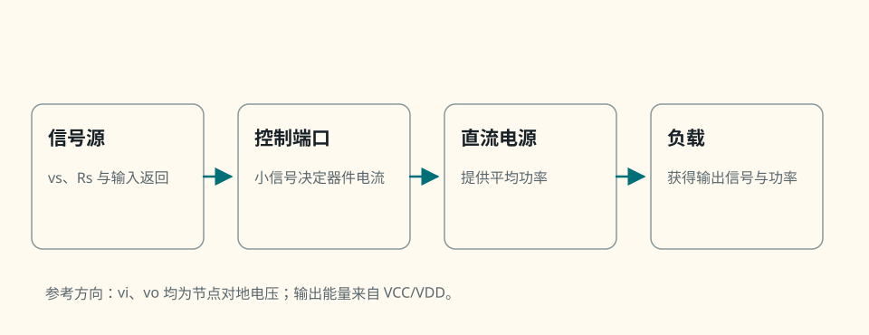{ .ae-figure }
</figure>

**图 4-2　放大器的能量与信号角色。** 若断开直流电源，理想化信号控制关系仍可写在纸上，但负载得不到持续功率；因此“放大”不是凭空造能量。

学完后，你应当能够：

1. 定义 $A_v,A_i,A_p,R_{in},R_{out},g_m$、摆幅、线性与失真，并用测试源测端口电阻；
2. 区分开路级增益、带载级增益、输入分压和从源到负载的总增益；
3. 从直流负载线解释 Q 点与上下削顶，并完成 DC/AC 分离；
4. 推导 CE 含/不含发射极旁路、CC、CB 的中频增益和端口电阻；
5. 推导 CS、源极跟随器、CG 和源极退化的一阶结果；
6. 把耦合、旁路、源电阻和负载接成完整增益链；
7. 从“观察波形 → 判断工作区/元件状态 → 测节点 DC/AC”诊断失真与常见故障。

| 路线 | 阅读范围 | 一个月备考动作 |
|---|---|---|
| 第一遍 | P0 的 CE、CC、CS、源极跟随、加载链与故障诊断，30 秒回答，以及 A-01～A-16 中标为 P0 的题 | 8～10 小时，分 5～6 次；每次重画小信号回路 |
| 完整掌握 | CB、CG、90 秒回答、精确 $\beta$ 形式、有限 $r_o$/体效应边界与全部追问 | 合计约 16～20 小时；以从完整电路独立画 DC/AC 两张图为准 |

## 2. P0：放大指标与端口测试

!!! abstract "第一次阅读：先分清四个比值"

    先在图上指出信号源、放大级输入、空载输出和负载电压，再写比值。第一遍只要会测 $R_{in},R_{out}$ 并不混淆级内增益与总增益；严格边界后读。

### 2.1 直觉：增益必须说清“从哪里到哪里”

“电压增益为 100”信息不完整：输出是否开路？是否接负载？输入是晶体管端口还是信号源 $v_s$？一个实用的一阶模型，是把放大级输出写成受控戴维南源 $A_{v0}v_i$ 串联 $R_{out}$。

对正弦稳态，若电压、电流均用相量或同一种有效值约定：

\[
A_v=\frac{v_o}{v_i},\qquad
A_i=\frac{i_o}{i_i},\qquad
A_p=\frac{P_o}{P_i}.
\]

$A_v,A_i,A_p$ 是无量纲比值；工程上也可写 $20\log_{10}|A_v|\ \mathrm{dB}$、$20\log_{10}|A_i|\ \mathrm{dB}$ 和 $10\log_{10}A_p\ \mathrm{dB}$。跨导

\[
g_m=\left.\frac{\partial I_{out}}{\partial V_{control}}\right|_Q
\]

单位是 $\mathrm{A/V=S}$，不是无量纲电压增益；它还必须乘等效负载电阻才形成电压增益。

**摆幅**是在不进入规定失真或跨区前，输出允许围绕 Q 点变化的峰值/峰峰值范围；**线性**表示叠加与比例关系在给定范围内近似成立；**失真**是输出不再只是输入的常数倍与固定相移，削顶只是失真的一种。

### 2.2 完整端口图：怎样测输入电阻与输出电阻

<figure class="ae-figure-frame" markdown="1">
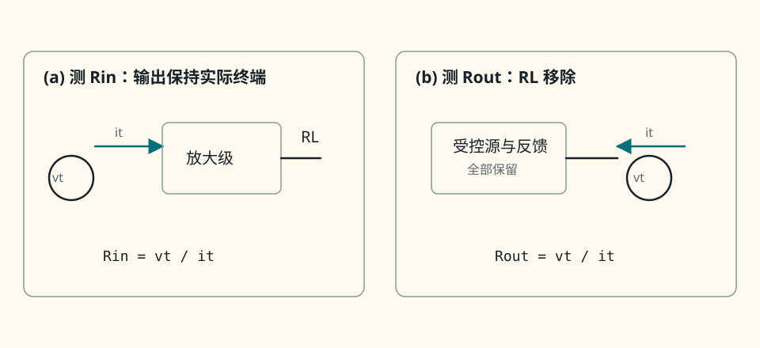{ .ae-figure }
</figure>

**图 4-3　输入、输出电阻的测试源定义。** 求 $R_{out}$ 时只把**独立信号源的增量**置零，不能删除晶体管受控源；负载 $R_L$ 要先移除，否则测到的是 $R_{out}\parallel R_L$。若电路含反馈，反馈路径也必须保留。

图 4-3 是本节的完整电路与小信号测试图：输入测试保留实际输出终端，输出测试明确画出置零后的源、偏置/输入返回、测试源返回与受控放大级；图 4-4 再把它还原到完整的源—级—负载接口。

输入端施加 $v_t$，测流入端口的 $i_t$，得到

\[
R_{in}=\frac{v_t}{i_t}.
\]

输出端则先按图 4-3(b) 处理，再得

\[
R_{out}=\frac{v_t}{i_t}.
\]

对非线性电路，这些是 Q 点附近的微分/小信号电阻；对含电容电感的电路，更一般应写输入、输出阻抗 $Z_{in}(j\omega),Z_{out}(j\omega)$。本章中频把它们按纯电阻处理。

### 2.3 四种电压传递不能混称

<figure class="ae-figure-frame" markdown="1">
{ .ae-figure }
</figure>

**图 4-4　从源到负载的电压链。** 每一项都有明确测量端点和共同参考地。

- **开路级增益：** $A_{v0}=v_{o,oc}/v_i$，输出不接 $R_L$；
- **带载级增益：** $A_{vL}=v_L/v_i$。若输出戴维南模型适用，则 \(\displaystyle A_{vL}=A_{v0}\frac{R_L}{R_{out}+R_L}.\)

- **输入传输系数：** $k_s=v_i/v_s=R_{in}/(R_s+R_{in})$，它是源内阻与输入电阻造成的分压；
- **从源到负载的总增益：** \(\displaystyle G_v=\frac{v_L}{v_s}=\frac{R_{in}}{R_s+R_{in}}A_{vL}.\)

因此“源电压 $v_s$”不是“级内输入 $v_i$”。把 $-g_mR_C$ 直接说成从信号源到负载的增益，通常漏掉了两个分压。

“高 $R_{in}$、低 $R_{out}$”也不是无条件真理。电压放大/缓冲通常希望高输入、低输出以减小电压加载；电流读取可能希望低输入电阻；跨阻接口、阻抗匹配和最大功率传输各有不同目标。指标必须服务于接口目标。

### 2.4 假设、推导、单位与极限

- **假设：** 中频小信号，端口可线性化；图 4-4 的单向戴维南模型忽略从输出返回输入的反向耦合。
- **推导：** 对输入回路用分压得 $k_s$；对输出戴维南源再用分压得 $k_L$；串接即得 $G_v=k_sA_{v0}k_L$。
- **单位：** $R=v/i$ 为 $\Omega$；$g_m=i/v$ 为 S；增益为无量纲；摆幅用 V、V peak 或 $V_{pp}$ 并注明。
- **极限：** $R_{in}\gg R_s$ 时 $k_s\to1$；$R_L\gg R_{out}$ 时 $k_L\to1$。这是趋近关系，不是有限电阻下的恒等式。
- **限制：** 强非线性、大信号跨区、反向传输明显或频率接近极点时，常数 $R_{in},R_{out},A_v$ 的中频模型不足。

### 第二遍：适用边界

测试源法本身很普遍，但“把独立源置零”的对象和终端条件必须说明。含反馈或双向晶体管参数时，输入端终端可能改变 $R_{out}$；功率增益还必须统一有效值、端口电流方向和平均功率正负。

### 30 秒回答

“我先定义端点。开路级增益是 $v_{o,oc}/v_i$，带载级增益是 $v_L/v_i$，从源到负载则是 $G_v=v_L/v_s=[R_{in}/(R_s+R_{in})]A_{vL}$。测 $R_{in}$ 就在输入加测试电压并取 $v_t/i_t$；测 $R_{out}$ 要移除负载、把独立信号源置零但保留受控源，再从输出端求 $v_t/i_t$。高输入低输出只是电压接口常见目标，不是普适规则。”

### 第二遍：90 秒回答

“放大器是能量受控传递器，信号控制电源向负载送能。描述它必须先说端口和终端：$A_v=v_o/v_i,A_i=i_o/i_i,A_p=P_o/P_i$，跨导 $g_m=\partial I_{out}/\partial V_{control}|_Q$ 的单位是西门子。把输出看成 $A_{v0}v_i$ 串 $R_{out}$，接负载后 $A_{vL}=A_{v0}R_L/(R_{out}+R_L)$；再乘输入分压 $R_{in}/(R_s+R_{in})$，才是 $v_L/v_s$。测试输出电阻时独立输入源置零、负载移除、依赖源保留。所有这些都是指定 Q 点、中频和小信号范围内的端口量；大信号、跨区或频率相关时要换模型。”

### 本节练习与递进追问

1. 若 $R_s=1.0\ \mathrm{k\Omega},R_{in}=4.0\ \mathrm{k\Omega},A_{v0}=-20,R_{out}=500\ \Omega,R_L=1.5\ \mathrm{k\Omega}$，分别写出 $k_s,k_L,A_{vL},G_v$，不要把任意两项混名。
2. 追问一：为什么求 $R_{out}$ 时不能把受控源也置零？追问二：电流传感器为什么可能有意设计成低输入电阻？

## 3. P0：Q 点、直流负载线与 DC/AC 分离

!!! abstract "第一次阅读：先找静态位置"

    先断开交流信号的思维干扰，只用 DC 电路求节点、电流和工作区；然后再以 Q 点为中心讨论小信号摆动。第一遍不要同时把 DC 偏置值与 AC 增量塞进同一组方程。

### 3.1 直觉：Q 点是在两侧非线性边界之间选活动空间

考虑最简单的发射极接地 CE 直流集电回路。KVL 给出

\[
\boxed{V_{CE}=V_{CC}-I_CR_C}.
\]

这是外电路的**直流负载线**。理想截止端点为 $I_C=0,V_{CE}=V_{CC}$；把饱和压降暂取零时，另一截距为 $V_{CE}=0,I_C=V_{CC}/R_C$。若采用 $V_{CE,sat}=0.20\ \mathrm V$，实际可用饱和端约为 $(V_{CC}-0.20)/R_C$。Q 点过于靠近截止或饱和，某一半周会先失去线性。

### 3.2 完整数值电路、负载线与波形

取 $V_{CC}=10.0\ \mathrm V,R_C=2.00\ \mathrm{k\Omega},R_B=390\ \mathrm{k\Omega},\beta=100,V_{BE}=0.70\ \mathrm V,V_{CE,sat}=0.20\ \mathrm V$，发射极接地；温度取 $300\ \mathrm K$，忽略 Early 效应与自热。

<figure class="ae-figure-frame" markdown="1">
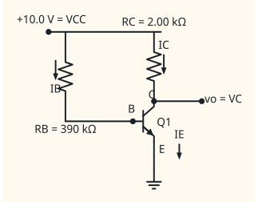{ .ae-figure }
</figure>

**图 4-5　简单 CE 的完整直流偏置电路。** 输入小信号稍后通过耦合电容叠加到 B；这里先令其直流平均值为零。

先假设正向有源：

\[
I_{BQ}=\frac{10.0-0.70}{390\ \mathrm{k\Omega}}=23.85\ \mu\mathrm A,
\]

\[
I_{CQ}\approx\beta I_{BQ}=2.385\ \mathrm{mA},\qquad
V_{CEQ}=10.0-(2.385\ \mathrm{mA})(2.00\ \mathrm{k\Omega})=5.231\ \mathrm V.
\]

$V_B=0.70\ \mathrm V,V_C=5.231\ \mathrm V$，故 $V_{BC}=-4.531\ \mathrm V<0$，正向有源假设成立。理想负载线截点为 $(10.0\ \mathrm V,0)$ 与 $(0,5.00\ \mathrm{mA})$；采用 $0.20\ \mathrm V$ 饱和边界时，最大集电电流约为 $4.90\ \mathrm{mA}$。Q 点向截止侧有 $10.0-5.231=4.769\ \mathrm V$ 的集电极上摆余量，向饱和侧有 $5.231-0.20=5.031\ \mathrm V$ 的下摆余量，近似对称。

<figure class="ae-figure-frame" markdown="1">
{ .ae-figure }
</figure>

**图 4-6　数值负载线与近对称 Q 点。** 斜率单位是 A/V；Q 点不是凭空选择，而是偏置网络与外电路线共同决定的交点。使用[交互负载线实验](../labs/bjt-load-line.html)时，先由 $V_{CC}$ 与 $R_C$ 口算两个截距，再只改目标 $I_C$，检查 Q 点的实际值和工作区是否自洽。

<figure class="ae-figure-frame" markdown="1">
{ .ae-figure }
</figure>

**图 4-7　简单 CE 的输入—输出和两侧削顶。** “Q 高/低”此处明确指 $I_{CQ}$ 高/低；不能把这里的顶/底削顶结论不加参考方向地套到跟随器或 PMOS/PNP 电路。

### 3.3 DC 与 AC 是同一电路的两次分析

在小信号范围，把总量分解为直流与增量：

\[
V_C(t)=V_{CQ}+v_c(t),\qquad I_C(t)=I_{CQ}+i_c(t).
\]

<figure class="ae-figure-frame" markdown="1">
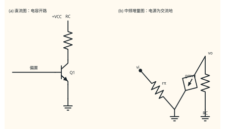{ .ae-figure }
</figure>

**图 4-8　同一电路的直流图与中频小信号图。** “电源成为交流地”只发生在增量模型；真实电源仍存在并供能。普通地与交流地在小信号图上可重合，但定义依据不同。

### 3.4 完整分析链：从偏置到摆幅

- **假设：** 普通硅 NPN，$300\ \mathrm K$，直流用给定 $V_{BE},\beta,V_{CE,sat}$ 分段模型；未击穿、无显著自热。
- **完整电路与模型：** 图 4-5 含电源与两条返回；图 4-8 分别保留 DC 元件或把独立恒定电源的增量置零。中频耦合/旁路电容近似短路，直流分析中开路。
- **推导：** 基极回路先得 $I_{BQ}$，正向有源近似给 $I_{CQ}\approx\beta I_{BQ}$，集电回路 KVL 得 $V_{CEQ}=V_{CC}-I_{CQ}R_C$，最后以 $V_{BC}<0$ 验区。
- **单位：** $V/R=A$，$IR=V$，负载线斜率 $-1/R_C$ 为 S；电压摆幅必须说明峰值或峰峰值。
- **极限：** $I_C\to0$ 时 $V_{CE}\to V_{CC}$；$V_{CE}\to0$ 的直线截点只是理想几何端点，真实饱和边界约为给定 $V_{CE,sat}$。
- **失效：** 大输入跨入截止/饱和、
  Early 效应使特性不再水平、温升改变参数，或电容不满足中频短路条件时，要换更完整模型。

### 第二遍：适用边界

“Q 点居中可得对称摆幅”只是一阶设计直觉。若接入交流负载，交流负载线斜率由 $R_C\parallel R_L$ 决定；发射极也可能摆动，截止和饱和边界会随拓扑改变。真正的摆幅应分别从 Q 点沿实际交流负载线检查两侧，而不是机械取 $V_{CC}/2$。

### 30 秒回答

“简单 CE 的直流负载线是 $V_{CE}=V_{CC}-I_CR_C$，连接截止点 $(V_{CC},0)$ 和理想饱和截点 $(0,V_{CC}/R_C)$。Q 点靠中间通常有较均衡摆幅；$I_{CQ}$ 太高会让 CE 的集电极电压先向下撞饱和，太低会先向上撞截止。直流分析保留电源且电容开路；小信号分析只取增量，恒定电源增量为零才成为交流地，中频大电容才近似短路。”

### 第二遍：90 秒回答

“我先在完整直流电路求 $I_{BQ},I_{CQ},V_{CEQ}$ 并检查 BE 正偏、BC 反偏，再画 $V_{CE}=V_{CC}-I_CR_C$。以 $10\ \mathrm V,2\ \mathrm{k\Omega}$ 为例，负载线电流截点是 $5\ \mathrm{mA}$。若 Q 点约在 $2.4\ \mathrm{mA},5.2\ \mathrm V$，到截止与 $0.2\ \mathrm V$ 饱和边界的电压余量接近。对 CE，正基极增量使 $i_c$ 增、$v_c$ 降，因此靠饱和时出现低电平削顶，靠截止时出现高电平削顶。随后把总量写成 Q 点加小写增量；只有在这个增量模型中，理想 DC 电源才是交流地。带载后还要用交流负载线重新检查摆幅。”

### 本节练习与递进追问

1. 把图 4-5 的 $R_B$ 改为 $620\ \mathrm{k\Omega}$，只判断 Q 点向截止还是饱和移动、哪一侧余量先减小，并写验证它所需的两个 DC 节点电压。
2. 追问一：为什么 $V_{CE}=0$ 截点不等于晶体管真实可线性工作的端点？追问二：接上 $R_L$ 后为什么不能继续只用原直流负载线判断交流摆幅？

## 4. P0：共射 CE——从基极到负载，再从信号源到负载

!!! abstract "第一次阅读：固定一条计算链"

    严格按“求 Q 点→求 $g_m,r_\pi$→画中频小信号图→求级内增益→乘输入和输出加载”前进。第一遍先掌握发射极交流接地的 CE；未旁路 $R_E$ 的精确 $\beta$ 形式在这条链独立跑通后再看。

### 4.1 直觉与完整偏置电路

CE 把输入加在 B-E 间、输出取自 C-E 侧。正的 $v_{be}$ 使 $i_c\approx g_mv_{be}$ 增大；这个增量电流让 $R_C\parallel R_L$ 上的压降增大，于是集电极对地电压 $v_o$ 下降，所以电压反相。反相的因果是“跨导电流增加 → 上拉电阻压降增加 → 集电极电压降低”，不是一个要死记的负号。

下面用同一个完整电路贯穿 DC 与 AC。取 $V_{CC}=12.0\ \mathrm V,R_1=82.0\ \mathrm{k\Omega},R_2=18.0\ \mathrm{k\Omega},R_C=2.20\ \mathrm{k\Omega},R_E=1.00\ \mathrm{k\Omega},R_L=10.0\ \mathrm{k\Omega},R_s=600\ \Omega$，$C_{in},C_{out},C_E$ 在中频都足够大。直流采用 $V_{BE}=0.70\ \mathrm V,\beta=100,T=300\ \mathrm K$；小信号忽略 Early 效应，即 $r_o\to\infty$。

<figure class="ae-figure-frame" markdown="1">
{ .ae-figure }
</figure>

**图 4-9　分压偏置、输入/输出耦合和发射极旁路齐全的 CE。** 重复端点标签使 B 点的输入/分压连接与 E 点的 $R_E\parallel C_E$ 明确；$C_E$ 旁路的是发射极交流变化，不会短路 $R_E$ 的直流偏置作用。

### 4.2 先求 Q 点与小信号参数

基极分压网络作戴维南等效：

\[
V_{TH}=12.0\frac{18.0}{82.0+18.0}=2.160\ \mathrm V,
\qquad R_{TH}=82.0\parallel18.0=14.760\ \mathrm{k\Omega}.
\]

在所选正向有源模型内，

\[
I_{BQ}=\frac{V_{TH}-V_{BE}}{R_{TH}+(\beta+1)R_E}
=\frac{1.460}{14.760\ \mathrm{k\Omega}+101\ \mathrm{k\Omega}}
=12.612\ \mu\mathrm A,
\]

\[
I_{CQ}=1.261\ \mathrm{mA},\quad I_{EQ}=1.274\ \mathrm{mA},
\]

\[
V_E=1.274\ \mathrm V,\quad V_C=12.0-(1.261\ \mathrm{mA})(2.20\ \mathrm{k\Omega})=9.225\ \mathrm V,
\]

\[
V_{CEQ}=7.951\ \mathrm V.
\]

$V_{BC}=V_B-V_C=(1.974-9.225)\ \mathrm V<0$，故正向有源自洽。在 $T=300\ \mathrm K,V_T=25.9\ \mathrm{mV}$ 下，

\[
g_m=\frac{I_{CQ}}{V_T}=48.70\ \mathrm{mS},\qquad
r_\pi=\frac{\beta}{g_m}=2.054\ \mathrm{k\Omega}.
\]

### 4.3 发射极交流接地：混合 π 模型与增益

<figure class="ae-figure-frame" markdown="1">
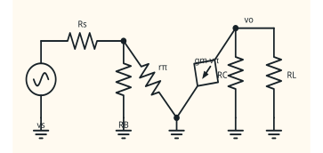{ .ae-figure }
</figure>

**图 4-10　图 4-9 的中频混合-$\pi$ 小信号图。** 旁路充分使 E 为交流地；忽略 $r_o$ 已明确，相当于受控源之外 C-E 间开路。

令

\[
R_C'=R_C\parallel R_L.
\]

在集电极写 KCL，或直接用电阻电压降：$i_c=g_mv_\pi=g_mv_b$，而正 $i_c$ 把电流从集电极拉向发射极，故

\[
v_o=-i_cR_C'=-g_mv_bR_C',
\]

于是从基极节点到负载的中频带载增益为

\[
\boxed{A_{v,b\to L}=\frac{v_o}{v_b}\approx-g_m(R_C\parallel R_L)}
\quad(r_o\text{ 忽略、E 交流接地}).
\]

近似号不能省：若 $r_o$ 有限，一阶负载应改为 $R_C\parallel R_L\parallel r_o$；更完整时还要考虑偏置网络、反馈和寄生。

晶体管基极看入为 $r_\pi$，整个级的输入电阻为

\[
\boxed{R_{in}=R_1\parallel R_2\parallel r_\pi}.
\]

移除 $R_L$，令 $v_s=0$，在输出加测试源。忽略 $r_o$ 且 E 交流接地时，测试电流只经 $R_C$ 回交流地，所以

\[
\boxed{R_{out}\approx R_C}.
\]

### 4.4 不旁路发射极电阻 RE：精确 β 形式与退化近似

<figure class="ae-figure-frame" markdown="1">
{ .ae-figure }
</figure>

**图 4-11　有发射极退化的 CE 小信号回路。** E 不再是交流地，$v_e$ 会跟随输入，抵消一部分 $v_{be}$。

设基极电流 $i_b=v_\pi/r_\pi$。忽略 $r_o$ 时 $i_c=\beta i_b$，$i_e=(\beta+1)i_b$，因此

\[
v_b=v_\pi+v_e=i_br_\pi+(\beta+1)i_bR_E
=i_b[r_\pi+(\beta+1)R_E].
\]

又有 $v_o=-i_cR_C'=-\beta i_bR_C'$，故

\[
\boxed{\frac{v_o}{v_b}
=-\frac{\beta R_C'}{r_\pi+(\beta+1)R_E}},
\]

并且晶体管基极看入

\[
\boxed{R_{in,b}=r_\pi+(\beta+1)R_E},\qquad
R_{in}=R_1\parallel R_2\parallel R_{in,b}.
\]

利用 $r_\pi=\beta/g_m$，只是代数变形于所选模型；当 $\beta\gg1$ 时才可进一步近似：

\[
\frac{v_o}{v_b}
=-\frac{g_mR_C'}{1+g_m(1+1/\beta)R_E}
\approx-\frac{g_mR_C'}{1+g_mR_E}.
\]

若还满足 $g_mR_E\gg1$，才有

\[
A_v\approx-\frac{R_C'}{R_E}.
\]

这就是发射极退化：增益绝对值下降，但对 $g_m,\beta$ 的敏感性减弱，输入电阻上升，线性范围通常改善。它与后续系统反馈有联系，但本章不展开环路增益。

**未旁路 CE 的输出电阻测试。** 先移除 $R_L$，令独立输入电压源 $v_s=0$，但保留 $R_s,R_1,R_2,r_\pi$、受控源和 $R_E$；再在 C 点对地加测试电压 $v_t$，定义注入电路的测试电流为 $i_t$。本节还假设 $r_o\to\infty$，并采用无 C-B 反向耦合的**单向**混合-$\pi$ 模型。于是 C 点的 $v_t$ 没有任何支路能反向改变 $v_\pi$；输入独立源已经置零，故该模型的唯一小信号解为 $v_\pi=0$，受控电流 $g_mv_\pi=0$。测试电流只经 $R_C$ 回交流地：

\[
i_t=\frac{v_t}{R_C}
\quad\Longrightarrow\quad
\boxed{R_{out}=\frac{v_t}{i_t}=R_C}
\qquad(r_o\to\infty,\text{ 单向模型}).
\]

若输出端另有未移除的偏置电阻 $R_X$ 通向交流地，同一定义下为 $R_{out}=R_C\parallel R_X$。这是所选模型内的等式，真实电路仍写 $R_{out}\approx R_C$。当 $r_o$ 有限时，测试电压会经 C-E 的 $r_o$ 改变发射极电压与 $v_\pi$；$R_E$ 退化又会改变受控源电流，因此必须对 C、E（必要时 B）重列节点方程，结果一般不等于简单的 $R_C\parallel r_o$，也不同于上式。

### 4.5 完整数值：从信号源电压到负载电压

对图 4-9，

\[
R_C'=2.20\parallel10.0=1.803\ \mathrm{k\Omega},
\]

\[
A_{v,b\to L}\approx-(48.70\ \mathrm{mS})(1.803\ \mathrm{k\Omega})=-87.81.
\]

输入电阻为

\[
R_{in}=14.760\parallel2.054=1.803\ \mathrm{k\Omega}.
\]

所以源到基极的分压为

\[
\frac{v_b}{v_s}=\frac{1.803}{0.600+1.803}=0.7503,
\]

从理想源到实际负载的总增益为

\[
\boxed{G_v=\frac{v_L}{v_s}=0.7503(-87.81)=-65.88}.
\]

例如 $v_s=10.0\ \mathrm{mV_{peak}}$ 时，一阶线性模型给 $v_b=7.50\ \mathrm{mV_{peak}}$、$v_L=-0.659\ \mathrm{V_{peak}}$。此时 $|v_{be,peak}|/V_T=7.50/25.9=0.290$，已经靠近局部线性化的边缘；这个数值只用于核对增益账本，**不是低失真示例**。把源幅值缩小 10 倍为 $1.00\ \mathrm{mV_{peak}}$，则 $v_b=0.750\ \mathrm{mV_{peak}}\approx0.0290V_T$、$v_L=-65.9\ \mathrm{mV_{peak}}$，更符合 $|v_{be,peak}|\ll V_T$ 的低失真尺度。两种情况都还必须用实际 Q 点和交流负载线检查摆幅。

### 4.6 假设、单位、极限与输出电阻边界

- **假设：** Q 点处于正向有源区；小信号；$T=300\ \mathrm K$；中频 $C_{in},C_{out},C_E$ 近似短路；忽略 $r_o$；偏置电源理想；计算旁路式时 E 为交流地。
- **完整电路与模型：** 图 4-9 显示电源、耦合、旁路、源和负载；图 4-10、4-11 显示所有交流返回和受控源方向。
- **推导链：** DC 求 $I_{CQ}$ → 求 $g_m,r_\pi$ → 由 $i_c=g_mv_\pi$ 与集电极 KCL 求级内增益 → 求 $R_{in},R_{out}$ → 乘源分压。
- **单位：** $g_mR_C'$ 是 $\mathrm{S\cdot\Omega}=1$；$r_\pi+(\beta+1)R_E$ 为 $\Omega$；总增益无量纲。
- **极限：** $R_L\to\infty$ 时 $R_C'\to R_C$；$R_E\to0$ 时不旁路精确式回到 $-\beta R_C'/r_\pi=-g_mR_C'$；$R_E\to\infty$ 时增益趋零、基极输入电阻趋大。
- **$r_o$ 边界：** 若 $r_o$ 与 $R_C'$ 同量级就不能忽略；旁路 E 的简单一阶式可用 $R_C'\parallel r_o$，未旁路时 $r_o$ 还会耦合 C、E，需重新列节点方程，不能机械并联后宣称精确。

### 第二遍：适用边界

$-g_mR_C'$ 只从基极小信号到输出，且要求 E 交流接地。耦合/旁路不足、$r_o$ 有限、$v_\pi$ 不够小、Q 点跨区或源/负载改变时都要修正。对 BJT，常以

\[
|v_{be,peak}|\ll V_T
\]

作为低失真的保守线索而非硬阈值；若需要较大输入，应利用退化或更完整的非线性分析。

### 30 秒回答

“CE 中正 $v_{be}$ 令 $i_c=g_mv_{be}$ 增大，$R_C\parallel R_L$ 上压降增大，所以集电极电压下降，因果上得到反相。中频、E 被旁路成交流地且忽略 $r_o$ 时，$A_v\approx-g_m(R_C\parallel R_L)$，$R_{in}=R_1\parallel R_2\parallel r_\pi$，$R_{out}\approx R_C$。若 $R_E$ 不旁路，精确 $\beta$ 形式是 $-\beta R_C'/[r_\pi+(\beta+1)R_E]$，还要乘信号源输入分压才是总增益。”

### 第二遍：90 秒回答

“我先用直流分压偏置求 Q 点并验证正向有源，再由 $g_m=I_{CQ}/V_T,r_\pi=\beta/g_m$ 画混合-$\pi$ 图。中频电容足够大时耦合、旁路近似短路，恒定电源端是交流地。若 E 交流接地，$v_\pi=v_b,i_c=g_mv_b$，集电极 KCL 给 $v_o=-i_c(R_C\parallel R_L)$，所以 $A_v\approx-g_mR_C'$。不旁路时，$v_b=i_b[r_\pi+(\beta+1)R_E]$，而 $v_o=-\beta i_bR_C'$，得到精确 $\beta$ 形式；大 $\beta$ 才近似为 $-g_mR_C'/(1+g_mR_E)$。整个级的输入还要并联偏置网络，从 $v_s$ 到 $v_L$ 要乘 $R_{in}/(R_s+R_{in})$。若 $r_o$ 不远大于负载、信号过大或电容不在中频，必须修正。”

### 本节练习与递进追问

1. 图 4-9 若去掉 $C_E$ 而其余不变，只计算 $R_{in,b}$ 与带载 $v_o/v_b$，并比较输入加载和增益绝对值的变化。
2. 追问一：增大 $R_C$ 是否总能提高可用增益？请同时检查 Q 点、带载并联、输出余量。追问二：若 $r_o=20\ \mathrm{k\Omega}$，旁路式的负载应怎样修改，误差趋势是什么？

## 5. P0 共集 CC；第二遍共基 CB——缓冲和低阻输入

!!! abstract "第一次阅读：用端口特性区分用途"

    第一遍只完成 CC：辨认输入、输出与交流公共端，推导它为何具有高输入、低输出和接近 1 的同相电压增益。CB 只在总览图中辨认端口；低输入阻抗、同相增益和完整公式统一放到 5.3 节的第二遍。

### 5.1 直觉：电压增益接近 1 为什么仍然有用

共集电极（CC，射极跟随器）从 E 取输出。基极上升会使发射极同向上升，直到新增的发射极电阻电流与晶体管关系自洽；因此电压增益略小于 1、不反相。它的价值不是制造大电压，而是把较高输入电阻变换为较低输出电阻，让弱信号源驱动更重负载，并提供更大的负载电流。

共基极（CB）把 B 固定在交流地，从 E 输入、从 C 输出。发射极输入略升会减小 $v_{be}=v_b-v_e$，使向下的集电极电流减小，集电极电压随之升高，所以电压不反相；发射极端却只有约 $1/g_m$ 的低输入电阻，适合低阻电流型信号源。其高频优势这里只作概念提示：输入端不直接承受 CE 那样的反相电压反馈放大；定量频响留到后章。

### 5.2 CC 完整电路与混合 π 图

<figure class="ae-figure-frame" markdown="1">
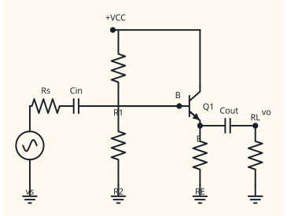{ .ae-figure }
</figure>

**图 4-12　分压偏置射极跟随器的完整电路。** 输出耦合电容隔去 $V_{EQ}$，负载只接收交流；最大正向发射极摆幅受 $V_C-V_E\gtrsim V_{CE,sat}$ 限制，负向摆幅受截止和 $R_E$ 回路限制。

<figure class="ae-figure-frame" markdown="1">
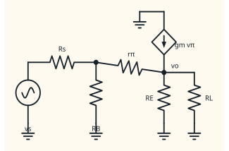{ .ae-figure }
</figure>

**图 4-13　CC 的完整中频小信号图。** 集电极是交流公共端；发射极输出反馈到 $v_\pi$，所以 $v_e$ 越跟随 $v_b$，剩余控制电压越小。

令

\[
R_E'=R_E\parallel R_L.
\]

由 $i_b=v_\pi/r_\pi$、$i_e=(\beta+1)i_b$ 得

\[
v_e=(\beta+1)i_bR_E',
\]

\[
v_b=v_\pi+v_e=i_br_\pi+(\beta+1)i_bR_E'.
\]

所以从基极到发射极/负载的电压增益为

\[
\boxed{
A_{v,b\to e}=
\frac{(\beta+1)R_E'}{r_\pi+(\beta+1)R_E'}
}.
\]

分子、分母均为 $\Omega$，增益无量纲；所有量为正，故不反相。只有当 $(\beta+1)R_E'\gg r_\pi$ 时才有 $A_v\approx1$，不应写成恒等于 1。

从基极看入晶体管：

\[
\boxed{R_{in,b}=r_\pi+(\beta+1)R_E'},\qquad
R_{in}=R_1\parallel R_2\parallel R_{in,b}.
\]

求输出电阻时移除 $R_L$、令独立源 $v_s=0$。基极到交流地的等效电阻为

\[
R_B'=R_s\parallel R_1\parallel R_2.
\]

从发射极看入，基极一侧电阻被约缩小 $\beta+1$ 倍：

\[
\boxed{
R_{out}\approx R_E\parallel
\frac{r_\pi+R_B'}{\beta+1}
}
\quad(r_o\text{ 忽略}).
\]

这条式子说明：驱动基极的源/偏置电阻越大，跟随器输出电阻也会上升；不能只背 $R_{out}\approx1/g_m$ 而忘记源电阻。若 $R_B'\ll r_\pi$ 且 $R_E$ 很大，才有 $(r_\pi+R_B')/(\beta+1)\approx1/g_m$。

**数值核对。** 取 $\beta=100,r_\pi=2.590\ \mathrm{k\Omega},R_E=2.20\ \mathrm{k\Omega},R_L=1.00\ \mathrm{k\Omega},R_1\parallel R_2=47.0\ \mathrm{k\Omega},R_s=1.00\ \mathrm{k\Omega}$，忽略 $r_o$。则

\[
R_E'=687.5\ \Omega,\quad A_{v,b\to e}=0.9640,
\]

\[
R_{in,b}=72.03\ \mathrm{k\Omega},\quad
R_{in}=28.44\ \mathrm{k\Omega},
\]

\[
\frac{v_b}{v_s}=0.9660,\quad
\frac{v_L}{v_s}=0.9313.
\]

又有 $R_B'=1.00\parallel47.0=0.9792\ \mathrm{k\Omega}$，所以

\[
R_{out}\approx2.20\ \mathrm{k\Omega}\parallel
\frac{2.590+0.9792}{101}\ \mathrm{k\Omega}
=34.78\ \Omega.
\]

电压只少量衰减，却能把约 $28.4\ \mathrm{k\Omega}$ 的输入接口变成约 $34.8\ \Omega$ 的输出接口；这正是“增益约 1 仍有用”的量化答案。实际负载电流和摆幅还受晶体管允许电流、功耗、截止与饱和余量限制。

### 5.3 第二遍：CB 完整电路与推导

<figure class="ae-figure-frame" markdown="1">
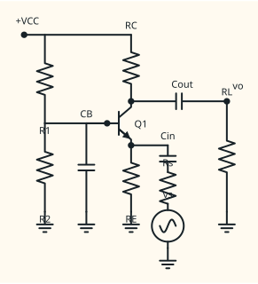{ .ae-figure }
</figure>

**图 4-14　单电源共基极完整电路。** 基极不是“无电压”，而是有直流偏置 $V_{BQ}$、小信号增量近似为零；这正是 DC 节点与交流地的典型区别。

<figure class="ae-figure-frame" markdown="1">
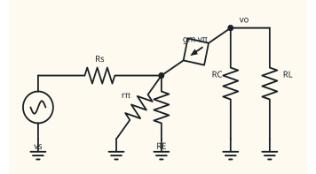{ .ae-figure }
</figure>

**图 4-15　CB 的中频小信号图。** $g_mv_\pi$ 的上、下端分别连续接到 c、e 实心结点，$r_\pi$ 则从同一 e 点接到交流接地的 b；$R_E$ 若远大于晶体管发射极看入电阻，对 $R_{in}$ 的影响很小，否则必须并联计入。

在 C 节点列 KCL：

\[
\frac{v_o}{R_C'}+g_mv_\pi=0.
\]

因 $v_\pi=-v_e$，

\[
\boxed{\frac{v_o}{v_e}\approx+g_m(R_C\parallel R_L)}
\quad(r_o\text{ 忽略}).
\]

发射极端输入电流为

\[
i_{in}=\frac{v_e}{r_\pi}+g_mv_e
=v_e\left(\frac{1}{r_\pi}+g_m\right),
\]

故晶体管发射极看入

\[
\boxed{
R_{in,e}=\frac{v_e}{i_{in}}
=\frac{r_\pi}{\beta+1}
\approx\frac{1}{g_m}=r_e
}.
\]

最后两个等号中，$r_\pi/(\beta+1)$ 是忽略 $r_o$ 的混合-$\pi$ 结果；$1/g_m$ 需要 $\beta\gg1$，而 $r_e$ 在这里指常用的小信号发射结动态电阻近似。整个输入还应为 $R_E\parallel R_{in,e}$。

若把晶体管内部由发射端注入的信号电流和集电极增量电流都按同向传输的**幅值**定义，则

\[
\left|\frac{i_c}{i_{in}}\right|
=\frac{g_m}{g_m+1/r_\pi}
=\frac{\beta}{\beta+1}
=\alpha\approx1.
\]

这是晶体管本征电流传输，不等于接上 $R_C,R_L$ 后“流进某个负载支路”的电流比；负载分流必须另算。CB 的电压增益可大于 1，而本征电流传输略小于 1，两者并不矛盾。

### 5.4 三种 BJT 接法放到同一尺度

<figure class="ae-figure-frame" markdown="1">
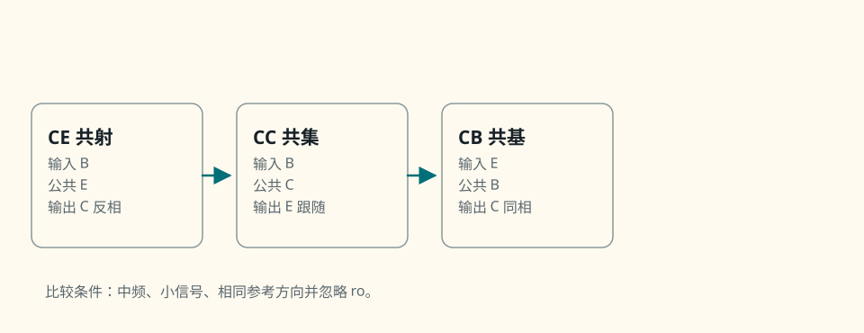{ .ae-figure }
</figure>

**图 4-16　CE、CC、CB 的公共端与信号方向。** “共”指输入与输出共同参考的交流端，比较时依次看输出端、公共端、相位和端口阻抗，并使用相同的中频、小信号、忽略 $r_o$ 条件。

| 拓扑 | 从所示输入节点到输出的中频电压增益 | 输入电阻量级 | 输出电阻量级 | 典型角色 |
|---|---|---|---|---|
| CE，E 旁路 | $\approx-g_m(R_C\parallel R_L)$ | 基极约 $r_\pi$，再并偏置 | 约 $R_C$ | 电压增益、反相 |
| CC | $(\beta+1)R_E'/[r_\pi+(\beta+1)R_E']<1$ | 较高，负载乘约 $\beta+1$ 反射 | 较低，含源/偏置电阻折算 | 缓冲、电流驱动 |
| CB | $\approx+g_m(R_C\parallel R_L)$ | 很低，约 $1/g_m$ | 约 $R_C$ | 低阻输入、电流传递、高频概念用途 |

### 5.5 假设、推导、单位与极限

- **假设：** 两电路 Q 点都在正向有源区；$T=300\ \mathrm K$；中频耦合/旁路电容近似短路；小信号；忽略 Early 效应即 $r_o\to\infty$；CC/CB 未出现截止、饱和或功耗越界。
- **完整电路与模型：** 图 4-12、4-14 给出电源、偏置、耦合、负载和返回；图 4-13、4-15 保留受控源、$r_\pi$ 与所有交流返回。
- **推导链：** CC 用 $i_e=(\beta+1)i_b$ 把 $R_E'$ 反射到基极；求 $R_{out}$ 时将基极源/偏置电阻缩小约 $\beta+1$ 倍。CB 用 $v_\pi=-v_e$，分别在 C、E 写 KCL。
- **单位：** CC 增益是 $\Omega/\Omega$；CB 的 $g_mR_C'$ 为 $\mathrm{S\cdot\Omega}=1$；所有端口电阻单位为 $\Omega$。
- **极限：** CC 中 $R_E'\to0$ 时 $A_v\to0$，$R_E'\to\infty$ 时 $A_v\to1^-$；CB 中 $g_m$ 越大，输入电阻约越低。趋近不代表可忽略摆幅、功耗和带宽。
- **有限 $r_o$：** 若 $r_o$ 不远大于外部电阻，CC、CB 的增益与输出电阻都需在完整小信号图中重算；不能把本节近似当恒等式。

### 第二遍：适用边界

CC 的低输出电阻依赖基极被低阻驱动；源电阻过大时会明显恶化。CB 的低输入电阻会重载电压源，却可能适合低阻电流源。所谓 CB “高频好”只是一阶拓扑直觉，真实上限还由结电容、源电阻、偏置网络和封装决定，本章不推导频率响应。

### 30 秒回答

“射极跟随器从 E 输出，$R_E'=R_E\parallel R_L$ 时，$A_v=(\beta+1)R_E'/[r_\pi+(\beta+1)R_E']$，所以只在分母中的 $r_\pi$ 相对很小时才接近 1。它把负载约乘 $\beta+1$ 反射到基极，同时把基极源/偏置电阻约除以 $\beta+1$ 反映到输出，因此适合缓冲和电流驱动。CB 令基极交流接地，从发射极输入，$R_{in}\approx1/g_m$，$A_v\approx+g_m(R_C\parallel R_L)$，不反相。”

### 第二遍：90 秒回答

“对 CC，我在混合-$\pi$ 图中写 $v_e=(\beta+1)i_bR_E'$、$v_b=i_br_\pi+v_e$，所以增益小于 1 但可很接近 1，基极输入是 $r_\pi+(\beta+1)R_E'$。测输出电阻时移除负载并令输入源为零，基极对地电阻 $R_s\parallel R_1\parallel R_2$ 与 $r_\pi$ 一起被缩小约 $\beta+1$ 倍，再与 $R_E$ 并联。对 CB，基极只有交流增量为零，仍有 DC 偏置；$v_\pi=-v_e$，集电极 KCL 给正增益 $+g_mR_C'$，发射极 KCL给 $r_\pi/(\beta+1)\approx1/g_m$。两者都假设中频、小信号、正向有源并忽略 $r_o$，实际还要检查负载电流和两侧摆幅余量。”

### 本节练习与递进追问

1. 用图 4-13 的数值，若 $R_s$ 从 $1.00\ \mathrm{k\Omega}$ 增到 $20.0\ \mathrm{k\Omega}$，只判断 $R_{out}$、$v_b/v_s$ 与总电压传递怎样变化，再列出验证式。
2. 追问一：跟随器电压增益小于 1，功率增益为什么仍可能大于 1？追问二：CB 输入电流增大时，$v_e$、$v_{be}$、$i_c$、$v_c$ 的符号链如何保持“电压同相”？

## 6. P0 共源与源极跟随；第二遍共栅——MOS 组态与 BJT 对照

!!! abstract "第一次阅读：先做端口映射"

    先把 CS、源极跟随器分别与 CE、CC 对照，并重新确认哪个端子交流公共。图 4-17、图 4-18 会同时展示 CG 以便辨认，但 CG 的推导、$r_o$、体效应与完整对照边界放到第二遍。

### 6.1 直觉与三个完整电路

MOS 放大级与 BJT 一样，先用 DC 偏置把器件放在合适工作区，再在 Q 点用跨导源线性化；但理想 MOS 栅极直流与低—中频电流近似为零，没有 BJT 的有限 $r_\pi$ 基极电流路径。栅极仍必须有偏置回路，且真实输入含电容，不能把“栅流近零”说成任意频率下输入阻抗无限大。

<figure class="ae-figure-frame" markdown="1">
{ .ae-figure }
</figure>

**图 4-17　CS、源极跟随器、CG 的完整单电源电路。** “共”指交流公共端：CS 的 S、跟随器的 D、CG 的 G；各端仍可有非零直流电压/电流。

### 6.2 三个中频小信号图与增益推导

本节统一假设：增强型 NMOS 已偏在饱和区，小信号、中频，耦合/旁路电容近似短路；忽略沟道长度调制，即 $r_o\to\infty$；忽略体效应，即受控电流只写 $g_mv_{gs}$；栅极电流取零。若衬底没有与源极同电位，体效应会引入 $g_{mb}v_{bs}$，尤其会降低源极跟随器增益，本节结果必须修正。

<figure class="ae-figure-frame" markdown="1">
{ .ae-figure }
</figure>

**图 4-18　三种 MOS 组态的中频小信号图。** 在 (c) 中，$g_mv_{gs}$ 直接跨接 d、s 两个实心结点，g 另行交流接地；MOS 栅极没有 $r_\pi$ 支路，低—中频输入电流主要流入偏置电阻，频率升高后栅电容电流不能忽略。

**CS。** 源极交流接地时 $v_{gs}=v_g$，在漏极列 KCL：

\[
\frac{v_o}{R_D\parallel R_L}+g_mv_{gs}=0,
\]

所以

\[
\boxed{\frac{v_o}{v_g}\approx-g_m(R_D\parallel R_L)}.
\]

正 $v_{gs}$ 使向下 $i_d$ 增大，$R_D$ 压降增大，$v_d$ 降低，因果上与 CE 一样反相。忽略 $r_o$ 时 $R_{out}\approx R_D$；栅极本身输入电阻趋于无穷，但整个级为 $R_{in}\approx R_1\parallel R_2$。

若源极电阻 $R_S$ **不旁路**，在忽略 $r_o$、体效应、栅流的模型中，$i_d=g_mv_{gs}$、$v_s=i_dR_S$、$v_{gs}=v_g-v_s$。于是

\[
i_d=g_m(v_g-i_dR_S)
\quad\Longrightarrow\quad
i_d=\frac{g_m}{1+g_mR_S}v_g,
\]

\[
\boxed{
\frac{v_o}{v_g}
\approx-\frac{g_m(R_D\parallel R_L)}{1+g_mR_S}
}.
\]

$R_S$ 越大，增益绝对值下降、对 $g_m$ 的敏感性降低、线性通常改善；它是源极退化趋势，不应脱离 Q 点和摆幅说“越大越好”。

<figure class="ae-figure-frame" markdown="1">
{ .ae-figure }
</figure>

**图 4-19　MOS 源极退化的局部因果链。** 这只是本级内的自稳趋势；完整反馈术语和频率依赖留到后章。

**源极跟随器。** 令 $R_S'=R_S\parallel R_L$。源节点 KCL 给

\[
\frac{v_s}{R_S'}=g_m(v_g-v_s).
\]

整理得

\[
\boxed{
\frac{v_s}{v_g}
=\frac{g_mR_S'}{1+g_mR_S'}
}.
\]

它为正且小于 1；只有 $g_mR_S'\gg1$ 才近似 1。栅极输入仍约为 $R_1\parallel R_2$。令独立栅极信号为零、移除负载后，从源极看入，忽略 $r_o$ 和体效应时

\[
R_{out}\approx R_S\parallel\frac{1}{g_m}.
\]

与 BJT CC 不同，低—中频理想 MOS 栅极不吸电流，所以栅极源电阻不会通过“基极电流乘 $\beta+1$”那种路径直接出现在该一阶输出电阻式中；高频栅电容和偏置非理想会改变结论。

**第二遍：CG。** 栅极交流接地，$v_{gs}=-v_s$。漏极 KCL 得

\[
\boxed{
\frac{v_o}{v_s}\approx+g_m(R_D\parallel R_L)
}.
\]

源端测试电流近似为 $i_t=g_mv_s$，所以

\[
\boxed{R_{in,s}\approx\frac{1}{g_m}}.
\]

忽略 $r_o$、体效应且不计栅电流时，晶体管的信号漏电流与源端注入电流幅值近似相等；外部 $R_S,R_D,R_L$ 的分流仍需另算。CG 与 CB 一样是低输入电阻、同相电压传递，高频用途只作概念说明。

### 6.3 与 BJT 的对应，以及不能对应之处

| BJT | MOS | 同一阶结构 | 关键差异 |
|---|---|---|---|
| CE | CS | 跨导电流增大使上拉电阻压降增大，电压反相 | BJT 基极有 $r_\pi$ 与基极电流；MOS 理想栅流近零 |
| CC 射极跟随 | 源极跟随 | 输出端跟随并形成局部退化，电压增益小于 1 | CC 的源/偏置电阻会经 $\beta+1$ 反射；MOS 一阶式无此基极电流机制 |
| CB | CG | 控制端交流接地，输入电阻约 $1/g_m$，电压同相 | CB 本征电流传输约 $\alpha$；CG 理想栅流零且可能有体效应 |

BJT 的 $g_m=I_{CQ}/V_T$，并有 $r_\pi=\beta/g_m$；长沟道平方律 NMOS 在 NMOS 饱和区常有 $g_m=2I_{DQ}/V_{OVQ}$，但参数取决于所用器件模型。MOS 分压器近似不受 DC 栅电流加载，BJT 分压器则会被 $I_B$ 加载；两者都必须先求并验证各自 Q 点。这里对 MOS 明确忽略体效应和 $r_o$，不是说它们物理上不存在。

### 6.4 假设、推导、单位与极限

- **假设：** NMOS 在饱和区；小信号、中频；耦合/旁路电容近似短路；栅极电流为零；忽略沟道长度调制 $r_o\to\infty$ 和体效应 $g_{mb}=0$；偏置网络与电源理想。
- **完整电路与模型：** 图 4-17 画出三个组态的电源、偏置、源/负载和返回；图 4-18 画出 $g_mv_{gs}$ 受控源及交流返回。
- **推导链：** 先从 Q 点取得 $g_m$；再由各公共端写 $v_{gs}$；在漏/源节点列 KCL；最后并入 $R_L$ 与信号源分压。
- **单位：** $g_mR'$ 为 $\mathrm{S\cdot\Omega}=1$；$1/g_m$ 为 $\Omega$；栅极输入电阻由偏置电阻决定。
- **极限：** CS/CG 中 $R_L\to\infty$ 才回到开路的 $R_D$；源极跟随中 $g_mR_S'\to\infty$ 才有增益趋近 1；退化式中 $R_S\to0$ 才回到无退化 CS。
- **有限 $r_o$/体效应：** $r_o$ 可与漏极负载并联并耦合源端，体效应给出额外 $g_{mb}v_{bs}$；源极活动的 SF、CG 和退化 CS 尤其不能机械套一个并联电阻就宣称精确。

### 第二遍：适用边界

上述式子不是三极管区或截止区的大信号规律。输出摆幅使 NMOS 逼近截止或三极管区、输入使 $v_{gs}$ 不再是小增量、栅电容电流显著、衬底未随源极运动或 $r_o$ 不够大时，都要回到完整模型与工作区检查。不要因 MOS 的“饱和区”适合放大，就和 BJT 的两结正偏“饱和”混为一谈。

### 30 秒回答

“MOS 三种接法与 BJT 有结构对应：CS 反相，$A_v\approx-g_m(R_D\parallel R_L)$；源极跟随同相，$A_v=g_mR_S'/(1+g_mR_S')<1$；CG 同相，$A_v\approx+g_m(R_D\parallel R_L)$、$R_{in}\approx1/g_m$。这些都要求 NMOS 处于饱和区、小信号、中频，并明确忽略 $r_o$ 和体效应。MOS 栅极理想电流近零，没有 BJT 的 $r_\pi$ 输入支路，但偏置电阻和栅电容仍决定实际输入。”

### 第二遍：90 秒回答

“我先从 DC Q 点取得 $g_m$ 并确认 NMOS 在饱和区。CS 源极交流接地时，正 $v_{gs}$ 增大向下漏电流，漏电阻压降增大，所以输出下降，得到 $-g_mR_D'$。若 $R_S$ 不旁路，$v_s=i_dR_S$ 抵消部分 $v_{gs}$，所以近似为 $-g_mR_D'/(1+g_mR_S)$。源极跟随器由 $v_s/R_S'=g_m(v_g-v_s)$ 得 $g_mR_S'/(1+g_mR_S')$；CG 因 $v_{gs}=-v_s$，漏极输出同相且源端约看见 $1/g_m$。与 BJT 相比，MOS 栅极无有限 $r_\pi$ 的 DC/中频电流路径，但实际有偏置电阻和栅电容。我已假设 $r_o$ 无限大、体效应为零；若不满足就回完整模型重列节点方程。”

### 本节练习与递进追问

1. 对同一 $g_m=4.0\ \mathrm{mS},R_D=6.8\ \mathrm{k\Omega},R_L=10\ \mathrm{k\Omega}$，比较 CS 与 CG 的增益符号和绝对值，再说明输入电阻为何不同。
2. 追问一：若源极跟随器衬底固定、源极上升，体效应会让增益向哪个方向变化？追问二：MOS 栅极电流近零，为什么仍不能说任意频率下输入阻抗无限大？

## 7. P0：耦合、旁路、加载与总增益链

!!! abstract "第一次阅读：按 DC 和中频 AC 各画一次"

    先在 DC 图中把电容视为开路，确认偏置不被前后级破坏；再在中频 AC 图中把合格的耦合/旁路电容视为近似短路。第一遍只计算三段总增益链，低频截止的精确极点后读。

### 7.1 直觉：电容让 DC 各自偏置，让 AC 在中频相连

耦合电容串在两级之间：直流稳态近似开路，阻止前一级 DC 改变后一级/负载偏置；中频电抗足够小时近似短路，让交流通过。旁路电容并在 $R_E$ 或 $R_S$ 两端：直流开路，所以保留偏置稳定作用；中频近似短路，减小交流退化、提高级内增益绝对值。二者都不是“任意频率下短路”。

### 7.2 完整源—级—负载图与三段传递

<figure class="ae-figure-frame" markdown="1">
{ .ae-figure }
</figure>

**图 4-20　耦合、旁路、源内阻与负载齐全的接口。** $C_{in}$、$R_1$、$R_2$ 与 Q1 基极由同一 [B] 标签明确相连；求 DC 时先断开三个电容支路，求中频时再把它们短接进小信号图，不能在同一组方程里混用两个状态。

若把未接 $R_L$ 的放大级输出等效为 $A_{v0}v_i$ 串联 $R_{out}$，完整中频链为

\[
\boxed{
\frac{v_L}{v_s}
=
\underbrace{\frac{R_{in}}{R_s+R_{in}}}_{\text{源分压}}
\underbrace{A_{v0}}_{\text{开路级增益}}
\underbrace{\frac{R_L}{R_{out}+R_L}}_{\text{负载分压}}
}.
\]

也可先把负载写入 CE/CS 的 $R_C'=R_C\parallel R_L$ 或 $R_D'=R_D\parallel R_L$，得到带载级增益 $A_{vL}$，再乘源分压。两种路线只能选一种计入 $R_L$；若既在 $R_C'$ 中并入 $R_L$，又额外乘一次输出分压，就重复加载。

<figure class="ae-figure-frame" markdown="1">
{ .ae-figure }
</figure>

**图 4-21　从理想源到负载的幅值账本。** $10.0\ \mathrm{mV_{peak}}$ 一行只核对线性模型的比例，因 $v_{be,peak}\approx0.29V_T$ 而不是低失真示例；缩小 10 倍的一行更符合 $|v_{be,peak}|\ll V_T$。四舍五入使中间数值只作账本核对。

对图 4-9 已算得 $R_{in}=1.803\ \mathrm{k\Omega}$、带载级增益 $A_{vL}=-87.81$、$R_s=600\ \Omega$，故

\[
\frac{v_i}{v_s}=0.7503,\qquad
\frac{v_L}{v_s}=-65.88.
\]

当 $v_s=10.0\ \mathrm{mV_{peak}}$ 时，

\[
v_i=7.50\ \mathrm{mV_{peak}},\qquad
v_L=-0.659\ \mathrm{V_{peak}}.
\]

这是一条“从源”而不是“从基极”的完整增益账本；它仍位于小信号近似的边缘。低失真尺度取 $v_s=1.00\ \mathrm{mV_{peak}}$ 时，对应 $v_i=0.750\ \mathrm{mV_{peak}}\approx0.0290V_T$、$v_L=-65.9\ \mathrm{mV_{peak}}$。若只报 $-87.81$，还漏掉了 $R_s$ 对低输入电阻 CE 的明显加载。

### 7.3 P1 第二遍：一个耦合电容的精确低频边界

只研究输入耦合电容 $C_{in}$，把其右侧等效为 $R_{in}$、左侧信号源等效为 $v_s,R_s$；暂时忽略其他电容。完整小信号回路是

<figure class="ae-figure-frame" markdown="1">
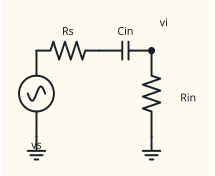{ .ae-figure }
</figure>

**图 4-22　单个输入耦合电容形成的一阶高通。** 这里只隔离一个低频因素；多只耦合/旁路电容会共同决定真实低频响应，留到频率响应章系统处理。

由分压，

\[
\frac{v_i}{v_s}
=\frac{R_{in}}{R_s+R_{in}+1/(j\omega C_{in})}.
\]

把中频分压 $R_{in}/(R_s+R_{in})$ 提出，剩余归一化高通项为

\[
H_{HP}(j\omega)=\frac{j\omega\tau}{1+j\omega\tau},
\qquad
\tau=(R_s+R_{in})C_{in},
\]

\[
\boxed{f_L=\frac{1}{2\pi(R_s+R_{in})C_{in}}}.
\]

取图 4-9 的 $R_s=600\ \Omega,R_{in}=1.803\ \mathrm{k\Omega},C_{in}=1.00\ \mu\mathrm F$：

\[
f_L=\frac{1}{2\pi(2.403\ \mathrm{k\Omega})(1.00\ \mu\mathrm F)}
=66.23\ \mathrm{Hz}.
\]

在此频率，**相对中频值**的幅度为 $1/\sqrt2$，所以若其他电容不限制，增益账本的负载幅值由 $0.659\ \mathrm{V_{peak}}$ 降至约 $0.466\ \mathrm{V_{peak}}$；按低失真源幅值缩小 10 倍时则由 $65.9\ \mathrm{mV_{peak}}$ 降至约 $46.6\ \mathrm{mV_{peak}}$。当 $f\gg f_L$ 时才可把 $C_{in}$ 近似短路；当 $f\ll f_L$ 时输出随频率下降并出现相移。

旁路电容的趋势类似但等效电阻更依赖晶体管与偏置网络：频率降低时旁路不充分，$R_E/R_S$ 逐渐重新进入交流回路，增益绝对值下降而退化增强。本章不把多电容极点合并成完整频率响应。

### 7.4 假设、推导、单位与极限

- **假设：** Q 点已正确；中频小信号分析时耦合、旁路电容电抗远小于其所见电阻；计算图 4-22 时只有 $C_{in}$ 产生频率依赖；CE 数值仍取 $T=300\ \mathrm K,\beta=100,r_o\to\infty$。
- **完整电路与模型：** 图 4-20 给出 DC/AC 两种电容状态及全部返回，图 4-22 给出单电容测试回路。
- **推导链：** 先求 $R_{in}$ 和 $R_{out}$；再做源分压、级内增益、负载分压；对单个耦合电容用 $Z_C=1/(j\omega C)$ 作串联分压。
- **单位：** $(R_s+R_{in})C$ 为 $\Omega\cdot\mathrm F=\mathrm s$；$1/(2\pi\tau)$ 为 Hz；各分压和增益无量纲。
- **极限：** $\omega\to0$ 时耦合传递趋零；$\omega\to\infty$ 时只趋近电阻分压 $R_{in}/(R_s+R_{in})$，并非无条件趋 1。
- **加载边界：** $R_L$ 越小通常使 CE/CS 的 $R_C',R_D'$ 变小、增益绝对值下降，并要求更多输出电流；是否改善带宽或线性属于后章问题，不能在此无条件推断。

### 第二遍：适用边界

“电容隔直通交”是频率相关的近似，不是理想二态元件规律。电解电容还受极性、漏电、等效串联电阻、容差和耐压影响。多级电路中，一个电容所见电阻可能含受控源，不能总用肉眼把两侧电阻简单相加。

### 30 秒回答

“耦合电容串联，直流稳态开路以隔开偏置，中频电抗足够小才近似短路；旁路电容并在发射极/源极电阻上，直流保留 $R_E/R_S$，中频减小交流退化、提高增益绝对值。总增益要写成源分压乘级内增益乘负载分压。单个输入耦合电容的一阶边界为 $f_L=1/[2\pi(R_s+R_{in})C]$，但多电容的完整低频响应留到后章。”

### 第二遍：90 秒回答

“我先分两张图：DC 中耦合和旁路电容开路，电源保留以求 Q 点；中频小信号中，大电容近似短路，恒定电源端才是交流地。接口上 \(v_L/v_s=[R_{in}/(R_s+R_{in})]A_{v0}[R_L/(R_{out}+R_L)]\)。也可直接把负载并入集电/漏极电阻求带载增益，但不能再乘一次负载分压。若只保留输入耦合电容，它和 $R_s+R_{in}$ 构成高通，截止频率是 $1/[2\pi(R_s+R_{in})C]$。旁路不足时退化重新出现，增益降低。所有近似都要检查电容电抗、Q 点、输出电流与摆幅。”

### 本节练习与递进追问

1. 图 4-22 若 $C_{in}$ 改为 $100\ \mathrm{nF}$，只判断截止频率和低频输出如何变化；再写出要保持原截止频率时 $R_s+R_{in}$ 应怎样变。
2. 追问一：为什么把 $R_L$ 既并入 $R_C'$ 又乘输出分压会重复计算？追问二：旁路电容增大为什么不能不加边界地说“任何频率增益都更大”？

## 8. P0：失真与故障诊断——从波形回到工作区和节点

!!! abstract "第一次阅读：先描述，后解释"

    先客观说明哪个节点的波形在哪一侧被压平，再回到对应管子的截止/饱和边界解释。第一遍只做“现象→首个可能状态→一个验证测量”，不同时罗列多个未检验故障。

### 8.1 直觉：先描述观察，再猜状态，最后用测量证伪

诊断固定走三步：

1. **观察波形：** 哪个节点、对哪个参考地？顶部还是底部削平？两侧是否对称？是幅度变小、DC 偏移，还是完全无信号？
2. **提出状态/故障候选：** BJT 截止或饱和、MOS 截止或三极管区、输入过大、Q 点错误、负载过重、电容开路/短路。
3. **验证节点 DC/AC：** 先测 Q 点的 $V_B,V_E,V_C$ 或 $V_G,V_S,V_D$，再沿信号路径比较各节点交流幅值；不要只凭输出形状更换元件。

### 8.2 削顶波形与符号参考

<figure class="ae-figure-frame" markdown="1">
{ .ae-figure }
</figure>

**图 4-23　用于故障定位的完整 DC 与 AC 测量基准。** 两图都有电源/信号源、负载与返回；先验证大写 Q 点，再沿小写增量路径定位，避免在错误偏置上硬套增益公式。

<figure class="ae-figure-frame" markdown="1">
{ .ae-figure }
</figure>

**图 4-24　统一电压参考下的 CE/CS 削顶画廊。** “顶/底”只描述示波器电压高/低；“正/负半周”只在已定义输入极性后使用，避免把器件状态与屏幕方向混为一谈。

对 CE，若 Q 点 $I_{CQ}$ 过高、$V_{CEQ}$ 太低，正 $v_{be}$ 半周使 $I_C$ 增大、$V_C$ 降低，先撞饱和边界，表现为底部削平；若 $I_{CQ}$ 过低、$V_{CEQ}$ 太高，负 $v_{be}$ 半周先让管子截止，$V_C$ 上升到 $V_{CC}$，表现为顶部削平。

对 CS，正 $v_{gs}$ 半周使 $I_D$ 增大、$V_D$ 降低；若 $V_{DS}$ 不再满足 NMOS 饱和区条件，器件进入 NMOS 三极管区，底部开始压缩/削平。负 $v_{gs}$ 半周可使 $V_{GS}$ 低于阈值而截止，漏极向 $V_{DD}$ 上升，顶部削平。真实过渡连续，分段模型只用于定位主因。

### 8.3 波形—状态—验证表

| 观察到的现象（先注明节点对地） | 优先候选状态/故障 | 首个 DC 验证 | 首个 AC 验证 |
|---|---|---|---|
| CE 集电极顶部削平在 $V_C\approx V_{CC}$ | BJT 截止；Q 点 $I_{CQ}$ 太低；输入负半周过大 | 测 $V_{BQ},V_{EQ},V_{CQ}$，检查静态是否已靠近截止 | 比较 $v_b$ 与 $v_c$，逐步减小输入看削顶是否消失 |
| CE 集电极底部削平、$V_C-V_E$ 很小 | BJT 饱和；Q 点 $I_{CQ}$ 太高；输入正半周过大 | 测 $V_{BQ},V_{EQ},V_{CQ},V_{CEQ}$，检查静态 Q 点是否已靠近饱和 | 测瞬时最小 $V_{CE}(t)$ 是否接近题设 $V_{CE,sat}$，并看 $v_b$ 增大时 $v_c$ 是否不再按比例下降 |
| CS 漏极顶部靠近 $V_{DD}$ | NMOS 截止；$V_{GS}$ 低于阈值 | 测 $V_{GSQ},I_{DQ},V_{DQ}$ | 看负 $v_g$ 半周是否对应 $i_d\to0$ |
| CS 漏极底部压缩，$V_{DS}$ 变小 | NMOS 进入三极管区；漏端余量不足 | 测 $V_{GSQ},V_{DSQ},I_{DQ}$，检查 Q 点余量 $V_{DSQ}-(V_{GSQ}-V_{TH})$ | 比较瞬时 $V_{DS}(t)$ 与 $V_{GS}(t)-V_{TH}$；再减小输入或减轻负载看线性是否恢复 |
| 两侧都压缩且随输入幅度减小而恢复 | 输入过大，Q 点附近线性化失效 | DC Q 点可能仍正常 | 逐级减半输入，观察谐波/形状和增益是否恢复 |
| 接上较小 $R_L$ 后增益下降、峰值提前压缩 | 负载过重、输出电流/摆幅不足 | 看 Q 点是否被输出耦合电容隔开；若未隔开，DC 也可能变 | 测内部 $v_o$ 与 $v_L$，核对 $R_{out}$ 分压和峰值电流 |
| 输入耦合后级完全无 AC，后级 DC 正常 | $C_{in}$ 开路、焊点断开 | 后级偏置节点仍可能正常 | 电容前有信号、后无信号 |
| 输入耦合后 Q 点被信号源 DC 拉偏 | $C_{in}$ 短路或严重漏电 | 断开信号源前后比较基/栅 DC | 检查电容两端是否出现不应传递的 DC |
| 内部集/漏极有 AC，负载无 AC，DC 正常 | $C_{out}$ 开路 | 内部 Q 点正常，负载侧 DC 约为 0 | 电容前有波形、后无波形 |
| 负载出现异常 DC，Q 点被负载拉动 | $C_{out}$ 短路/漏电 | 测负载侧 DC 与内部输出 DC | 移除负载后比较内部 AC 与 Q 点 |
| DC Q 点正常但旁路后增益明显偏低 | $C_E/C_S$ 开路或容量衰减 | 电容直流开路本就可能使 Q 点正常 | 测发射/源极 AC；异常增大表示旁路不足 |
| 发射/源极 DC 被拉近地、静态电流异常 | 旁路电容短路 | 测 $V_E/V_S$ 和器件电流，必要时立即限流断电 | 不应先用大信号继续刺激 |

“耦合电容短路”与“旁路电容短路”后果不同：前者把两个本应隔离的 DC 网络连在一起；后者直接短接 $R_E/R_S$，可能破坏偏置稳定并导致过流。故障判断必须结合电容位置。

~~~mermaid
flowchart TD
    A["输出异常：先记节点、地、幅值与 DC 偏移"] --> B{"DC Q 点正常吗？"}
    B -- "否" --> C["查偏置、电源、器件区间、耦合/旁路短路"]
    B -- "是" --> D{"信号在哪一级消失或变形？"}
    D --> E["按现象定位： ① 电容前有、后无 → 查开路/焊点 ② 全程有但逐渐变小 → 查加载、旁路、源分压 ③ 只在峰值削平 → 查输入幅度与两侧工作区余量"]
    C --> H["测 B/E/C 或 G/S/D 的 DC，再限幅复测 AC"]
    E --> H
~~~

**图 4-25　从现象到可证伪测量的故障树。** 顺序是先 DC 后 AC、先上游后下游、先减小输入再讨论“器件坏了”；这能避免把错误 Q 点误判为频率问题。

### 8.4 假设、推导、单位与极限

- **假设：** NPN CE 与 NMOS CS 输出均定义为集/漏极对地电压；NPN 电流方向与第 3 章一致，NMOS $I_D$ 从 D 到 S；故障测量使用限流电源与安全量程。
- **完整电路与模型：** 图 4-23 给出本节自己的完整 DC/AC 测量基准；图 4-24 给波形，图 4-25 给 DC/AC 验证顺序。
- **推导链：** CE/CS 都由“控制电压增 → 下拉电流增 → 上拉电阻压降增 → 输出节点电压降”确定反相；再分别检查 BJT 截止/饱和和 MOS 截止/三极管边界。
- **单位：** DC 节点电压用 V，交流幅值注明 peak、$V_{pp}$ 或 RMS；比较 MOS 区域时 $V_{DS}$ 与 $V_{GS}-V_{TH}$ 都是 V。
- **极限：** 输入趋小时，若 Q 点和器件正常，削顶应消失并回到小信号增益；若输入趋零仍有 DC 错误，优先查偏置或短路；若 DC 正常但信号在某电容处突失，优先查开路。
- **边界：** 示波器探头接地、带宽、衰减倍率与交流/直流耦合设置也会制造“假故障”；实际测量前先确认仪器参考地不会短接电路节点。

### 第二遍：适用边界

表中极性针对 NPN CE 和增强型 NMOS CS 的集/漏极对地输出。CC/SF 输出跟随输入，CB/CG 同相，PNP/PMOS 的电源与电流方向不同；这些拓扑必须从自己的 KCL 和工作区边界重建削顶方向，不能背一句“顶部就是截止”横跨所有电路。

### 30 秒回答

“我先说输出节点和参考地，再看顶部、底部、DC 偏移与信号是否中断。对 NPN CE 集电极输出，顶部接近 $V_{CC}$ 常指向截止，底部接近小 $V_{CE}$ 常指向饱和；对 NMOS CS，顶部常对应截止，底部常对应进入三极管区。然后先测 B/E/C 或 G/S/D 的 DC Q 点，再沿路径测 AC。减小输入可区分输入过大；接负载后才恶化提示重载；电容前有后无提示开路，DC 被串接或发射/源极被拉地提示短路。”

### 第二遍：90 秒回答

“诊断必须从观察到验证。对 CE/CS，正控制电压增量使下拉电流增、上拉电阻压降增、输出对地电压降。于是 NPN CE 的低端受饱和约束、高端受截止约束；NMOS CS 的低端常因 $V_{DS}$ 不够而进入三极管区，高端因截止靠近 $V_{DD}$。Q 点太靠某边、输入太大或重负载都会提前削顶。若波形完全消失，我先看 DC：偏置正常而电容前有 AC、后无 AC，查开路；DC 被前后级相互拉动，查耦合短路；Q 点正常但增益下降且发射/源极 AC 变大，查旁路开路。不同拓扑和极性要重写参考方向，不能把屏幕顶底无条件映射为同一工作区。”

### 本节练习与递进追问

1. 某 CE 在无负载时正弦正常，接 $1.0\ \mathrm{k\Omega}$ 后幅度下降且底部先削平。只列三项最小验证：一个 DC 量、一个内部/负载 AC 比较和一个可控变量实验。
2. 追问一：为什么旁路电容开路可能“DC 全正常、AC 增益不对”？追问二：如何用逐步减小输入区分器件已损坏与单纯跨区削顶？

## 9. 面试高频口答：结论—理由—边界—追问

### 9.1 七个 30 秒主答案

| 提问 | 30 秒主答案 |
|---|---|
| 为什么 CE/CS 反相？ | 正的 $v_{be}/v_{gs}$ 使向下的集/漏电流增量增大，上拉 $R_C/R_D$ 的压降增大，集/漏极对地电压下降；负号来自 KCL 与所选参考方向。 |
| 增大 $R_C$ 总能提高增益吗？ | 在 Q 点不变、线性、中频、负载与 $r_o$ 不限制时，$g_m(R_C\parallel R_L)$ 可增大；但 $R_C$ 也改变 DC Q 点、输出余量、输出电阻和负载并联，可能让器件先饱和或使可用摆幅变小。 |
| 跟随器增益约 1，为什么有用？ | 它主要做阻抗变换和电流驱动：高输入、低输出，减小前级加载并驱动较小负载；电压增益小于 1，功率仍来自电源。 |
| 旁路电容的取舍？ | 中频旁路减小发射/源极退化，提高增益绝对值；代价是输入/输出阻抗、低频响应、线性与参数敏感性改变。DC 时电容开路，所以正常器件不会取消 $R_E/R_S$ 的偏置作用。 |
| 怎样测 $R_{in},R_{out}$？ | 输入端加测试源取 $v_t/i_t$；输出端先移除负载、将独立输入信号置零但保留受控源，再加测试源取 $v_t/i_t$。必须说明 Q 点、频率和终端条件。 |
| DC 地与交流地有什么区别？ | 地是选定的零电位参考；交流地是增量电压为零的节点。理想恒定电源只在小信号模型中因增量为零而成为交流地，真实电源并未被短路。 |
| 怎样诊断削顶？ | 先说明输出节点和参考地，再看顶/底与 DC 偏移；测 Q 点判断靠近哪个工作区边界，再逐步减小输入、减轻负载并沿链测 AC，验证是跨区、Q 错、重载还是电容故障。 |

### 9.2 90 秒扩展、适用边界与递进追问

| 提问 | 90 秒扩展应包含 | 适用边界 | 至少两个递进追问 |
|---|---|---|---|
| CE/CS 反相 | 写 $i=g_mv$，在输出节点列 KCL，得到 $v_o=-i(R_{C/D}\parallel R_L)$；解释电源供能 | 只针对集/漏极对地输出；跟随器、CB/CG、PNP/PMOS 要重建符号 | 若输出取电阻两端是否仍反相？有限 $r_o$ 怎样改式？ |
| 增大 $R_C$ | 同时讨论 Q 点、$g_m$、$R_C\parallel R_L$、$R_{out}$、截止/饱和余量 | 不能假设改 $R_C$ 后 $I_{CQ}$ 永远不变；带载与开路不同 | 固定 Q 点需要怎样改偏置？$R_L\ll R_C$ 时还有多大收益？ |
| 跟随器用途 | 推导 CC 或 SF 增益小于 1、输入高、输出低；说明负载电流和功率来自电源 | 仍受截止/饱和或截止/三极管区、功耗和输出摆幅限制 | 基极源电阻怎样影响 CC 的 $R_{out}$？体效应怎样影响 SF？ |
| 旁路取舍 | 对比旁路/未旁路增益，说明 DC 开路、中频短路、低频逐步失效 | “中频短路”要求 $\lvert X_C\rvert$ 足够小；实际有 ESR、漏电与耐压 | 旁路开路的 DC/AC 症状？为什么退化常改善线性？ |
| 测 $R_{in},R_{out}$ | 画完整测试源，说明移除 $R_L$、独立源置零、受控源和反馈保留 | 非线性电路是 Q 点微分量；频率相关时应写 $Z(j\omega)$ | 电流源怎样置零？为何不能连同受控源删除？ |
| DC 与交流地 | 写总量 \(V=V_Q+v\)，举基极/栅极“有 DC、无 AC”的旁路例 | 电源内阻或去耦不理想会使电源端不再是理想交流地 | 直流地一定是交流地吗？交流地能否有非零 DC？ |
| 削顶诊断 | 从输入极性到电流再到输出方向；分别列 BJT 截止/饱和、MOS 截止/三极管，并用 DC/AC 验证 | 顶/底映射依赖拓扑、器件极性、输出节点和示波器参考 | 减小输入仍削顶说明什么？只接负载后削顶优先查什么？ |

面试时不必背完整表格，但回答必须出现：**定义/结论 → 一条因果或方程 → 当前假设 → 一个失效边界**。追问时再展开，不要一开始把频率响应和反馈整章倾倒出来。

## 10. 章末检查表

- [ ] 我能说明放大器由输入控制电源向负载传能，而不是创造能量。
- [ ] 我始终用大写 $I_{CQ},V_{CEQ},I_{DQ},V_{DSQ}$ 表示 DC，用小写 $i_c,v_{ce},i_d,v_{ds}$ 表示增量。
- [ ] 我能区分普通地、交流地，并能说清电源何时才可视为交流地。
- [ ] 我能画测试源求 $R_{in}$、$R_{out}$，并保留受控源。
- [ ] 我能区分开路级增益、带载级增益、源分压和从 $v_s$ 到 $v_L$ 的总增益。
- [ ] 我能由简单 CE 的负载线两端和 Q 点判断两侧摆幅。
- [ ] 我能从混合-$\pi$ 图推导旁路 CE 和未旁路 CE 的增益、$R_{in},R_{out}$。
- [ ] 我能推导 CC 增益、基极输入和含源/偏置电阻的输出电阻。
- [ ] 我能推导 CB 的 $R_{in}\approx1/g_m$、正电压增益和接近 1 的本征电流传输。
- [ ] 我能推导 CS、源极跟随、CG 与源极退化，并明确 $r_o$/体效应假设。
- [ ] 我能解释耦合与旁路的 DC/中频角色，并计算一个一阶耦合高通边界。
- [ ] 我能用“波形 → 工作区/元件状态 → 节点 DC/AC”诊断削顶和电容故障。

## 11. 常见错误与快速纠正

| 常见错误 | 为什么错 | 快速纠正 |
|---|---|---|
| “晶体管把输入能量放大” | 忽略了直流电源的能量 | 说“信号控制电源向负载传能” |
| 把 $V_C(t)$ 与 $v_c(t)$ 混用 | Q 点总量和增量混在一条式子里 | 先写 $V_C(t)=V_{CQ}+v_c(t)$ |
| DC 图把 $V_{CC}$ 短路 | 把交流地规则误用到直流 | DC 保留电源；只在增量图令理想恒定源为零 |
| 求 $R_{out}$ 时删除受控源 | 改变了放大器本身 | 只置零独立信号源，受控源与反馈保留 |
| 把 \(-g_mR_C\) 当总增益 | 漏掉 $R_s$、偏置网络和 $R_L$ | 写三段链并标端点 |
| 已把 $R_L$ 并入 $R_C'$ 又乘负载分压 | 把同一加载算了两次 | 选“直接并联”或“输出戴维南”一种路线 |
| 无条件写 $A_{CC}=A_{SF}=1$ | 忽略有限 $r_\pi,g_m$ 与负载 | 写精确一阶式，再说明趋近 1 的条件 |
| 写 CB/CG 输入电阻高 | 混淆控制端与输入端 | 从发射/源极测试得约 $1/g_m$ |
| MOS 栅流零，所以实际输入无限大 | 忽略偏置电阻与栅电容 | 中频约为偏置电阻，高频用输入阻抗 |
| 增大 $R_C/R_D$ 一定更好 | 忽略 Q 点、余量、加载和 $r_o$ | 改值后重算 DC、AC 和摆幅 |
| 旁路电容“提高 DC 电流” | 正常电容 DC 开路 | 区分开路、正常中频旁路与失效短路 |
| 所有“顶部削平”都叫截止 | 顶/底依赖输出节点、器件极性与参考 | 先写电流—电压因果，再判区 |

## 12. 章末练习：使用带图题库

本章题面统一放在[练习题 A-01～A-16](../exercises/练习题.md#a-01)。CE/CC/CB、CS/SF/CG、端口测试、耦合电容与削顶题均在题面旁给出分析基准图，不再让读者去正文猜“图里的哪一张”。

!!! warning "作答顺序"

    先做 DC Q 点和工作区检查，再画中频小信号图，最后按“源加载—级内增益—输出加载”计算。独立完成后再打开[详细解答 A-01～A-16](../exercises/详细解答.md#a-01)。

能分清级内增益和总增益后，再进入[第 5 章](05-运算放大器.md)。
