# 第 5 章　运算放大器

运算放大器（op amp）把一个很小的差分输入电压放大，再借外部反馈网络把“难以直接使用的巨大开环增益”变成稳定、可计算的闭环功能。本章的主线不是背电路，而是每次都回答三件事：**反馈方向是否为负、线性假设是否自洽、实际输出是否越过器件边界**。

!!! important "冲刺必会"

    先完成所有 **P0**：写清 $v_d=v_+-v_-$，判断反馈极性与输出状态，再决定能否使用“虚断、虚短”；用 KCL 推导反相、同相和四类功能电路；最后检查电源轨、共模范围、输出电流、压摆率与带宽。公式成立必须同时满足负反馈、线性未饱和和器件限制。

!!! tip "面试加分"

    不要开口就说“虚短虚断”。先说：“这是高输入电阻、很大但有限开环增益的模型；当前负反馈且输出在线性区，所以输入电流很小，$v_d=v_o/A$ 也很小。”再列 KCL、解闭环增益、验边界。这条证据链经得住追问。

!!! note "考后深入"

    本章只用单极点/增益带宽积和压摆率给出频率方向判断，并推导一次有限 $A$ 误差。环路增益、相位裕度、稳定性、噪声积分和完整频率响应留到[第 6 章](06-反馈与频率响应.md)；此处只建立接口。

!!! abstract "第一次阅读：先判状态，再列 KCL"

    每张运放图先做三问：输出变化经反馈会减小还是增大误差？候选输出是否在线性范围？输入共模和输出电流是否允许？三问通过后才使用虚断、虚短。P0 第一遍掌握反相、同相、跟随、求和、差分、比较器和施密特触发器；积分、微分与系统非理想建模明确放到 P1 第二遍。

## 1. 章节地图、学习结果、前置知识与双轨路线

前置知识是[第 1 章](01-最小电路基础.md)的参考方向、KCL/KVL、戴维南等效和 RC 初值，[第 2 章](02-二极管与半导体基础.md)的导通/限幅状态判断，[第 3 章](03-BJT与MOSFET.md)与[第 4 章](04-基本放大电路.md)的有源器件、电源供能、端口电阻、线性区和削顶。这里不再把电源画成“可有可无”的装饰：运放是**有源器件**，输出送给负载的能量来自正、负电源轨，输入信号只控制能量传递。

~~~mermaid
flowchart TD
    A["差分输入与开环模型"] --> B["反馈极性与输出状态"]
    B --> C["虚断 / 虚短是否可用"]
    C --> D["反相 / 同相 / 跟随器"]
    D --> E["求和 / 差分 / 积分 / 微分"]
    E --> F["比较器 / 施密特触发器"]
    F --> G["电源轨、GBW、SR、失调与电流边界"]
    G --> H["30 秒结论—理由—边界"]
~~~

**图 5-1　运放章节的判断链。** 每次先判反馈与状态，再选模型；箭头不是可以倒背的公式目录。

<figure class="ae-figure-frame" markdown="1">
{ .ae-figure }
</figure>

**图 5-2　带供电、输入符号和负载返回的运放符号。** “+”表示同相端，“−”表示反相端，不代表这两个引脚恒为正、负电压。

学完后，你应当能够：

1. 定义 $v_d=v_+-v_-$ 与 $v_o=A(v_+-v_-)$，解释输出能量和饱和电平；
2. 从输入电阻与有限 $v_o/A$ 分别推导虚断、虚短，并列出全部使用条件；
3. 用 KCL 推导反相、同相、跟随器及其端口特征，完成有限 $A$ 与实际边界检查；
4. 从完整电路推导求和、差分、积分、微分功能，说明初值和实用修正；
5. 区分线性运放与比较器，推导指定反相施密特触发器的上下阈值；
6. 判断有限直流增益、GBW、压摆率、失调、偏置电流、CMRR、共模范围、输出摆幅/电流如何改变结果；
7. 用 30 秒和 90 秒两种长度回答高频面试题，并应对“何时失效”的递进追问。

| 路线 | 阅读范围 | 一个月备考动作 |
|---|---|---|
| 第一遍 | P0 的开环模型、反馈判据、反相/同相/跟随、求和/差分、比较器、施密特，30 秒回答，以及 O-01～O-14 中标为 P0 的题 | 7～9 小时，分 4～5 次；每题写“反馈—状态—KCL—边界” |
| 完整掌握 | P1 积分/微分/非理想、90 秒回答、有限 $A$、匹配/CMRR 与全部追问 | 合计约 14～18 小时；以陌生连接能先判状态再列 KCL 为准 |

建议顺序：检查点 A 学模型、判据、反相/同相/跟随器；检查点 B 学四种功能电路；检查点 C 学比较器、施密特触发器、非理想、口述与练习。可在[运放反馈实验](../labs/opamp-feedback.html)中先按电阻比口算理想增益，再只改开环增益或电源轨，比较有限 $A$ 误差与削顶是否符合预测。

## 2. P0：开环模型、电源轨与输出状态

!!! abstract "第一次阅读：先算候选输出，再限幅"

    用 $v_o=A(v_+-v_-)$ 求的是线性候选值，不是不受限制的实际输出。第一遍只掌握差模极性、开环大增益和电源轨限幅三件事。

### 2.1 假设 → 模型 → 变量与参考

先把“理想”拆成数学假设。理想运放有

\[
A\to\infty,\qquad R_{in}\to\infty,\qquad R_{out}\to0,
\]

并假设带宽无限、压摆率无限、输出电压/电流不受限。这只是便于推导的**数学抽象**，不是实体器件。开环线性式为

\[
\boxed{v_d=v_+-v_-,\qquad v_o=A(v_+-v_-)}.
\]

$A$ 是无量纲差模开环电压增益。电压均相对公共地；$v_o>0$ 表示输出节点高于地。若 $A=2.0\times10^5$，只需 $v_d=50\ \mu\mathrm V$，线性式就要求 $v_o=10.0\ \mathrm V$。因此没有负反馈限制 $v_d$ 时，开环通常迅速到达饱和。

**输出电源轨**是供电端的电位，例如 $+V_{CC}=+12\ \mathrm V$、$-V_{EE}=-12\ \mathrm V$。实际输出通常不能正好到达电源轨，数据手册会在给定负载下给出高、低输出极限 $V_{OH},V_{OL}$。当线性式要求的输出超过可用范围，实际输出停在相应极限附近，称为**输出饱和**：

\[
v_o\approx
\begin{cases}
V_{OH},&A v_d>V_{OH},\\
A v_d,&V_{OL}\le A v_d\le V_{OH},\\
V_{OL},&A v_d<V_{OL}.
\end{cases}
\]

这里 $V_{OH}$、$V_{OL}$ 依赖电源、负载、电流和器件，不要机械写成 $\pm V_{CC}$。

<figure class="ae-figure-frame" markdown="1">
{ .ae-figure }
</figure>

**图 5-3　有限电源下的开环传输。** 中央斜率为 $A$，两端由输出极限钳住；这是开环常作比较器而不作线性放大的原因。

<figure class="ae-figure-frame" markdown="1">
{ .ae-figure }
</figure>

**图 5-4　信号控制与能量路径。** 运放输入端是控制口，电源与输出级才构成功率路径。

### 2.2 KCL/KVL、求解、单位与极限

开环输入端若等效电阻为 $R_{in}$，输入回路 KVL 为 $v_+-v_--i_dR_{in}=0$，故差模电流量级 $i_d=v_d/R_{in}$；$R_{in}\to\infty$ 时 $i_d\to0$。输出端用戴维南模型可画成受控源 $Av_d$ 串联 $R_{out}$。接地负载 $R_L$ 时，输出回路 KVL 与节点 KCL 分别为

\[
Av_d-i_oR_{out}-v_o=0,
\qquad i_o=\frac{v_o}{R_L},
\]

所以尚未碰轨时 $v_o=Av_dR_L/(R_{out}+R_L)$；$R_{out}\to0$ 时，在电流能力无限的理想抽象中，负载不会引起输出分压。

对上例 $A=2.0\times10^5,V_{OH}=+10.5\ \mathrm V,V_{OL}=-10.0\ \mathrm V$：

- $v_+=1.00005\ \mathrm V,v_-=1.00000\ \mathrm V$，故 $v_d=+50\ \mu\mathrm V$，线性要求 $+10.0\ \mathrm V$，仍在范围内；
- 若 $v_d=+80\ \mu\mathrm V$，线性要求 $+16\ \mathrm V$，实际约为 $+10.5\ \mathrm V$，已饱和；
- 若 $v_d=-60\ \mu\mathrm V$，线性要求 $-12\ \mathrm V$，实际约为 $-10.0\ \mathrm V$，已饱和。

单位检查：$A$ 无量纲，$A\times\mathrm V=\mathrm V$；$v_d$ 常为 $\mu\mathrm V$ 或 $\mathrm{mV}$，但输出用 V。极限 $A\to\infty$ 不能与“任意有限 $v_d$ 仍线性”同时成立；恰恰相反，有限输出下必须有 $v_d=v_o/A\to0$。

### 第二遍：适用边界

分段饱和模型只描述静态主趋势。它没有覆盖输入共模范围、输入保护、电源电流、输出短路保护、饱和恢复、频率相移和压摆率。开环状态不得用闭环“虚短”替代 $v_o=A v_d$ 与饱和判断。

### 30 秒回答

“运放先按差分受控源理解：$v_d=v_+-v_-$，线性开环输出 $v_o=Av_d$。它必须供电，负载能量来自电源轨。因为 $A$ 很大，开环只需几十微伏差分输入就可能要求数伏输出；超过 $V_{OH},V_{OL}$ 后实际输出饱和，所以开环通常不适合线性放大。”

### 第二遍：90 秒回答

“我先定义参考：$v_+,v_-,v_o$ 都对地，$v_d=v_+-v_-$。理想模型令 $A\to\infty,R_{in}\to\infty,R_{out}\to0$，还抽象掉带宽、输出摆幅和电流限制。实体运放由电源供能，输出只能在负载条件规定的 $V_{OL}$ 到 $V_{OH}$ 内近似线性。比如 $A=2\times10^5$ 时，$50\ \mu\mathrm V$ 已对应 $10\ \mathrm V$；再增大就会饱和。因此理想式是分析工具，必须在最后回查电源轨、共模、电流、压摆率和带宽。”

### 本节练习与递进追问

1. 某运放 $A=1.5\times10^5,V_{OH}=+11.0\ \mathrm V,V_{OL}=-10.2\ \mathrm V$，分别判断 $v_d=+40\ \mu\mathrm V,+100\ \mu\mathrm V,-90\ \mu\mathrm V$ 的输出状态。
2. 追问一：若输入电流近似为零，负载功率从哪里来？追问二：为什么“理想输出不限幅”不能用于实物饱和判断？

## 3. P0：虚断、虚短与负反馈判据

!!! abstract "第一次阅读：把两个“虚”分开"

    虚断来自高输入阻抗，虚短还需要负反馈、足够环路增益和线性状态。第一遍对每张图先做反馈极性与候选输出检查，通过后才写 $v_+\approx v_-$。

### 3.1 两条近似来自不同理由

<figure class="ae-figure-frame" markdown="1">

{ .ae-figure }

<figcaption markdown="1">先沿反馈环判断返回量是否减小误差，再谈虚短；反相和同相公式都建立在负反馈、线性区和足够大环路增益之上。</figcaption>
</figure>

**虚断**来自很高的输入电阻。若输入引脚电流定义为流入运放，则

\[
i_+\approx0,\qquad i_-\approx0.
\]

若先用一只 $R_{in}$ 表示两输入间的简化差模端口，输入回路 KVL 为 $v_+-v_--i_dR_{in}=0$；在外部两个输入节点分别写 KCL，流向运放输入模型的电流随 $R_{in}\to\infty$ 而趋零。这就是“虚断”的电路方程来源。“虚断”表示输入端近似不取电流，不是引脚真的悬空；外部电阻、信号源和反馈网络仍然有完整电流返回路径。实体运放还存在偏置电流。

**虚短**来自很大的有限开环增益与有限输出：

\[
v_d=v_+-v_- = \frac{v_o}{A}\approx0
\quad\Rightarrow\quad v_+\approx v_-.
\]

它还要求电路处于**负反馈、闭环线性、未饱和**状态。“虚短”只表示差分电压很小；两个输入端没有物理短路，也没有由此形成的电流通道。

<figure class="ae-figure-frame" markdown="1">
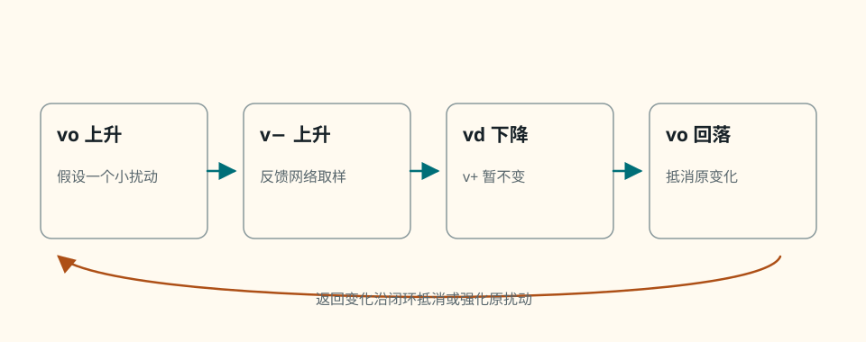{ .ae-figure }
</figure>

**图 5-5　反相端取样的负反馈方向检查。** 不要只凭“接到 − 端”判定；要沿扰动走一圈，看返回变化是否抵消原变化。

<figure class="ae-figure-frame" markdown="1">
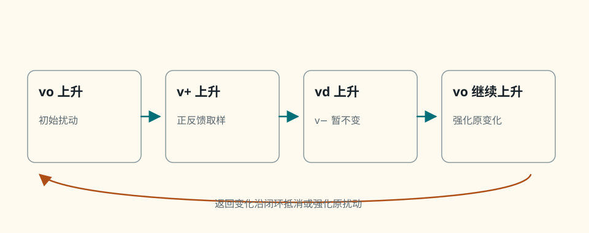{ .ae-figure }
</figure>

**图 5-6　正反馈的自增强方向。** 输入最终是否接“−”端并不改变这条输出回送到“+”端的正反馈性质。

### 3.2 状态判定：先求候选解，再验自洽

使用虚短的可靠顺序是：

1. 画出电源轨、输入正负号、反馈路径和地返回；
2. 用“$v_o$ 微升/微降”测试反馈方向；
3. 暂按线性负反馈求候选闭环解；
4. 检查候选 $v_o$ 是否在输出摆幅内，$v_+,v_-$ 是否在输入共模范围内，输出电流、频率和 $dv_o/dt$ 是否可实现；
5. 全部通过才保留 $v_+\approx v_-$；否则回到饱和/动态模型。

| 状态问题：“能用虚短吗？” | 结论 | 快速检查 |
|---|---|---|
| 反相放大器，反馈完好，候选 $v_o=-2\ \mathrm V$，允许范围 $[-10,+10]\ \mathrm V$ | 能 | 负反馈且线性解在轨内；仍需验共模/电流/频率 |
| 同相放大器要求 $v_o=+15\ \mathrm V$，但 $V_{OH}=+11\ \mathrm V$ | 不能 | 输出已正饱和，实际 $v_d$ 不再由 $v_o/A$ 的闭环小误差决定 |
| 开环比较器，$v_+=10\ \mathrm{mV},v_-=0$ | 不能 | 没有负反馈，输出趋向 $V_{OH}$ |
| 反相施密特触发器，输出回送同相端 | 不能 | 正反馈形成滞回，输入交叉阈值时翻转 |
| 负反馈放大器，正弦频率远超闭环带宽 | 通常不能按静态虚短 | $A(j\omega)$ 已下降且有相位，$v_d$ 不能忽略 |
| 负反馈电路正在压摆率限制或输出限流 | 不能用于瞬时求解 | 输出级跟不上所需 $dv_o/dt$ 或电流，线性闭环关系失效 |

**表 5-1　六个虚短状态判断。** “反馈存在”不等于“虚短成立”；反馈极性和工作状态缺一不可。

<figure class="ae-figure-frame" markdown="1">
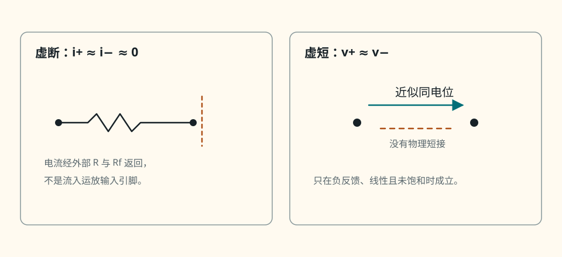{ .ae-figure }
</figure>

**图 5-7　“虚断”与“虚短”不能望文生义。** 前者是输入电流近似，后者是特定闭环状态下的差分电压近似。

### 3.3 单位、极限与失败模式

若 $A=2.0\times10^5$ 且闭环输出 $v_o=4.0\ \mathrm V$，则 $v_d=20\ \mu\mathrm V$，并非严格为零。若差模输入电阻 $R_{in}=2\ \mathrm{M\Omega}$，对应差模电流量级 $10\ \mathrm{pA}$；实体输入偏置电流可能另有更大值，不能混为一项。

常见失败模式是：正反馈仍硬令 $v_+=v_-$；已饱和仍按电阻比算输出；把两个输入端画成导线；忽略高频 $A$ 下降、压摆率、输出限流；或只看电路中有一根线从输出返回便宣称“负反馈”。

### 第二遍：适用边界

虚断在低频主要由输入电阻/偏置电流精度决定；虚短则是更严格的状态近似，只在高环路增益、负反馈、线性未饱和时适用。比较器/开环、正反馈、输出饱和、高频、压摆率限制和电流限制都是明确反例。

### 30 秒回答

“虚断来自高输入电阻，所以 $i_+,i_-\approx0$；虚短来自 $v_d=v_o/A$，在 $A$ 很大而输出有限时才有 $v_+\approx v_-$。虚短还必须先证明是负反馈并且线性未饱和。它不是物理短路；比较器、正反馈、饱和、高频、压摆率或限流状态都不能直接套用。”

### 第二遍：90 秒回答

“我会分开证明两条近似。输入电流由输入电阻模型决定，$R_{in}$ 很大给出虚断；差分电压由开环关系决定，$v_d=v_o/A$，只有负反馈能把输出变化送回去抵消输入误差，而候选输出还必须在摆幅、共模、电流、SR 与带宽范围内，才可把 $v_d$ 近似为零。判断反馈时我假设 $v_o$ 上升，若回送使 $v_d$ 降低就是负反馈。任何检查失败，就回到有限增益、饱和或动态模型，而不是继续强迫两输入等电位。”

### 本节练习与递进追问

1. 对“输出经电阻回到同相端、输入接反相端”的电路，用输出微升法判反馈方向，并说明为何不能用虚短。
2. 追问一：虚断能否推出 $v_+=v_-$？追问二：负反馈但输出饱和时，哪一步假设失效？

## 4. P0：反相放大器——KCL 主模板

!!! abstract "第一次阅读：只守住一个求和节点"

    先标出 $v_-$ 节点的两条电阻电流，再用虚断写 KCL；负号应从方程中出现。第一遍先得到理想闭环增益并做输出轨/电流检查，有限 $A$ 精确误差后读。

### 4.1 完整电路、假设与参考量

<figure class="ae-figure-frame" markdown="1">
{ .ae-figure }
</figure>

**图 5-8　反相放大器的完整连接。** $R_{in}$ 是外接输入电阻；不要和运放自身极高的差模输入电阻混称。

假设：低频或中频、负反馈、高环路增益、候选输出未饱和；输入共模、输出电流、压摆率和带宽均通过检查；暂取理想输入和输出端。变量定义：$i_i=(v_i-v_-)/R_{in}$ 向右，$i_f=(v_--v_o)/R_f$ 从求和节点流向输出。

负反馈方向：若 $v_o$ 上升，经 $R_f$ 使 $v_-$ 上升，$v_d=0-v_-$ 下降，运放把 $v_o$ 拉低，故是负反馈。于是线性状态可用 $v_-\approx v_+=0$；这个节点称**虚地**，它电位近似为地但没有直接接地，且能通过外部电阻传输电流。

### 4.2 KCL → 求解 → 单位与极限

在 $v_-$ 写 KCL，因 $i_-\approx0$：

\[
\frac{v_i-v_-}{R_{in}}
=\frac{v_--v_o}{R_f}.
\]

代入 $v_-\approx0$：

\[
\frac{v_i}{R_{in}}=-\frac{v_o}{R_f}
\quad\Rightarrow\quad
\boxed{A_v=\frac{v_o}{v_i}=-\frac{R_f}{R_{in}}}.
\]

负号表示对同一地参考反相。电阻比无量纲，所以电压增益无量纲；$v_i/R_{in}$ 与 $-v_o/R_f$ 都是 A。极限 $R_f\to0$ 会逼近零增益，但实际会令输出直接钳求和节点；$R_{in}\to0$ 会要求过大电流，因此不能把公式极限当作可制造电路。

<figure class="ae-figure-frame" markdown="1">
{ .ae-figure }
</figure>

**图 5-9　反相输出波形。** 图形只在输出未削顶、频率与斜率均可实现时成立。

### 4.3 端口电阻与有限开环增益修正

从信号源端“看入”图 5-8，在理想闭环状态 $v_-\approx0$，故 $i_i=v_i/R_{in}$，外部闭环输入电阻

\[
R_{in,cl}=\frac{v_i}{i_i}\approx R_{in}.
\]

这不表示运放引脚本身只有 $R_{in}$；引脚输入电阻仍很高，信号源看到的是外接电阻通向虚地的效果。求输出电阻时应令独立输入 $v_i=0$、移除 $R_L$、保留反馈与受控源，在输出加测试源；理想运放 $R_{out}=0$，故理想闭环输出电阻也是 $0$。实体运放的闭环输出电阻约被环路增益降低，而且随频率上升，不等于“看见 $R_f$ 就是 $R_f$”。

深入轨保留有限 $A$。因为 $v_+=0$，有

\[
v_-=-\frac{v_o}{A}.
\]

仍在求和节点写同一条 KCL并代入：

\[
\frac{v_i+v_o/A}{R_{in}}
=\frac{-v_o/A-v_o}{R_f},
\]

整理得

\[
\boxed{
\frac{v_o}{v_i}
=-\frac{R_f}{R_{in}+(R_f+R_{in})/A}
=-\frac{R_f/R_{in}}{1+(1+R_f/R_{in})/A}
}.
\]

有限 $A>0$ 使增益幅值小于理想值；相对误差一阶约为“噪声增益”$(1+R_f/R_{in})/A$。这里的**噪声增益**是从运放等效输入误差到输出的闭环倍数 $1+R_f/R_{in}$，不同于信号增益 $-R_f/R_{in}$。若 $R_f/R_{in}=4.7,A=10^5$，精确增益为

\[
-\frac{4.7}{1+5.7\times10^{-5}}=-4.69973,
\]

幅值相对理想值低约 $0.00570\%$。

<figure class="ae-figure-frame" markdown="1">
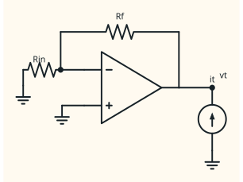{ .ae-figure }
</figure>

**图 5-10　反相闭环输出电阻的端口定义。** 测量条件比“低输出电阻”这句话更重要。

### 4.4 完整数值例题与六项检查

取 $R_{in}=10.0\ \mathrm{k\Omega},R_f=47.0\ \mathrm{k\Omega},R_L=10.0\ \mathrm{k\Omega}$，供电 $\pm12\ \mathrm V$；数据手册条件下 $V_{OH}=+10.5\ \mathrm V,V_{OL}=-10.5\ \mathrm V$，输入共模范围 $[-10,+10]\ \mathrm V$，最大线性输出电流 $10\ \mathrm{mA}$，GBW $=1.0\ \mathrm{MHz}$，SR $=0.50\ \mathrm{V/\mu s}$。输入为 $v_i(t)=1.50\sin(2\pi\cdot5.00\ \mathrm{kHz}\,t)\ \mathrm V$，忽略失调和偏置电流。

1. 理想候选输出峰值：$V_{op}=4.7(1.50)=7.05\ \mathrm V$，极性反相。
2. 轨检查：$[-7.05,+7.05]\ \mathrm V\subset[-10.5,+10.5]\ \mathrm V$，通过。
3. 共模检查：两输入约为 $0\ \mathrm V$，在 $[-10,+10]\ \mathrm V$ 内。
4. 输出电流峰值：负载支路 $7.05/10.0\ \mathrm{k\Omega}=0.705\ \mathrm{mA}$，反馈支路 $7.05/47.0\ \mathrm{k\Omega}=0.150\ \mathrm{mA}$；最坏合计幅值约 $0.855\ \mathrm{mA}<10\ \mathrm{mA}$。
5. 带宽检查：噪声增益 $1+47/10=5.7$，一阶闭环带宽约 $1.0\ \mathrm{MHz}/5.7=175\ \mathrm{kHz}$，$5.00\ \mathrm{kHz}$ 远低于它。
6. 压摆率检查：正弦所需最大斜率 $2\pi fV_{op}=2\pi(5.00\ \mathrm{kHz})(7.05\ \mathrm V)=0.221\ \mathrm{V/\mu s}<0.50\ \mathrm{V/\mu s}$。

所以本例在所列模型下自洽。若只把频率改为 $20.0\ \mathrm{kHz}$，所需 SR 为 $0.886\ \mathrm{V/\mu s}$，即使幅值未碰电源轨也会发生压摆率失真。

### 第二遍：适用边界

公式 $-R_f/R_{in}$ 只适用于闭环解通过电源轨、输入共模、输出电流、压摆率和带宽检查的线性负反馈状态。电阻很大时偏置电流/噪声误差上升；电阻很小时信号源与输出负担加重。高频细节见下一章。

### 30 秒回答

“反相电路的输出经 $R_f$ 回到反相端，输出上升会令 $v_-$ 上升并使 $v_d$ 降低，所以是负反馈。线性未饱和时 $v_-\approx v_+=0$ 且输入电流近零。在求和节点写 $(v_i-v_-)/R_{in}=(v_--v_o)/R_f$，得 $v_o/v_i=-R_f/R_{in}$。信号源看入约为 $R_{in}$；最后要查轨、共模、电流、SR 和 GBW。”

### 第二遍：90 秒回答

“我先画完整供电和返回，定义电流从输入经 $R_{in}$ 流向求和节点，再经 $R_f$ 返回输出。输出微升通过 $R_f$ 使反相端升高，故负反馈。虚断给出输入引脚不分流，虚短给出求和节点近似零伏，KCL 直接得到反相增益。有限 $A$ 时 $v_-=-v_o/A$，精确增益是 $-(R_f/R_{in})/[1+(1+R_f/R_{in})/A]$，所以误差由噪声增益除以 $A$ 控制。端口上，信号源看到外接 $R_{in}$，实体闭环输出电阻被环路增益降低。理想结果只有在全部大信号与动态边界内才成立。”

### 本节练习与递进追问

1. $R_{in}=12\ \mathrm{k\Omega},R_f=68\ \mathrm{k\Omega},v_i=1.8\ \mathrm V$，供电 $\pm9\ \mathrm V$ 且输出只能到 $\pm7.5\ \mathrm V$；先求候选值，再判断能否用虚短保留该值。
2. 追问一：为什么反相电路“运放引脚高阻”与“信号源看到 $R_{in}$”不矛盾？追问二：有限 $A$ 为什么使闭环增益幅值略小？

## 5. P0：同相放大器与电压跟随器

!!! abstract "第一次阅读：从反馈分压反推输出"

    在线性负反馈下，先令反馈分压节点追踪 $v_i$，再解出为此所需的 $v_o$。跟随器的重点是隔离源和负载，不是“增益等于 1 所以没有作用”。

### 5.1 完整电路、反馈分压与 KCL

<figure class="ae-figure-frame" markdown="1">
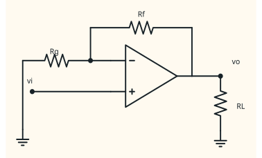{ .ae-figure }
</figure>

**图 5-11　同相放大器的完整连接。** 输出直接控制分压节点 $v_-$；正、负供电和负载返回不可省略。

假设与反相电路相同：低/中频、负反馈、高环路增益、线性未饱和且通过全部边界。若 $v_o$ 上升，分压使 $v_-$ 上升，$v_d=v_i-v_-$ 下降，故为负反馈。

输入引脚近似不取电流，反馈分压节点 KCL 为

\[
\frac{v_o-v_-}{R_f}=\frac{v_-}{R_g}.
\]

因此

\[
v_-=\frac{R_g}{R_f+R_g}v_o\equiv\beta v_o.
\]

线性状态 $v_-\approx v_+=v_i$，所以

\[
\boxed{\frac{v_o}{v_i}=\frac1\beta=1+\frac{R_f}{R_g}}.
\]

也可把 $v_-$ 代回 KCL 得到同一结果。电阻比和增益均无量纲，闭环增益不小于 1；若算出负值或小于 1，应检查拓扑或符号。

<figure class="ae-figure-frame" markdown="1">
{ .ae-figure }
</figure>

**图 5-12　同相放大器的波形方向。** “同相”指相对同一参考地的极性，不代表输出必为正值。

### 5.2 有限开环增益 A、端口与数值检查

令 $\beta=R_g/(R_f+R_g)$。有限开环增益时

\[
v_o=A(v_i-\beta v_o),
\]

故

\[
\boxed{\frac{v_o}{v_i}=\frac{A}{1+A\beta}
=\frac{1/\beta}{1+1/(A\beta)}}.
\]

当 $A\beta\gg1$ 才趋近 $1/\beta$；相对误差约 $1/(A\beta)=(1+R_f/R_g)/A$。同相电路的信号增益恰好也等于噪声增益。

信号源从 $v_+$ 看入的是运放输入端；理想时输入电阻无限大，实体时由输入级及反馈共同决定。输出电阻仍须按测试源法定义；理想为零，实体闭环值通常比开环输出电阻低。高输入电阻不表示信号源完全无误差：输入偏置电流和输入电容仍会与源电阻作用。

数值例：$R_f=30.0\ \mathrm{k\Omega},R_g=10.0\ \mathrm{k\Omega},R_L=2.00\ \mathrm{k\Omega}$，输入 $v_i(t)=2.00\sin(2\pi\cdot10.0\ \mathrm{kHz}\,t)\ \mathrm V$；供电 $\pm12\ \mathrm V$，输出范围 $\pm10.5\ \mathrm V$，共模范围 $[-10,+10]\ \mathrm V$，最大线性输出电流 $10\ \mathrm{mA}$，GBW $1.0\ \mathrm{MHz}$，SR $1.0\ \mathrm{V/\mu s}$。

- 候选增益 $1+30/10=4.00$，输出峰值 $8.00\ \mathrm V$，未碰轨；
- 两输入端约随 $v_i$ 在 $\pm2.00\ \mathrm V$ 内，满足共模范围；
- 负载电流峰值 $8/2.00\ \mathrm{k\Omega}=4.00\ \mathrm{mA}$，反馈分压链峰值 $8/(30+10)\ \mathrm{k\Omega}=0.200\ \mathrm{mA}$，合计约 $4.20\ \mathrm{mA}<10\ \mathrm{mA}$；
- 闭环带宽一阶估计 $1.0\ \mathrm{MHz}/4=250\ \mathrm{kHz}>10.0\ \mathrm{kHz}$；
- 所需 SR 为 $2\pi(10.0\ \mathrm{kHz})(8.00\ \mathrm V)=0.503\ \mathrm{V/\mu s}<1.0\ \mathrm{V/\mu s}$。

若只把输入峰值改为 $3.00\ \mathrm V$，候选输出峰值为 $12.0\ \mathrm V$，超过 $10.5\ \mathrm V$，波形削顶，不能继续用虚短声称输出等于 $12.0\ \mathrm V$。

### 5.3 跟随器：单位增益不等于没有作用

把输出直接接到反相端、信号接同相端，得到 $\beta=1$ 的极限：

\[
\boxed{v_o\approx v_i}.
\]

<figure class="ae-figure-frame" markdown="1">
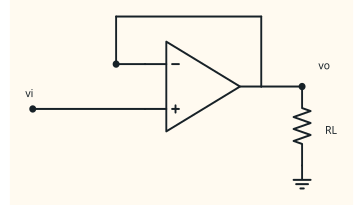{ .ae-figure }
</figure>

**图 5-13　电压跟随器作为缓冲器。** “电流驱动增强”指隔离高源阻与低负载，不是允许无限输出电流。

例如 $v_s=1.00\ \mathrm V,R_s=100\ \mathrm{k\Omega},R_L=1.00\ \mathrm{k\Omega}$。若直接相连，负载只有 $1.00\times1/(100+1)=9.90\ \mathrm{mV}$；插入理想跟随器后，输入约 $1.00\ \mathrm V$，输出也约 $1.00\ \mathrm V$，运放向负载提供 $1.00\ \mathrm{mA}$。实际还必须确认 $1\ \mathrm{mA}$ 在输出能力内、输入/输出接近电源轨时仍在线性范围内，并注意容性负载稳定性。

### 第二遍：适用边界

同相增益式与跟随关系依赖负反馈线性状态。输入电压虽不经外接串联电阻，仍受共模范围约束；输出仍受摆幅、电流、负载电容、GBW 与 SR 限制。电压跟随器改善的是端口隔离和负载驱动，不产生能量，也不保证所有运放在任意容性负载下稳定。

### 30 秒回答

“同相电路由 $R_f,R_g$ 把输出分压到反相端。输出上升令 $v_-$ 上升，所以是负反馈。虚断使分压不被输入引脚加载，$v_-=v_oR_g/(R_f+R_g)$；线性虚短令 $v_-=v_i$，于是增益 $1+R_f/R_g$。输出直连反相端时 $\beta=1$，成为电压跟随器，用高输入、低输出端口隔离信号源和负载。”

### 第二遍：90 秒回答

“先在反馈分压点写 KCL，得 $v_-=\beta v_o$，其中 $\beta=R_g/(R_f+R_g)$。确认负反馈并通过边界后，$v_-\approx v_i$，所以 $v_o/v_i=1/\beta=1+R_f/R_g$。有限 $A$ 的精确式是 $A/(1+A\beta)$，表明闭环准确性的关键是环路增益 $A\beta$。跟随器是 $\beta=1$，电压增益近 1，却能让高源阻几乎不带载，同时由电源和输出级向低阻负载供电流；它仍受共模、输出摆幅/电流、SR、GBW 和稳定性限制。”

### 本节练习与递进追问

1. $R_f=22\ \mathrm{k\Omega},R_g=10\ \mathrm{k\Omega},v_i=2.5\ \mathrm V$，输出范围 $[-8,+8]\ \mathrm V$，求候选输出并判断状态；再说明若 $R_L=500\ \Omega$ 还应查什么。
2. 追问一：跟随器电压增益约为 1，为何仍能“增强驱动”？追问二：同相端源电阻很大时，哪两个输入非理想会更值得关注？

## 6. P0：反相求和器——在一个节点做加权

!!! abstract "第一次阅读：把每路输入写成一项电流"

    每个输入经自己的电阻向同一求和节点送入电流，反馈支路提供平衡。第一遍只要会逐项写 KCL，并在求和后重新检查输出是否饱和。

### 6.1 功能、完整电路与 KCL

求和器把多个输入按电阻比加权并反相，常用于模拟加法、偏置注入与数模接口。所有输入电压均对同一地参考。

<figure class="ae-figure-frame" markdown="1">
{ .ae-figure }
</figure>

**图 5-14　三个输入的反相加权求和器。** 增加输入必须增加独立电阻，不能把理想电压源直接并联。

假设：理想输入端、负反馈、低/中频、输出线性未饱和，且所有源/负载与器件边界允许。定义 $i_k=(v_k-v_-)/R_k$ 流入求和节点，$i_f=(v_--v_o)/R_f$ 流出节点。虚断给出求和节点没有输入引脚分流，KCL 为

\[
\sum_{k=1}^{n}\frac{v_k-v_-}{R_k}
=\frac{v_--v_o}{R_f}.
\]

虚短给出 $v_-\approx0$，于是

\[
\boxed{v_o=-R_f\sum_{k=1}^{n}\frac{v_k}{R_k}}.
\]

若所有 $R_k=R$，则 $v_o=-(R_f/R)(v_1+\cdots+v_n)$。每项 $v_k/R_k$ 的单位是 A，乘 $R_f$ 得 V。纯电阻求和器是无记忆电路，无电容/电感初值；若源本身带动态，则其初态属于源而非此网络。

### 6.2 数值、极限、实用误差与失败模式

取 $R_f=20.0\ \mathrm{k\Omega}$，$R_1=10.0\ \mathrm{k\Omega},R_2=20.0\ \mathrm{k\Omega},R_3=40.0\ \mathrm{k\Omega}$；$v_1=+0.300\ \mathrm V,v_2=-0.400\ \mathrm V,v_3=+1.00\ \mathrm V$，输出范围 $\pm4.0\ \mathrm V$。三支路电流分别为 $+30.0,-20.0,+25.0\ \mu\mathrm A$，代数和 $+35.0\ \mu\mathrm A$，故反馈电流为 $35.0\ \mu\mathrm A$，

\[
v_o=-(20.0\ \mathrm{k\Omega})(35.0\ \mu\mathrm A)=-0.700\ \mathrm V,
\]

在轨内。若把 $v_1$ 改为 $3.00\ \mathrm V$，候选输出变为 $-6.10\ \mathrm V$，超过负向范围，实际饱和，虚短解失效。

<figure class="ae-figure-frame" markdown="1">
{ .ae-figure }
</figure>

**图 5-15　求和器的权重与共同饱和边界。** 叠加只对线性系统成立；饱和后不能分别求贡献再相加。

电阻误差直接变成权重误差；电阻过大时偏置电流与热噪声增大，过小时输入源和运放输出电流加重。输入数量增加也提高等效噪声增益、寄生电容影响和饱和概率。

**面试一句话：**“我不背求和式，而是在虚地节点列 KCL；每个 $v_k/R_k$ 是一股电流，反馈电阻把电流总和转换为反相输出。”

### 第二遍：适用边界

只有所有输入共同作用后的候选输出在线性区，且共模、输出电流、SR 与带宽均合格时，才能使用叠加和虚短。某输入源若不能驱动其 $R_k$，还要把源内阻并入计算。

### 30 秒回答

“反相求和器把多个输入各经一个电阻送到虚地求和节点。输入引脚不分流，所以 KCL 给出 $\sum v_k/R_k=-v_o/R_f$，即 $v_o=-R_f\sum v_k/R_k$。电阻比决定权重；最后用所有项的代数和检查输出轨与电流。”

### 第二遍：90 秒回答

“先确认输出经 $R_f$ 回反相端形成负反馈，且候选输出未饱和。定义每个支路电流 $(v_k-v_-)/R_k$ 流入求和点，反馈电流 $(v_--v_o)/R_f$ 流出；虚断让两者代数和守恒，虚短再令 $v_-\approx0$，得到加权和。电阻误差就是权重误差，偏置电流会在较大等效电阻上产生失调，频率升高还要看噪声增益和寄生。任何一路让总输出越轨后，叠加与虚短都不能继续使用。”

### 本节练习与递进追问

1. 设计一个候选关系为 $v_o=-(2v_1+0.5v_2+v_3)$ 的求和器，只写电阻比例，并列出你必须声明的输出范围与输入源条件。
2. 追问一：为何不能把两个理想电压源直接并到求和点？追问二：一路输入令输出饱和后，能否仍用叠加定理求实际输出？

## 7. P0：差分放大器——匹配电阻比才抑制共模

!!! abstract "第一次阅读：先核对四只电阻的位置"

    不要先背 $v_o=k(v_2-v_1)$；先按图辨认反相侧输入/反馈与同相侧输入/对地电阻。第一遍只处理电阻比完全匹配的情形，失配 CMRR 和共模边界第二遍再加。

### 7.1 功能、完整电路与推导

本节固定拓扑：$v_1$ 经 $R_1$ 接反相端，$R_2$ 从输出反馈；$v_2$ 经 $R_3$ 接同相端，$R_4$ 从同相端接地。目标是输出 $v_2-v_1$ 的加权差。

<figure class="ae-figure-frame" markdown="1">
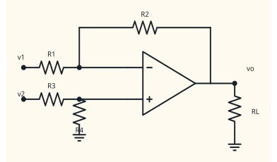{ .ae-figure }
</figure>

**图 5-16　四电阻差分放大器的指定拓扑。** $R_1,R_2$ 属于反相侧，$R_3,R_4$ 属于同相分压侧。

假设：四个源/电阻相对同一地，负反馈、线性未饱和，输入电流近零。先在同相节点用分压/KCL：

\[
v_+=\frac{R_4}{R_3+R_4}v_2.
\]

线性虚短令 $v_-=v_+$。在反相节点写 KCL：

\[
\frac{v_1-v_-}{R_1}=\frac{v_--v_o}{R_2}.
\]

解得一般式

\[
v_o=\left(1+\frac{R_2}{R_1}\right)
\frac{R_4}{R_3+R_4}v_2-\frac{R_2}{R_1}v_1.
\]

只有比例严格匹配

\[
\boxed{\frac{R_2}{R_1}=\frac{R_4}{R_3}=k}
\]

时，才化为

\[
\boxed{v_o=k(v_2-v_1)}.
\]

比例与增益无量纲。纯电阻网络没有储能初值。极限 $v_1=v_2=v_{cm}$ 时，理想匹配给 $v_o=0$；这正是检验共模抑制的最快方法。

### 7.2 匹配、CMRR 边界与数值检查

<figure class="ae-figure-frame" markdown="1">
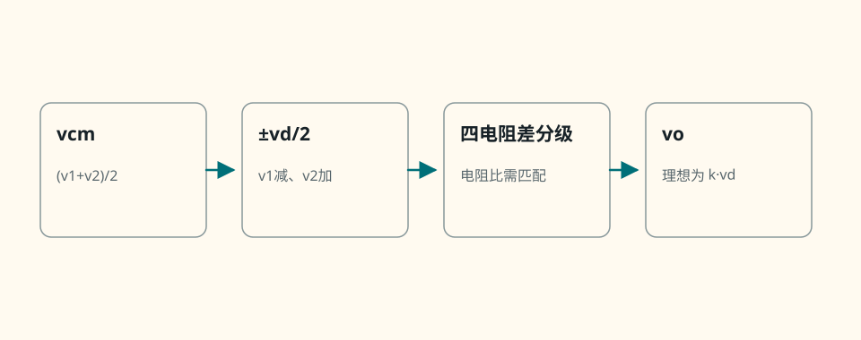{ .ae-figure }
</figure>

**图 5-17　差模与共模的分解。** 电阻网络匹配和运放自身 CMRR 是两道不同边界，任一道不足都会留下共模误差。

数值例：$R_1=10.0\ \mathrm{k\Omega},R_2=40.0\ \mathrm{k\Omega},R_3=15.0\ \mathrm{k\Omega},R_4=60.0\ \mathrm{k\Omega}$，两侧比例都是 4；$v_1=0.800\ \mathrm V,v_2=1.200\ \mathrm V$。因此 $v_+=1.200\times60/(15+60)=0.960\ \mathrm V$，$v_-\approx0.960\ \mathrm V$，

\[
v_o=4(1.200-0.800)=1.600\ \mathrm V.
\]

若输出范围为 $\pm5.0\ \mathrm V$、输入共模范围为 $[-2,+3]\ \mathrm V$，则本例的输入节点与输出均通过静态范围检查。若把两个输入同时增加 $+10\ \mathrm V$，数学差仍为 $0.400\ \mathrm V$，但引脚共模已可能越界，不能据理想差分式宣称输出不变。

电阻“都用 1%”不等于两比值误差恰好抵消；应使用成组匹配网络或按所需 CMRR 预算比值误差。实际共模抑制比 CMRR 常以 dB 表示：同样差模信号下，CMRR 越高，共模到输出的误差越小；频率上升时一般变差。

**面试一句话：**“四电阻差分器要先写一般式；只有 $R_2/R_1=R_4/R_3$ 才有 $v_o=k(v_2-v_1)$，而且输入共模必须在运放范围内。”

### 第二遍：适用边界

差分公式受电阻比匹配、运放 CMRR、输入共模范围、输入源内阻、输出摆幅和频率共同限制。若两个源内阻不同，它们会并入相应支路并破坏名义比值。需要很高输入阻抗与 CMRR 时通常采用仪表放大器结构，而不是无限提高四个电阻。

### 30 秒回答

“指定四电阻拓扑中，先求 $v_+=v_2R_4/(R_3+R_4)$，再在反相端列 KCL。一般式只有在 $R_2/R_1=R_4/R_3=k$ 时才化为 $v_o=k(v_2-v_1)$。共模抑制同时受电阻比匹配和运放 CMRR 限制，输入共模越界时理想差分式失效。”

### 第二遍：90 秒回答

“我不会一看到四个电阻就直接写差值。先由同相分压得到 $v_+$，确认负反馈线性后令 $v_-=v_+$，再用 $(v_1-v_-)/R_1=(v_--v_o)/R_2$ 求一般式。比较 $v_2$ 与 $v_1$ 的系数，可得比例匹配条件 $R_2/R_1=R_4/R_3$。即使比值名义匹配，公差、源内阻和运放有限 CMRR 都会把共模泄漏到输出；输入引脚还必须位于共模范围内。因此差分很小而共模很大时，最先检查的不只是输出轨。”

### 本节练习与递进追问

1. $R_1=12\ \mathrm{k\Omega},R_2=36\ \mathrm{k\Omega},R_3=20\ \mathrm{k\Omega}$，选择 $R_4$ 使比例匹配；再对 $v_1=1.7\ \mathrm V,v_2=2.0\ \mathrm V$ 写候选输出和共模检查项。
2. 追问一：四只独立 1% 电阻为何可能使 CMRR 很差？追问二：输入差值很小，为什么共模越界仍会失真？

## 8. P1 第二遍：积分器——电容初值、直流漂移与实用泄放

!!! abstract "进入本 P1 小节：先定电容参考方向和初值"

    先由电容两端电压定义得到 $v_o(0^+)$，再用求和节点 KCL 得到输出斜率。第二遍先算理想积分器的分段候选波形与首次撞轨，再读泄放电阻和直流漂移。

### 8.1 功能、完整电路、KCL 与初值

理想反相积分器用输入电阻把电压变成电流，用反馈电容积累电荷，输出与输入的时间积分成比例。

<figure class="ae-figure-frame" markdown="1">
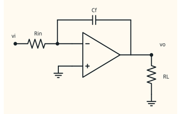{ .ae-figure }
</figure>

**图 5-18　带电容电压参考的理想反相积分器。** 初始电容电压 $v_C(t_0)$ 不能凭空删掉。

假设：负反馈且整个观察区间内输出线性，运放输入电流为零；$R,C$ 理想，输入连续到足以不触发动态限制。定义电容电压 $v_C=v_--v_o$，电流从 $v_-$ 流向 $v_o$ 为 $i_C=C\,d(v_--v_o)/dt$。求和节点 KCL：

\[
\frac{v_i-v_-}{R}=C\frac{d(v_--v_o)}{dt}.
\]

用 $v_-\approx0$ 得

\[
\frac{dv_o}{dt}=-\frac{v_i}{RC}.
\]

从 $t_0$ 积分到 $t$：

\[
\boxed{
v_o(t)=v_o(t_0)-\frac1{RC}\int_{t_0}^{t}v_i(\tau)\,d\tau
}.
\]

由于 $v_-(t_0)\approx0$，有 $v_o(t_0)=-v_C(t_0)$。$RC$ 单位为 s，积分 $\int v_i dt$ 为 $\mathrm{V\cdot s}$，除以 $RC$ 后为 V。

### 8.2 波形、数值与饱和时间

<figure class="ae-figure-frame" markdown="1">
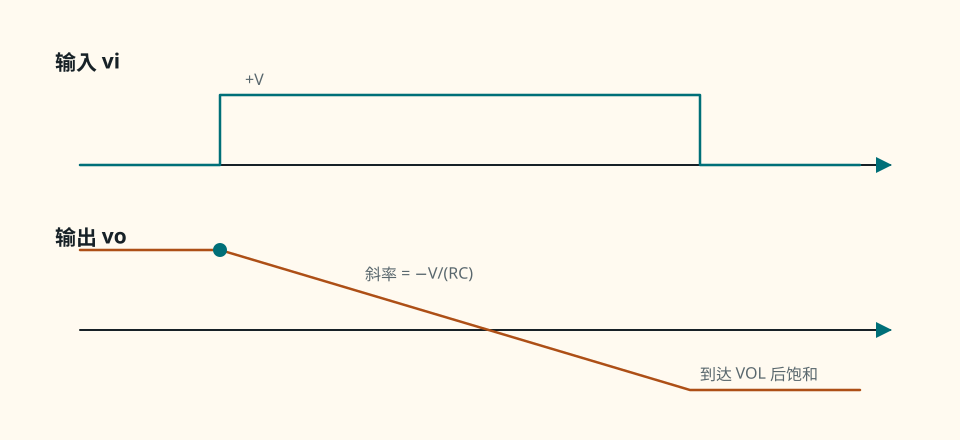{ .ae-figure }
</figure>

**图 5-19　正恒压输入产生负斜坡。** 输出初值决定斜坡从哪里开始，电源轨决定它能走多远。

取 $R=100\ \mathrm{k\Omega},C=1.00\ \mathrm{\mu F},v_i=+0.200\ \mathrm V$（$t\ge0$），$v_o(0)=+1.00\ \mathrm V$，输出范围 $[-10,+10]\ \mathrm V$。$RC=0.100\ \mathrm s$，斜率为 $-2.00\ \mathrm{V/s}$，所以 $v_o(0.300\ \mathrm s)=+0.400\ \mathrm V$。若输入一直保持，候选输出在

\[
t=\frac{1.00-(-10.0)}{2.00}=5.50\ \mathrm s
\]

到达负饱和；之后不能继续按直线外推。

### 8.3 直流漂移与实用积分器

真实电路的输入失调电压、偏置电流和输入直流分量即使很小，也会被持续积分，最终把输出推到某一电源轨。实用做法是在 $C$ 两端并联 $R_f$，给直流提供泄放路径：

<figure class="ae-figure-frame" markdown="1">
{ .ae-figure }
</figure>

**图 5-20　并联泄放电阻的实用积分器。** 它牺牲无限直流增益来避免缓慢漂移到饱和。

并联 $R_f$ 后是“漏积分器”：时间尺度远短于 $R_fC$ 时近似理想积分，长时间后直流输出有限。还要检查电容漏电、介质吸收、初值复位方式、输出 SR 与轨限制。

**面试一句话：**“积分器必须写 $v_o(t_0)$；实际失调和偏置会被积到饱和，所以用并联反馈电阻限制直流增益。”

### 第二遍：适用边界

理想积分式只在运放线性、$v_-\approx0$ 且电容模型有效的区间成立。初始电压、直流误差、输出轨、SR、输入/输出电流以及实用泄放电阻都会改变长时间结果。

### 30 秒回答

“在虚地节点，输入电流 $v_i/R$ 全部流入反馈电容；$v_i/R=-C\,dv_o/dt$。因此 $v_o(t)=v_o(t_0)-(1/RC)\int_{t_0}^t v_i d\tau$，初值由电容原有电压决定。真实失调、偏置和直流输入会一直积累到饱和，所以常在电容并联 $R_f$ 限制直流增益。”

### 第二遍：90 秒回答

“我先定义电容电压 $v_C=v_--v_o$，避免初值和符号混乱。负反馈线性时 $v_-\approx0$，KCL 是 $(v_i-v_-)/R=C\,d(v_--v_o)/dt$，积分后必须保留 $v_o(t_0)=-v_C(t_0)$。常值正输入给负斜率，斜率单位是 V/s。实体积分器即使输入标称为零，也会积分失调和偏置，最终撞轨；并联 $R_f$ 给 DC 泄放，低频变成有限增益、高一些频率才近似积分。观察时间、轨、SR 与电容非理想都要声明。”

### 本节练习与递进追问

1. $R=50\ \mathrm{k\Omega},C=2.0\ \mathrm{\mu F},v_o(0)=-1.0\ \mathrm V$，在 $0\le t\le0.4\ \mathrm s$ 施加 $v_i=-0.25\ \mathrm V$；写候选函数并根据给定 $\pm3\ \mathrm V$ 输出范围判断是否碰轨。
2. 追问一：输入为零时理想积分器为何仍可能有非零输出？追问二：并联 $R_f$ 为什么能抑制 DC 漂移，却不会在合适频带完全取消积分作用？

## 9. P1 第二遍：微分器——边沿敏感也意味着噪声敏感

!!! abstract "进入本 P1 小节：先把输入斜率变成电流"

    输入电容产生与 $\mathrm dv_i/\mathrm dt$ 成正比的电流，反馈电阻再把它变成输出电压。第二遍先判断常值、斜坡与边沿的理想输出，然后再学为什么实用电路必须限带。

### 9.1 功能、完整电路与 KCL

理想反相微分器用输入电容把变化率变成电流，再由反馈电阻转换为输出电压。

<figure class="ae-figure-frame" markdown="1">
{ .ae-figure }
</figure>

**图 5-21　带电容参考的理想反相微分器。** 输入必须有返回路径；实际信号源输出电阻也是电路的一部分。

假设：输入在所分析区间可微，负反馈、线性未饱和，输入电流为零，电容与电阻理想，初始电容电压与输入连续性相容。由 $v_-\approx0$，输入电容电流

\[
i_C=C\frac{d(v_i-v_-)}{dt}\approx C\frac{dv_i}{dt}.
\]

求和节点 KCL 为

\[
C\frac{d(v_i-v_-)}{dt}=\frac{v_--v_o}{R_f},
\]

故

\[
\boxed{v_o=-R_fC\frac{dv_i}{dt}}.
\]

$R_fC$ 单位是 s，乘 $\mathrm{V/s}$ 得 V。电容电压不能瞬间跃变；理想电压阶跃意味着无限 $dv_i/dt$ 和冲激输出要求，实体电路只会由带宽、SR、电流与寄生限制成有限尖峰，因此阶跃点不能直接把经典导数当普通有限值。

### 9.2 波形、数值与高频噪声

<figure class="ae-figure-frame" markdown="1">
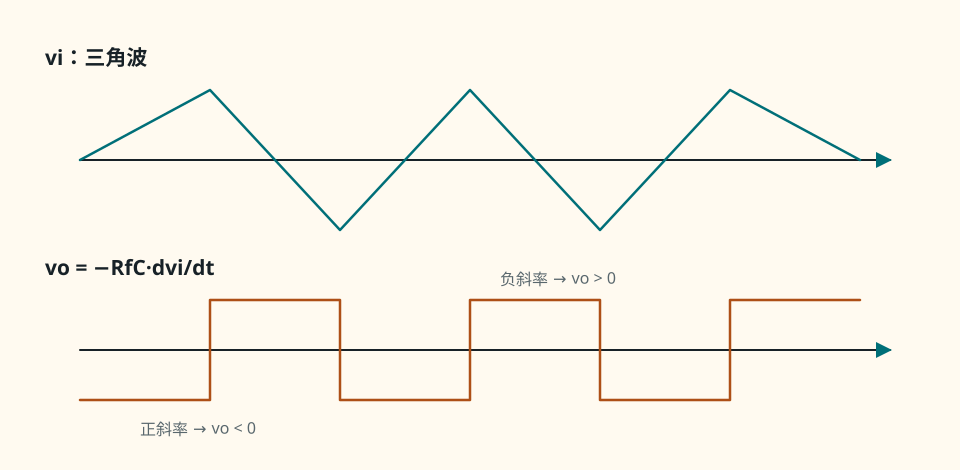{ .ae-figure }
</figure>

**图 5-22　三角波的斜率映射成反相方波。** 输出幅值取决于斜率，不只取决于输入峰值。

取 $R_f=10.0\ \mathrm{k\Omega},C=10.0\ \mathrm{nF}$，$v_i=0.100\sin(2\pi\cdot1.00\ \mathrm{kHz}\,t)\ \mathrm V$。$R_fC=100\ \mathrm{\mu s}$，所以

\[
v_o=-0.100\ \mathrm{ms}\times
(2\pi\cdot1000)(0.100)\cos(2\pi\cdot1000t)
=-0.0628\cos(2\pi\cdot1000t)\ \mathrm V.
\]

候选峰值为 $62.8\ \mathrm{mV}$。同样幅值的频率若增加 100 倍，理想输出也增 100 倍；高频噪声通常含很大变化率，因而被强烈放大，最终触发带宽、SR、输出电流或饱和限制。

### 9.3 实用带限微分器

<figure class="ae-figure-frame" markdown="1">
{ .ae-figure }
</figure>

**图 5-23　输入串 $R_{in}$、反馈并 $C_f$ 的实用带限微分器。** 两个滚降机制共同抑制高频噪声和稳定性风险。

忽略 $C_f$ 时，输入支路 $C$ 串 $R_{in}$，在 $f\ll1/(2\pi R_{in}C)$ 才近似 $-R_fCs$；更高频率增益趋近 $-R_f/R_{in}$，不再随频率无限增长。$C_f$ 又在约 $1/(2\pi R_fC_f)$ 以上降低反馈阻抗。设计时让目标信号变化率位于近似微分频带内，并逐项验噪声、相位裕度、输出电流和 SR。

**面试一句话：**“微分器把 $dv_i/dt$ 放大，所以边沿和高频噪声一起被放大；实际必须用输入串联电阻与反馈电容限带。”

### 第二遍：适用边界

理想微分式适用于可微、带限且不会把输出推入动态/幅值限制的信号区间。电容初态不相容、理想阶跃、高频噪声、源电阻、寄生与闭环稳定性都会让简单式失效。

### 30 秒回答

“微分器在虚地节点令输入电容电流 $C\,dv_i/dt$ 流过 $R_f$，因此 $v_o=-R_fC\,dv_i/dt$。频率越高，同样幅值产生的输出越大，所以噪声和尖锐边沿会被放大；实用电路用输入串联电阻限制高频增益，再用反馈并联电容继续滚降。”

### 第二遍：90 秒回答

“我定义输入电容电压为 $v_i-v_-$，线性负反馈时 $v_-\approx0$，KCL 得 $C\,d(v_i-v_-)/dt=(v_--v_o)/R_f$，从而得到反相微分式。单位检查是秒乘伏每秒得到伏。理想阶跃在数学上要求冲激输出，实体运放只会出现受 GBW、SR、电流和寄生限制的尖峰；这也解释了高频噪声问题。输入串 $R_{in}$ 使高频增益封顶在 $R_f/R_{in}$，反馈并 $C_f$ 再降低高频闭环增益，目标只是有限频带近似微分。”

### 本节练习与递进追问

1. $R_f=22\ \mathrm{k\Omega},C=4.7\ \mathrm{nF}$，输入为幅值 $0.20\ \mathrm V$、频率 $2.0\ \mathrm{kHz}$ 的正弦；写候选输出表达式，并列出至少三项动态边界检查。
2. 追问一：为何理想阶跃会暴露微分器模型的不现实？追问二：只加 $R_{in}$ 与再加 $C_f$ 分别抑制什么？

## 10. P0：比较器——先判大小，不用虚短

!!! abstract "第一次阅读：只做状态表"

    比较 $v_+$ 与 $v_-$ 后，直接选高/低输出状态，不引入虚短。第一遍要强制写明输入相等时理想模型不能唯一决定实际状态，并检查输入范围。

### 10.1 比较功能、状态表与完整波形

固定使用**同相比较器**：待比较信号接 $v_+$，参考 $V_{ref}$ 接 $v_-$；没有负反馈。运放/比较器按开环工作，输出只表示大小关系。

<figure class="ae-figure-frame" markdown="1">
{ .ae-figure }
</figure>

**图 5-24　同相比较器的固定拓扑。** 某些专用比较器为开集电极/开漏输出，必须加上拉；普通推挽输出则按数据手册接负载。

假设：只做低速静态状态判断；$v_i,V_{ref}$ 在输入允许范围内，差分输入未超过额定值；忽略失调、噪声与传播延迟。开环模型 $v_o=A(v_i-V_{ref})$ 与输出限幅给出：

从参考源经两个输入端到信号源写输入差值 KVL，$v_d-v_i+V_{ref}=0$；若输出用受控戴维南源且负载为 $R_L$，则有 $A v_d-i_oR_{out}-v_o=0$ 与 $i_o=v_o/R_L$。求出的线性候选值仍必须经过 $V_{OH},V_{OL}$ 限幅，因而得到下表。

| 输入条件 | $v_d=v_i-V_{ref}$ | 输出状态 |
|---|---:|---|
| $v_i>V_{ref}$ | $>0$ | $v_o\approx V_{OH}$ |
| $v_i<V_{ref}$ | $<0$ | $v_o\approx V_{OL}$ |
| $v_i\approx V_{ref}$ | 很小且受噪声/失调影响 | 状态不确定或反复翻转，不能宣称恰为 $0$ |

没有闭环 KCL 可把两输入拉成相等，因此**绝不能使用虚短**。单位上，输入比较的是 V，输出仍是 V；逻辑接收端还必须确认 $V_{OH},V_{OL}$ 满足其电平门限。

<figure class="ae-figure-frame" markdown="1">
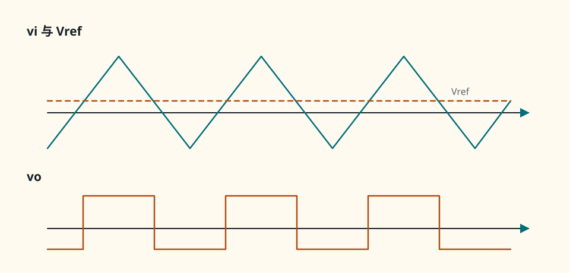{ .ae-figure }
</figure>

**图 5-25　同相比较器的阈值波形。** 只有一个理想阈值时，缓慢且带噪输入会在交越附近多次翻转。

数值例：$V_{ref}=1.20\ \mathrm V$，供电 $\pm5.0\ \mathrm V$，在指定负载下 $V_{OH}=+4.20\ \mathrm V,V_{OL}=-4.40\ \mathrm V$。$v_i=1.35\ \mathrm V$ 时输出趋向 $+4.20\ \mathrm V$；$v_i=0.90\ \mathrm V$ 时趋向 $-4.40\ \mathrm V$。若 $v_i=1.200\ \mathrm V$，失调、噪声和历史都会影响结果，不能用理想模型给唯一状态。

### 10.2 比较器与线性运放不能只按符号互换

线性运放通常为闭环线性稳定而补偿，关注失调、GBW、SR、摆幅和驱动；比较器为快速越阈翻转优化，常给传播延迟、输入过驱动、迟滞和逻辑输出接口。比较器可能不适合线性负反馈；有些运放在长期饱和后恢复很慢，或不允许很大的差分输入，也未必是好比较器。选型必须查数据手册，不能只看三角形符号。

失败模式包括：用虚短得到 $v_i=V_{ref}$；把 $V_{OH},V_{OL}$ 当作精确电源轨；忘记开集电极输出的上拉；输入越过共模/差模额定值；忽略饱和恢复和传播延迟；让慢噪声输入在单阈值处抖动。

### 第二遍：适用边界

表 5-2 是准静态理想状态表。实际切换阈值包含失调与噪声，边沿包含传播延迟，输出电平取决于负载/上拉，输入还受共模与差模范围约束。需要抗噪时使用有明确迟滞的施密特触发器。

### 30 秒回答

“比较器开环判断 $v_+-v_-$ 的符号：同相比较器中 $v_i>V_{ref}$ 输出高，反之输出低。它没有负反馈，输出通常在高低限附近，所以不能用虚短。实际还要看输入范围、失调、传播延迟、输出接口与饱和恢复。”

### 第二遍：90 秒回答

“我先指定拓扑，本例信号接同相端、参考接反相端。开环式 $v_o=A(v_i-V_{ref})$ 因 $A$ 很大而很快到 $V_{OH}$ 或 $V_{OL}$，因此状态表只由差分输入符号决定，交越附近则受失调和噪声影响。这里没有负反馈，所以 $v_+=v_-$ 不是可用条件。专用比较器和线性运放的补偿、传播延迟、饱和恢复及输出级不同；开集电极还需上拉。慢噪输入需要迟滞，不应靠理想单阈值期待干净边沿。”

### 本节练习与递进追问

1. 同相比较器 $V_{ref}=-0.50\ \mathrm V,V_{OH}=+3.3\ \mathrm V,V_{OL}=0.10\ \mathrm V$，按 $v_i=-0.8,-0.5,+0.2\ \mathrm V$ 分别写状态或“不确定”，不得使用虚短。
2. 追问一：线性运放为什么未必适合做高速比较器？追问二：输入慢慢穿越阈值且叠加噪声时，怎样从拓扑上改善？

## 11. P0：反相施密特触发器——正反馈制造滞回

!!! abstract "第一次阅读：按当前输出分别求两个阈值"

    先假定输出正饱和，由正反馈分压求翻转阈值；再对负饱和重复。第一遍用“当前状态+输入运动方向”读状态表，不把两个阈值当成同时成立。

### 11.1 指定拓扑与上下阈值推导

本节只讨论一个明确拓扑：**输入 $v_i$ 接反相端；输出经 $R_1$ 接同相端，同相端再经 $R_2$ 接参考 $V_{ref}$**。这是反相施密特触发器，反馈送到“+”端，属于正反馈。

<figure class="ae-figure-frame" markdown="1">
{ .ae-figure }
</figure>

**图 5-26　指定的反相施密特拓扑。** 电阻编号与端点一旦改变，阈值系数也会改变，不能套别的图的公式。

假设输入电流近零，输出只有两个稳定电平 $V_{OH}$ 与 $V_{OL}$；准静态输入，忽略传播延迟与失调。令

\[
\beta=\frac{R_2}{R_1+R_2}.
\]

在 $v_+$ 写 KCL：

\[
\frac{v_o-v_+}{R_1}=\frac{v_+-V_{ref}}{R_2},
\]

解得

\[
v_+=\beta v_o+(1-\beta)V_{ref}.
\]

当输出当前为高电平 $V_{OH}$，输入上升到 $v_i=v_+$ 时即将使 $v_d=v_+-v_i$ 转负，输出翻到低电平。因此**上阈值**

\[
\boxed{V_{TH}=\beta V_{OH}+(1-\beta)V_{ref}}.
\]

当输出当前为低电平 $V_{OL}$，输入下降到 $v_i=v_+$ 时即将使 $v_d$ 转正，输出翻到高电平。因此**下阈值**

\[
\boxed{V_{TL}=\beta V_{OL}+(1-\beta)V_{ref}}.
\]

滞回宽度为

\[
\boxed{V_H=V_{TH}-V_{TL}=\beta(V_{OH}-V_{OL})}.
\]

这些量的单位都是 V。若输出饱和不对称，$V_{TH}$ 和 $V_{TL}$ 也相对中心不对称；上式已经保留了这一点。

### 11.2 状态表、数值与抗噪波形

| 当前输出 | 当前阈值 | 输入越过方向 | 翻转后输出 |
|---|---:|---|---:|
| $V_{OH}$ | $V_{TH}$ | $v_i$ 上升并超过 $V_{TH}$ | $V_{OL}$ |
| $V_{OL}$ | $V_{TL}$ | $v_i$ 下降并低于 $V_{TL}$ | $V_{OH}$ |
| 任一状态 | $V_{TL}<v_i<V_{TH}$ | 未越过对应阈值 | 保持原状态（有记忆） |

取 $R_1=30.0\ \mathrm{k\Omega}$（输出到 $v_+$）、$R_2=10.0\ \mathrm{k\Omega}$（$v_+$ 到 $V_{ref}=0$），故 $\beta=0.250$。若 $V_{OH}=+4.20\ \mathrm V,V_{OL}=-4.40\ \mathrm V$，则

\[
V_{TH}=+1.05\ \mathrm V,\qquad
V_{TL}=-1.10\ \mathrm V,\qquad
V_H=2.15\ \mathrm V.
\]

从高输出开始，$v_i$ 上升穿过 $+1.05\ \mathrm V$ 后输出转低；此时阈值立即移到 $-1.10\ \mathrm V$。输入即使在 $+1.05\ \mathrm V$ 附近有小于 $2.15\ \mathrm V$ 峰峰值的局部噪声，也不会仅因回落一点就立刻翻回；必须一路降过 $-1.10\ \mathrm V$。

<figure class="ae-figure-frame" markdown="1">
{ .ae-figure }
</figure>

**图 5-27　反相施密特触发器的双阈值波形。** 上穿上阈值使输出变低，下穿下阈值使输出变高，方向由本节指定拓扑决定。

<figure class="ae-figure-frame" markdown="1">
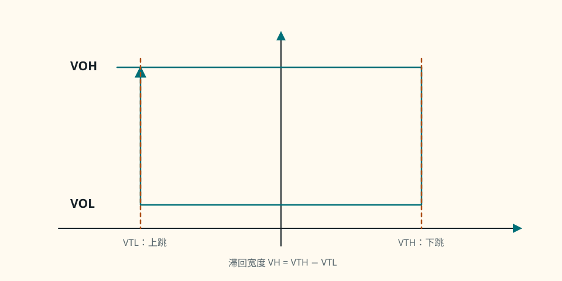{ .ae-figure }
</figure>

**图 5-28　反相施密特的滞回传输。** 高、低水平支路在 $V_{TL}$ 与 $V_{TH}$ 间重叠：输入下降沿低支路向左并在 $V_{TL}$ 上跳，输入上升沿高支路向右并在 $V_{TH}$ 下跳；区间内输出取决于先前状态。

失败模式：把 $R_1,R_2$ 的分压系数写反；忘记 $V_{ref}$ 项；用对称 $\pm V_{sat}$ 代替实际不对称输出；把正反馈误当负反馈并使用虚短；或只给两个阈值而不说明输出历史和越过方向。

### 第二遍：适用边界

静态阈值式假设输入电流可忽略、输出电平已知且切换很快。偏置电流、源阻、输出负载、失调、传播延迟与输出恢复会移动实际阈值或边沿。滞回提高噪声容限，但噪声幅度若足以跨越另一阈值，仍会翻转。

### 30 秒回答

“本例是反相施密特：输入接负端，输出经 $R_1$ 正反馈到正端，$R_2$ 把正端接参考。分压得 $v_+=\beta v_o+(1-\beta)V_{ref}$，$\beta=R_2/(R_1+R_2)$。所以 $V_{TH}$ 用当前高输出 $V_{OH}$，$V_{TL}$ 用当前低输出 $V_{OL}$；中间区保持历史状态，不能用虚短。”

### 第二遍：90 秒回答

“先明确连接，否则阈值符号没有意义。输出通过 $R_1$ 到同相端，$R_2$ 再到 $V_{ref}$，故输出扰动会强化自身，是正反馈。输入电流近零允许对同相节点分压，但正反馈不允许虚短。输出高时，同相端阈值是 $\beta V_{OH}+(1-\beta)V_{ref}$，输入上穿它使输出翻低；输出低时阈值变为 $\beta V_{OL}+(1-\beta)V_{ref}$，输入下穿它才翻高。两者差 $\beta(V_{OH}-V_{OL})$ 是抗噪滞回宽度，且天然允许上下饱和不对称。”

### 本节练习与递进追问

1. 按图 5-26，$R_1=18\ \mathrm{k\Omega},R_2=12\ \mathrm{k\Omega},V_{ref}=0.50\ \mathrm V,V_{OH}=4.0\ \mathrm V,V_{OL}=-3.5\ \mathrm V$；写上下阈值、滞回宽度和两个翻转方向。
2. 追问一：为何中间区必须知道历史状态？追问二：若只把 $R_2$ 增大，$\beta$ 与噪声容限怎样变化，同时会带来什么输入范围代价？

## 12. P1 第二遍：非理想总览——公式后必须过的器件检查

!!! abstract "进入本 P1 小节：不背参数表，只走检查顺序"

    每次得到理想候选解后，依次查输入共模、输出摆幅、输出电流、增益/带宽和压摆率。进入第二遍时先能指出“哪个限制最先使候选解失效”，再学习精确器件模型。

### 12.1 假设、统一模型与趋势

在闭环静态小信号范围，可把主要误差暂写入

\[
v_o=A(s)\,[v_+-v_-+V_{OS}],
\]

其中 $V_{OS}$ 是按该符号约定折算到输入端的失调电压，$A(s)$ 是随频率变化的开环增益。输入端另有偏置电流 $I_{B+},I_{B-}$；输出端另受摆幅、电流与动态限制。这是误差预算入口，不是一只具体器件的完整宏模型。

以反馈因子 $\beta$ 的同相结构为例，反馈节点 KCL 给出 $v_-=\beta v_o$，代入上式：

\[
v_o=A(s)[v_i-\beta v_o+V_{OS}],
\]

所以

\[
v_o=\frac{A(s)}{1+A(s)\beta}v_i
+\frac{A(s)}{1+A(s)\beta}V_{OS}.
\]

当 $|A\beta|\gg1$，信号增益趋近 $1/\beta$，输出失调趋近 $V_{OS}/\beta$，即失调被**噪声增益**放大。这同时给出了变量、KCL、求解和有限 $A$ 极限；单位为 V。

| 非理想 | 冲刺轨要会的方向/检查 | 常见失败表现 |
|---|---|---|
| 有限直流开环增益 $A_0$ | $A_0$ 越小，$v_d=v_o/A_0$ 越大，闭环增益幅值通常更低；高噪声增益更敏感 | 精密增益低于电阻比理想值 |
| GBW 与单极点 | 一阶近似 $A(s)=A_0/(1+s/\omega_p)$，GBW $\approx A_0f_p$；闭环带宽约 GBW/噪声增益 | 高频增益下降、相位滞后；更完整分析留第 6 章 |
| 压摆率 SR | 大信号正弦需 $2\pi fV_p\le SR$；增大 $f$ 或 $V_p$ 更易失败 | 正弦变斜边/近三角波，阶跃边沿受限 |
| 输入失调 $V_{OS}$ | 输出误差约为噪声增益乘 $V_{OS}$；积分器会积累等效 DC | 零输入却有非零输出或缓慢漂移 |
| 输入偏置电流 $I_B$ | 流过源/反馈等效电阻产生压降；两端戴维南电阻匹配可抵消“相等部分” | 高阻电路 DC 误差变大，差值电流仍留下误差 |
| CMRR | CMRR 越低，共模到输出的误差越大；频率升高通常变差 | 差分很小、共模很大时输出偏移 |
| 输入共模范围 | 两输入电压都要落在允许区间；与差分小不矛盾 | 增益异常、失真，某些器件可能出现相位反转；须查手册 |
| 输出摆幅 | 负载越重通常越难接近电源轨；轨到轨也有条件 | 顶部/底部削顶，虚短失效 |
| 输出电流/短路 | 同时计算负载和反馈支路；限流后电压公式失效 | 幅度塌陷、发热；短路能力有时间/温度条件，绝非正常工作点 |
| 饱和与电源轨恢复 | 深饱和后回到线性区需要恢复时间；越深/器件越慢常越明显 | 比较后迟迟不回线性、脉冲宽度/边沿异常 |

### 12.2 偏置电流的 KCL 方向例子

在反相放大器中，若 $v_+$ 直接接地而 $v_-$ 看到的戴维南电阻约为 $R_{in}\parallel R_f$，相等的输入偏置电流会在两端产生不同压降。常在 $v_+$ 与地之间加入

\[
R_b\approx R_{in}\parallel R_f
\]

以匹配两端 DC 电阻。对 $v_+$ 节点，若 $I_{B+}$ 定义为流入引脚，KCL 给 $v_+/R_b+I_{B+}=0$，故 $v_+=-I_{B+}R_b$；反相侧有对应压降。这个办法只抵消偏置电流相等的部分，不能消除输入失调电流 $I_{B+}-I_{B-}$、电阻误差或 $V_{OS}$。

<figure class="ae-figure-frame" markdown="1">
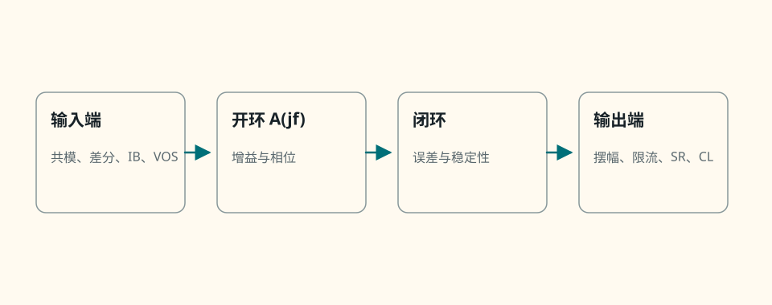{ .ae-figure }
</figure>

**图 5-29　从输入、开环到输出的非理想检查链。** 静态轨内不代表动态合格，差分很小也不代表共模合格。

### 12.3 单极点只给方向，细节留到下一章

若低频 $A_0=10^5$、主极点 $f_p=10\ \mathrm{Hz}$，则 GBW 约 $1.0\ \mathrm{MHz}$。噪声增益为 10 的闭环电路一阶带宽约 $100\ \mathrm{kHz}$；噪声增益为 100 时约 $10\ \mathrm{kHz}$。这个估计说明“闭环增益越高，带宽通常越窄”的方向，但真实运放可能有额外极点/零点、去补偿要求和负载相关稳定性，不能仅用 GBW 判断相位裕度。完整推导在[第 6 章](06-反馈与频率响应.md)。

常见失败是把小信号带宽和大信号 SR 混为一项：一个 $1\ \mathrm{kHz}$ 大幅正弦可能因 SR 失真，即使小信号增益尚未下降；一个高频小幅信号也可能先受闭环带宽影响，而未达到 SR。

### 第二遍：适用边界

表中趋势不能替代具体数据手册。必须在指定电源、温度、负载、输出幅度和频率下读取参数；“典型值”不等于保证值。单极点只作本章接口，稳定性与完整频响统一留待下一章。

### 30 秒回答

“理想电阻比只是候选解。静态先查有限 $A$、失调、偏置、CMRR、共模范围、输出摆幅与电流；动态再查 GBW、压摆率、负载稳定性和饱和恢复。有限 $A$ 使闭环增益略低，失调常被噪声增益放大；大信号 $2\pi fV_p$ 超过 SR 时，即使没碰轨也会失真。”

### 第二遍：90 秒回答

“我把误差分三层。输入层有 $V_{OS},I_B$、CMRR 和共模/差模范围；开环层有有限 $A_0$、随频率下降的 $A(j\omega)$ 与相位；输出层有摆幅、电流、SR、负载稳定性和饱和恢复。以反馈因子 $\beta$ 为例，$v_o=A(v_i-\beta v_o+V_{OS})$，解得信号闭环增益 $A/(1+A\beta)$，而输入失调到输出也乘这个量，环路增益很大时约为噪声增益 $1/\beta$。GBW/噪声增益只是一阶带宽方向，SR 是另一种大信号限制。所有参数都要回到具体供电、负载、温度和保证条件。”

### 本节练习与递进追问

1. 同相放大器噪声增益为 21，$A_0=2.0\times10^5$、GBW $=2.1\ \mathrm{MHz}$、$V_{OS}=80\ \mu\mathrm V$；写有限 $A$ 的增益趋势、输出失调估计和一阶带宽估计，并注明三者模型边界。
2. 追问一：输出在电源轨内，为何仍可能失真？追问二：匹配两输入端戴维南电阻为何不能消除失调电压和输入失调电流？

## 13. 面试主线：结论—理由—边界

### 13.1 七个高频主题的最短证据链

| 主题 | 先说结论 | 必须跟上的理由 | 最容易漏的边界 |
|---|---|---|---|
| 开环饱和 | 开环通常输出高/低限 | $v_o=Av_d$ 且 $A$ 很大 | 输入/输出极限与饱和恢复 |
| 虚断/虚短条件 | 两者来源不同 | 高 $R_{in}$；有限 $v_o/A$ 加负反馈 | 正反馈、开环、饱和、高频、SR、限流 |
| 反相/同相推导 | 用 KCL，不只背电阻比 | 先判负反馈，再写求和点或分压点 | 轨、共模、电流、GBW、SR |
| 积分器漂移 | DC 小误差也会积到轨 | $dv_o/dt=-v_i/(RC)$ 且有初值 | 并联 $R_f$、复位与漏电 |
| 微分器噪声 | 高频噪声被增强 | $v_o=-R_fC\,dv_i/dt$ | $R_{in}$、$C_f$ 限带与稳定性 |
| 比较器 vs 线性运放 | 比较器开环判符号，线性运放闭环定比例 | 工作状态和优化目标不同 | 不用虚短；输出接口/传播延迟 |
| 滞回 | 双阈值提高噪声容限 | 正反馈让阈值随输出状态改变 | 拓扑、越过方向、非对称输出 |

### 30 秒回答

“运放面试题我先写 $v_d=v_+-v_-$ 和 $v_o=Av_d$，再判断反馈方向与输出状态。虚断来自高输入阻，虚短只在高环路增益、负反馈、线性未饱和时成立。之后用 KCL 求候选闭环解，最后逐项检查电源轨、共模、输出电流、GBW 和 SR；比较器或施密特是开环/正反馈状态，绝不套虚短。”

### 第二遍：90 秒回答

“运放是由电源供能的差分受控器件。开环增益巨大，所以开环输入只差很小就会饱和；负反馈则把输出变化送回去减小 $v_d$。高输入电阻推出虚断，高增益且输出有限推出 $v_d=v_o/A$ 很小，但还要先验证线性状态。反相、同相、求和与差分都可在关键节点用 KCL 推导；积分器必须保留电容初值并处理 DC 漂移，微分器必须限带以免放大噪声。比较器按差分符号输出高低，施密特用正反馈得到随状态变化的双阈值。任何理想结果都要再查有限 $A$、失调/偏置、CMRR、共模、轨、电流、GBW、SR 与恢复时间。”

### 第二遍：适用边界

口述模板用于组织答案，不取代读图。若拓扑、电阻编号、输出级类型、供电、负载或初始状态改变，必须重新列节点方程和状态条件。频率响应的相位裕度与稳定性细节统一留到下一章。

### 递进追问

1. 如果面试官说“有负反馈就一定虚短”，你会用哪三个反例反驳，并分别指出失败的物理限制？
2. 同一运放电路的小信号带宽合格，为何大幅正弦仍可能变成三角形？若输出先撞轨，判断顺序又怎样？
3. 差分器输出异常时，怎样区分电阻比失配、有限 CMRR 与输入共模越界？

## 14. 章末检查清单与错误对照

### 14.1 每道题的闭环检查清单

- [ ] 画出 $+V_{CC},-V_{EE}$、地、负载和全部电流返回；标清 $v_+,v_-,v_o$。
- [ ] 写 $v_d=v_+-v_-$，用输出微扰判断反馈是负、正还是开环。
- [ ] 说明采用理想、有限 $A$、饱和还是动态模型；比较器/正反馈不使用虚短。
- [ ] 在关键节点写 KCL，必要时写电源/输出回路 KVL；先求候选解再代数验算。
- [ ] 核对单位、极性、相位、时间常数和电容初值；电阻比增益应无量纲。
- [ ] 查输出 $V_{OL}\le v_o\le V_{OH}$、输入共模、输出负载与反馈电流。
- [ ] 对动态信号再查 GBW/噪声增益、$2\pi fV_p\le SR$、稳定性与恢复时间。
- [ ] 最后说一句适用边界；若任一检查失败，撤销虚短并改用限幅/动态状态分析。

| 常见错误 | 为什么错 | 修正动作 |
|---|---|---|
| 一见运放就写 $v_+=v_-$ | 未判断反馈与状态 | 先做输出微扰，再验候选解是否线性 |
| 把虚短画成导线 | 虚短只是小差分电压 | 保留两个节点和近零输入电流 |
| 认为输入端给负载供能 | 运放是有源器件 | 画出电源轨、输出级和负载返回 |
| 开环也按电阻比算线性输出 | 巨大 $A$ 通常使输出饱和 | 用差分符号与 $V_{OH},V_{OL}$ 判状态 |
| 反相增益漏负号 | 参考方向或 KCL 电流方向混乱 | 统一对地电压并在求和点列 KCL |
| 同相增益写成 $R_f/R_g$ | 漏掉分压反解的 1 | 先写 $v_-=v_oR_g/(R_f+R_g)$ |
| 差分器只看电阻数值相等 | 所需的是两边**比值**匹配 | 逐项验证 $R_2/R_1=R_4/R_3$ |
| 积分器漏 $v_o(t_0)$ | 电容电压连续、有记忆 | 定义电容极性并写完整定积分 |
| 微分器直接输入理想阶跃 | 理想导数要求冲激输出 | 承认带限，并加入 $R_{in},C_f$ |
| 施密特上下阈值用同一输出电平 | 阈值随当前状态改变 | 上阈代 $V_{OH}$，下阈代 $V_{OL}$ |
| 轨内就宣布“完全线性” | 还可能共模、限流、SR 或带宽失败 | 按清单完成全部静态/动态检查 |
| 把 GBW 与 SR 当同一参数 | 前者偏小信号频响，后者是大信号斜率 | 分别算闭环带宽与 $2\pi fV_p$ |

## 15. 章末练习：使用带图题库

本章题面统一放在[练习题 O-01～O-14](../exercises/练习题.md#o-01)。所有依赖连接方式的运放题已就地附图；状态与模型审判题不用无关示意图代替推理。

!!! warning "作答顺序"

    先判反馈极性与线性候选状态，再决定能否用虚断/虚短，然后列 KCL，最后检查轨、共模、电流、GBW 和 SR。独立完成后再打开[详细解答 O-01～O-14](../exercises/详细解答.md#o-01)。

能解释虚短何时失效后，再进入[第 6 章](06-反馈与频率响应.md)。
