# 第 6 章　反馈与频率响应

反馈把输出的一部分送回输入比较点；频率响应则回答同一套关系随频率怎样改变。两者必须放在一起学：低频时能改善增益精度的负反馈，到了相位滞后显著的频段，可能不再“抵消”，甚至接近自激。本章坚持一条证据链：**先定义符号与端口，再列环路方程；先画精确响应，再作 Bode 近似；最后用相位裕度和工作边界检查结论。**

!!! important "冲刺必会"

    完成所有 **P0**：从 $x_e=x_s-\beta x_o$ 推出 $A_f=A/(1+A\beta)$ 与灵敏度；按“输出先、输入后”识别四种反馈组态；能画一阶 RC 的幅相 Bode 图；解释单主极点下反馈为何降增益、扩带宽；用 $1+T(s)$、增益交越频率和相位裕度判断常规负反馈环的稳定趋势。

!!! tip "面试加分"

    每个结论都补一句条件。例如不说“负反馈一定稳定”，而说“在讨论频带内若环路相位仍使返回量抵消误差，且常规开环稳定、单交越模型适用，足够的相位裕度通常对应可接受的阶跃响应；否则应看完整 Nyquist 条件”。

!!! note "考后深入"

    深入轨补全 Miller 两端等效推导、多极点相互作用、噪声注入位置与 Nyquist 适用条件。可用[运放反馈实验](../labs/opamp-feedback.html)只改一个参数，先预测理想与有限 $A$ 的闭环增益以及是否削顶，再观察波形；本实验不模拟带宽或振铃。

!!! abstract "第一遍的三个检查点"

    第一遍依次完成三个 P0 检查点：先推 $A_f=A/(1+A\beta)$ 并识别四种反馈组态，再画 RC 低通、高通的幅相和阶跃，最后把环路增益、交越频率与相位裕度接起来。Miller、Nyquist 和多极点精确叠加明确属于 P1 第二遍，不夹在 P0 手算中。

## 1. 章节地图、学习结果、前置知识与双轨路线

前置知识是[第 1 章](01-最小电路基础.md)的 RC 暂态和戴维南电阻、[频域工具章](03A-交流相量与频域工具.md)的复数、相量、复阻抗、传递函数、分贝、极点/零点与 Bode 图，[第 3 章](03-BJT与MOSFET.md)的结电容和小信号参数，[第 4 章](04-基本放大电路.md)的端口电阻、耦合/旁路电容和中频增益，以及[第 5 章](05-运算放大器.md)的反馈极性、有限开环增益和 GBW。若对 $Z_C=1/(j\omega C)$、$H(j\omega)$ 或“小信号模型只在 Q 点附近有效”还不熟，先回看对应工具节。

~~~mermaid
flowchart TD
    A["符号与反馈代数"] --> B["灵敏度与效果边界"]
    B --> C["四种取样—混合组态"]
    C --> D["RC 精确频响"]
    D --> E["Bode 近似与多极点"]
    E --> F["放大器低频 / 高频"]
    F --> G["反馈扩带宽 / Miller"]
    G --> H["环路稳定性与裕度"]
    H --> I["30 秒结论—理由—边界"]
~~~

**图 6-1　反馈与频率响应的证明链。** 箭头表示知识依赖；实际电路分析要在每一级保留变量参考、频率范围和模型边界。

学完后，你应当能够：

1. 定义负反馈、正反馈、前向增益 $A$、反馈因子 $\beta$、误差 $x_e$、输入 $x_s$、输出 $x_o$ 和环路增益 $T=A\beta$；
2. 推导 $A_f=A/(1+T)$ 与 $S_A=1/(1+T)$，解释复数形式和深度负反馈条件；
3. 识别四种“输出取样—输入混合”组态，并在规定理想假设下判断 $R_{in},R_{out}$ 趋势；
4. 从电路推导 RC 低通、高通的幅值、相位、$-3\ \mathrm{dB}$ 点与每十倍频斜率，并联系时间常数；
5. 解释耦合/旁路电容、器件结电容与多极点怎样形成放大器低、高频截止；
6. 推导单主极点闭环带宽和近似增益—带宽权衡，正确使用 Miller 等效；
7. 定义增益交越、相位裕度、增益裕度，联系超调、振铃和振荡，并说明简单 Bode 判据的适用范围；
8. 用 30 秒与 90 秒回答高频面试题，并应对至少两轮“为什么、何时失效”的追问。

| 路线 | 阅读范围 | 一个月备考动作 |
|---|---|---|
| 第一遍 | P0 的反馈代数、四组态、RC 频响、单主极点与单交越裕度，30 秒回答，以及 F-01～F-12 中标为 P0 的题 | 9～12 小时，分 6～7 次；每题写“符号—方程—单位—边界” |
| 完整掌握 | P1 多极点、Miller、Nyquist、90 秒回答、注入点传递与全部追问 | 合计约 18～24 小时；以能从 $H(s)$ 独立画幅相并解释稳定边界为准 |

建议顺序：检查点 A 学反馈代数、效果和四组态；检查点 B 学 RC/Bode 与放大器带宽；检查点 C 学稳定性、口述和章末练习。完成 P0 后，第二遍再补 Miller、多极点精确叠加和 Nyquist。

## 2. P0：反馈符号、闭环代数与灵敏度

!!! abstract "第一次阅读：先固定减号约定"

    只从 $x_e=x_s-\beta x_o$ 与 $x_o=Ax_e$ 两式出发，自己解出 $A_f$，不先背结果。第一遍把 $A,\beta,T$ 的起点、终点和量纲说清，灵敏度只记住它衡量参数变化如何传到闭环结果。

### 2.1 假设 → 模型 → 变量与符号

在统一的**负反馈符号约定**中，比较点作减法：

\[
x_e=x_s-x_f=x_s-\beta x_o,
\qquad x_o=A x_e.
\]

$x_s$ 是外加源量，$x_f=\beta x_o$ 是返回量，$x_e$ 是驱动前向通道的误差，$x_o$ 是输出。$A=x_o/x_e$ 是从比较点到输出的前向传递，$\beta=x_f/x_o$ 是从输出到比较点的反馈传递。电压放大器中它们常为无量纲比值；跨阻、跨导或电流放大反馈系统中，$A$、$\beta$ 可以分别带 $\Omega$、S 或其倒数量纲，但乘积

\[
\boxed{T=A\beta}
\]

必须无量纲，才可与 1 相加。在线性时不变小信号频域中，应写成 $A(s),\beta(s),T(s)$，它们一般是复数。

<figure class="ae-figure-frame" markdown="1">
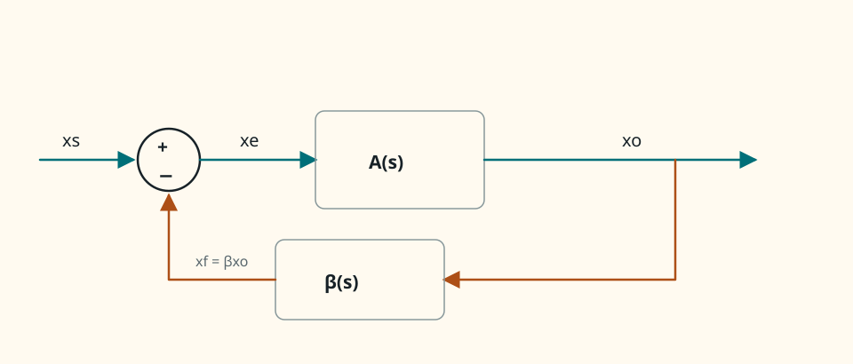{ .ae-figure }
</figure>

**图 6-2　统一负反馈方框图。** 图中的减号已经包含反馈极性，因此 $T=A\beta$ 不再额外写负号；闭环特征式是 $1+T(s)=0$。

若返回量在比较点与输入**相加**，则 $x_e=x_s+\beta x_o$，称为正反馈；解得分母 $1-A\beta$。但实体电路不能只凭接到器件“+”或“−”端命名，必须假设 $x_o$ 微增，沿实际路径判断返回变化最终抵消还是强化原扰动。

<figure class="ae-figure-frame" markdown="1">
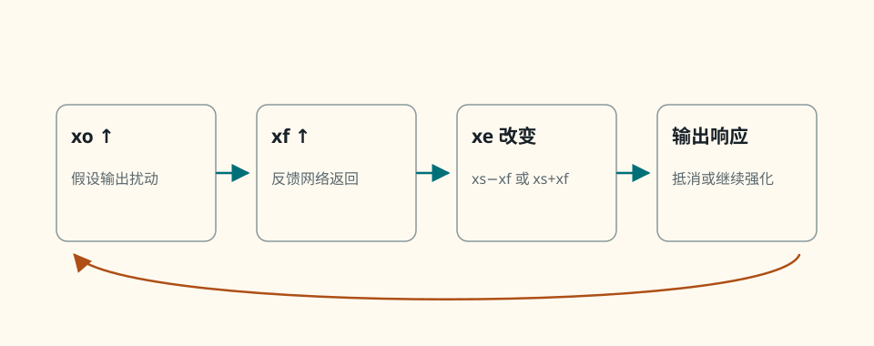{ .ae-figure }
</figure>

**图 6-3　反馈极性的扰动判定。** 最后一行是频率响应与稳定性相连的关键：低频负反馈不保证所有频率都保持抵消。

### 2.2 由方程求闭环增益与深度负反馈极限

把 $x_e=x_s-\beta x_o$ 代入 $x_o=A x_e$：

\[
x_o=A(x_s-\beta x_o)
\Rightarrow x_o(1+A\beta)=Ax_s,
\]

所以闭环传递为

\[
\boxed{A_f\equiv\frac{x_o}{x_s}=\frac{A}{1+A\beta}=\frac{A}{1+T}}.
\]

若在所讨论频带内 $T$ 近似为正实数且 $T\gg1$，则

\[
A_f\approx\frac1\beta.
\]

这称为**深度负反馈**：闭环主要由反馈网络决定，而不再强烈依赖前向通道的绝对增益。一般频率下 $T(j\omega)$ 与 $1+T(j\omega)$ 都是复数；增益幅值应写

\[
|A_f|=\frac{|A|}{|1+T|},
\]

不能无条件把 $|1+T|$ 写成 $1+|T|$。当 $T$ 的相位接近 $-180^\circ$ 时，$|1+T|$ 反而可能很小。

<figure class="ae-figure-frame" markdown="1">
{ .ae-figure }
</figure>

**图 6-4　$1+T$ 的复数几何意义。** “除以 $1+T$”表示复数相除；只有相位合适时才等价于直观的幅值压低。

### 2.3 对前向增益变化的灵敏度

固定 $\beta$，从 $A_f=A/(1+A\beta)$ 对 $A$ 求微分：

\[
\frac{dA_f}{dA}=\frac{1}{(1+A\beta)^2}.
\]

相对灵敏度定义为

\[
S_A\equiv\frac{dA_f/A_f}{dA/A}
=\frac{A}{A_f}\frac{dA_f}{dA}
=\boxed{\frac1{1+A\beta}=\frac1{1+T}}.
\]

$S_A$ 无量纲。对小参数变化，$\Delta A_f/A_f\approx S_A\,\Delta A/A$；若 $T$ 为正实且很大，前向增益的相对漂移约被 $1+T$ 倍减弱。若 $A,\beta$ 为复频率函数，这个导数是局部复灵敏度；它同时包含幅值和相位变化，不能把某个频率的结果直接推广到所有频率。对很大的有限变化，应重算精确式而不是只用微分近似。

### 2.4 完整数值例：闭环增益、去敏与端口趋势

设低频电压串联负反馈放大器的前向电压增益 $A=200$，反馈因子 $\beta=0.0400$，开环输入电阻 $R_{in}=10.0\ \mathrm{k\Omega}$，开环输出电阻 $R_{out}=900\ \Omega$。假设在该频带内 $A\beta$ 为正实数，取样与混合网络理想，且电路未削顶、未限流。

\[
T=A\beta=8.00,
\qquad A_f=\frac{200}{1+8}=22.222,
\qquad S_A=\frac19=0.1111.
\]

因此闭环增益由 200 降至 22.222，而对 $A$ 的小相对变化只保留约 $11.11\%$。若 $A$ 因器件离散性从 200 增加 $20\%$ 到 240，精确重算

\[
A_f'=\frac{240}{1+240(0.0400)}=22.6415,
\]

闭环只增加 $(22.6415/22.222-1)\times100\%=1.89\%$。微分估计给 $0.1111\times20\%=2.22\%$，偏差来自参数变化并不无限小；方向和量级一致。

该电路是“输出电压取样、输入串联混合”，在下一节规定的理想负反馈假设下：

\[
R_{in,f}=R_{in}(1+T)=90.0\ \mathrm{k\Omega},
\qquad R_{out,f}=\frac{R_{out}}{1+T}=100\ \Omega.
\]

<figure class="ae-figure-frame" markdown="1">
{ .ae-figure }
</figure>

**图 6-5　负反馈数值例的去敏与端口变化。** 去敏不是“参数完全不变”；有限变化用精确闭环式，端口公式则受下一节的取样/混合理想条件约束。

### 第二遍：适用边界

$A_f=A/(1+T)$ 来自线性小信号方框模型。$T\gg1$ 只有在 $T$ 相位合适、$|1+T|$ 没有逼近零且器件仍在线性范围内时才表示深度负反馈。大信号碰电源轨、输出限流、器件损坏或强非线性时，不能继续用同一线性 $A$。灵敏度推导固定了 $\beta$；反馈网络本身漂移时还要另算对 $\beta$ 的灵敏度。

### 30 秒回答

“我先约定减法比较：$x_e=x_s-\beta x_o$、$x_o=Ax_e$，所以 $A_f=A/(1+A\beta)$，环路增益 $T=A\beta$ 必须无量纲。固定 $\beta$ 微分得到 $S_A=1/(1+T)$；在所讨论频带内 $T$ 为足够大的正实数时，闭环约为 $1/\beta$，对 $A$ 的漂移不敏感。但一般 $T$ 是复数，不能把 $|1+T|$ 无条件写成 $1+|T|$，更不能据此断言负反馈总稳定。”

### 第二遍：90 秒回答

“我会先把符号写清：输入 $x_s$ 与返回量 $x_f=\beta x_o$ 在比较点相减，误差 $x_e=x_s-x_f$ 驱动前向通道 $x_o=Ax_e$。联立得到 $A_f=A/(1+T)$，$T=A\beta$ 绕环一周且无量纲。固定 $\beta$ 对 $A$ 求相对微分，得到 $S_A=(dA_f/A_f)/(dA/A)=1/(1+T)$。低频若 $T$ 为正实且远大于 1，闭环增益约由反馈网络 $1/\beta$ 决定，同时前向增益漂移被压低。这个结论是小信号、线性、未限幅且相位合适的频带内结论；频率升高后 $T$ 是复数，若靠近 $-1$，$|1+T|$ 会变小，闭环可能峰化甚至失稳。”

### 本节练习与递进追问

1. 保持 $\beta=0.0250$，令 $A$ 从 500 降低到 350；分别精确计算两次 $A_f$，再用初始点的 $S_A$ 作微分估计并比较误差。
2. 追问一：为什么 $A$ 和 $\beta$ 可以各自带单位，而 $T$ 必须无量纲？追问二：若 $T=0.8\angle-170^\circ$，为什么不能用 $1+|T|$ 估计闭环幅值？

## 3. P0：反馈改善什么，又以什么为代价

!!! abstract "第一次阅读：每个“改善”都补条件"

    先用环路增益说明为何闭环结果对前向通道变化不敏感，再分类看失真、噪声和带宽。第一遍不接受“负反馈什么都能改善”；必须说明误差在环内、系统未限幅且仍稳定。

### 3.1 增益、线性度、噪声、带宽与精度

负反馈通常牺牲闭环增益，换取对被环路覆盖因素的控制。这里“约减小 $1+T$ 倍”只在同一频率、相位合适、扰动注入位置明确且线性化成立时使用。

| 量 | 典型改善机制 | 必须同时说明的代价或边界 |
|---|---|---|
| 增益稳定性/精度 | $S_A=1/(1+T)$ 降低前向增益漂移；深反馈时主要由 $\beta$ 定标 | 总增益降低；$\beta$ 的误差不会被同一公式自动消除 |
| 线性度/失真 | 环内非线性产生的输出误差返回比较点，在有环路增益的频带内被纠正 | 已削顶、截止/饱和过深或所需校正超出速度/电流时不能修复 |
| 内部噪声 | 某些环内、特定注入点的输出贡献可被返回校正 | 输入端噪声、反馈网络噪声、输出端环外噪声的传递各不相同；反馈不是“消噪器” |
| 带宽 | 单主极点中低频增益降低而高截止频率提高 | 多极点相位滞后会降低稳定裕度；大信号仍受 SR 与摆幅限制 |
| 端口与负载误差 | 由取样/混合方式改变 $R_{in},R_{out}$，减小某类加载 | 四组态趋势不同；传感器、取样器非理想会改变结果 |

若一个扰动 $n_o$ 加在前向通道输出、且其后的输出仍被反馈取样，可写

\[
x_o=A(x_s-\beta x_o)+n_o
\Rightarrow
\frac{x_o}{n_o}=\frac1{1+T}.
\]

但若噪声 $n_s$ 直接叠加在源输入，则

\[
\frac{x_o}{n_s}=\frac{A}{1+T}=A_f,
\]

它与有用输入一起被闭环传递，并不会凭空消失。扰动若加在取样点之后、反馈看不到的输出端，也不能由这条环路纠正。

<figure class="ae-figure-frame" markdown="1">
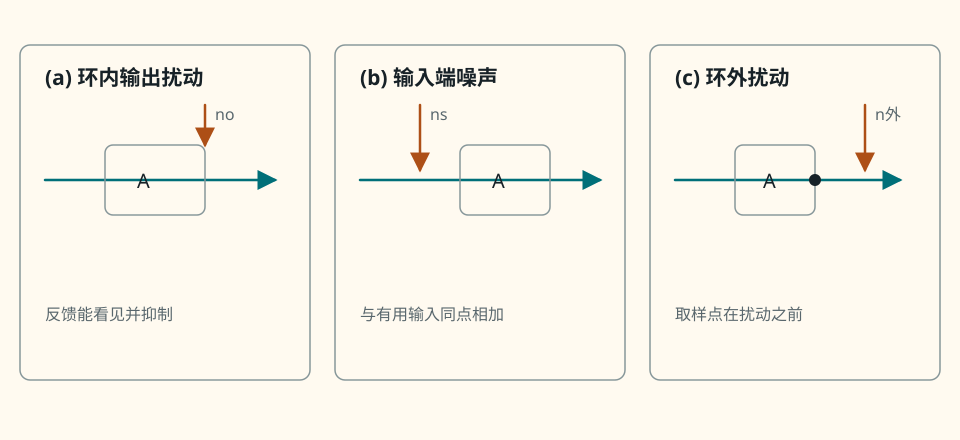{ .ae-figure }
</figure>

**图 6-6　三种扰动注入位置。** 是否降低噪声/扰动取决于注入点、取样点、频率和环路覆盖范围，不能只说“有负反馈所以噪声变小”。

### 3.2 反馈不能修复的边界

负反馈需要保留“纠错余量”。输出已碰电源轨时，误差增大也无法要求输出继续上升；输出级限流或器件损坏时，模型中的 $A$ 已不是原来的线性传递；噪声若产生在取样点之外，环路根本没有误差信息。即使扰动在环内，$|T(j\omega)|$ 也常随频率下降，高频抑制通常比低频弱。

<figure class="ae-figure-frame" markdown="1">
{ .ae-figure }
</figure>

**图 6-7　反馈纠错的四个必要环节。** 任一环节断开，都不能套用理想的扰动压低比例。

### 第二遍：适用边界

“失真约减小 $1+T$ 倍”是对弱非线性作局部线性化后的常用方向，不是对任意削顶波形的全局定理。内部噪声必须逐个标注注入节点后再求传递；反馈网络电阻也会自行产生热噪声。带宽扩展的定量式只在后文的单主极点模型内成立。

### 30 秒回答

“负反馈降低信号增益，却能在有足够环路增益的频带内降低前向增益漂移和部分环内误差，并可按组态改变端口电阻、在单主极点模型下扩展带宽。关键边界是环路必须看得见扰动且执行器还有纠错余量；输入噪声、环外噪声、碰轨、限流、损坏和高频低环路增益都不能被一句‘负反馈改善’掩盖。”

### 第二遍：90 秒回答

“反馈的收益要按传递路径说。固定反馈网络时，前向增益灵敏度是 $1/(1+T)$；弱非线性或加在环内输出处的扰动，若被同一取样点看见，其输出贡献也常带 $1/(1+T)$。但加在输入端的噪声按闭环信号增益传递，反馈电阻还会增加自身噪声，取样点之后的扰动则完全在环外。单主极点中反馈把低频增益换成带宽，但高频相位滞后可能造成峰化或振荡。最后还要查摆幅、电流、SR 和损坏状态，因为没有执行余量时环路无法纠错。”

### 本节练习与递进追问

1. 对图 6-6 的三个注入点分别写出“反馈是否能看见、输出传递属于哪一类、频率升高后趋势如何”，不必假定三种噪声谱密度相同。
2. 追问一：为什么负反馈不能把已经削平的输出顶端“补回来”？追问二：如果传感器噪声进入反馈取样支路，它更像输入噪声还是输出扰动，为什么？

## 4. P0：四种反馈组态——先看输出，再看输入

!!! abstract "第一次阅读：只用两步命名"

    第一步看输出是并接取电压还是串入取电流，第二步看返回量在输入是串联比较还是并联求和。先会准确命名，再用串/并直觉判断 $R_{in},R_{out}$ 趋势。

### 4.1 名称约定与两步识别

本章统一采用国内教材常见的**输出在前、输入在后**命名：

- 第一个词说明输出取样：**电压**取样跨接输出端，**电流**取样串入输出支路；
- 第二个词说明输入混合：**串联**混合比较电压，**并联**混合在同一节点比较电流。

因此四类叫“电压串联、电压并联、电流串联、电流并联”。英文资料常按“输入混合—输出取样”倒过来写 series-shunt、shunt-shunt、series-series、shunt-series；遇到“串并联反馈”一类简称时必须先问命名顺序，不能只凭两个字猜。

~~~mermaid
flowchart TD
    A["第一步：输出端怎样取样？"] -->|"跨接端口，xo=vo"| B["电压取样"]
    A -->|"串入支路，xo=io"| C["电流取样"]
    B --> D["第二步：输入怎样混合？"]
    C --> D
    D -->|"源与反馈形成误差电压"| E["串联混合：Rin 趋向增大"]
    D -->|"源电流与反馈电流汇于节点"| F["并联混合：Rin 趋向减小"]
    B --> G["电压取样：Rout 趋向减小"]
    C --> H["电流取样：Rout 趋向增大"]
~~~

**图 6-8　四组态的两步识别树。** 先看反馈网络在输出端跨接还是串接，再看返回量在输入端形成电压差还是电流和。

### 4.2 电压串联：电压放大器

<figure class="ae-figure-frame" markdown="1">
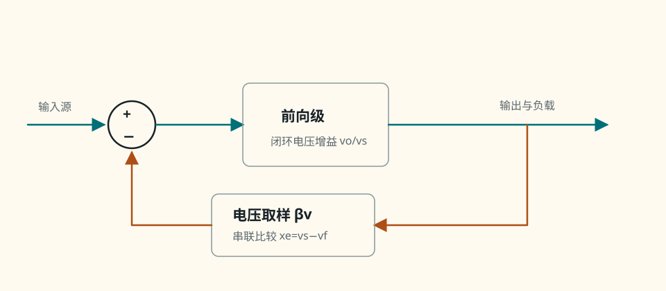{ .ae-figure }
</figure>

**图 6-9　电压串联反馈的完整信号与返回路径。** 输出电压先经跨接输出端的 $\beta_v$ 网络变为 $x_f=\beta v_o$，再送到串联比较器的负端；它适合作电压放大器，同相运放和电压跟随器是典型例子。

串联混合使同一输入电流所需的源端电压增大，故输入电阻提高；电压取样使环路抵抗输出电压扰动，故输出电阻降低。图 6-5 的数值例正属此类。

### 4.3 电压并联：跨阻型放大器

<figure class="ae-figure-frame" markdown="1">
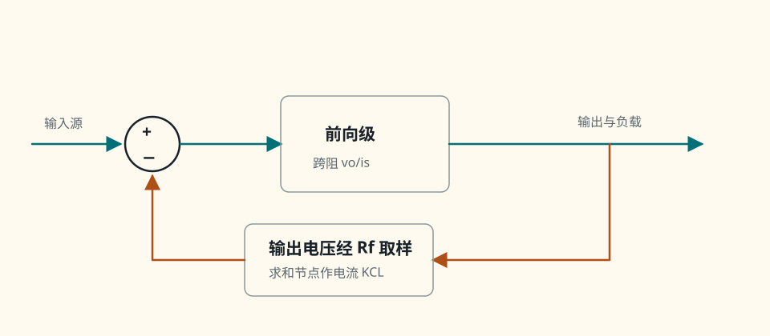{ .ae-figure }
</figure>

**图 6-10　电压并联反馈的完整节点图。** $v_\Sigma$ 是未接地的电流求和点，$R_f$ 把 $v_o$ 的变化转成返回电流；“$R_f$ 串在一根线上”不代表串联混合，判断依据是源电流与反馈电流是否在同一输入节点相加。

并联混合给源提供额外电流通路，使闭环输入电阻降低；电压取样仍使输出电阻降低。

### 4.4 电流串联：跨导型放大器

<figure class="ae-figure-frame" markdown="1">
{ .ae-figure }
</figure>

**图 6-11　电流串联反馈的完整跨导通道。** 电流取样元件必须位于所定义输出电流的串联路径中；若 $i_E\ne i_C$，应明确取样的是哪一个电流及近似条件。

串联混合提高输入电阻；电流取样促使输出电流对负载电压变化更不敏感，相当于提高输出电阻。

### 4.5 电流并联：电流放大器

<figure class="ae-figure-frame" markdown="1">
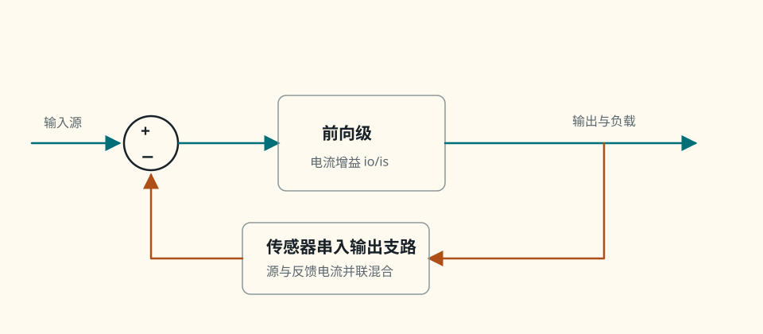{ .ae-figure }
</figure>

**图 6-12　电流并联反馈的完整电流放大通道。** 并联混合比较电流，电流取样串入输出；这两个判据分别决定输入、输出电阻趋势。

并联混合降低输入电阻；电流取样提高输出电阻，因而更接近“输入接受电流、输出维持电流”的理想电流放大器。

### 4.6 用环路因子 1+T 解释端口电阻趋势

以下结果假设：小信号负反馈；在讨论频带内 $T$ 近似正实且 $1+T>0$；取样器与混合器理想、不会额外加载端口；前向通道可用单向两端口表示；测 $R_{in}$ 时保持规定输出终端，测 $R_{out}$ 时将独立输入源置零而保留反馈网络。若相位显著，应把因子理解为复阻抗关系并重新分析，不能机械乘除幅值。

对**串联混合**，令开环输入电压 $v_i=i_iR_{in}$。反馈返回的串联电压在负反馈方向迫使源提供

\[
v_s=v_i+v_f=v_i(1+T),
\]

故 $R_{in,f}=v_s/i_i=R_{in}(1+T)$。对**并联混合**，令开环输入电流 $i_i=v_i/R_{in}$；反馈支路使源电流成为 $i_s=i_i+i_f=i_i(1+T)$，故 $R_{in,f}=v_i/i_s=R_{in}/(1+T)$。

输出端作同样的测试源分析：电压取样产生与测试电压相反的校正，使同一测试电流只产生原来的 $1/(1+T)$ 倍电压，因此 $R_{out}$ 降低；电流取样抵抗测试源引起的输出电流变化，同一测试电流变化需要 $(1+T)$ 倍端口电压，因此 $R_{out}$ 提高。

| 本章中文名（输出—输入） | 输出取样 | 输入混合 | 理想负反馈下 $R_{in,f}$ | 理想负反馈下 $R_{out,f}$ | 典型放大器目标 |
|---|---|---|---:|---:|---|
| 电压串联 | 电压，跨接 | 电压，串联 | $R_{in}(1+T)$ | $R_{out}/(1+T)$ | 电压放大 |
| 电压并联 | 电压，跨接 | 电流，并联 | $R_{in}/(1+T)$ | $R_{out}/(1+T)$ | 跨阻 |
| 电流串联 | 电流，串接 | 电压，串联 | $R_{in}(1+T)$ | $R_{out}(1+T)$ | 跨导 |
| 电流并联 | 电流，串接 | 电流，并联 | $R_{in}/(1+T)$ | $R_{out}(1+T)$ | 电流放大 |

**表 6-1　四组态端口趋势。** 记忆法是“输入看混合：串增并减；输出看取样：压减流增”，但计算前必须确认命名顺序与模型假设。

### 第二遍：适用边界

上述阻抗公式不是所有实际电路的精确式。取样电阻本身会加载输出，并联混合网络会加载信号源，晶体管存在反向传输，$T$ 也会随频率变为复数。只有在频带内负反馈、环路增益足够且相位合适时，才可把“乘/除 $1+T$”解释为电阻幅值的明显增减。接近失稳时，端口阻抗甚至可能出现峰值或负实部。

### 30 秒回答

“我按输出在前命名：先看反馈网络跨接输出还是串入输出，得到电压或电流取样；再看输入端形成电压差还是节点电流和，得到串联或并联混合。理想负反馈下，输入串增并减，输出压减流增，所以电压串联是 $R_{in}$ 乘、$R_{out}$ 除 $1+T$；电压并联两者都除；电流串联两者都乘；电流并联是输入除、输出乘。公式只适用于规定频带和理想取样/混合模型。”

### 第二遍：90 秒回答

“四组态不能靠某一只电阻横着还是竖着判断。我先看输出：反馈网络跨输出端感知电压叫电压取样，串在输出支路感知电流叫电流取样；再看输入：源与返回量形成误差电压叫串联混合，在同一节点写 KCL 叫并联混合。串联混合时同一输入电流需要源端电压 $v_s=v_i(1+T)$，所以 $R_{in}$ 墊高；并联混合时同一节点电压需要源电流 $i_s=i_i(1+T)$，所以 $R_{in}$ 降低。电压取样调节端口电压，降低 $R_{out}$；电流取样维持支路电流，提高 $R_{out}$。最后说明这是假设负反馈、相位合适和理想取样/混合的频带内结果。”

### 本节练习与递进追问

1. 分别对同相运放、反相跨阻器、源极退化 MOS 级和图 6-12 的电流放大器，圈出取样端口与混合点，再写中文名和 $R_{in},R_{out}$ 趋势。
2. 追问一：为什么反相运放中的 $R_f$ 看起来“串接”却属于输入并联混合？追问二：若取样电阻的压降不可忽略，表 6-1 哪个理想假设首先失效？

## 5. P0：从 RC 电路到精确频率响应

!!! abstract "第一次阅读：同一个分压式分别取输出"

    对同一个串联 $R$-$C$，输出取在电容上得低通，取在电阻上得高通。第一遍只做“写阻抗分压→化为标准式→查 $\omega\to0,\infty$→标 $-3\ \mathrm{dB}$”。

### 5.1 一阶低通：输出取在电容上

对零初始条件的线性频率响应，令 $s=j\omega$、$Z_C=1/(sC)$。低通电路是串联 $R$、并联到地的 $C$，输出取电容两端：

<figure class="ae-figure-frame" markdown="1">
{ .ae-figure }
</figure>

**图 6-13　一阶 RC 低通完整电路。** 低频时电容阻抗大，输出接近输入；高频时电容把输出节点交流旁路到地。

由阻抗分压

\[
H_{LP}(s)=\frac{V_o}{V_s}=\frac{Z_C}{R+Z_C}
=\boxed{\frac1{1+sRC}}.
\]

令 $\tau=RC$、$\omega_c=1/RC$、$f_c=1/(2\pi RC)$，则

\[
|H_{LP}(j\omega)|=\frac1{\sqrt{1+(\omega/\omega_c)^2}},
\qquad
\angle H_{LP}=-\tan^{-1}(\omega/\omega_c).
\]

### 5.2 一阶高通：输出取在电阻上

<figure class="ae-figure-frame" markdown="1">
{ .ae-figure }
</figure>

**图 6-14　一阶 RC 高通完整电路。** 低频时串联电容近似开路；高频时电容阻抗减小，输出接近输入。

由阻抗分压

\[
H_{HP}(s)=\frac{V_o}{V_s}=\frac{R}{R+Z_C}
=\boxed{\frac{sRC}{1+sRC}}.
\]

于是

\[
|H_{HP}(j\omega)|=\frac{\omega/\omega_c}{\sqrt{1+(\omega/\omega_c)^2}},
\qquad
\angle H_{HP}=90^\circ-\tan^{-1}(\omega/\omega_c).
\]

这里相位取 $0<\omega<\infty$ 的主值：高通由低频的近 $+90^\circ$ 过渡到高频的 $0^\circ$。

### 5.3 −3 dB、斜率与单位

当 $\omega=\omega_c$ 时，两种电路的幅值都是

\[
|H|=\frac1{\sqrt2}=0.7071,
\qquad 20\log_{10}|H|=-3.0103\ \mathrm{dB}.
\]

电压比在输入、输出参考阻抗相同或只讨论传递幅值时用 $20\log_{10}$；功率比用 $10\log_{10}$。$-3.0103\ \mathrm{dB}$ 对应幅度乘 $1/\sqrt2$，在相同阻抗下功率减半，不是电压减半。

<figure class="ae-figure-frame" markdown="1">
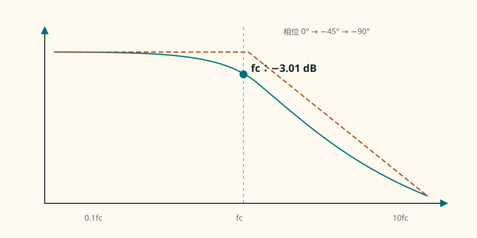{ .ae-figure }
</figure>

**图 6-15　低通精确幅频与相位标记。** 拐点处精确曲线比两条渐近线交点低 $3.0103\ \mathrm{dB}$。

<figure class="ae-figure-frame" markdown="1">
{ .ae-figure }
</figure>

**图 6-16　高通精确幅频与相位标记。** 低频每升高一 decade，幅值近似增加 $20\ \mathrm{dB}$；过拐点后趋于 $0\ \mathrm{dB}$。

斜率可直接由极限式得到：

- 低通在 $\omega\ll\omega_c$ 时 $H\approx1$，为 $0\ \mathrm{dB/dec}$；在 $\omega\gg\omega_c$ 时 $|H|\approx\omega_c/\omega$，为 $-20\ \mathrm{dB/dec}$；
- 高通在 $\omega\ll\omega_c$ 时 $|H|\approx\omega/\omega_c$，为 $+20\ \mathrm{dB/dec}$；在 $\omega\gg\omega_c$ 时 $H\approx1$，为 $0\ \mathrm{dB/dec}$。

一个稳定左半平面（LHP）实极点因子 $1/(1+s/\omega_p)$ 在越过拐点后累计贡献 $-20\ \mathrm{dB/dec}$ 幅值斜率和最终 $-90^\circ$ 相位；LHP 实零点因子 $1+s/\omega_z$ 贡献 $+20\ \mathrm{dB/dec}$ 和最终 $+90^\circ$。右半平面（RHP）对应因子的幅值斜率相同、相位符号相反：RHP 极点 $1/(1-s/\omega_p)$ 为 $-20\ \mathrm{dB/dec}$、最终 $+90^\circ$，且代表不稳定自然响应；RHP 零点 $1-s/\omega_z$ 为 $+20\ \mathrm{dB/dec}$、最终 $-90^\circ$，属于非最小相位。实际相位连续过渡，不在 $f_c$ 突然跳变；所以“极点必给 $-90^\circ$”只对稳定 LHP 实极点成立。

### 5.4 数值核算与手绘程序

取 $R=10.0\ \mathrm{k\Omega},C=10.0\ \mathrm{nF}$：

\[
\tau=RC=100\ \mathrm{\mu s},
\quad \omega_c=10.0\ \mathrm{krad/s},
\quad f_c=\frac{10^4}{2\pi}=1.5915\ \mathrm{kHz}.
\]

三个基准频率的精确值为：

| 频率 | $\lvert H_{LP}\rvert$ / dB / 相位 | $\lvert H_{HP}\rvert$ / dB / 相位 |
|---|---|---|
| $0.1f_c$ | $0.9950$ / $-0.0432\ \mathrm{dB}$ / $-5.71^\circ$ | $0.09950$ / $-20.043\ \mathrm{dB}$ / $+84.29^\circ$ |
| $f_c$ | $0.7071$ / $-3.0103\ \mathrm{dB}$ / $-45.0^\circ$ | $0.7071$ / $-3.0103\ \mathrm{dB}$ / $+45.0^\circ$ |
| $10f_c$ | $0.09950$ / $-20.043\ \mathrm{dB}$ / $-84.29^\circ$ | $0.9950$ / $-0.0432\ \mathrm{dB}$ / $+5.71^\circ$ |

<figure class="ae-figure-frame" markdown="1">
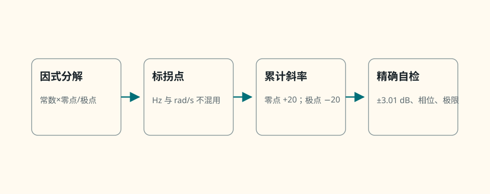{ .ae-figure }
</figure>

**图 6-17　一阶 Bode 手绘与自检流程。** 先画渐近线，再在拐点和相位过渡处补精确信息，最后回到电路检查开路/短路极限。

## 6. P0：同一个 RC 电路的时间域—频率域联系

!!! abstract "第一次阅读：用同一个时间尺度连两张图"

    时域的 $\tau=RC$ 与频域的 $\omega_c=1/RC$ 描述同一个系统的快慢。第一遍先用极限和初始斜率解释关系，不需要把拉普拉斯变换当成额外前置。

低通对零初值阶跃 $v_s=V u(t)$ 的响应为

\[
v_{o,LP}(t)=V(1-e^{-t/\tau})u(t).
\]

高通对同一阶跃，在电容初始电压为零时为

\[
v_{o,HP}(t)=Ve^{-t/\tau}u(t).
\]

两者的自然响应都含 $e^{-t/\tau}$，对应系统极点

\[
s_p=-\frac1\tau=-\omega_c,
\qquad f_c=\frac1{2\pi\tau}.
\]

$\tau$ 越大，暂态衰减越慢，频率截止越低；这不是两条互不相干的口诀，而是同一个极点在时间域和频率域的两种描述。

<figure class="ae-figure-frame" markdown="1">
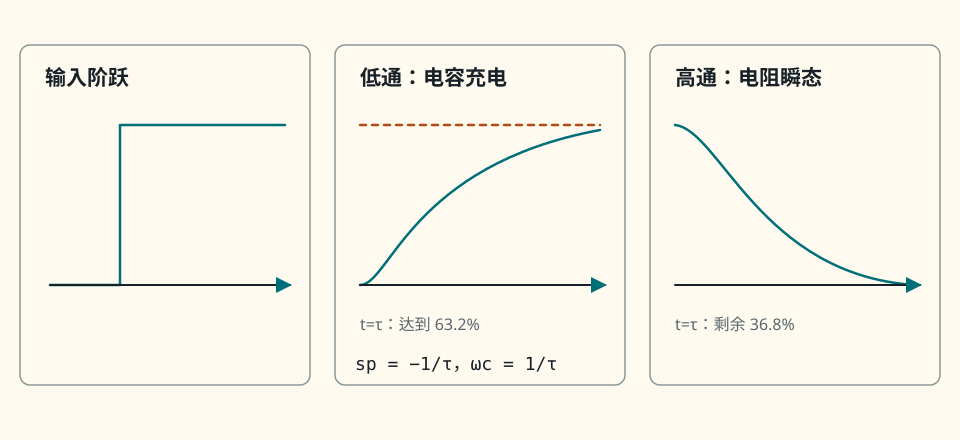{ .ae-figure }
</figure>

**图 6-18　RC 阶跃与截止频率的同一极点。** 低通观察电容充电，高通观察电阻上的瞬态电流压降；初值非零时必须重算起点。

### 第二遍：适用边界

这里假设理想电压源、理想 $R,C$、输出端不再被负载加载，且正弦稳态频响采用线性模型。若信号源有 $R_s$ 或负载 $R_L$，应先求电容“看到”的戴维南电阻再确定时间常数；多个储能元件一般产生多个极点/零点。高通在 $\omega=0$ 的相位没有可测输出，$+90^\circ$ 是从正频率趋近的极限。

### 30 秒回答

“RC 低通输出取电容，$H=1/(1+j\omega RC)$；高通输出取电阻，$H=j\omega RC/(1+j\omega RC)$。两者 $f_c=1/(2\pi RC)$，在截止处幅值 $1/\sqrt2$、即 $-3.01\ \mathrm{dB}$，相位分别 $-45^\circ$ 与 $+45^\circ$。每个一阶极点使高频斜率再降 $20\ \mathrm{dB/dec}$；同一极点在时间域给 $e^{-t/RC}$。”

### 第二遍：90 秒回答

“我先按阻抗分压推导，不背结论。低通的 $Z_C$ 在分子，得到 $1/(1+sRC)$；高通的 $R$ 在分子，得到 $sRC/(1+sRC)$。令 $\omega_c=1/RC$ 后可直接写幅值和相位。$\omega_c$ 处幅值为 $1/\sqrt2$，电压比按 $20\log_{10}$ 是 $-3.0103\ \mathrm{dB}$，相同阻抗下对应半功率。手绘时先标拐点和低频增益，再按每个零点加、每个极点减 $20\ \mathrm{dB/dec}$，相位用 $0.1f_c,f_c,10f_c$ 作平滑过渡。时间域中的 $e^{-t/RC}$ 与频域极点 $-1/RC$ 是同一动态。”

### 本节练习与递进追问

1. $R=4.70\ \mathrm{k\Omega},C=22.0\ \mathrm{nF}$，分别为低通和高通计算 $\tau,f_c$，并写 $0.1f_c,f_c,10f_c$ 的幅值趋势、相位与渐近斜率。
2. 追问一：为什么 $-3\ \mathrm{dB}$ 不是“电压减半”？追问二：高通对阶跃为何瞬间有输出，却不能通过直流？

## 7. P0 频带来源；P1 多极点：实际放大器的低频端与高频端

!!! abstract "第一次阅读：先为每个电容找到它看到的电阻"

    低频时耦合/旁路电容不再是短路，高频时器件电容不再是开路。P0 只对每个主要电容估 $f\approx1/(2\pi R_{seen}C)$ 并判断它影响低频还是高频；“拐点接近时怎样精确叠加”属于 P1。

### 7.1 低频：耦合与旁路电容不再是短路

中频分析把耦合、旁路电容近似为交流短路；频率下降后它们的 $|Z_C|=1/(\omega C)$ 增大，分别形成低频零点/极点：

- 输入耦合 $C_{in}$ 与其两侧所见电阻形成高通，简单单向模型中 $f_{Li}\approx1/[2\pi C_{in}(R_s+R_{in})]$；
- 输出耦合 $C_{out}$ 与 $R_{out}+R_L$ 形成高通，$f_{Lo}\approx1/[2\pi C_{out}(R_{out}+R_L)]$；
- 发射极/源极旁路 $C_E$ 或 $C_S$ 看到的等效电阻决定另一低频转折。它从“不旁路、退化强、增益低”过渡到“旁路充分、增益高”，常同时产生一个零点和一个极点，不能总当作简单串联高通。

<figure class="ae-figure-frame" markdown="1">
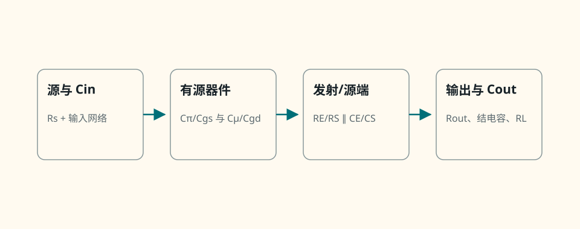{ .ae-figure }
</figure>

**图 6-19　含低频与高频电容的完整放大器接口。** 同一电容看到的等效电阻随其他电容采用开路、短路或时间常数法而变，不能只拿一只标称电阻相乘。

### 7.2 高频：器件电容与节点电阻形成低通

频率升高后，BJT 的 $C_\pi,C_\mu$，MOS 的 $C_{gs},C_{gd},C_{db}$，以及布线、探头和负载电容开始分流信号。每个独立储能节点都可能贡献极点；跨接输入—输出的 $C_\mu$ 或 $C_{gd}$ 还会受 Miller 效应放大输入端表观电容。于是实际增益通常呈“低频上升—中频近似平坦—高频下降”。

若各低频转折相隔很远，可用最高的低频拐点粗估 $f_L$；若各高频转折相隔很远，可用最低的高频拐点粗估 $f_H$。

#### P1 第二遍：相邻拐点的精确叠加

若拐点接近，幅值损失和相位会叠加，整体 $-3\ \mathrm{dB}$ 频率并不等于任意单个拐点，必须计算总传递或仿真/测量。

<figure class="ae-figure-frame" markdown="1">
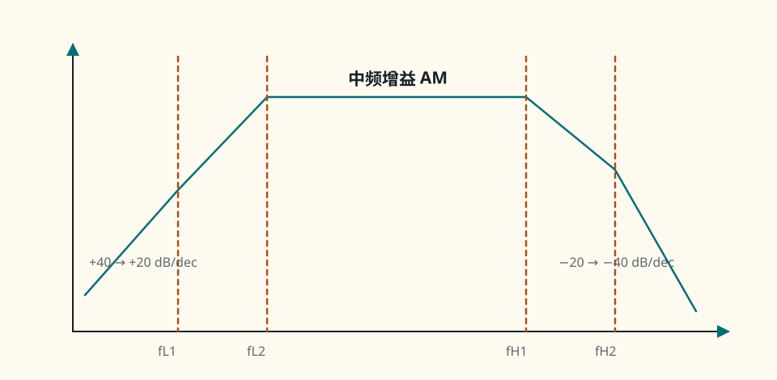{ .ae-figure }
</figure>

**图 6-20　多低频、多高频转折的放大器 Bode 包络。** 每多越过一个同向一阶极点，渐近斜率再减少 $20\ \mathrm{dB/dec}$；零点会反向改变斜率。

### 第二遍：适用边界

上述低频角频率式用了单向、弱耦合近似；真实晶体管的输入/输出端会通过跨接电容耦合。示波器探头、电缆和后级输入也是负载的一部分。多极点只看幅值不够：稳定性取决于环路相位，需在第 10 节检查。

### 30 秒回答

“放大器低频下降主要来自输入/输出耦合和发射极/源极旁路电容，因为低频时它们不再近似短路；高频下降来自器件结电容、跨接电容、布线和负载。多个储能节点形成多极点/零点：拐点相隔远时可由主导转折粗估，靠得近时幅值与相位叠加，整体 $-3\ \mathrm{dB}$ 点必须由总传递确定。”

### 第二遍：90 秒回答

“我会先画完整小信号返回并问每只电容看到什么戴维南电阻。输入耦合常与 $R_s+R_{in}$ 形成高通，输出耦合常与 $R_{out}+R_L$ 形成高通；旁路电容使退化随频率改变，通常产生一对零极点。高频则由 $C_\pi/C_{gs}$、$C_\mu/C_{gd}$、结电容和外部负载电容形成低通，其中跨接输入输出的电容还会产生 Miller 效应。多个拐点靠近时不能简单取最大低频角或最小高频角，因为总幅值和相位同时叠加。”

### 本节练习与递进追问

1. 某级 $R_s=1.00\ \mathrm{k\Omega},R_{in}=9.00\ \mathrm{k\Omega},C_{in}=1.00\ \mathrm{\mu F}$，$R_{out}=1.50\ \mathrm{k\Omega},R_L=3.50\ \mathrm{k\Omega},C_{out}=2.20\ \mathrm{\mu F}$；按单向近似求两个低频拐点，并说明若两者接近为何不能直接把较大者叫整体 $f_L$。
2. 追问一：旁路电容为何可能同时改变中频增益和低频形状？追问二：把 1× 示波器探头换成 10× 探头，为什么测得的高频截止可能改变？

## 8. P0：单主极点反馈为何降低增益、扩展带宽

!!! abstract "第一次阅读：只在单主极点模型中做一次代数"

    把 $A(s)=A_0/(1+s/\omega_p)$ 代入闭环式，直接读出新的低频增益和极点。第一遍把“增益降低、带宽扩展”限定在单主极点且未受 SR/其他极点限制的情形。

设前向通道只有一个主极点，反馈因子在相关频带内为正实常数：

\[
A(s)=\frac{A_0}{1+s/\omega_p},
\qquad T_0=A_0\beta>0.
\]

代入闭环式：

\[
A_f(s)=\frac{A(s)}{1+\beta A(s)}
=\frac{A_0}{1+T_0+s/\omega_p}
=\boxed{\frac{A_0/(1+T_0)}{1+s/[\omega_p(1+T_0)]}}.
\]

因此闭环低频增益与高截止角频率分别为

\[
A_{f0}=\frac{A_0}{1+T_0},
\qquad \omega_{Hf}=\omega_p(1+T_0).
\]

二者的乘积为

\[
\boxed{A_{f0}\omega_{Hf}=A_0\omega_p},
\]

或用 Hz 表示 $A_{f0}f_{Hf}=A_0f_p$。增益无量纲时，乘积单位为 rad/s 或 Hz；两种频率单位之间差 $2\pi$，不能混算。这个“增益—带宽近似守恒”源于**单主极点和常数 $\beta$**，不是任意放大器的普遍守恒律。

<figure class="ae-figure-frame" markdown="1">
{ .ae-figure }
</figure>

**图 6-21　单主极点负反馈的增益—带宽交换。** 面积并非守恒；守恒的是此模型中“低频增益 × 一阶带宽”的乘积。

数值例：$A_0=1.00\times10^5,f_p=10.0\ \mathrm{Hz},\beta=0.0100$，则

\[
T_0=1000,
\quad A_{f0}=\frac{10^5}{1001}=99.9001,
\quad f_{Hf}=10.0\times1001=10.010\ \mathrm{kHz}.
\]

交叉检查：$99.9001\times10.010\ \mathrm{kHz}=1.000\ \mathrm{MHz}=A_0f_p$。深反馈近似会写 $A_{f0}\approx1/\beta=100$、$f_{Hf}\approx\beta A_0f_p=10.0\ \mathrm{kHz}$。若真实前向通道还有第二、第三极点，扩大后的交越频率可能靠近它们，增益峰化与稳定性将破坏这份单极点图景。

### 第二遍：适用边界

该推导假设线性小信号、单主极点、$\beta$ 不随频率改变，且闭环稳定。运放反相电路的稳定性带宽常由**噪声增益** $1/\beta$ 而非带符号的信号增益决定。反馈不能扩大压摆率、电源摆幅或输出电流，因而大信号可在小信号带宽内仍失真。

### 30 秒回答

“对 $A(s)=A_0/(1+s/\omega_p)$ 和常数负反馈 $\beta$，闭环可整理为低频增益 $A_0/(1+T_0)$、极点 $\omega_p(1+T_0)$，所以反馈以降低增益换取约 $1+T_0$ 倍带宽，且单极点模型下增益带宽积不变。多极点、频变 $\beta$、不稳定或大信号 SR/摆幅限制时，这个结论不能直接套用。”

### 第二遍：90 秒回答

“我会直接把单极点 $A(s)$ 代入 $A_f=A/(1+A\beta)$。把分母整理后，闭环 DC 增益除以 $1+T_0$，主极点频率乘以 $1+T_0$，所以 $A_{f0}f_{Hf}=A_0f_p$。它解释了为什么反馈降低增益却扩大可用小信号带宽。这里 $T_0=A_0\beta$ 要在低频为正实，$\beta$ 近似常数且系统只有主导极点；若扩展后的交越靠近额外极点，相位裕度会降低，甚至振荡。大信号还要另查压摆率、摆幅和输出电流。”

### 本节练习与递进追问

1. $A_0=2.00\times10^4,f_p=50.0\ \mathrm{Hz},\beta=0.0200$；由闭环式计算 $T_0,A_{f0},f_{Hf}$ 和乘积，不能先用深反馈近似。
2. 追问一：为何“闭环信号增益为零”不代表反相求和点的噪声增益为零？追问二：反馈扩展小信号带宽后，为何大幅正弦仍可能受 SR 限制？

## 9. 面试加深：Miller 效应的两端推导

设阻抗 $Z$ 跨接输入节点 $v_i$ 与输出节点 $v_o$，并在所分析频带内有确定的线性比值

\[
A_v=\frac{v_o}{v_i}.
\]

从输入端流入桥接支路的电流为

\[
i_i=\frac{v_i-v_o}{Z}=\frac{v_i(1-A_v)}{Z}.
\]

所以输入端等效为对地阻抗

\[
Z_{in,M}=\frac{Z}{1-A_v}.
\]

从输出端流入同一桥接支路的电流为

\[
i_o=\frac{v_o-v_i}{Z}=\frac{v_o(1-1/A_v)}{Z},
\]

所以输出端等效为

\[
Z_{out,M}=\frac{Z}{1-1/A_v}.
\]

<figure class="ae-figure-frame" markdown="1">
{ .ae-figure }
</figure>

**图 6-22　桥接阻抗的 Miller 两端等效。** 输入、输出等效必须成对使用；$A_v$ 的定义方向、符号和适用频带不可省略。

若桥接元件为电容 $C$，$Z=1/(sC)$，并且 $A_v$ 可在所研究频带近似为常数，则

\[
\boxed{C_{in}=C(1-A_v)},
\qquad
\boxed{C_{out}=C\left(1-\frac1{A_v}\right)}.
\]

反相大增益 $A_v<0,|A_v|\gg1$ 时，$C_{in}\approx C(1+|A_v|)$，输入表观电容显著增大。例：$A_v=-50.0,C=2.00\ \mathrm{pF}$，得

\[
C_{in}=102\ \mathrm{pF},
\qquad C_{out}=2.04\ \mathrm{pF}.
\]

若输入节点所见电阻为 $100\ \mathrm{k\Omega}$ 且其他电容暂忽略，输入极点约

\[
f_{p,in}=\frac1{2\pi(100\ \mathrm{k\Omega})(102\ \mathrm{pF})}
=15.60\ \mathrm{kHz},
\]

而只用原 $2.00\ \mathrm{pF}$ 会误估为 $795.8\ \mathrm{kHz}$。这解释了反相高增益级为何容易因很小的跨接结电容而显著限带。

### 第二遍：适用边界

Miller 定理是端口代数等效，不代表电路中真的多出两只独立物理电容。若 $A_v=A_v(s)$ 随频率显著变化，$C(1-A_v)$ 与 $C(1-1/A_v)$ 也随频率且可为复数，不能在全频段把它们当成两个固定电容；应保留原桥接支路或在局部频带使用等效。$A_v=0$ 时输出等效式不可用；接近同相单位增益、双向耦合或多个高频极点时也应回到完整节点方程。

### 30 秒回答

“跨接输入输出的阻抗 $Z$ 若满足 $v_o=A_vv_i$，输入支路电流是 $v_i(1-A_v)/Z$，输出支路电流是 $v_o(1-1/A_v)/Z$。对电容得到 $C_{in}=C(1-A_v)$、$C_{out}=C(1-1/A_v)$。反相大增益使输入表观电容约放大到 $C(1+|A_v|)$。前提是 $A_v$ 的符号和适用频带明确；频变 $A_v(s)$ 不能全局替成常数电容。”

### 第二遍：90 秒回答

“我不直接背 Miller 倍数，而从桥接电流推。输入端有 $i_i=(v_i-v_o)/Z=v_i(1-A_v)/Z$，输出端有 $i_o=(v_o-v_i)/Z=v_o(1-1/A_v)/Z$，所以分别得到 $Z/(1-A_v)$ 与 $Z/(1-1/A_v)$ 的对地等效。令 $Z=1/(sC)$ 就得到两端电容。比如 $A_v=-50$、$C=2\ \mathrm{pF}$，输入表观是 $102\ \mathrm{pF}$，会与高源电阻形成很低的极点。等效只在建立该 $A_v$ 的线性频带保持端口电流；若 $A_v(s)$ 显著频变，应保留桥接电容做完整节点分析。”

### 本节练习与递进追问

1. $C_{gd}=1.50\ \mathrm{pF}$，某反相级在目标频带近似 $A_v=-24.0$，输入节点所见电阻 $80.0\ \mathrm{k\Omega}$；计算局部 Miller 输入电容与相应单极点估计，并列出至少两个可能使估计失效的因素。
2. 追问一：为什么 Miller 等效不等于真的把跨接电容拆掉？追问二：当 $A_v(s)$ 的相位已明显变化时，$C(1-A_v)$ 为什么未必还是一个普通正实常数电容？

## 10. P0 单交越裕度；P1 Nyquist 边界：负反馈为何也会振荡

!!! abstract "第一次阅读：在 $|T|=1$ 处只问一个问题"

    找到环路增益幅值降到 1 的频率，再看当时相位离 $-180^\circ$ 还有多远。第一遍只会用相位裕度判断常规开环稳定负反馈环的趋势；Nyquist 全局条件与多交越例外第二遍再学。

读完交越与裕度定义后，使用[Bode 与环路稳定性实验](../labs/bode-stability.html)：先预测第二极点移动对交越相位的影响，只改一个极点，再用 PM 和阶跃振铃趋势核对。实验的时域图是等效二阶趋势，不代替完整闭环极点或 Nyquist 检查。

### 10.1 特征方程与相位滞后

闭环传递

\[
A_f(s)=\frac{A(s)}{1+T(s)},
\qquad T(s)=A(s)\beta(s)
\]

的自然响应由闭环极点决定，即特征方程

\[
\boxed{1+T(s)=0}.
\]

低频时按图 6-2 约定，返回量在比较点相减；但放大级、储能元件和传播延时都会增加相位滞后。若绕环一周的额外相位接近 $180^\circ$，原本在比较点相减的返回正弦会在该频率附近变得同相强化。纯延时 $e^{-s\tau_d}$ 的幅值为 1，却贡献相位 $-\omega\tau_d$，说明“幅值没变”也可能严重损害稳定性。

<figure class="ae-figure-frame" markdown="1">
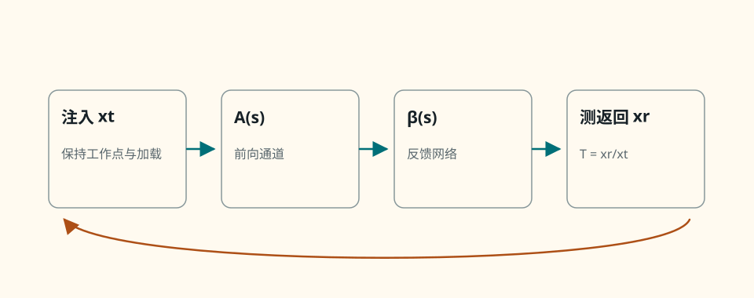{ .ae-figure }
</figure>

**图 6-23　闭环分母与环路增益测试概念。** 不能随手剪断一根线就测 $T$；断点必须保留原环路的工作点和双向阻抗环境。

### 10.2 增益交越、相位裕度与增益裕度

<figure class="ae-figure-frame" markdown="1">

{ .ae-figure }

<figcaption markdown="1">幅值图先定位 $|T|=1$ 的交越频率，再到相位图的同一频率读取相位裕度；不能从两张图各取一个不同频率的“好看数值”。</figcaption>
</figure>

**增益交越角频率** $\omega_{gc}$ 满足

\[
|T(j\omega_{gc})|=1\quad(0\ \mathrm{dB}).
\]

在负反馈约定下，相位裕度定义为

\[
\boxed{PM=180^\circ+\angle T(j\omega_{gc})},
\]

其中相位按连续展开、相对于 $-180^\circ$ 计算。**相位交越角频率** $\omega_{pc}$ 满足 $\angle T(j\omega_{pc})=-180^\circ$；若该交越存在，增益裕度为

\[
\boxed{GM=\frac1{|T(j\omega_{pc})|}},
\qquad
GM_{dB}=-20\log_{10}|T(j\omega_{pc})|.
\]

示例：某经验证可用常规单交越 Bode 判据的开环稳定系统，测得 $f_{gc}=20.0\ \mathrm{kHz}$ 时 $T=1\angle-135^\circ$，故 $PM=45.0^\circ$；在 $f_{pc}=80.0\ \mathrm{kHz}$ 时 $|T|=0.200$，故 $GM=5.00$，即 $13.98\ \mathrm{dB}$。PM 回答“在 0 dB 处还差多少相位到 $-180^\circ$”，GM 回答“在 $-180^\circ$ 处还允许环路幅值增加多少到 1”。

<figure class="ae-figure-frame" markdown="1">
{ .ae-figure }
</figure>

**图 6-24　同一环路的 PM 与 GM 读图。** 幅值、相位必须取同一 $T(j\omega)$；若有多个交越，应检查所有相关交越而非只挑最好看的一个。

对**开环无右半平面极点、常规最小相位、单一主要增益交越且没有异常回绕**的系统，正的 PM/GM 通常表示闭环稳定，裕度越小通常越容易峰化和振铃。

#### P1 第二遍：何时必须改用 Nyquist 或闭环极点

上述结论只是常用 Bode 工程判据的范围。若 $T(s)$ 有右半平面极点、明显非最小相位零点、纯延时或多个交越，只看某一个 $PM>0$ **不能全局保证稳定**；应使用 Nyquist 绕点计数或直接求闭环极点，并结合全部交越判断。

### 10.3 从频域裕度到时域波形

在典型主导二阶趋势中，较大的正相位裕度通常意味着阻尼较好、超调较小；较小但仍为正的裕度常对应明显超调和衰减振铃；裕度逼近零时接近等幅振荡边界；闭环极点进入右半平面后，扰动随时间增长。这个对应关系是趋势，不是从 PM 唯一决定所有波形的精确公式：零点、高阶极点、非最小相位和限幅都会改变时域形状。

<figure class="ae-figure-frame" markdown="1">
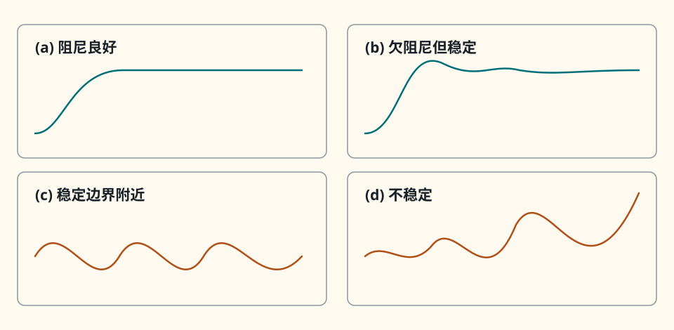{ .ae-figure }
</figure>

**图 6-25　稳定、超调、振铃和振荡的时域联系。** 不应仅凭“有一点超调”就宣布不稳定；稳定性的严格判据是自然响应是否衰减。

### 10.4 Barkhausen 条件与补偿直觉

当某实频率满足

\[
T(j\omega_0)=-1
\quad\Longleftrightarrow\quad
|T|=1,\ \angle T=(2k+1)180^\circ,
\]

则 $1+T=0$，是线性闭环极点落在虚轴上的稳定边界，也是正弦稳态振荡常说的 Barkhausen 条件。在振荡器分析中，它是某频率维持正弦稳态的必要环路条件，但**不是关于启动、唯一频率和最终幅度的普遍充分条件**。实际启动通常要求小信号环路增益略大于 1 以放大噪声/扰动，随后非线性把等效环路增益压回 1 并限制幅度；器件限幅、谐波、模式竞争与初始条件都参与最终状态。

常见补偿思路包括：

- 加强主导极点补偿，让 $|T|$ 在额外极点贡献太多相位前越过 0 dB；代价通常是闭环带宽或速度降低；
- 用超前补偿/零点在交越附近增加相位，提高 PM，但必须检查高频噪声与新的极点；
- 隔离电容负载、减小高阻节点或调整反馈网络，避免额外相位滞后；
- 降低闭环噪声增益或改变它的频率形状时要谨慎，因为 $\omega_{gc}$ 与稳定裕度会一起变化。

补偿不是“加一只电容就稳定”。每次改变后都要重画/测量 $T(j\omega)$，核对全部交越、PM/GM、阶跃和大信号边界。

### 第二遍：适用边界

PM/GM 来自线性化小信号环路，不能直接预测削顶后的极限环幅度。稳定是闭环极点/ Nyquist 条件，PM 是在特定假设下便于设计的局部裕度指标。$PM>0$ 在右半平面开环极点或多交越系统中不构成全局充分条件；非最小相位零点虽不必单独造成不稳定，却会增加相位滞后并限制可达到的响应速度。

### 30 秒回答

“负反馈也会振荡，因为 $A(s)\beta(s)$ 的极点和延时会增加相位滞后；返回量在某频率可能从抵消变成强化。闭环特征式是 $1+T(s)=0$。在 $|T|=1$ 的增益交越处，$PM=180^\circ+\angle T$；PM 小通常意味着峰化和振铃。$T=-1$ 是稳定边界，但 PM 的简单判读要限定在常规开环稳定、单交越系统；多交越或右半平面极点要看 Nyquist/闭环极点。”

### 第二遍：90 秒回答

“我先从分母说：负反馈闭环是 $A/(1+T)$，因此自然响应由 $1+T=0$ 决定。器件极点和纯延时会使 $T$ 的相位下降，即使低频返回量相减，高频绕环后也可能同相强化。定义 $|T(j\omega_{gc})|=1$，则 $PM=180^\circ+\angle T(j\omega_{gc})$；在相位交越 $-180^\circ$ 处，$GM=1/|T|$。小正裕度常表现为超调和衰减振铃，零裕度接近等幅振荡边界。Barkhausen 的 $T=-1$ 是线性边界和维持正弦的必要条件，却不保证启动与幅度。若有右半平面开环极点、非最小相位或多交越，我不会只凭一个正 PM 判稳定，而会用 Nyquist 或闭环极点。”

### 本节练习与递进追问

1. 某常规开环稳定单交越系统在 $f_{gc}=60.0\ \mathrm{kHz}$ 的相位为 $-152^\circ$，在 $-180^\circ$ 相位交越处幅值为 $-9.50\ \mathrm{dB}$；计算 PM 与线性 GM，并描述预期阶跃趋势，不把趋势写成必然波形。
2. 追问一：纯延时为何不改变幅值却能让负反馈失稳？追问二：满足 $|T|=1,\angle T=-180^\circ$ 为什么仍不足以说明振荡器一定能从零状态启动并稳定在某一幅度？

## 11. 面试主线：七个主题的 exact blocks

### 11.1 先写精确关系，再给近似与边界

| 高频主题 | 先写的 exact block | 一句话解释 | 最容易漏的边界 |
|---|---|---|---|
| 为什么降增益仍有用 | $A_f=A/(1+T)$，$S_A=1/(1+T)$ | 牺牲增益换取对环内参数与误差的控制 | $T$ 复数、频变；碰轨/环外扰动不可修 |
| 四组态识别 | 输出先看压/流，输入再看串/并 | 输入串增并减，输出压减流增 | 中文/英文命名顺序与取样加载 |
| 带宽扩展 | $A_{f0}=A_0/(1+T_0)$，$\omega_{Hf}=\omega_p(1+T_0)$ | 单主极点下用增益换带宽 | 多极点、频变 $\beta$、SR |
| 增益—带宽 | $A_{f0}\omega_{Hf}=A_0\omega_p$ | 是指定一阶模型的乘积关系 | 不是任意系统或大信号守恒律 |
| $-3\ \mathrm{dB}$/相位 | $\lvert H(f_c)\rvert=1/\sqrt2$；低/高通相位 $\mp45^\circ$ | 同阻抗时半功率；相位连续过渡 | 电压比用 $20\log$，功率比用 $10\log$ |
| Miller 效应 | $C_{in}=C(1-A_v)$，$C_{out}=C(1-1/A_v)$ | 反相大增益放大输入表观电容 | $A_v$ 的符号、端口和局部频带 |
| 负反馈为何会振 | $1+T(s)=0$；$PM=180^\circ+\angle T\big\rvert_{\lvert T\rvert=1}$ | 延时/极点令返回量由抵消趋向强化 | 单个正 PM 不是复杂环路的全局充分条件 |

下面四个公式块应能不看书完整写出，并在口述中说明变量、单位和条件：

\[
\boxed{x_e=x_s-\beta x_o,\quad x_o=Ax_e,
\quad T=A\beta,
\quad A_f=\frac{A}{1+T}}
\]

\[
\boxed{S_A=\frac{dA_f/A_f}{dA/A}=\frac1{1+T}}
\qquad(\beta\ \text{固定})
\]

\[
\boxed{H_{LP}=\frac1{1+j\omega RC},\quad
H_{HP}=\frac{j\omega RC}{1+j\omega RC},\quad
f_c=\frac1{2\pi RC}}
\]

\[
\boxed{1+T(s)=0,\quad
PM=180^\circ+\angle T(j\omega_{gc}),\quad |T(j\omega_{gc})|=1}
\]

### 11.2 统一 30 秒回答

“反馈题我先定义减法比较 $x_e=x_s-\beta x_o$，联立 $x_o=Ax_e$ 得 $A_f=A/(1+T)$。在相位合适且 $T\gg1$ 的频带，闭环增益约由 $1/\beta$ 决定、前向增益灵敏度降为 $1/(1+T)$。四组态按输出压/流、输入串/并识别。频率响应从极点零点画 Bode；单主极点反馈降低增益并扩带宽。最后查 $1+T(s)$：相位滞后会让负反馈趋向正反馈，必须看交越与 PM，而不是说负反馈必稳定。”

### 11.3 统一 90 秒回答

“我会从统一方框图开始：$x_e=x_s-\beta x_o$、$x_o=Ax_e$，所以 $A_f=A/(1+A\beta)$，而固定 $\beta$ 的相对灵敏度为 $1/(1+T)$。深反馈能提高增益精度、降低部分环内弱失真和扰动，但取决于注入点、频率和纠错余量；它不能修复轨限幅、损坏或环外噪声。组态按输出先、输入后命名：电压/电流取样决定输出电阻压减流增，串联/并联混合决定输入电阻串增并减。RC 低通与高通分别是 $1/(1+j\omega RC)$ 和 $j\omega RC/(1+j\omega RC)$，截止处 $-3.01\ \mathrm{dB}$、相位 $\mp45^\circ$。实际放大器低频由耦合旁路电容、高频由器件和 Miller 电容决定。单主极点反馈把增益除、带宽乘 $1+T_0$，但多极点和延时会累积相位；闭环分母 $1+T(s)$，在 $|T|=1$ 处用 PM 判断常规单交越趋势，复杂环路则回到 Nyquist/闭环极点。”

### 第二遍：适用边界

这些 block 是口试起点，不替代读图。若变量不是同类量，要先核对 $A,\beta$ 的单位并确保 $T$ 无量纲；若反馈网络、负载、频率或大信号状态改变，要重新建立 $T(s)$。四组态端口趋势、单极点增益带宽与 PM—时域联系都依赖各自已声明的模型。

### 递进追问

1. 第一轮：负反馈既降低增益，为何还值得用？第二轮：若闭环精度主要由 $\beta$ 决定，反馈电阻漂移会怎样？第三轮：若输出已经削顶，增大 $A$ 能否恢复线性？
2. 第一轮：如何从一张陌生电路图识别四组态？第二轮：为什么反相运放是输入并联混合？第三轮：若取样网络明显加载输出，$1+T$ 阻抗趋势还精确吗？
3. 第一轮：反馈为何扩展单极点带宽？第二轮：为何额外极点会破坏结论？第三轮：怎样从阶跃振铃反推需要检查 PM 而不是只查 GBW？

## 12. 章末检查清单与错误对照

### 12.1 每道反馈/频响题的证据链

- [ ] 标出 $x_s,x_e,x_f,x_o$ 的类型、方向和单位；写清比较点是减法还是加法。
- [ ] 定义断环的 $A(s),\beta(s),T(s)$，确认 $T$ 无量纲且没有重复计入负号。
- [ ] 由方程推闭环式；若用 $T\gg1$，写明频带、相位与线性边界。
- [ ] 涉及稳定精度时写 $S_A=1/(1+T)$，并说明固定的是 $\beta$、采用局部微分。
- [ ] 识别组态时先输出取样、再输入混合；端口电阻测量保持正确的源/负载条件。
- [ ] RC 题从 $Z_C=1/(sC)$ 分压，检查 $\omega\to0,\infty$、单位和电路开短路极限。
- [ ] Bode 图标出拐点、精确 $-3.01\ \mathrm{dB}$ 点、每 decade 斜率和相位三点。
- [ ] 放大器低频逐只找耦合/旁路电容所见电阻，高频列器件、Miller、布线和负载电容。
- [ ] 用单极点增益带宽式前，确认主导极点、常数 $\beta$、小信号和闭环稳定。
- [ ] Miller 先写 $A_v=v_o/v_i$ 的符号与频带，再推输入、输出两端等效。
- [ ] 稳定性检查全部 $|T|=1$ 交越、PM/GM、开环右半平面极点和延时；复杂情况用 Nyquist/闭环极点。
- [ ] 最后查电源轨、输出电流、SR、器件损坏和扰动是否在环内；给出适用边界。

| 常见错误 | 为什么错 | 修正动作 |
|---|---|---|
| 把负反馈说成“一定稳定” | 高频相位滞后可让返回量强化扰动 | 写 $1+T(s)$，检查全部交越与 PM/GM |
| 把 $\lvert1+T\rvert$ 写成 $1+\lvert T\rvert$ | $T$ 是复数，相位接近 $-180^\circ$ 时差异巨大 | 在复平面作向量相加 |
| 在 $T=A\beta$ 前再塞一个负号 | 本章比较点减号已单独定义 | 保持图 6-2 的统一符号约定 |
| 只说“反馈降噪” | 噪声传递取决于注入点和取样覆盖 | 标注噪声源后重新列闭环方程 |
| 认为反馈能修复削顶/损坏 | 执行器已无纠错余量或模型已失效 | 先恢复线性工作区和硬件完整性 |
| 按电阻横竖判断四组态 | 几何外观不等于取样/混合变量 | 先看输出压/流，再看输入串/并 |
| 反相运放叫“串联混合” | 求和点比较的是支路电流 | 在节点写 KCL 看源流与反馈流 |
| 截止处写电压减半 | $-3.01\ \mathrm{dB}$ 对应幅值 $1/\sqrt2$ | 区分 $20\log$ 电压比与 $10\log$ 功率比 |
| 相位在拐点突然跳 $90^\circ$ | 一阶相位从约 $0.1f_c$ 到 $10f_c$ 连续过渡 | 标 $\mp5.71^\circ,\mp45^\circ,\mp84.29^\circ$ |
| 多极点时直接取某一拐点为总 $-3\ \mathrm{dB}$ | 相邻极点幅值损失会叠加 | 计算总传递的模或仿真/测量 |
| 把增益带宽积当普遍守恒律 | 推导依赖单主极点与常数 $\beta$ | 先写模型，再决定是否可用 |
| Miller 只写输入端或漏掉增益符号 | 等效要保持两个端口电流，反相符号决定倍数 | 从 $(v_i-v_o)/Z$ 与 $(v_o-v_i)/Z$ 重推 |
| 有一个 $PM>0$ 就宣布复杂系统稳定 | 右半平面极点、多交越可能改变 Nyquist 绕点 | 检查完整 Nyquist 或闭环极点 |
| 把 Barkhausen 当启动和幅度充分条件 | 线性等幅条件不决定启动裕量和非线性限幅 | 分开小信号启动与稳态幅度机制 |

## 13. 章末练习：使用带图题库

本章题面统一放在[练习题 F-01～F-12](../exercises/练习题.md#f-01)。反馈方框、四组态、RC 电路、Bode 图、Miller 与稳定性题均已把分析对象放在题面附近。

!!! warning "作答顺序"

    先写清 $A,\beta,T$ 的起点、终点和符号，再列精确关系，最后才使用深反馈、渐近 Bode 或单主极点近似。独立完成后再打开[详细解答 F-01～F-12](../exercises/详细解答.md#f-01)。

能把相位裕度和时域波形联系起来后，再进入[第 7 章](07-差分功放与电源.md)。
